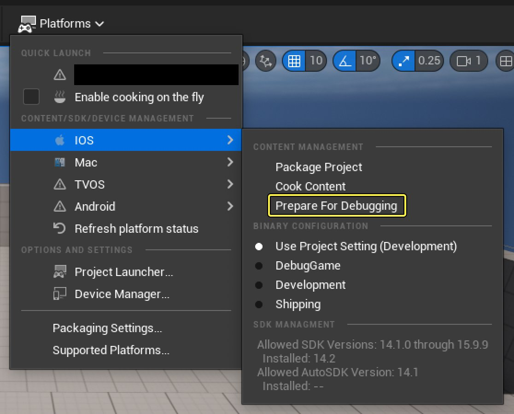
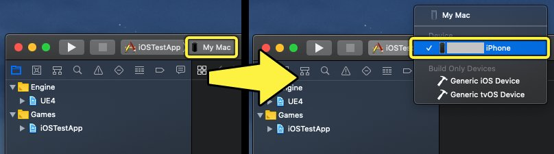
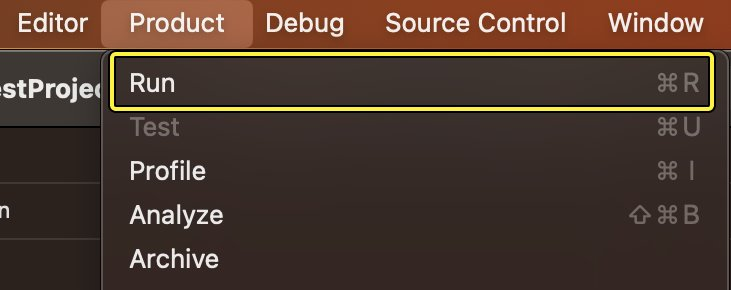
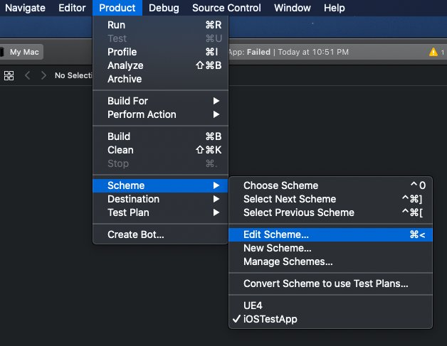
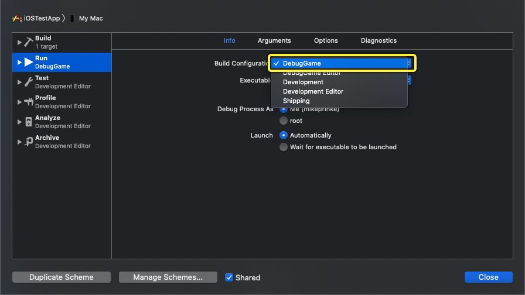
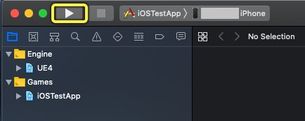

# 使用Xcode调试iOS项目

> 路径：虚幻引擎5.7文档 / 移动端开发 / 移动端调试和优化 / iOS和tvOS的调试和优化 / 使用Xcode调试iOS项目

> 原始页面：https://dev.epicgames.com/documentation/unreal-engine/debugging-ios-projects-with-xcode-in-unreal-engine

你需要一台运行 **Xcode** 的 **macOS** 设备，才能在iOS、tvOS和iPadOS设备上启动 **虚幻引擎（UE）** 应用程序的调试版本进行测试。但你需要使用虚幻编辑器烘焙内容，以将版本完整打包和敲定。为了满足这些要求，你需要使用专门的工作流程为版本做调试准备，然后再返回Xcode将它启动，而不是一个步骤内完成打包和启动操作。

本页面将说明此工作流程和UE提供的可精简此过程的工具，包括无需先创建编辑器版本即可启动调试版本的方法。

## 1. 必要设置

iOS的调试工作流程有以下要求：

- 一台安装了Xcode的macOS机器。macOS和Xcode都必须符合最新的iOS[开发要求](https://dev.epicgames.com/documentation/404)。
- 你的应用的 **代码签名证书** 和 **预配配置文件** 。如果不符合这些要求，你的版本将无法部署到iOS设备。如需了解有关此过程的更多信息，请参阅[iOS预配](../../../ios-ipados-and-tvos-support/getting-started-and-setup-guides-for-ios-and-tvos/setting-up-ios-tvos-and-ipados-provisioning-pro-d7cef79d/index.md)。
- 你的应用的Xcode项目（ `.xcodeproj` ）。如果你还没有Xcode项目，请找到项目的 `.uproject` 文件，右键点击它，然后选择 **生成Xcode项目（Generate Xcode Project）** 。
- 如果你想跳过创建编辑器版本，需要将来自另一台计算机的已烘焙数据注入你的版本。这些数据必须包含在你的项目的 **Binaries/iOS** 或 **Binaries/tvOS** 文件夹中。

## 2. 工作流程摘要

iOS、tvOS或iPadOS上的调试工作流程如下：

1. 为iOS/tvOS烘焙内容。你可以直接在macOS计算机上执行此操作，也可以使用另一台计算机。
2. 使用 **做调试准备（Prepare for Debugging）** 命令将已烘焙数据注入在构建过程中创建的Xcode负载（.IPA）中。
3. 使用Xcode利用.IPA创建一个版本，并从你的macOS计算机启动该版本。

## 3. 为iOS烘焙内容

虽然Xcode可以创建和启动调试版本，但它无法烘焙内容。因此，你需要从另一台计算机导入已烘焙内容，或者构建虚幻编辑器并使用它在你的macOS计算机上烘焙内容。

### 3A. 从另一台计算机导入已烘焙内容

如果已有可用于你的版本的已烘焙内容，则可以跳过构建虚幻编辑器和烘焙内容。如果你的团队共享了构建资源（例如构建场），或者在版本控制系统上托管了项目的二进制文件，则很可能会出现这种情况。这些文件应该位于 **Binaries/iOS** 或 **Binaries/tvOS** 文件夹中。

如果你需要手动将已烘焙文件引入到项目中，请将.IPA文件从另一台计算机复制并粘贴到项目的Binaries/iOS或Binaries/tvOS文件夹中。

### 3B. 在你的macOS计算机上烘焙内容

如需在你的macOS计算机上烘焙内容，请执行以下步骤：

1. 在虚幻编辑器中打开你的项目。如果你使用的是虚幻引擎的源代码版本，则需要从Xcode构建它。
2. 使用 **平台（Platforms）** 下拉列表中的以下选项之一：

   - 对于iOS和iPadOS：

     - **平台（Platforms）** > **iOS** > **烘焙内容（Cook Content）**
     - **平台（Platforms）** > **iOS** > **打包项目（Package Project）**
   - 对于tvOS：

     - **平台（Platforms）** > **tvOS** > **烘焙内容（Cook Content）**
     - **平台（Platforms）** > **tvOS** > **打包项目（Package Project）**

你还可以使用 `RunUAT.command` 脚本从命令行运行 `BuildCookRun` 命令。下面是一个仅烘焙命令的示例：

```
RunUAT.sh BuildCookRun -project=[ProjectName] -platform=iOS -build -cook -stage -pak -package -skipbuild
```

如需了解更多信息，请参阅[构建操作和烘焙内容](../../../../sharing-and-releasing-projects/packaging-and-cooking/build-operations-cooking-packaging-deploying-an-ca003a9c/index.md)。

## 4. 做调试准备

**做调试准备（Prepare for Debugging）** 命令会将之前烘焙的数据从Xcode注入到版本中，生成一个.IPA文件，你可以使用该文件在目标设备上从Xcode启动版本。此命令对项目的调试管线进行了两方面的精简：

- 做调试准备（Prepare for Debugging）将自动处理调试版本的创建，无需重新配置你的Xcode项目。
- 只用于少量Mac计算机的项目可以从其他计算机导入已烘焙数据。这样便可跳过虚幻编辑器的构建或使用，只需从Xcode启动版本即可。

如需使用做调试准备（Prepare for Debugging）命令，你可以通过虚幻编辑器（Unreal Editor）中的 **平台（Platforms）** 下拉菜单运行，也可以通过 **虚幻自动化工具（UAT）（Unreal Automation Tool (UAT)）** 中的 **Turnkey命令行** 运行。下文对这两个过程做了详细说明。

> [!TIP]
> "准备调试"设计为用于远程Mac工作流程，在使用备用远程Mac调试时尤其有助于节省时间。请参阅[远程Mac版本](../../../ios-ipados-and-tvos-support/working-on-ios-projects-using-a-windows-machine/creating-remote-builds-of-unreal-engine-projects-for-ios/index.md)，了解更多详情。

### 4A. 使用命令行做调试准备

你可以在Turnkey命令行中使用 `WrangleContentForDebugging` 命令，以你要使用的项目的名称为参数运行做调试准备（Prepare for Debugging）。下方示例说明了命令的格式：

```
RunUAT.command Turnkey -command=WrangleContentForDebugging -project=[你的.uproject文件的名称]
```

### 4B. 使用平台（Platforms）菜单做调试准备

你可以通过在虚幻编辑器中点击以下选项之一来运行做调试准备（Prepare for Debugging）：

- **平台（Platforms）** > **iOS** > **做调试准备（Prepare for Debugging）**
- **平台（Platforms）** > **tvOS** > **做调试准备（Prepare for Debugging）**



## 5.在Xcode中启动你的项目

1. 打开你的应用的Xcode项目。
2. 将目标设备从 **我的Mac（My Mac）** 更改为目标iOS或tvOS设备。

   
3. 点击 **产品（Product）** > **执行操作（Perform Action）** > **运行（Run）** ，或使用键盘快捷键 **Command** + **R** 。此操作将创建一个版本，创建过程中会用到你通过"做调试准备（Prepare for Debugging）"创建的.IPA。

   

完成这些步骤后，项目将在你的设备上构建并启动。在项目中，你可以使用断点、日志和LLDB命令来调试项目并在运行时检查信息。

## 6. 手动重建你的项目以调试

如果你没有访问"做调试准备（Prepare for Debugging）"命令的权限，可以通过以下步骤手动重建项目以从Xcode调试。在使用以下工作流程之前，你仍须烘焙和打包项目。

1. 打开你的应用的Xcode项目。在Xcode的主菜单中选择 **产品（Product）** > **方案（Scheme）** > **编辑方案（Edit Scheme）** 。

   
2. 点击 **运行（Run）** 类别，然后将 **构建配置（Build Configuration）** 更改为 **调试游戏（DebugGame）** 。

   

   > [!TIP]
   > 如果你使用的是虚幻引擎的源代码版本，则可以使用 **调试（Debug）** 配置来调试引擎代码。
3. 将目标设备从 **我的Mac（My Mac）** 更改为你已连接的 **iPhone** 。

   
4. 点击 **构建并运行（Build and Run）** 按钮，开始从Xcode构建项目，并在设备上启动它。

   

此操作实现的的结果与"做调试准备（Prepare for Debugging）"工作流程相同。

## 7. Xcode的调试工具和LLDB

如需详细了解Xcode调试功能的用法，请参阅Apple有关[使用Xcode调试](https://developer.apple.com/library/archive/documentation/DeveloperTools/Conceptual/debugging_with_xcode/chapters/debugging_tools.html)的开发人员文档。

如需详细了解LLDB，请参阅Apple文档档案中的[LLDB入门指南](https://developer.apple.com/library/archive/documentation/IDEs/Conceptual/gdb_to_lldb_transition_guide/document/lldb-basics.html)页面。
