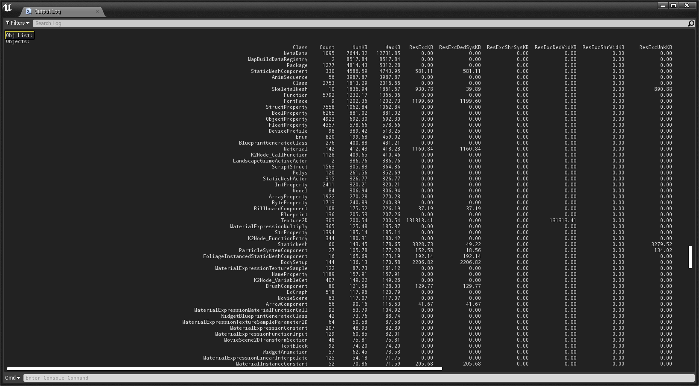

# iOS游戏包体大小

> 路径：虚幻引擎5.7文档 / 移动端开发 / 移动端调试和优化 / iOS和tvOS的调试和优化 / iOS游戏包体大小

> 原始页面：https://dev.epicgames.com/documentation/unreal-engine/optimizing-packaged-game-size-for-ios-projects-in-unreal-engine

影响iOS已打包游戏的因素众多，从游戏引用的内容到所选的版本配置，都会产生影响。

## 目标配置

最大变化之一是以发布配置为目标，而非开发，从而节省了约31MB。发布配置使用较高优化配置，同时删除调试符号及大量日志和描述代码，从而减小可执行文件的大小。

## 游戏内容引用

理解的重点是将烘焙游戏中引用的内容；常见问题有：在材质函数或材质中引用大量未用纹理作为默认纹理样本，或在断开连接的节点中引用未用内容，亦或在蓝图中引用未用变量。即使所有材质实例将上述内容替换为其他内容，此类这些内容仍然被视为已引用。可在已烘焙资源文件夹中进行查看，如找到意料外的资源，则使用[引用查看器](../../../../understanding-the-basics/assets-and-content-packs/reference-viewer/index.md)追踪其引用者。

> [!NOTE]
> 如通过工具栏上的[启动](../../../../sharing-and-releasing-projects/packaging-and-cooking/launching-unreal-engine-projects-on-devices/index.md)按钮进行烘焙，仅会烘焙所选地图引用的内容；但若[打包项目](https://dev.epicgames.com/documentation/404)，则将烘焙游戏中的所有内容，甚至是未引用内容。

## 禁用Slate

纯内容项目无法对使用中的插件和库进行假定，因此其的可执行文件较大。切换到C++并在编译时禁用无用插件和库，通常可稍微压缩可执行文件的大小（通过 `EnabledPlugins`、`Project.Build.cs` 和 `Project.Target.cs` 文件）。纯内容游戏无法使用Slate，因此最优化的方式是在纯内容游戏中移除30MB以上的Slate资源。如创建的C++项目不使用Slate，则在 `Project.Target.cs` 中 `TargetRules` 类的构造函数内设置 `bUsesSlate = false`，即可节省这部分空间。

## Obj List

可使用 **Obj List** 命令来更好了解项目中消耗内存最多的资源类型。在UE4控制台中输入Obj List命令后，其将返回与下图类似的列表。

点击查看大图。

然后可使用该列表来判断内存使用最多的项目，并根据需要进行优化。

## 低级内存跟踪器

低级内存跟踪器（Low-Level Memory Tracker）简称LLM，其是一种追踪虚幻引擎项目中内存使用情况的工具。LLM使用范围标记系统来记录虚幻引擎和操作系统分配的所有内存。可使用LLM来帮助确定内存的占用情况。欲了解使用LLM的更多相关信息，请查看以下文档，其中将介绍在UE4项目中使用LLM的方法。

- 低级内存跟踪器
