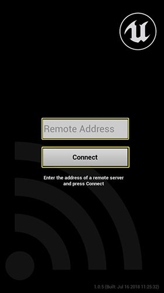

# 使用远程会话插件进行iOS开发

> 路径：虚幻引擎5.7文档 / 移动端开发 / 移动端调试和优化 / iOS和tvOS的调试和优化 / 使用远程会话插件进行iOS开发

> 原始页面：https://dev.epicgames.com/documentation/unreal-engine/using-the-remote-session-plugin-for-ios-development-in-unreal-engine

远程会话插件旨在复制与PC连接在同一网络上的iOS设备的输入，以便从编辑器或本地运行的游戏或应用程序的封装版本测试游戏或应用程序。Unreal Remote 2应用程序与远程会话插件配合使用，可以帮助用户测试游戏或应用程序。

## 获取Unreal Remote 2应用程序

1. 转到iOS设备上的应用商店。搜索

   Unreal Remote 2

   。点击

   获取（Get）

   下载。
2. Unreal Remote 2

   应用程序将下载并安装到设备上。该设备应连接到与PC相同的网络。
3. 在iOS设备上启动该应用程序，输入你的PC的IP地址。然后点击 **连接（Connect）**。

   

## 启用远程会话插件

1. 在虚幻编辑器中，单击

   编辑（Edit） > 插件（Edit > Plugins）

   。显示

   插件（Plugins）

   面板。
2. 在左侧导航面板中，向下滚动到 **试验（Experimental）**。找到 **远程会话插件（Remote Session Plugin）**。 你也可以在 **搜索（Search）** 栏中输入"remote"来查找插件。

   > [!WARNING]
   > 如果使用在搜索栏中输入"remote"的方法，你可能会在搜索结果中看到Slate远程插件。这是版本较旧的插件，不应启用——**仅启用远程会话插件**。
3. 选中

   启用（Enabled）

   复选框。将显示一条警告消息，指出你需要重新启动编辑器才能使更改生效。
4. 单击 **立即重启（Restart Now）** 来重新启动编辑器。
5. 在虚幻编辑器中，单击

   播放（Play）

   按钮上的下拉箭头。这将显示播放状态选项的菜单。选择

   新编辑器窗口（PIE）（New Editor Window，PIE）

   或

   独立游戏（Standalone Game）

   。打开一个新窗口。
6. 确保虚幻引擎编辑器是活动窗口。输入管理器将接收来自iOS设备上的Unreal Remote应用程序的交互。以下类别中的所有蓝图节点（以及相应的 C++ API）将返回可用值：

   - 接触事件（Touch events）
   - 接触输入（Touch input）
   - 姿势事件（Gesture events）
   - 动作事件（Motion events）
   - 动作值（Motion values）
