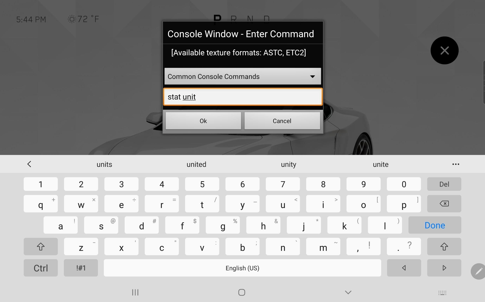
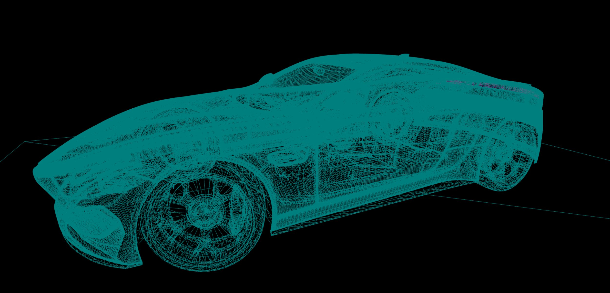
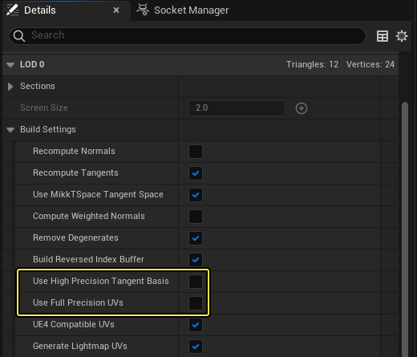
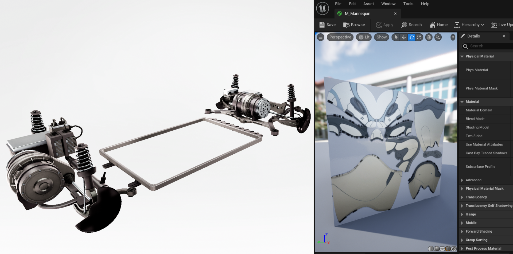
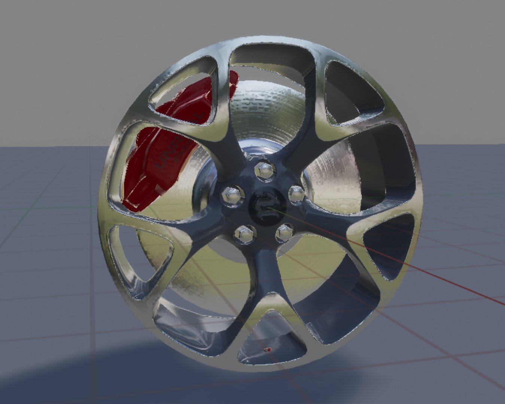
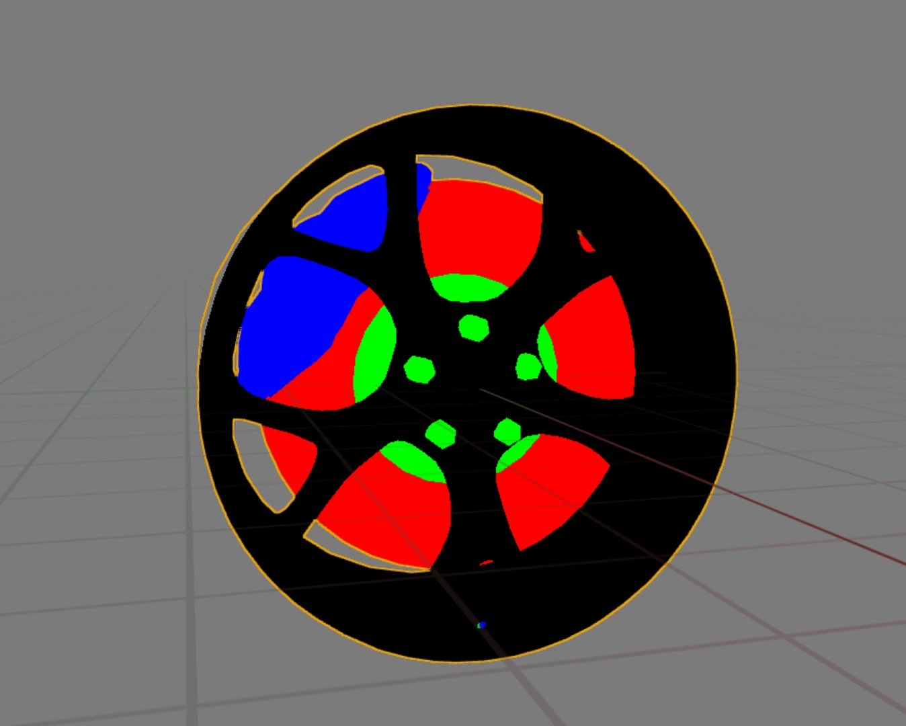
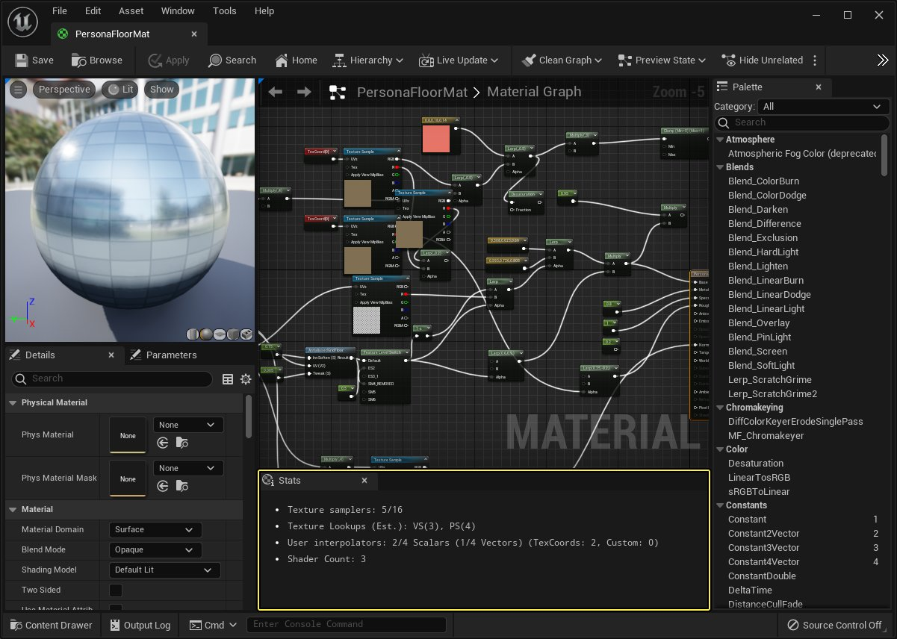

# 移动端的渲染优化技巧

> 路径：虚幻引擎5.7文档 / 移动端开发 / 移动端调试和优化 / 移动端的渲染优化技巧

> 原始页面：https://dev.epicgames.com/documentation/unreal-engine/optimization-and-development-best-practices-for-mobile-projects-in-unreal-engine

此页面提供有关如何优化移动设备性能，同时从移动HDR功能获取最佳保真度的指南和最佳实践。 这包括：

- 关于哪些因素会影响移动设备性能预算的信息
- 关于打包已启用移动HDR功能之项目的最佳实践
- **虚幻引擎**应用程序瓶颈的测量工具攻略

> [!TIP]
> 以下链接包含有关Android常规性能主题的实用信息：
>
> - [应用启动时间](https://developer.android.com/topic/performance/vitals/launch-time)
> - [渲染速度缓慢](https://developer.android.com/topic/performance/vitals/render)

## 了解你的性能预算

应用程序的目标设备具有有限的可用资源，可以用于将对象保存在内存中，也可以用于处理对象。 构建应用程序时，你必须决定将这些资源用于哪些地方。 你应该自行了解设备在速度、线程、CPU和GPU带宽方面的能力，以及设备的内存、图形内存和可用磁盘空间。

你还应该对设备进行*基准测试*，了解其运行方式以及哪里会遇到性能瓶颈。 你可以在设备上运行要求苛刻的应用程序或技术演示，对设备进行基准测试，然后观察性能统计信息。

### 用于显示性能统计数据的控制台命令

你可以使用一系列的**控制台命令**检查性能统计数据。 要在移动设备上打开开发人员控制台，请同时用四根手指点击显示屏。 此操作将打开屏幕键盘和提示，你可以输入控制台命令。



移动端应用中的控制台界面。

> [!NOTE]
> 控制台和四指点击命令仅在开发版本中提供。 发行或测试版不可用。

你可以在控制台中输入命令以便在界面显示调试信息。 以下表格包括提供性能信息的命令列表：

| 命令 | 说明 |
| --- | --- |
| Stat GPU | 显示GPU用于不同进程的时间（以毫秒为单位）。某些运行Vulkan的设备可能支持stat GPU，但是大多数移动设备不直接支持。 |
| Stat Unit | 显示CPU用于不同进程的时间（以毫秒为单位）。 还显示游戏线程、渲染线程和GPU时间。 |
| Stat UnitGraph | 显示一张图表，图中呈现一段时间内CPU和GPU利用率。 这有助于识别峰值。 |
| Stat TextureGroup | 显示不同纹理池使用的内存量。 |

> [!TIP]
> 对于你可以用于分析应用程序设备性能的更多控制台命令，请参阅Stat Commands。

## 常见性能因素

现在你已了解在设备上查找性能数据的位置，此部分将让你熟悉通常最影响虚幻引擎移动渲染器性能的因素。 了解哪个元素影响应用程序以及如何影响应用程序后，你可以快速识别问题，并使用虚幻引擎的诊断工具解决问题。

### 法线贴图纹理vs. 高顶点网格体

虚幻引擎的移动渲染器在渲染大量顶点上很高效，而移动渲染器上的高质量法线贴图可能存在位深度问题，并且性能成本高于高多边形模型。

在低端硬件上，法线贴图可以极大地提高模型表面上的反射和光照质量。 但是，汽车车身面板等细微形状可能会超出通常用于这些贴图的8位增量，从而在最终渲染中产生可见的条带。

你可以使用16位法线贴图进行补偿，但是16位法线的像素成本超过了更高密度网格体的顶点成本。 引擎中16位法线未压缩，这意味着大小也是常规法线贴图的八倍。

在下方示例中，我们使用没有法线贴图的高密度车身面板。 目标锁定Galaxy Tab S6时，我们的车身面板可合并到约500,000个顶点。



### 高分辨率法线贴图最佳实践

将高分辨率顶点烘焙到低多边形模型的法线贴图的过程可能比较复杂，并且许多因素会使引擎内部的法线贴图纹理质量降低。 用于烘焙法线贴图的工具集有很多，但我们推荐使用**xNormal**。 xNormal的使用流程大致如下：

1. 在xNormal中将法线贴图烘焙为附带4xAA的8k TIFF。
2. 将TIFF导入到photoshop中，然后将其缩减为1k纹理。
3. 应用值为0.35px的高斯模糊。
4. 将图像从16位转换为8位。
5. 将图像导出到24位TGA。
6. 将最终法线贴图导入虚幻。

为确保烘焙过程中使用的表面法线与引擎中呈现的法线相同，你应从虚幻内部导出已优化法线。 将烘焙模型导入虚幻引擎，选择创建自己的法线，然后从虚幻引擎中导出烘焙模型以在xNormal中烘焙。 这是创建高质量法线贴图的重要步骤，因为xNormal需要感知网格体的表面法线，才能为高分辨率模型应用偏移。

最后，有两个选项可以减少渲染**静态网格体**时的瑕疵：

- 使用全精度UV（Use Full Precision UVs）
- 使用高精度切线基础（Use High Precision Tangent Basis）

以上两项设置在**静态网格体编辑器**中均可用，具体位于**细节（Details）**面板的**LOD**分段中。



### 绘制调用

绘制调用是指查找资产，发生在每一帧。 你的应用程序使用的绘制调用次数，取决于场景中独特网格体的数量，以及每个网格体使用的独特材质ID数量。 当前，大量的绘制调用是导致图形性能降低的最大原因，因此应尽可能减少。

例如，高度优化的汽车模型可能仅有五六个单独的网格体，并且其中每个组件可能仅具有一种材质。

优化场景中绘制调用的理想目标大致为Galaxy Tab S6上700次，低端硬件上少于500次。 HMI项目倾向于使用非常独特或复杂的材质，Galaxy Tab S6上的理想目标是100次，最好是少于50次。

用控制台命令**Stat RHI**即可输出绘制调用次数。

> [!NOTE]
> 请记住绘制调用次数将取决于你处于PIE模式还是在设备上。 |

#### 减少网格体数量

要减少绘制调用，最简单的方式是减少场景中独特网格体的数量。 你可以使用数字内容创建（DCC）工具集（如Maya、3DSMax或Blender），将尽可能多的对象整合到一个网格体中，然后导入虚幻。

#### 减少材质ID数量

要减少网格体中独特材质的数量，则有多种选择。

最简单的方法是使用**物质绘制器（Substance Painter）**等程序，将多种材质整合到同一纹理中。 这样你就可以在一个非常简单的虚幻材质中利用海量的材质类型，然后将其作为基础制作具有简单纹理输入的**材质实例**。 此操作还能减少材质指令数，进一步提升性能。



点击查看大图

第二种方法使用**遮罩**以追求更为程序化的效果。 材质可以表示表面的某些特征，例如颜色、粗糙度或金属质量。 不用对网格体的不同部分使用单独的材质，你可以将遮罩用于网格体UV的单独部分，并对每个分段应用不同的设置。 你可以使用黑白纹理创建基本遮罩，但使用**顶点颜色**的效率更高。





最终渲染

顶点颜色

在以下示例中，顶点颜色用于定义不同的材质类型，材质定义单独影响这些组成部分外观的参数。 顶点颜色遮罩更加高效，分离更清晰，因为它不依赖纹理分辨率。


使用顶点颜色来区分不同材质类型的材质。

### 材质

**材质复杂度**可能会增加渲染的像素开销。 每个像素的指令越多，渲染计算最终值所需花的时间就越多。 不透明材质的价格最实惠，但是基于着色模型或基础着色器代码，情况可能截然不同。

你可以在**材质编辑器**的**统计数据（Stats）**窗口中找到关于材质指令数量的读数。



正在显示指令数的统计数据窗口。 点击查看大图。

指令数也会根据材质中数学函数的数量而增加。 节点越多，材质的渲染成本就越高。 某些特定操作的成本也会较高。 尽量限制在构建更复杂材质时的指令数。

**半透明（Translucent）**和**透明（transparent）**材质属于成本最高的材质类型。 单独的半透明层的每像素成本较高，当多个透明层堆叠和渲染时，成本要高得多。 这被称为**过度绘制**。

车辆的前灯和尾灯是透明度问题区域的典型示例。 在很多情况下，我们使用手绘纹理贴图降低材质复杂性。 即使纹理平坦，也可以很好地表明复杂的形状和深度。

> 图片已省略：image alt text

### 优化纹理分辨率

高分辨率纹理需要大量存储空间，无论是在设备上还是在设备的纹理内存中，而较大的纹理则需要更多像素才能进行渲染和处理。 虽然高分辨率纹理可以提高保真度，但考虑到设备的屏幕分辨率和纹理的视角，纹理大小带来的收益会减少。 使用尽可能小的纹理获取所需的保真度至关重要。

要确定你的纹理需求，你首先要确定**摄像机位置**和查看模型时所用的**视野（FOV）**。 这将有助于确定所有网格体和材质的界面空间。

确定摄像机位置后，你可以使用特殊的调试纹理确定用于各种材质的纹理分辨率。 此纹理使用**Mipmap**的行为确定不同组件所需的分辨率，并为每个Mipmap应用不同颜色。 这样你可以很轻松地识别出材质正在使用哪个mip，以及应该使用哪种纹理分辨率。

将随附的纹理插入无光照材质的自发光信道，然后将该材质应用于你的网格体。 从合适摄像机距离查看网格体时，颜色编码将指示引擎用于渲染的mip级别。 观察到的最高级别应该是法线和环境光遮蔽贴图的原生纹理大小。

> 图片已省略：image alt text

## 打包大小和启动时间

在打包应用程序及其资产时，需要在磁盘上的包大小与运行时启动性能之间权衡。

启用**ZLib压缩**后，应用程序的文件包会更小。 然而，这需要更多的CPU时间加载应用程序，可能会减慢启动速度。 为优化启动时间，你可以禁用压缩。

> 图片已省略：项目设置/打包中的Zlib压缩设置

你可以在 "项目设置（Project Settings）" > "打包（Packaging）" 中找到 Zlib 压缩设置。 点击查看大图。

### 推荐的流送设置

`DefaultEngine.ini`中推荐的流送设置如下。 这样在应用程序启动时为异步加载资产提供了更多时间，可以改善启动时间。

C++

```
[/Script/Engine.StreamingSettings]	s.PriorityAsyncLoadingExtraTime=275.0	s.LevelStreamingActorsUpdateTimeLimit=250.0	s.PriorityLevelStreamingActorsUpdateExtraTime=250.0
```

### 推荐的打包设置

`DefaultEngine.ini`中推荐的打包设置如下。 这些设置减少了打包资产时使用的压缩量，因为启动时未压缩.pak文件的加载速度明显快于ZLib压缩文件。

C++

```
[/Script/UnrealEd.ProjectPackagingSettings]	bCompressed=False	BuildConfiguration=PPBC_Development	bShareMaterialShaderCode=True	bSharedMaterialNativeLibraries=True	bSkipEditorContent=True
```

## 分析文件包在磁盘上的大小

虚幻引擎有多种实用工具，可以提供资产数据占用空间的深度信息。

### 尺寸贴图

**尺寸贴图**可读取并对比资产在编辑器中的相对内存消耗。 必须启用**AssetManagerEditor**插件才能使用该功能。 之后，右键点击内容浏览器中的文件夹，从上下文菜单中选择**尺寸贴图（Size Map）**即可访问该功能。

> 图片已省略：image alt text

规模图将显示带有图标的窗口，图标代表文件夹和文件占用的内存量。 图标越大，文件消耗的空间越大。

> 图片已省略：image alt text

如需了解如何使用尺寸贴图，请参阅[烘焙和数据块划分](../../../sharing-and-releasing-projects/packaging-and-cooking/cooking-content-and-creating-chunks/index.md)。

> [!NOTE]
> 规模图可读取编辑器中使用的资产空间大小。 打包项目后，内存消耗会有所不同。 这是因为在烘焙过程中会出现不同类型的压缩。 一般来说，规模图代表资产可能占用的最大规模。

### 统计数据

**统计数据（Statistics）**工具提供关于**关卡**中资产使用的详细信息。 可以在**窗口（Window）**下拉菜单中找到该工具。

> 图片已省略：image alt text

此统计数据窗口将细分关卡文件中的资产数量，可以显示所有关卡，也可以仅显示特定关卡。 **图元统计数据（Primitive Stats）**列出了关于三角形数量、内存消耗和计数等项目的信息。

> 图片已省略：统计数据窗口

正在显示图元数据的统计窗口。

此列表中显示的其他数据包括纹理使用和静态网格体光照信息。 统计数据窗口的列表模式可以快速展示哪些资产消耗的内存最多。 **烘焙器统计数据（Cooker Stats）**也很有帮助，因为其中列出了上一个打包过程烘焙的所有资产。

### 内存报告

统计数据和尺寸贴图工具向你展示了虚幻编辑器中文件的数据占用情况，你也可以在目标设备上启动的应用程序安装中使用控制台命令`Memreport -full`。 这可以提供文件尺寸的详细且准确的信息，因为它们存在于设备压缩设置中。

应用程序在开发配置中构建并加载到设备后，你可以打开控制台窗口并输入命令。 此内存快照保存在设备的项目目录中。 该目录通常为`Game/[YourApp]/[YourApp]/Saved/Profiling/Memreports/`，但可能有所变化。

`.memreport`文件是一种文本文件，可在大多数文本编辑器中读取。 文本开头包含一些关于已分配内存和池尺寸的信息，而文本的大部分内容显示已加载关卡、RHI统计数据、渲染目标、场景信息等记录。 所有此类信息都很有价值，因为它们代表完成烘焙和打包过程的实际数据。

如果你搜索**列出所有纹理（Listing all textures）**这个短语，你将找到应用程序中的所有纹理的列表，以及纹理类型、分组、大小和内存占用等详细信息。 列表按内存大小排序，首先显示较大的纹理。 这个方法可以快速简便地找出什么纹理消耗内存最多。

## 分析启动时间

影响启动时间的因素包括以下内容：

- 加载并解压初始资产所需的时间
- 应用程序的总大小
- 需要在用户的安装中激活的任何插件
- 需要解析的字符串数量
- 用户设备上的任何内存分配或分片

有数种不同的工具可用于分析应用程序的启动时间，但最推荐使用**Unreal Insights**，因为它可以远程分析目标设备的性能数据。 如需了解该工具集的完整信息，请参阅[Unreal Insights小节](../../../testing-and-optimizing-content/unreal-insights/index.md)。

如需了解如何在Android应用程序中使用Unreal Insights的示例，请参阅[Android设备上的Unreal Insights](../optimization-guides-for-android/how-to-use-unreal-insights-to-profile-android-games/index.md)。
