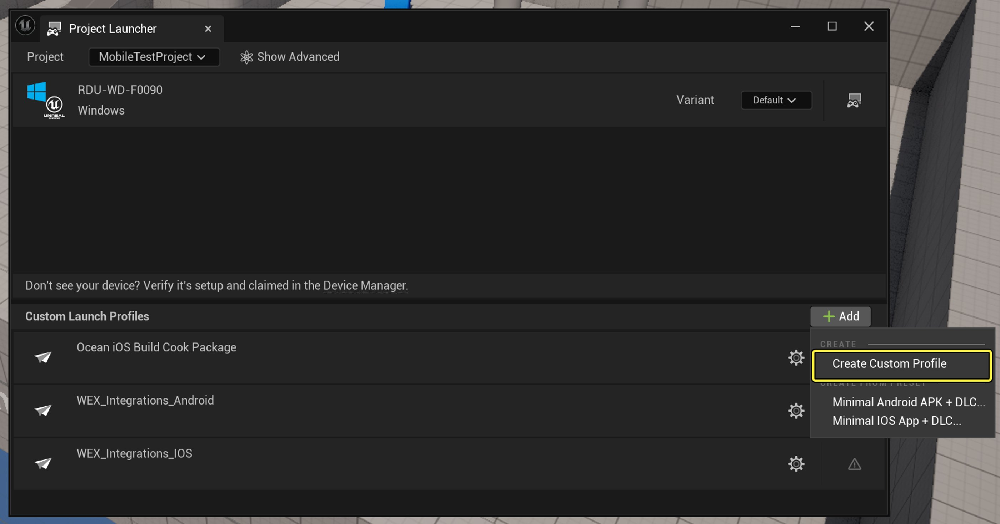
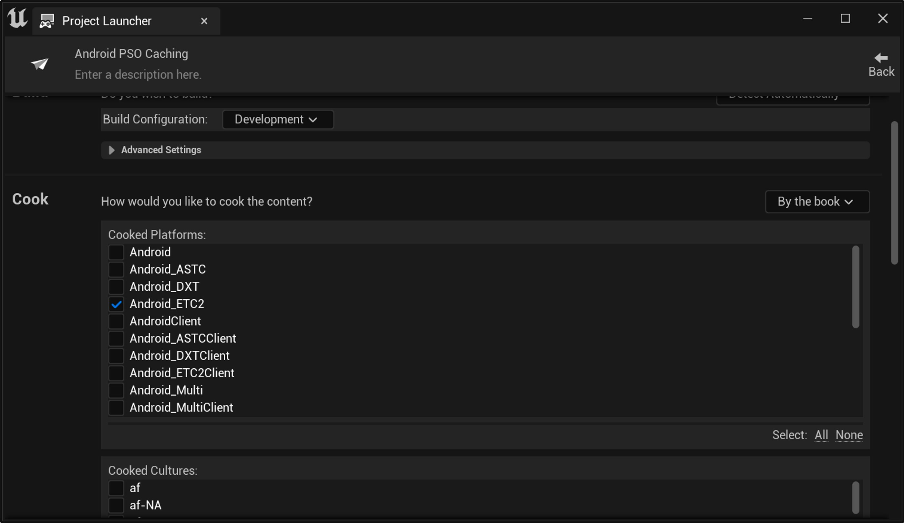
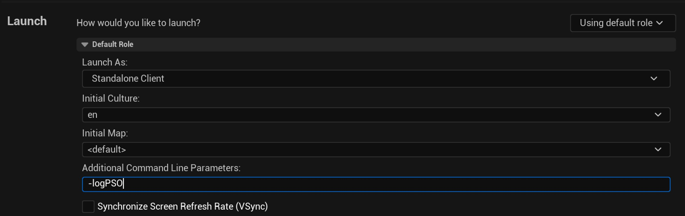

# 为Android创建捆绑的PSO缓存

> 路径：虚幻引擎5.7文档 / 移动端开发 / 移动端调试和优化 / 虚幻引擎Android优化指南 / 为Android创建捆绑的PSO缓存

> 原始页面：https://dev.epicgames.com/documentation/unreal-engine/creating-bundled-pso-caches-for-android-in-unreal-engine

[PSO缓存](../../../../testing-and-optimizing-content/optimizing-rendering-with-pso-caches/index.md)可提前为你的应用程序创建并存储最常用的管线状态对象数据，以提高渲染性能，尤其是在运行应用程序时减少卡顿。 本指南提供了在虚幻引擎（UE）中为Android项目实现PSO缓存的操作说明。

> [!NOTE]
> 本页面提供了捆绑的PSO缓存方法的说明，该方法是UE版本5.2及更早版本中使用的旧版手动PSO缓存系统。 我们推荐使用5.3及更新版本中的PSO预缓存系统（如果对你的项目可行）。 如需了解详情，请参阅[PSO预缓存文档](https://dev.epicgames.com/documentation/assets/testing-and-optimizing-your-content/pso-caches/pso-precaching)。

## 必要设置

要学习本指南，你需要以下内容：

- [以Android为目标平台](../../../android-support/getting-started-and-setup-for-android-projects/setting-up-unreal-engine-projects-for-android-d-db209844/index.md)设置的虚幻引擎项目。
- 兼容你当前虚幻引擎版本的[Android SDK和NDK](../../../android-support/getting-started-and-setup-for-android-projects/advanced-setup-and-troubleshooting-guide-for-us-ec72c4a3/index.md)版本。
- 启用了[开发者模式和USB调试](../../../android-support/getting-started-and-setup-for-android-projects/setting-up-your-android-device-for-developing-a-f537b307/index.md)的兼容Android测试设备。

> [!NOTE]
> 如需详细了解哪些Android设备兼容你的虚幻引擎版本，请参阅[Android开发要求](https://dev.epicgames.com/documentation/assets/sharing-and-releasing-projects/android/development-requirements)。

## 设置PSO缓存的项目设置

要配置你的项目设置以支持PSO缓存，请执行以下步骤：

1. 在虚幻编辑器中打开你的项目。
2. 打开**编辑（Edit）** > **项目设置（Project Settings）**。
3. 找到**项目（Project）** > **封装（Packaging）**，并确保**共享材质着色器代码（Share Material Shader Code）**和**共享材质原生库（Shared Material Native Libraries）**均已启用。
4. 在下一步，你需要手动编辑描述文件。 关闭虚幻编辑器，避免你的手动编辑与项目设置冲突。
5. 打开项目的`Config/Android`文件夹，然后打开`AndroidEngine.ini`。 添加以下设置：

   C++

   ```
   [DevOptions.Shaders]     NeedsShaderStableKeys=true
   ```

## 运行你的游戏并收集PSO

现在你的项目设置已兼容PSO缓存，请在启用`-logPSO`命令行的情况下运行项目构建。

1. 确保你的测试设备连接到你的计算机。
2. 在虚幻编辑器中打开你的项目。
3. 点击**平台（Platforms）** > **项目启动程序（Project Launcher）**。
4. 在项目启动程序中，点击**+添加（+ Add）** > **创建自定义配置文件（Create Custom Profile）**，创建新的启动配置文件。

   
5. 将你的配置文件重命名为**PSO Caching - ETC2**。
6. 在**你想如何烘焙内容？（How would you like to cook your content?）**旁边的下拉菜单中，点击**按常规烘焙（Cook by the Book）**。
7. 选择**Android_ETC2**作为你的目标平台。

   
8. 在**部署（Deploy）**下，将你的移动设备选为目标设备，并将**变体（Variant）**设为**Android_ETC2**。
9. 在**启动（Launch）**类别下，将`-logPSO`命令添加到**其他命令行参数（Additional Command Line Parameters）**中。

   

   > [!TIP]
   > 你可以使用**Android文件服务器（Android File Server，AFS）**将`-logPSO`命令添加到你设备上现有构建的`UECommandLine.txt`文件中。 如需了解详情，请参阅[AFS文档](../../debugging-for-android-devices/android-file-server/index.md)。
10. 启动你的配置文件。 UE将编译并打包项目，然后将其部署到你的设备。
11. 运行完你的游戏。 你的游戏随时记录新PSO时，输出日志都会显示消息。

运行未来的PSO收集会话时，你可以复用你在此小节中创建的配置文件。

### 关于收集PSO的提示

你收集的PSO越多，当你打包最终应用时，游戏的启动时间就越长，因为必须加载所有PSO后，用户才能开始运行游戏。 因此，我们建议专门在你确信常用并有显著卡顿的位置收集PSO，因为这些位置的PSO缓存能为用户体验提供最多的优势。

只要一个位置发生重大更改，之前为该位置收集的PSO将变得过时。 因此，需确保在整个制片过程中经常收集PSO。

## 从你的设备检索已收集的PSO数据

记录你的PSO后，你需要从你的测试设备检索数据并将其整合到新版本中。 要检索你的PSO数据，请执行以下步骤：

1. 将你的测试设备从你的计算机拔掉，并关闭你的游戏。

   > [!WARNING]
   > 如果你尝试从项目启动程序关闭游戏，你的设备可能不会保存它记录的PSO数据。
2. 关闭你的项目，并将你的测试设备重新连接到你的计算机。
3. 从以下目录提取PSO：

   `Internal Storage/Android/Data/[package name of project]/files/UnrealGame/[project name]/Saved/CollectedPSOs`

   你可以使用以下任一方法提取CollectedPSOs目录的内容：

   - 使用Android文件服务器（AFS）运行以下命令：`UnrealAndroidFileTool -p [package name] -k [security token] pull ^saved/CollectedPSOs [destination path]`
   - 将设备连接到你的计算机，并使用计算机的文件系统找到PSO的位置。
4. 将`.UPIPELINECACHE`文件复制到你的计算机上易于访问的位置。 此示例使用项目目录中名为`Import/PSOFiles`的文件夹。

## 编译最终PSO缓存数据并将其添加到你的项目

要将你的PSO缓存整合到版本中，请执行以下步骤：

1. 打开你的项目文件夹并找到Saved/Cooked/Android_ETC2/[项目名称]/Metadata/PipelineCaches。 将此文件夹中的文件复制到Import/PSOFiles中。
2. 打开你的命令行工具并找到你用于项目的引擎版本的安装目录，然后找到Engine/Binaries/Win64文件夹。 例如：C:/Program FIles/Epic Games/UE_5.2/Engine/Binaries/Win64。
3. 运行以下命令行：

   C++

   ```
   UnrealEditor-Cmd.exe "YourProjectPath.uproject" -run=ShaderPipelineCacheTools expand C:\PSOfiles\*.rec.upipelinecache C:\PSOfiles\*.shk C:\PSOfiles\"Alias Name"_"Project Name"_"Used Graphics API".spc
   ```
4. 命令行成功运行后，Import/PSOFiles目录应该包含新的PKCS #7证书文件。 将其复制到你的项目的Build/Android/PipelineCaches文件夹。
5. 重新编译并再次启动你的游戏。 新版本包括最终PSO缓存数据。

## 结果

启动时，你还应该会看到一个日志声称加载了多少PSO。 运行你的游戏时，你从中收集了PSO的位置上的所有渲染卡顿都应该会得到解决。
