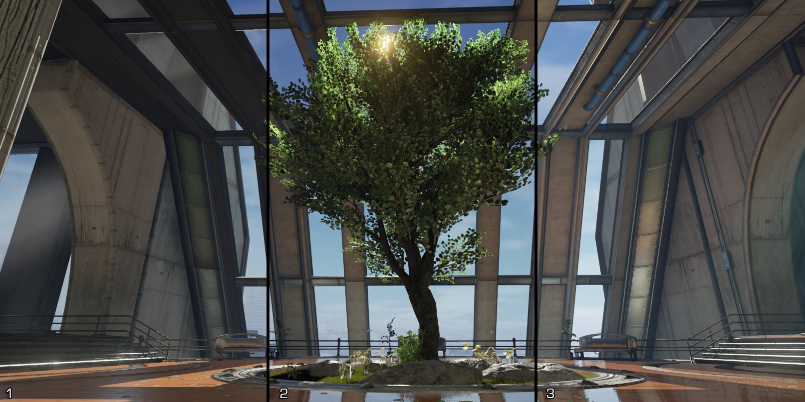
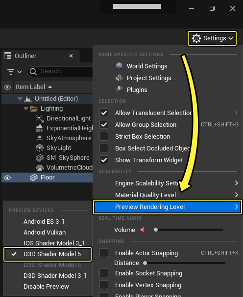
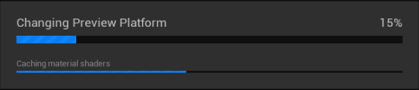
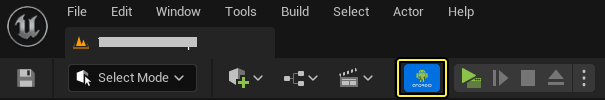
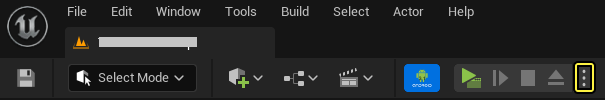
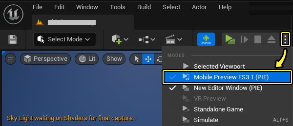

# 移动预览器

> 路径：虚幻引擎5.7文档 / 移动端开发 / 移动端开发工具 / 移动预览器

> 原始页面：https://dev.epicgames.com/documentation/unreal-engine/using-the-mobile-previewer-in-unreal-engine

1：移动/HTML5 - Open GL ES2，2：着色器模型4.0 - DX10/ OpenGL 3.3+，3：着色器模型5.0 - DX11/ OpenGL 4.3+。

在 **虚幻引擎** 中，你可以使用 **移动预览器（Mobile Previewer）** 直接在UE编辑器视口中预览你的场景在不同移动设备上的显示情况。在启用不同的预览渲染关卡时，场景中的材质将被重新编译，以最大程度上模拟所选择的渲染器预览的外观和特性集。移动预览器使你能够在渲染关卡之间无缝切换，而无需重新启动编辑器。

## 使用移动预览器

**移动预览器（Mobile Previewer）** 使你能够针对当前UE会话在不同渲染器之间快速切换，以便你在编辑器中工作的同时，还能够了解你的游戏在目标设备上的显示情况。要了解如何更改到不同的渲染器预览，请遵循以下步骤：

> [!NOTE]
> 虽然你不需要重新启动编辑器以使新的预览渲染关卡生效，但是当你第一次更改到某个预览渲染关卡时，编辑器将需要时间重新编译着色器。对以前使用的渲染关卡的后续更改应该几乎是即时的。

1. 从主工具栏中，选择 **设置（Settings）** 按钮以展开列示的菜单项。在 **可扩展性（Scalability）** 部分下，将鼠标悬停在 **预览渲染关卡（Preview Rendering Level）** 以公开可以从中选择的不同渲染关卡选项。

   
2. 将鼠标悬停在要预览的部分渲染关卡上，然后单击鼠标左键选择它。 将弹出"正在更改预览渲染关卡（Changing Preview Rendering Level）"进度条。等待该进度条完成并重新编译着色器。

   

   **预览模式（Preview Mode）** 按钮显示在 **设置（Settings）** 按钮旁边，该按钮显示所选预览模式的图标。单击它以禁用移动预览器。

   
3. 一旦选择了渲染关卡，视口中的材质将自动更新，以通过为该目标平台启用或禁用的材质质量，反映新的渲染方法。（有关如何进一步调整这些设置的更多详情，请参阅本页面的[平台材质质量设置](#%E5%B9%B3%E5%8F%B0%E6%9D%90%E8%B4%A8%E8%B4%A8%E9%87%8F%E8%AE%BE%E7%BD%AE)部分。）

   

   

   Android Vulkan Preview

   Desktop Shader Model 5 (SM5) Preview

> [!NOTE]
> 移动预览器旨在尽可能地匹配移动设备，但它也许不一定能预示你的项目在目标设备上的显示情况。你应该始终确保在目标设备上全面测试你的项目，并且仅使用移动预览器来查看你的工作是否朝着正确的方向发展。

### PIE中的移动预览器

你可以使用 **移动预览ES2（PIE）（Mobile Preview ES2 (PIE)）** 选项启动UE移动项目的独立版本，该版本将使用与在移动设备上运行的项目相同的渲染路径。这是一个很好的方法，可以预览你正在进行的更改，而不必经历整个烘焙和部署过程。要在使用移动预览的独立游戏中启动UE项目，你需要执行以下操作：

1. 从 **主工具栏（Main Toolbar）** 中，单击 **运行（Play）** 按钮旁边的下拉按钮，以公开 **修改游戏模式和游戏设置（Change Play Mode and Play Settings）** 的设置。

   
2. 选择 **移动预览ES2（PIE）（Mobile Preview ES2 (PIE)）** 选项，然后你的项目将在一个新窗口中启动，该窗口模拟你的项目在移动设备上的显示情况。

   

## 启用Vulkan移动预览

你可以使用 **Vulkan移动预览（PIE）（Vulkan Mobile Preview (PIE)）** 选项，以使用Vulkan渲染启动UE移动项目的独立版本。这是一个很好的方法，可以预览你正在进行的更改，而不必经历整个烘焙和部署过程。要在使用Vulkan移动预览的独立游戏中启动UE项目，你需要执行以下操作：

1. 要启用Vulkan预览器，首先需要打开 **编辑器偏好设置（Editor Preferences）**，方法是转到 **主工具栏（Main Toolbar）** 并单击 **编辑（Edit）**，然后选择 **编辑器偏好设置（Editor Preferences）**。

   > 图片已省略：Open the Editor Preferences
2. 在编辑器偏好设置（Editor Preferences）菜单中，找到 **一般（General）** 标题，然后单击 **实验性（Experimental）** 部分。

   > 图片已省略：Experimental tab of the Editor Preferences

   单击显示全图。
3. 找到 **PIE** 部分，然后单击 **允许Vulkan移动预览（Allow Vulkan Mobile Preview）** 选项以启用它。

   > 图片已省略：Enable Allow Vulkan Mobile Preview

   单击显示全图。
4. 关闭编辑器偏好设置（Editor Preferences）菜单，然后从 **主工具栏（Main Toolbar）** 中，单击 **运行（Play）** 按钮旁边的下拉按钮，以公开 **修改游戏模式和游戏设置（Change Play Mode and Play Settings）** 的设置。

   > 图片已省略：Show Play Mode Options
5. 选择 **Vulkan移动预览(PIE)（Vulkan Mobile Preview (PIE)）** 选项，然后你的项目将在一个新窗口中启动，该窗口模拟你的项目在移动设备上的显示情况。

   > 图片已省略：Select the Vulkan Mobile Preview

## 平台材质质量设置

在 **项目设置（Project Settings）** 中的 **平台（Platforms）** 类别下，你可以选择不同的平台 **材质质量（Material Quality）** 部分来启用或禁用目标平台的特定功能。

> 图片已省略：undefined

点击查看大图。

要使这些更改生效，请确保单击 **更新预览着色器（Update Preview Shaders）** 按钮。

> 图片已省略：Update Preview Shaders

## 预览渲染关卡选择

当你选择预览渲染关卡时，将有几个选项可供你选择。使用下表选择最适合你的目标设备的选项。

| 目标设备 | 说明 |
| --- | --- |
| High-End Mobile / Metal |  |
| **默认高端移动设备（Default High-End Mobile）** | 模拟默认的高端移动材质质量设置，而不使用项目设置（Project Settings）中指定的任何材质质量覆盖。 |
| **Android GLES 3.1** | 提供支持的Android OpenGL ES3.1质量设置的预览模拟。材质质量（Material Quality）设置可在 **项目设置（Project Settings）** > **Android材质质量 - ES31（Android Material Quality - ES31）** 部分中设置。 |
| **Android Vulkan** | 提供支持的Android Vulkan质量设置的预览模拟。材质质量（Material Quality）设置可在 **项目设置（Project Settings）** > **Android材质质量 - Vulkan（Android Material Quality - Vulkan）** 部分中设置。 |
| **iOS Metal** | 提供支持的iOS Metal质量设置的预览模拟。材质质量（Material Quality）设置可在 **项目设置（Project Settings）** > **iOS材质质量 - Metal（iOS Material Quality - Metal）** 部分中设置。 |
| Mobile / HTML5 |  |
| **默认移动设备/HTML5（Default Mobile/HTML5）** | 模拟默认的移动材质质量设置，而不使用 **项目设置（Project Settings）** 中指定的任何材质质量覆盖。 |
| **Android** | 提供支持的Android OpenGL ES2质量设置的预览仿真。材质质量（Material Quality）设置可在 **项目设置（Project Settings）** > **Android材质质量 - ES2（Android Material Quality - ES2）** 部分中设置。 |

> [!NOTE]
> 在通过项目设置（Project Settings）将一些可用的预览渲染关卡启用作为目标平台（即Android OpenGLES 3.1和Android Vulkan）之前，这些关卡是不可见的。然而，iOS Metal默认为开启，如果其目标平台被禁用，它也将作为一个可用的预览选项被移除。

## 移动设备预览选项

由于手机边框设计多种多样，确保用户界面的某些部分不会被手机边框遮挡有较大的难度。为了确保用户界面不会被设备遮挡，你可以使用 **设备启动（Device Launch）** 选项来覆盖不同的手机边框设计。要在UE项目中使用该选项，你需要做的就是执行以下操作。

1. 首先，打开你的 **编辑器偏好设置（Editor Preferences）**，方法是转到 **主工具栏（Main Toolbar）** 并单击 **编辑（Edit）**，然后选择 **编辑器** **偏好设置（Editor Preferences）**。

   > 图片已省略：Open the Editor Preferences
2. 在 **编辑器偏好设置（Editor Preferences）** 菜单中，找到 **一般（General）** 标题，然后单击 **实验性（Experimental）** 部分。

   > 图片已省略：Experimental tab of the Editor Preferences

   点击查看大图。
3. 找到 **PIE** 部分，然后单击 **使用预览设备启动选项启用移动PIE（Enable mobile PIE with preview device launch options）** 以启用边框覆层。

   > 图片已省略：Enable mobile PIE with preview device launch options

   点击查看大图。
4. 关闭编辑器偏好设置（Editor Preferences）菜单，然后从 **主工具栏（Main Toolbar）** 中，单击 **运行（Play）** 按钮旁边的下拉按钮，以公开 **修改游戏模式和游戏设置（Change Play Mode and Play Settings）** 的设置。

   > 图片已省略：Show Play Mode Options
5. 从显示的菜单中，转到 **移动预览(PIE)（Mobile Preview (PIE)）** > **Android**，然后从列表中选择你要进行测试的设备。

   > 图片已省略：Select Device Previewer

   点击查看大图。
6. 现在，单击 **启动（Launch）** 按钮启用你的项目。当你的项目加载时，它将使用设备预览，如下图中所示。

   > 图片已省略：Device Playing Example

## 在预览器中复制实体设备的配置

在虚幻引擎（UE5.5）及更新版本中，你可以保存一个用于特定设备的JSon文件，其中包含设备描述文件和控制台变量（CVar）。然后将其加载到UE中，在移动预览器中使用，为所有项目提供与设备上1:1还原的图像设置。本文将概述此流程。

### 先决条件

要按此指南操作，你需要将项目设置为面向Android开发，且需要将一台启用了开发模式的Android设备连接到你的计算器。关于Android项目的基础设置指南，请参阅[Android快速入门指南](../../android-support/getting-started-and-setup-for-android-projects/setting-up-unreal-engine-projects-for-android-d-db209844/index.md)。关于准备设备并将其连接到UE的指南，请参阅[设置设备以供开发](../../android-support/getting-started-and-setup-for-android-projects/setting-up-your-android-device-for-developing-a-f537b307/index.md)。

### 将设备数据保存到JSon

要将目标设备的数据保存到JSon文件，请按以下步骤操作：

1. 点击虚幻编辑器右上角的 **设置（Settings）** 按钮，找到 **预览平台（Preview Platform）** 并打开所选平台的子菜单。本示例中使用的Android。
2. 点击 **生成平台JSon文件（Generate Platform JSon）**，选择要生成JSon文件的测试设备。

   > 图片已省略：undefined

   点击查看大图
3. 在弹出的对话框中，选择JSon文件的保存位置。

## 加载JSon设备数据

要在虚幻编辑器的移动预览器窗口中加载设备数据，请按以下步骤操作：

1. 打开 **设置（Settings）** > **预览平台（Preview Platform）**，然后打开所选平台的子菜单。本示例中使用的Android。
2. 选择 **预览OpenGL（Preview OpenGL）** 或 **预览（Preview Vulkan）**，然后点击 **通过JSon预览（Preview via JSon）**。

   > [!NOTE]
   > 请务必在 **预览平台（Preview Platform）** > **Android** 菜单中为设备选择正确的图形API，否则你将无法看到准确的预览。
3. 弹出的对话框会提示你打开JSon文件。找到保存的JSon文件并将其打开。

虚幻编辑器会从你的目标设备的描述文件中加载所有适用的CVar。在使用移动预览器时，它会1:1还原你在设备屏幕上看到的一切。

### 扩展阅读

关于Vulkan与Android设备兼容性的问题，请参阅[Vulkan移动渲染器](../../android-support/developing-guides-for-android/using-the-android-vulkan-mobile-renderer/index.md)文档。

关于设备描述文件的详情，请参阅以下文档：

- [设备描述](../../../sharing-and-releasing-projects/tools-for-general-platform-support/setting-up-device-profiles/index.md)
- [自定义Android设备描述](../../android-support/packaging-and-publishing-android-projects/customizing-device-profiles-and-scalability-in-e75f27cc/index.md)
