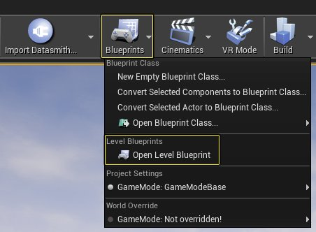
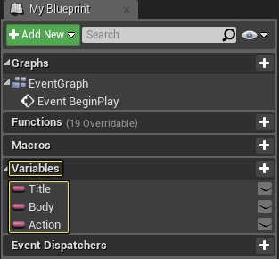
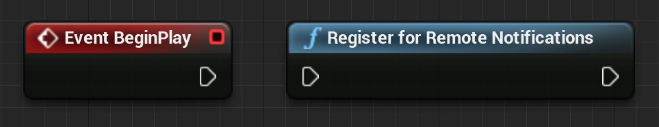
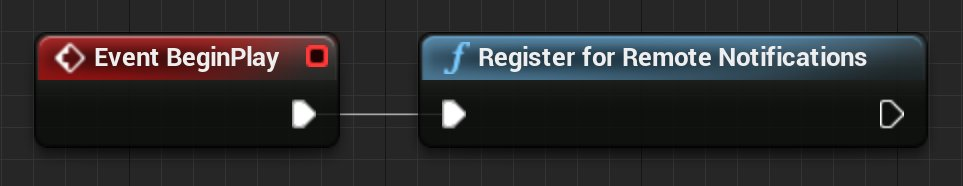
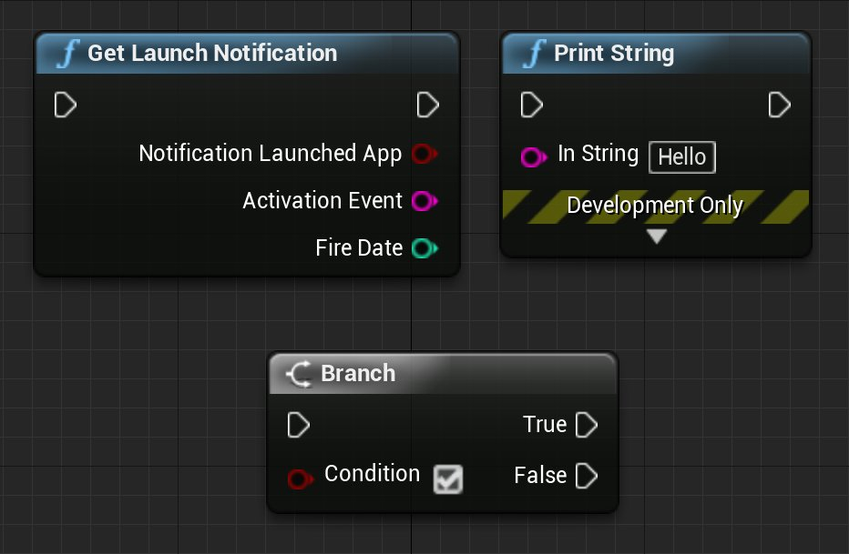
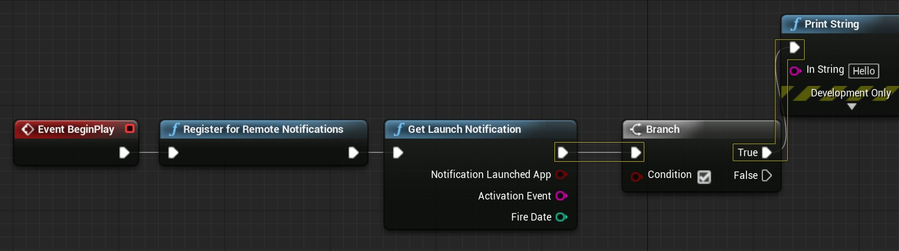
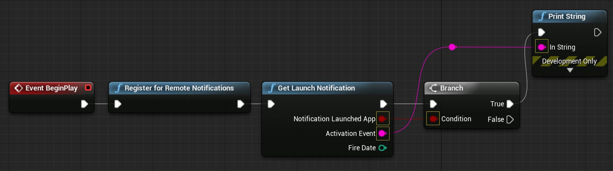
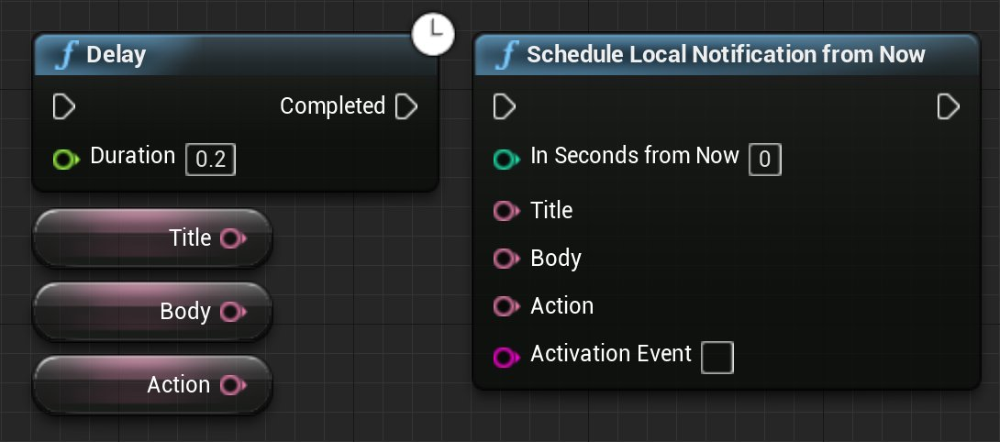

# Android和iOS的本地通知

> 路径：虚幻引擎5.7文档 / 移动端开发 / 应用内购买和广告 / Android和iOS的本地通知

> 原始页面：https://dev.epicgames.com/documentation/unreal-engine/local-notifications-for-android-and-ios-in-unreal-engine

本地通知是可在虚幻引擎4（UE4）应用程序之外显示的消息，用于告知用户已进行的更改或更新。在以下操作指南中，我们将介绍如何设置在Android和iOS设备上都有效的本地通知。

> [!NOTE]
> 适用于Android和iOS的本地通知的当前实现设置和执行起来都极其简单。本系统也仅适用于本地通知，不适用于通过远程服务器发送的通知。

选择移动平台

Android

iOS

## 步骤

1. 首先，新建具有下列选项集的基于 **蓝图** 的项目：

   - 选择

     蓝图（Blueprint）
   - 选择

     手机

     /

     平板电脑（Mobile/Tablet）
   - 选择

     可伸缩3D或2D（Scalable 3D or 2D）
   - 选择

     不带含初学者内容包（No Starter Content）
2. 项目打开之后，打开 **关卡蓝图**，方法是单击 **主工具栏** 上的 **蓝图（Blueprints）** 按钮，然后从显示的列表中选择 **打开关卡蓝图（Open Level Blueprint）** 选项。

   

   点击查看大图。

   > [!NOTE]
   > 为了便于你按照本操作指南所述进行操作，我们使用了关卡蓝图来设置和调用所需的本地通知蓝图节点。尽管可以在关卡蓝图中设置本地通知，但是你应考虑将该逻辑添加在对你的项目来说最为合理的位置。
3. 在 **变量（Variables）** 部分中，创建下列三个 **文本变量**，以便在本地通知显示时我们可以向用户显示消息：

   

   点击查看大图。

   | 变量名称 | 值 |
   | --- | --- |
   | **标题（Title）** | Title:This is the Title! |
   | **正文（Body）** | Body:This is the body! |
   | **操作（Action）** | Action:I am taking this Action! |
4. 为确保在本地通知被调用（以显示）时用户能够看到本地通知，向 **事件图表** 中添加 **Event Begin Play** 和 **Register for Remote Notifications** 节点。

   

   点击查看大图。

   > [!NOTE]
   > 向UE4项目中添加它时，请确保在项目首次加载时就调用"Register for Remote Notifications"节点。这样，你就不必在尝试显示通知时再次调用它。
5. 为确保在通知触发时用户能够看到通知，你需要将 **Event Begin Play** 的 **输出** 与 **Register for Remote Notifications** 的输入相连接。此设置可确保用户授予操作系统（OS）显示通知的权限。

   

   点击查看大图。
6. 我们已授予OS显示通知的权限，接下来，我们需要设置当用户单击通知时发生的事件。为处理此类型的交互，向 **事件图表** 中添加 **Get Launch Notification**、**Print String** 和 **Branch** 节点。

   

   点击查看大图。
7. 将 **Get Launch Notification** 节点的输出与 **Branch** 节点的输入相连接，然后将"Branch"节点的 **True** 输出与 **Print String** 节点的输入相连接。

   

   点击查看大图。
8. 现在，将 **Notification Launched App** 与"Branch"节点的 **Condition** 输入相连接，然后将 **Activation Event** 与 **Print String** 节点的 **In String** 相连接。

   

   点击查看大图。

   > [!NOTE]
   > 将它添加到项目中时可以省略 **Print String** 节点。添加它的目的是确保使用的Activation Event正确。
9. 现在，我们需要设置通知内容以及通知应在多长时间之后显示。要做到这一点，我们首先需要向事件图表中添加下列蓝图节点：

   - Schedule Local Notifications from Now
   - Delay
   - 标题（Title）、正文（Body）和操作（Action）文本变量

   

   点击查看大图。

10.在向事件图表中添加所需的节点之后，将"Delay"节点的 **Completed** 输出与 **Schedule Local Notifications from Now** 的输入相连接，然后分别将每个 **文本** 变量与它们在 **Schedule Local Notifications from Now** 节点上的相应输入相连接。完成后，事件图表应该如下图所示：

> 图片已省略：undefined

点击查看大图。

11.将"Delay"节点上的 **时长（Duration）** 设置为 **五（5）** 秒。这有助于确保在本地通知被调用和显示之前，用户有足够的时间关闭应用程序或使应用程序在后台中运行。

> 图片已省略：undefined

点击查看大图。

> [!NOTE]
> 添加 **Delay** 节点的目的只是为了确保在通知被触发之前有足够的时间可用来关闭应用程序或使它在后台运行。将它添加到项目时不必使用 **Delay** 节点。

12.接下来，将"Schedule Local Notifications from Now"节点的 **Seconds from Now** 输入设置为 **30** 秒。此设置将使通知在此代码运行完的30秒之后显示。

> 图片已省略：undefined

点击查看大图。

13.将"Schedule Local Notifications from Now"的 **Activation Event** 的值设置为 **42**。

> 图片已省略：undefined

点击查看大图。

> [!NOTE]
> 借助Activation Event输入，你可以关联可用于调用特定通知的字符串值。它使你可以设置并使用在满足特定条件时可以被显示的不同通知。

14.在使本地通知能够奏效所需的所有节点都已添加到事件图表中之后，需要做的最后一件事情是将 **Branch** 节点的 **False** 输出与 **Delay** 节点的输入相连接。完成后，事件图表应该如下图所示：

> 图片已省略：undefined

点击查看大图。

15.按"编译（Compile）"按钮编译关卡蓝图，然后按"保存（Save）"按钮保存关卡。 16.最后，在 **主工具栏** 上，单击 **启动（Launch）** 图标旁的 **高级选项（Advanced Options）** 下拉菜单，然后选择要在其上进行测试的设备。 LocalNotifications_LaunchOneDevice.png

> [!WARNING]
> iOS项目的本地通知目前只能通过源代码版本获得。

1. 首先，下载并编译虚幻引擎的源代码。关于如何从GitHub下载源代码，你可以参阅[GitHub上的UE4](https://www.unrealengine.com/en-US/ue4-on-github)，以及[下载虚幻引擎源代码](https://dev.epicgames.com/documentation/404)指南。

   > 图片已省略：undefined

   点击查看全图
2. 编译完编辑器后，将其打开并选择 **游戏（Games）> 空白（Blank）** 模板，使用以下设置新建一个项目：

   - 选择

     C++
   - 选择

     手机

     /

     平板电脑（Mobile/Tablet）
   - 选择

     可伸缩3D或2D（Scalable 3D or 2D）
   - 选择

     不带初学者内容包（No Starter Content）
3. 项目打开之后，转至

   编辑（Edit）

   ，然后选择

   项目设置（Project Settings）

   。
4. 在 **项目设置（Project Settings）** 菜单中，单击 **全部设置（All Settings）**，然后在搜索框中输入 **Enable Remote Notifications Support**。

   > 图片已省略：undefined

   点击查看大图。

   > [!NOTE]
   > "Enable Remote Notifications Support"仅在使用基于C++的项目时可用。如果使用基于蓝图的项目，该选项将显示为灰色。
5. 项目打开之后，打开 **关卡蓝图**，方法是单击 **主工具栏** 上的 **蓝图（Blueprints）** 按钮，然后从显示的列表中选择 **打开关卡蓝图（Open Level Blueprint）** 选项。

   > 图片已省略：undefined

   点击查看大图。

   > [!NOTE]
   > 为了便于你按照本操作指南所述进行操作，我们使用了关卡蓝图来设置和调用所需的本地通知蓝图节点。尽管可以在关卡蓝图中设置本地通知，但是你应考虑将该逻辑添加在对你的项目来说最为合理的位置。
6. 在 **变量（Variables）** 部分中，创建下列三个 **文本变量**，以便在本地通知显示时我们可以向用户显示消息：

   > 图片已省略：undefined

   点击查看大图。

   | 变量名称 | 值 |
   | --- | --- |
   | **标题（Title）** | Title:This is the Title! |
   | **正文（Body）** | Body:This is the body! |
   | **操作（Action）** | Action:I am taking this Action! |
7. 为确保在本地通知被调用（以显示）时用户能够看到本地通知，向 **事件图表** 中添加 **Event Begin Play** 和 **Register for Remote Notifications** 节点。

   > 图片已省略：undefined

   点击查看大图。

   > [!NOTE]
   > 向UE4项目中添加它时，请确保在项目首次加载时就调用"Register for Remote Notifications"节点。这样，你就不必在尝试显示通知时再次调用它。
8. 为确保在通知触发时用户能够看到通知，你需要将 **Event Begin Play** 的 **输出** 与 **Register for Remote Notifications** 的输入相连接。此设置可确保用户授予操作系统（OS）显示通知的权限。

   > 图片已省略：undefined

   点击查看大图。
9. 我们已授予OS显示通知的权限，接下来，我们需要设置当用户单击通知时发生的事件。为处理此类型的交互，向 **事件图表** 中添加 **Get Launch Notification**、**Print String** 和 **Branch** 节点。

   > 图片已省略：undefined

   点击查看大图。

10.将 **Get Launch Notification** 节点的输出与 **Branch** 节点的输入相连接，然后将"Branch"节点的 **True** 输出与 **Print String** 节点的输入相连接。

> 图片已省略：undefined

点击查看大图。

11.现在，将 **Notification Launched App** 与"Branch"节点的 **Condition** 输入相连接，然后将 **Activation Event** 与 **Print String** 节点的 **In String** 相连接。

> 图片已省略：undefined

点击查看大图。

> [!NOTE]
> 将它添加到项目中时可以省略 **Print String** 节点。添加它的目的是确保使用的Activation Event正确。

12.现在，我们需要设置通知内容以及通知应在多长时间之后显示。要做到这一点，我们首先需要向事件图表中添加下列蓝图节点：

***Schedule Local Notifications from Now*** **Delay** * **标题（Title）、正文（Body）和操作（Action）文本变量**

> 图片已省略：undefined

点击查看大图。

13.在向事件图表中添加所需的节点之后，将"Delay"节点的 **Completed** 输出与 **Schedule Local Notifications from Now** 的输入相连接，然后分别将每个 **文本** 变量与它们在 **Schedule Local Notifications from Now** 节点上的相应输入相连接。完成后，事件图表应该如下图所示：

> 图片已省略：undefined

点击查看大图。

14.将"Delay"节点上的 **时长（Duration）** 设置为 **五（5）** 秒。这有助于确保在本地通知被调用和显示之前，用户有足够的时间关闭应用程序或使应用程序在后台中运行。

> 图片已省略：undefined

点击查看大图。

> [!NOTE]
> 添加 **Delay** 节点的目的只是为了确保在通知被触发之前有足够的时间可用来关闭应用程序或使它在后台运行。将它添加到项目时不必使用 **Delay** 节点。

15.接下来，将"Schedule Local Notifications from Now"节点的 **Seconds from Now** 输入设置为 **30** 秒。此设置将使通知在此代码运行完的30秒之后显示。

> 图片已省略：undefined

点击查看大图。

16.将"Schedule Local Notifications from Now"的 **Activation Event** 的值设置为 **42**。

> 图片已省略：undefined

点击查看大图。

> [!NOTE]
> 借助Activation Event输入，你可以关联可用于调用特定通知的字符串值。它使你可以设置并使用在满足特定条件时可以被显示的不同通知。

17.在使本地通知能够奏效所需的所有节点都已添加到事件图表中之后，需要做的最后一件事情是将 **Branch** 节点的 **False** 输出与 **Delay** 节点的输入相连接。完成后，事件图表应该如下图所示：

> 图片已省略：undefined

点击查看大图。

18.按"编译（Compile）"按钮编译关卡蓝图，然后按"保存（Save）"按钮保存关卡。 19.最后，在 **主工具栏** 上，单击 **启动（Launch）** 图标旁的 **高级选项（Advanced Options）** 下拉菜单，然后选择要在其上进行测试的设备。 LocalNotifications_LaunchOnIOS.png

## 最终结果

一旦将项目部署到移动设备，在打开应用程序的五秒之后，你将听到并看到通知弹出，如以下视频所示。
