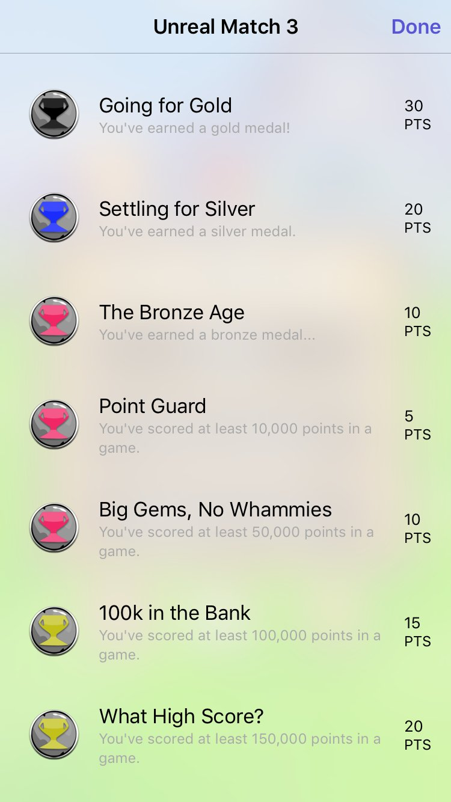
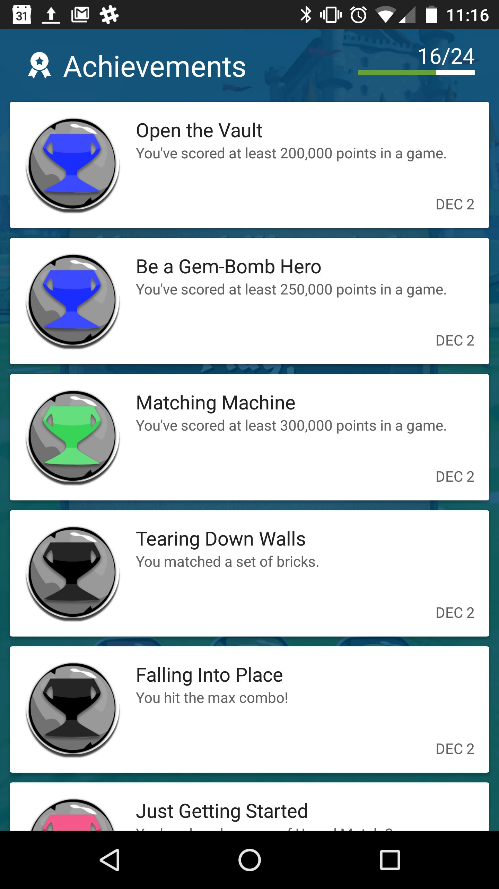

# 使用移动服务成就

> 路径：虚幻引擎5.7文档 / 移动端开发 / 应用内购买和广告 / 使用移动服务成就

> 原始页面：https://dev.epicgames.com/documentation/unreal-engine/using-achievements-in-mobile-applications-in-unreal-engine

**成就** 可设定为努力达成的目标、荣誉的徽章，或只是单纯的游戏进度标志。无论如何，它们都能让玩家对游戏更为入迷。

iOS Game Center

Google Play

## 配置

在下方页面中查看在每个平台上进行成就配置的详细内容：

- 使用 Google Play 成就

## 缓存成就

**Cache Achievements** 将从平台游戏服务请求成就列表，以及玩家拥有的成就数值。如此节点成功返回，即可使用 **Get Cached Achievement Value**。

它是 **隐藏** 节点，因此拥有多个执行输出引脚。最上方的是"pass through"，功能与其他执行输出引脚相似。在线服务返回数值（或返回数值失败）后，其他两个引脚（**On Success** 和 **On Failure**）将执行。执行返回 success 时

**在蓝图中：**

下图取自 Unreal Match 3 示例游戏的 **Global Game Instance** 蓝图。用户登入设备的游戏平台（Game Center、Google Play）后，我们在此时将运行 **Cache Achievements** 节点并停止实际执行（使顶部输出执行引脚不进行执行），使服务有时间返回所有成就。

## 从成就读取数值

**Get Cached Achievement Progress** 将返回特定 **Player Controller** 特定 **Achievement ID** 的进度，前提是之前已运行 **Cache Achievements** 节点并成功返回。

对于 iOS Game Center 而言，该数值为一个底层浮点值，因为它们将其作为整数保存。为 Google Play 服务接收的是浮点值。

**在蓝图中：**

下图取自 Unreal Match 3 示例游戏的 **Global Game Instance** 蓝图。成就被缓存后，我们通过一个循环从阵列中获取成就名称、以及它们的目标分数，并与找到的离线数值进行快速比较。然后接收服务较高的数值，或本地数值：

## 向成就写入数值

**Write Achievement Progress** 将从平台的成就系统发出消息，向特定用户的特定成就（**Player Controller** 和 **User Tag**）写入以百分比（0.0% - 100.0%）为基础的 **Progress**。对于"一次性解锁"的成就而言，**Progress** 传入的固定数值为 `100.0`；对于递增的成就而言，传入的百分比较低，直至数值达到 `100.0`。

对 iOS Game Center 而言，此数值实际上会作为整数发送，因为只存在 1-100 递增的成就。为 Google Play 服务发送的是浮点值。

它是 **隐藏** 节点，因此拥有多个执行输出引脚。最上方的是"pass through"，与其他执行输出引脚相似。在线服务返回数值（或返回数值失败）后，其他两个引脚（**On Success** 和 **On Failure**）将执行。执行返回 success 后，**Written Achievement Name**、**Written Progress** 和 **Written User Tag** 将返回等于传入节点的非空数值。

**在蓝图中：**

下图取自 Unreal Match 3 示例游戏的 **Global Game Instance** 蓝图。一个循环将对当前成就数值和增加成就所需的数字进行对比。如已有进度，则会调用 **Write Achievement** 事件：

> [!NOTE]
> 执行此操作的原因是隐藏节点无法用于函数之中。

## 显示平台特有的成就画面

**Show Platform Specific Achievement Screen** 将显示当前平台特定 **Player Controller** 的成就。

**在蓝图中：**

下图取自 Unreal Match 3 示例游戏的 **GameOverButtons** 蓝图控件。**ShowAchievements** 按钮按下后，游戏将显示当前平台的成就画面。
