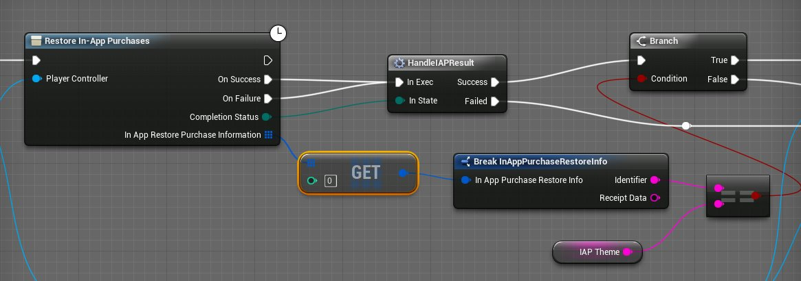

# 使用应用程序内购买

> 路径：虚幻引擎5.7文档 / 移动端开发 / 应用内购买和广告 / 使用应用程序内购买

> 原始页面：https://dev.epicgames.com/documentation/unreal-engine/using-inapp-purchases-in-unreal-engine-projects-for-mobile-devices

应用程序内购买使你能够向玩家提供额外的内容和功能。这可以用来为免费游戏创收，或者为游戏提供额外付费内容。

## 配置

有关为各个平台配置应用程序内购买的详细信息，请参阅下方相应的平台特定页面：

- 使用安卓内购

## 读取购买信息

然后您可以使用 **读取应用程序内购买信息（Read In-App Purchase Information）** 蓝图节点（或关联的C++函数调用）阅读应用程序内购买信息。像大多数其他在线子系统函数一样，它将玩家控制器作为输入以及您的产品辨识符数组。注意，下方的进行应用程序内购买（Make In-App Purchase）采用单个辨识符，而读取（Read）可以处理信息数组。此函数返回应用程序内购买（In App Purchase）结构体的数组，且该数组的各个元素均可以经过分析来获取名称、描述、价格和其他数据，以显示在您的UI中或用于您的游戏进程逻辑。

## 完成购买

若要进行应用程序内购买，请使用 **进行应用程序内购买（Make In-App Purchases）** 蓝图节点（或关联的C++函数调用）。它将玩家控制器作为输入以及产品请求（Product Request）结构体。产品请求（Product Request）就是来自iTunes Connect或Google Play Developer主机的产品辨识符（此例中为match3theme_night），以及产品是否是消费品。

**进行应用程序内购买（Make an In-App Purchase）** 节点是潜在的，因此您希望使其依赖于购买成功与否的任何游戏进程行为都应使用那两个执行引脚。它们将仅在收到在线服务返回的响应后执行。此节点还返回购买的完成状态（例如成功（Success）、失败（Failed）、恢复（Restored））和详细的应用程序内购买信息（In App Purchase Information）结构体。

此函数有非潜在版本（将显示蓝图节点，而不显示时钟）。此处的退出执行引脚并不会等待在线服务的响应，因此您通常需要使用潜在版本。

## 恢复购买

若要恢复购买，请使用 **恢复应用程序内购买（Restore In-App Purchases）** 蓝图节点（或关联的C++函数调用）。它仅接受玩家控制器，并返回与该玩家控制器关联的所有购买信息的数组。然后你可以处理该数组，与你的游戏进程逻辑需要的特定辨识符进行对比。
