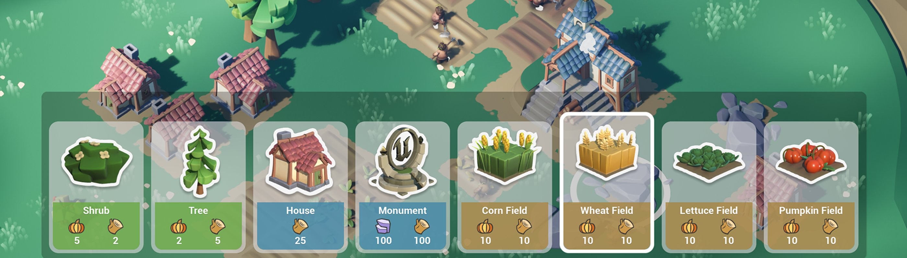
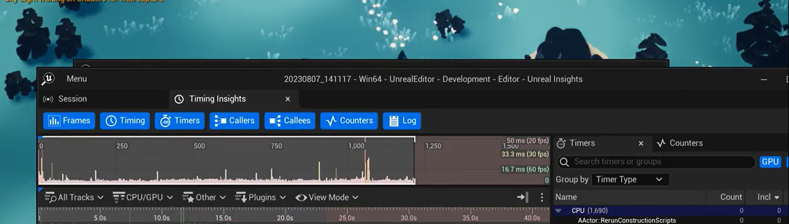
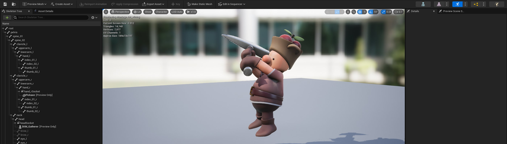
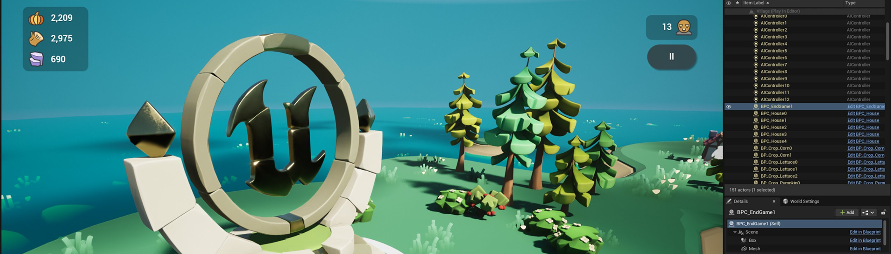

# 移动端开发

> 路径：虚幻引擎5.7文档 / 移动端开发

> 原始页面：https://dev.epicgames.com/documentation/unreal-engine/getting-started-with-mobile-development-in-unreal-engine

虚幻引擎为你提供了各种工具和框架，让你可以为iOS、Android和tvOS创建优质的应用程序。 下文各小节将帮你着手创建应用程序，并指导你优化、调试和打包项目。

要为移动平台创建游戏和应用程序，在开发过程中有很多独特的注意事项需要加以考虑：

- 你的目标设备是什么？
- 它们存在哪些限制？
- 是否应该使用广告或应用内购买？
- 其他问题等等。

虚幻引擎为你提供了各种工具和框架，让你可以为iOS、Android和tvOS创建优质的应用程序。 下文各小节将帮你着手创建应用程序，并指导你优化、调试和打包项目。

## 入门指南

本小节将帮助你为移动端开发做好准备，并协助你完成部署到所选平台的相关设置。

- [创建低开销移动端项目](https://dev.epicgames.com/documentation/unreal-engine/creating-a-lowoverhead-mobile-project) - 为Android设备创建渲染功能极少的低开销项目。

- [创建移动项目](setting-up-an-unreal-engine-project-for-mobile-platforms/index.md) - 为移动设备配置新项目。
- [移动端开发工具](development-tools-for-mobile-applications/index.md) - 了解虚幻引擎为移动设备准备的项目构建和调试工具。
- [移动端渲染功能](rendering-features-for-mobile-games/index.md) - 了解虚幻引擎移动端渲染路径以及其对于图形功能的支持。
- [应用内购买和广告](in-app-purchases-and-ads-in-unreal-engine-projects/index.md) - 实现常见的移动端服务，例如成就、通知和应用内购。
- [移动端调试和优化](debugging-and-optimization-for-mobile/index.md) - 关于优化移动端内容的工具和最佳实践。

- [在Windows上开发iOS项目](ios-ipados-and-tvos-support/working-on-ios-projects-using-a-windows-machine/index.md) - 介绍在Windows设备上进行开发时，简化iOS工作流程的指南。

## 调试和优化

本小节包含了关于优化Oodle压缩工具、Gauntlet框架、Unreal Insights以及RenderDoc插件等工具的最佳实践和指南。

- [Android支持](android-support/index.md) - 了解如何为Android设备编译项目。

- [iOS、iPadOS和tvOS](ios-ipados-and-tvos-support/index.md) - 了解如何为iOS、iPadOS和Apple TV构建项目。

- [Android设备上的Unreal Insights](debugging-and-optimization-for-mobile/optimization-guides-for-android/how-to-use-unreal-insights-to-profile-android-games/index.md) - 将Unreal Insights诊断工具附加到在测试设备上运行的Android应用程序的分步骤指南。

- [使用Oodle](../testing-and-optimizing-content/using-oodle/index.md) - 介绍虚幻引擎中的Oodle压缩解决方案

- [使用RenderDoc分析虚幻引擎画面](../designing-visuals-rendering-and-graphics/optimizing-and-debugging-projects-for-realtime-rendering/using-renderdoc/index.md) - RenderDoc是一款免费的开源图形调试程序，可以逐帧捕捉应用中的画面。

- [Gauntlet自动化框架](../testing-and-optimizing-content/automation-test-framework/gauntlet-automation-framework/index.md) - 在虚幻引擎中运行项目会话的框架，可执行测试并验证结果。

## 图形和资产注意事项

本小节包含了关于优化资产、材质、光照、图形等内容的最佳实践和指南。

- [渲染和着色模式](rendering-features-for-mobile-games/mobile-rendering-and-shading-modes/index.md) - 关于移动前向、延迟和桌面渲染路径的信息。

- [移动端的渲染优化技巧](debugging-and-optimization-for-mobile/optimization-and-development-best-practices-for-f2fc3d86/index.md) - 有关如何优化移动设备性能以及从移动端HDR功能获取最高保真度的指南和最佳实践

- [PSO缓存](../testing-and-optimizing-content/optimizing-rendering-with-pso-caches/index.md) - 提前记录应用程序的GPU状态，优化渲染。

- [移动端Lumen](rendering-features-for-mobile-games/using-lumen-global-illumination-on-mobile/index.md) - 在移动设备上使用Lumen的兼容性信息和说明。

## 打包并发布你的移动端游戏

本小节包含了关于编译应用程序、使用商城以及打包iOS和Android应用程序的指南。

- [打包Android项目](android-support/packaging-and-publishing-android-projects/packaging-android-projects/index.md) - 介绍如何打包最终Android项目。

- [打包iOS项目](ios-ipados-and-tvos-support/packaging-and-publishing-android-projects/packaging-ios-projects/index.md) - 了解如何打包虚幻引擎iOS项目

## 更多资源

虚幻引擎移动版：打造3A级跨平台开放世界 | 2024虚幻嘉年华
