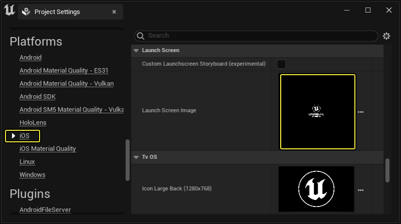
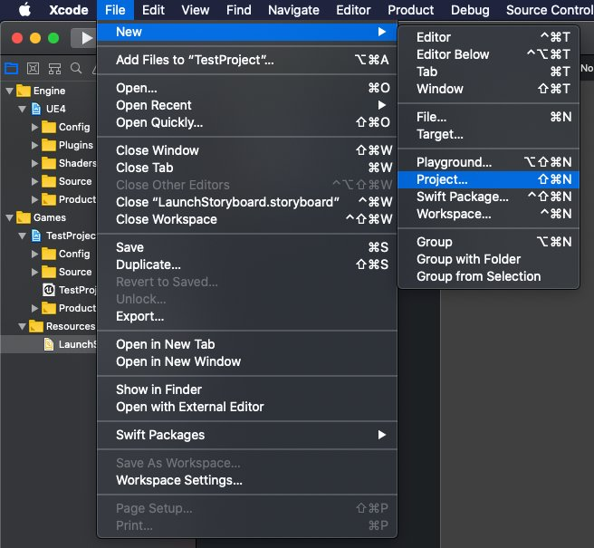
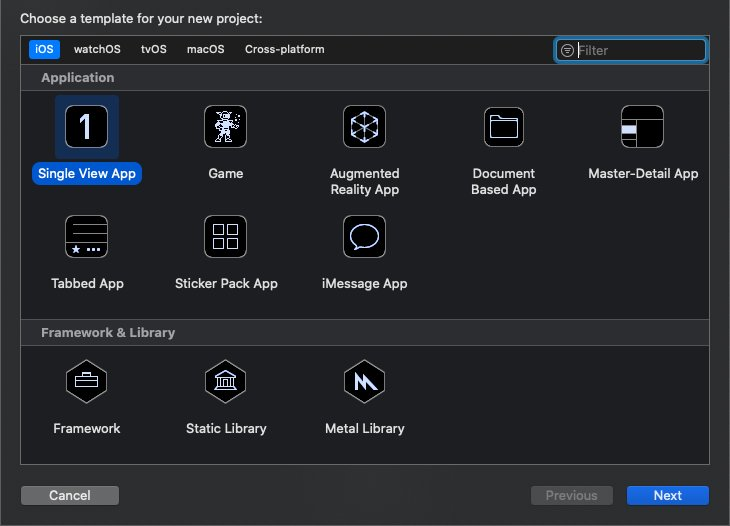
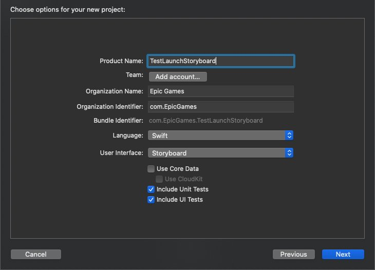
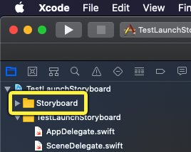
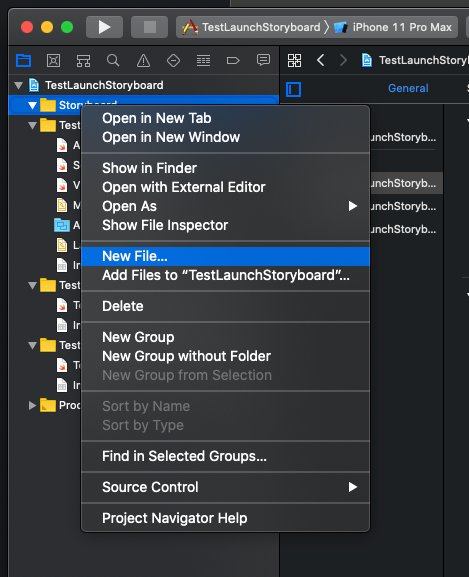
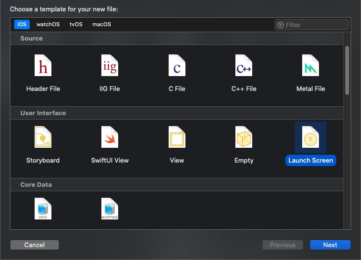
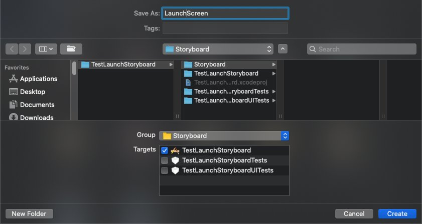

# iOS故事板启动

> 路径：虚幻引擎5.7文档 / 移动端开发 / iOS、iPadOS和tvOS / iOS和tvOS开发指南 / iOS故事板启动

> 原始页面：https://dev.epicgames.com/documentation/unreal-engine/setting-up-ios-launch-storyboards-in-unreal-engine-projects

**启动故事板（Launch Storyboards）** 是iOS应用程序的启动画面。与传统的静态图像启动画面不同，故事板支持动画，并且能够根据用户设备的分辨率和DPI进行缩放。借助故事板，开发人员能够相对轻松地创建精美的启动画面，并能适配各种设备。本指南将带领你了解如何在 **虚幻引擎（UE）** 项目中一步步实现故事板。

> [!NOTE]
> App Store和Apple Arcade的所有应用程序强制要求使用故事板。Apple不再接受带静态启动画面的应用程序送审。

## 简约启动故事板

建议你进行以下部分的学习，创建功能齐全的自定义故事板。UE能够创建单张画面类型的简易故事板，可用作临时启动画面或用于测试目的，以便你打包出有效的iOS项目。此工作流可在所有操作系统中使用（无论是否为C++项目）。

如需配置简易故事板，请打开 **项目设置（Project Settings）**，然后导航至 **平台（Platforms）** > **iOS** > **启动画面（Launch Screen）** 分段。

若未勾选 **自定义启动故事板（Custom Launch Storyboard）**，则构建项目时，**启动画面图像（Launch Screen Image）** 中提供的图像将被转换为故事板。默认情况下，会提供一张带有虚幻引擎标志的备用图像。

### 图像指南

启动画面图像必须是没有透明度通道的PNG文件。最好采用正方形尺寸（例如2048x2048），以便缩放和裁剪，从而轻松适配尽可能多的设备。

## 在Xcode中创建自定义启动故事板

要创建自定义故事板，你需要一台装有Xcode的Mac。你无需在虚幻引擎中创建C++项目来完成这些步骤，但你需要Xcode来生成故事板。

## 设置Xcode项目

如果你打算创建C++项目，你可以直接在Xcode项目中为UE游戏创建启动画面。或者，你可以在UE项目之外的、任何有效的Xcode项目中创建启动画面，之后再将其移至UE中。若你出于组织管理目的希望单独分开故事板项目，或者你打算创建一个蓝图项目，则可以借鉴此方法。

请遵循以下步骤创建一个独立的Xcode项目：

1. 打开 **Xcode**，然后依次点击 **文件（File）** > **新建（New）** > **项目（Project）**。

   

   点击放大图像。
2. 在模板菜单中，选择创建 **iOS** 项目，然后点击 **单视图应用程序（Single View App）**，再点击 **下一步（Next）**。

   

   点击放大图像。
3. 在选项菜单中填写产品名称、组织名称和组织辨识符。在此范例中，将生成 *com.EpicGames.TestLaunchStoryboard* 的 **束辨识符（Bundle Identifier）**。
4. 在 **用户界面（User Interface）** 下拉菜单中点击 **故事板（Storyboard）**。填写完所有必要信息后，点击 **下一步（Next）**。

   

   点击放大图像。
5. 将新项目放置在便利的文件夹中。在此范例中，项目位于 `Users/UserName/Xcode Projects` 下。

无需编译该项目。制作此项目只为了创建故事板，故事板将手动移入UE项目。

## 创建启动故事板

建立项目后，请遵循以下步骤创建用作启动画面的故事板：

1. 在 **项目导航器（Project Navigator）** 中右键点击 **项目**，点击 **New Group（新建组）**，然后创建一个名为 **故事板（Storyboard）** 的新组。

   
2. 点击 **文件（File）** > **新建文件（New File）…**

   

   点击放大图像。
3. 在文件模板菜单中，导航至 **用户界面（User Interface）** 部分，选择 **启动画面（Launch Screen）**，然后点击 **下一步（Next）**。

   

   点击放大图像。
4. 出现提示时保存文件。将文件放置在 **Storyboard** 文件夹中，它必须位于名称相同的组中，然后将文件名更改为 **LaunchScreen**，不带空格。

   

   点击放大图像。
5. 点击 **创建（Create）** 按钮完成故事板的创建。名为LaunchScreen.storyboard的文件将出现在故事板（Storyboard）组中，带有简单的文本标签和版权声明。

   > 图片已省略：undefined

   点击放大图像。
6. 选择 **视图控制器（View Controller）**。在身份检查器（Identity Inspector）中，将 **故事板ID（Storyboard ID）** 设为"LaunchScreen"。在 **恢复ID** 部分勾选 **使用故事板ID（Use Storyboard ID）** 复选框。

   > 图片已省略：undefined

   点击放大图像。

> [!WARNING]
> 要在启动时识别故事板，必须为视图控制器（View Controller）设置故事板和恢复ID。若跳过此步骤，在显示故事板之前应用程序将停在黑屏状态中。

## 将图像添加到启动故事板

上部分创建的故事板已拥有足够功能，可在项目中按原样使用。在本部分中，将向故事板添加图像，了解如何将外部资源整合到Xcode项目中。

1. 创建图像，作为故事板的背景。此图像应为不带不透明度的PNG。
2. 在 **项目导航器（Project Navigator）** 中，右键点击 **故事板（Storyboard）** 组，点击 **New Group（新建组）**，然后调用新组 **资源（Assets）**。
3. 在 **查找器（Finder）** 中，确保 **Storyboard** 文件夹中存在 **Assets** 文件夹，然后将PNG放在 **Assets** 文件夹中。

   > 图片已省略：undefined

   点击放大图像。
4. 将PNG拖入 **项目导航器（Project Navigator）**的 **资产（Assets）** 组，以将其添加到Xcode项目。
5. 点击Xcode窗口顶部的 **+** （加号）按钮，打开 **库**。

   > 图片已省略：undefined

   点击放大图像。
6. 在 **库** 中找到 **图像视图（Image View）** 对象，然后点击将其拖入 **故事板**。对象将替换默认 **视图（View）** 以及所有填充文本。

   > 图片已省略：undefined

   点击放大图像。
7. 选择 **图像视图（Image View)**，然后在 **属性（Attributes）面板** 中，点击源 **图像（Image）** 下拉列表并选择PNG。若未显示属性（Attributes）面板，请点击 **标尺** 图标旁边中间有线条穿过的V形图标。

   > 图片已省略：undefined

   点击放大图像。
8. 在 **属性（Attributes）面板** 中将 **内容模式（Content Mode）** 设为 **等比填充（Aspect Fill）**。
9. 点击 **标尺** 图标，选择 **大小检查器（Size Inspector）**。点击 **自动调整大小（Autoresizing）** 部分中的所有四个 **约束（Constraints）**。这将确保图像视图（Image View）基于四个方向调整大小。

   > 图片已省略：undefined

   点击放大图像。

只要图像位于Xcode项目中的某个位置，图像视图（Image View）就能使用该图像。但是，我们建议将图像保存在Assets文件夹中，以便按照下一部分中的内容将其添加到虚幻引擎项目中。

### 图像指南

我们建议启动画面使用方形图像，以最大程度地兼容各种高宽比。但若目标为特定设备或特定高宽比，则可以自定义图像来完美匹配。

## 添加自定义故事板

将故事板添加到UE项目中：

1. 在 `Project/Build/IOS/Resources/Interface` 引擎安装目录中创建文件夹。
2. 在查找器（Finder）中找到Xcode项目的 **Storyboard** 文件夹。
3. 将LaunchScreen.storyboard和随附的Assets文件夹都复制到 `Project/Build/IOS/Resources/Interface` 中。

   > 图片已省略：undefined

   点击放大图像。

   > [!NOTE]
   > 如果你在项目文件夹中没有按要求提供文件，系统则会回到引擎目录并查找这些文件。
4. 在 **虚幻编辑器（Unreal Editor）**中打开 **项目设置（Project Settings）**，然后导航至 **平台（Platforms）** > **iOS** > **启动画面（Launch Screen）**。
5. 启用 **自定义启动故事板（Custom Launch Storyboard）** 复选框。

   > 图片已省略：启用自定义故事板

现在，打包iOS项目时，该项目将使用放置在IOS/Resources/Graphics文件夹中的自定义故事板，不使用默认的启动故事板。尽管Xcode项目在引用图像文件时不会依赖特定的文件夹结构，但UE4项目要求文件必须位于LaunchScreen.storyboard文件旁的Assets文件夹中。

## 延伸阅读

经过本指南的学习后，你应能掌握在UE4项目中实现基础启动故事板所需的全部知识。欲知配置和编辑iOS故事板的更多信息，请参阅Apple文档中有关[启动画面]的部分(https://developer.apple.com/design/human-interface-guidelines/ios/visual-design/launch-screen/) and [storyboards](https://developer.apple.com/library/archive/documentation/ToolsLanguages/Conceptual/Xcode_Overview/DesigningwithStoryboards.html)。
