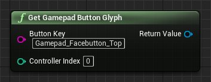

# 处理iOS输入

> 路径：虚幻引擎5.7文档 / 移动端开发 / iOS、iPadOS和tvOS / iOS和tvOS开发指南 / 处理iOS输入

> 原始页面：https://dev.epicgames.com/documentation/unreal-engine/working-with-ios-input-in-unreal-engine

在iOS、tvOS和iPadOS 14及更高版本中，Apple支持一系列的输入设备，包括游戏手柄、键盘、鼠标和触控板。这包括能够在操作系统层面重新映射Xbox、PlayStation和Mfi游戏手柄控制器的游戏手柄按钮。 操作系统可以处理这些设备的按钮样式显示，让应用程序能够获得与用户的自定义映射相符的样式。这对于所有面向操作系统版本14或更高版本的应用来说都是必需的。

> [!WARNING]
> Apple要求你的游戏内按钮显示必须准确对应用户的操作系统级输入绑定。如果不符合此要求，App Store和Apple Arcade可能会拒绝分发你的应用。

**虚幻引擎** 支持输入处理，让你的应用程序能够充分利用更广泛的设备范围。只要用户能够将其输入正确连接到他们的Apple设备，则无需额外设置便可使用此功能。但是，所包含的功能是为了帮助遵守Apple对UI的要求。

## 获得游戏手柄按钮样式

使用 **蓝图** 中的 **Get Gamepad Button Glyph** 节点，检索与你用户映射相符的样式。

Get Button Glyph节点，Button Key（按钮键）字段中提供了文本Gamepad_Facebutton_Top。

其参数如下：

| 参数 | 类型 | 说明 |
| --- | --- | --- |
| 按钮键（Button Key） | 字符串 | 目标按钮的 `FKey` 名称，如 `InputCoreTypes.h` 中所定义，已转换为字符串。 |
| 控制器索引（Controller Index） | 整数 | 你要为其获取按钮样式的已连接控制器的索引。 |
| 返回值（Return Value） | Texture2D | 2D纹理，其中包含要在你的UI控件中使用的按钮样式。 |

举个例子，如果你希望获得控制器上顶面按钮的按钮样式，则需要使用字符串 **Gamepad_Facebutton_Top**。

在请求这样的按钮时，应该根据默认映射请求你希望用户使用的按钮。如果用户在操作系统中重新映射了按钮，该功能将自动返回他们正在使用的重新映射后的按钮。例如，如果用户调换了Xbox控制器上的X按钮和Y按钮，`Gamepad_Facebutton_Top` 将返回X按钮样式，而不是Y按钮样式。
