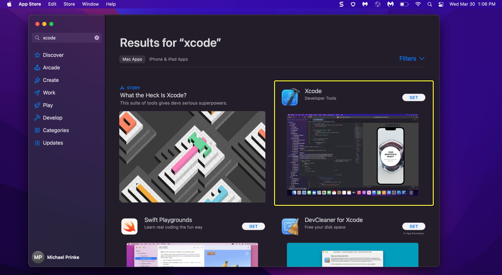
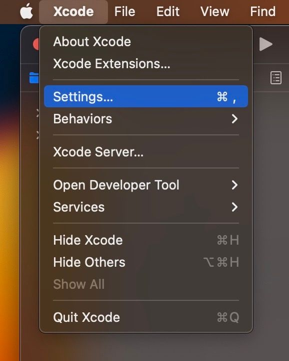
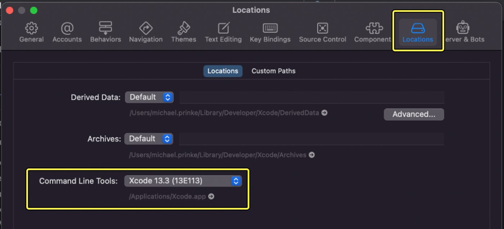
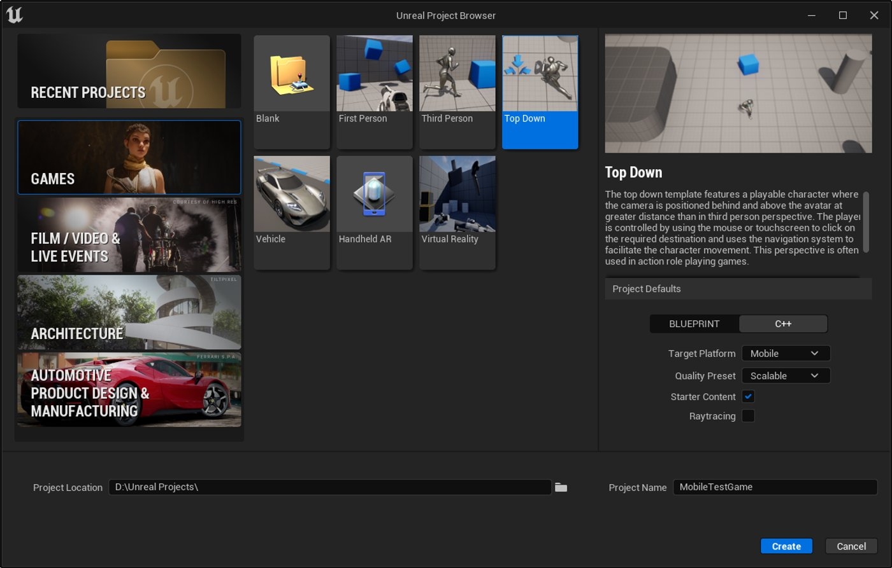

# iOS快速入门指南

> 路径：虚幻引擎5.7文档 / 移动端开发 / iOS、iPadOS和tvOS / 虚幻引擎中iOS和tvOS相关的入门指南 / iOS快速入门指南

> 原始页面：https://dev.epicgames.com/documentation/unreal-engine/setting-up-an-unreal-engine-project-for-ios

本快速入门指南说明了为Apple的iOS、iPadOS和tvOS平台编译**虚幻引擎**项目所需的所有步骤。 完成本指南后，你将学会以下技能：

- 在你的Mac上设置Xcode。
- 在Xcode中连接到你的设备。
- 使用你的Apple开发者账户注册你的设备。
- 为你的项目创建预配配置文件和证书。
- 为iOS配置你的项目。
- 在iOS设备上编译和运行你的项目。

> [!NOTE]
> 本指南涵盖了如何为C++项目创建签名的编译。 对于Windows上的纯Blueprint项目，有一个用于编译iOS项目的备用工作流程。 如需更多信息，请参阅[打包iOS项目](../../packaging-and-publishing-android-projects/packaging-ios-projects/index.md)。
>
> 此外，虽然本指南以iPhone和iOS为例，但请注意，相同的设置步骤也用于tvOS。 要连接到tvOS设备，请参阅[连接到tvOS设备](../connecting-to-tvos-devices/index.md)页面。

## 1. 要求

要为Apple的平台编译项目，你需要具备以下条件：

- 一台运行MacOS的计算机，并且安装了虚幻引擎。
- 安装与你的当前虚幻引擎版本兼容的Xcode。
- Apple开发者账户。
- 一个与你的当前虚幻引擎版本兼容的iOS设备。

以下软件版本与当前虚幻引擎版本兼容：

- 当前UE版本：5.6

  - 支持的目标SDK版本：iOS 15或更高版本
  - 推荐的macOS和Xcode版本

    - macOS Sonoma 14.7
    - Xcode 16.1
  - 最低的macOS和Xcode版本

    - macOS Sonoma 14.5
    - Xcode 16

以下iOS硬件版本与当前虚幻引擎版本兼容：

- iOS 15

  - + iPhone 6S或更新
  - iPod Touch第七代
- iPadOS 15

  - iPad第5代或更新
  - iPad Air 2或更高版本
  - iPad Mini 4或更高版本
  - iPad Pro（所有型号）
- tvOS 15

  - Apple TV HD
  - + Apple TV 4K（第一代）
  - Apple TV 4K（第二代）

> [!NOTE]
> Apple基于A8/A8X的设备（iPad Air 2、iPad Mini 4和Apple TV HD）需要相关项目设置才能启用支持。 某些渲染功能在A8/A8X设备上可能会受限。

有关更早虚幻引擎版本的软件兼容性信息，请参阅[iOS和tvOS开发要求](../../ios-ipados-and-tvos-development-requirements/index.md)页面。

## 2. 设置Xcode

1. 如果你尚未在Mac上安装Xcode，请从App Store下载并安装。 你需要使用Apple ID登录。

   
2. 打开Xcode后。 在工具栏中，打开**Xcode** > **设置（Settings）**。

   
3. 打开**位置（Locations）**选项卡，然后验证**命令行工具（Command Line Tools）**路径是否设置为当前Xcode版本。 如果未设置此路径，你将无法打开虚幻编辑器（Unreal Editor），因为Metal着色器编译器将找不到Xcode。

   

## 3. 创建你的项目

要设置移动项目，请打开虚幻编辑器（Unreal Editor），并使用以下规格创建新项目：

Click image for full size.

1. Open **Unreal Editor**. When the **Unreal Project Browser** appears, click **Games**.
2. Configure your project as follows:

   - **Project Template:**Top Down
   - **Target Platform:**Mobile
   - **Quality Preset:**Scalable
   - **Project Name:**MobileTestGame

You can create a project that uses either **Blueprint** or **C++**.

1. Click **Create** to create the project and open it in Unreal Editor.

> [!TIP]
> 上述规格和项目名称来自[创建移动项目](../../../setting-up-an-unreal-engine-project-for-mobile-platforms/index.md)指南。 请参阅该页面，详细了解这些规格。

## 4. 将你的设备与Xcode连接并使用你的Apple开发者账户进行注册

要使用你的iOS设备进行测试，你需要将其连接到你的计算机，确保它可被Xcode识别，并在你的Apple开发者账户中将其注册为你的应用的测试设备。 设备注册将在后面用于创建预配配置文件。 按照以下步骤设置你的设备：

1. 使用数据线将你的iOS设备连接到你的计算机。
2. 打开Xcode，然后点击**窗口（Window）** > **设备和模拟器（Devices and Simulators）**。
3. 解锁你的设备，授权Xcode访问该设备。 当你在iOS设备上看到**信任此设备（Trust This Device）**提示时，点击**信任（Trust）**，然后提供你的密码。 Xcode将获取该设备的调试符号。
4. 在[developer.apple.com](https://developer.apple.com/)登录你的Apple开发者账户。 如果你没有Apple ID和开发者账户，请创建一个。

   > [!NOTE]
   > 虽然Epic的软件可免费使用，但Apple开发者账户需要每年支付99美元的费用。 注册账户时请记住这一点。
5. 登录后，点击**证书、标识符和配置文件（Certificates, Identifiers & Profiles）**。
6. 点击**设备（Devices）**，然后点击**注册设备（Register a Device）**。
7. 填写关于设备的以下信息：

   - 将**平台（Platform）**设置为iOS、tvOS、watchOS。
   - 将**设备名称（Device Name）**设置为可识别的唯一名称。
   - 在**Xcode**的**窗口（Window）** > **设备和模拟器（Devices and Simulators）**中查看关于设备的信息。 复制**标识符**，然后返回到注册设备（Register a Device）页面，并将其粘贴到**UUID**字段中。

   完成后，点击**继续（Continue）**。
8. 仔细检查关于设备的信息是否正确。 如果你输入错误的UUID，可能会看到界面上列出错误的设备类型。 点击**注册（Register）**，使用你的Apple开发者账户完成设备注册。 注册完成后，点击**完成（Done）**。

## 5. 预配和签名

下面简要总结了如何获取你的应用的代码签名证书和预配配置文件，这两者是打包iOS项目所必需的。 如需完整详细步骤，请参阅[iOS预配指南](../setting-up-ios-tvos-and-ipados-provisioning-pro-d7cef79d/index.md)。

1. 在**Xcode** > **偏好设置（Preferences）** > **账户（Accounts）**中，将你的Apple开发者ID与Xcode连接。
2. 为你的应用创建**标识符**（应用ID）。 使用格式com.(OrganizationName).(ProjectName)提供束标识符名称。 在此示例中，束标识符是com.YourCompany.MobileTestProject。
3. 打开项目的Xcode项目文件，然后确保其束标识符与你为应用ID指定的值相同。 在虚幻编辑器（Unreal Editor）的**项目设置（Project Settings）** > **平台（Platforms）** > **iOS**中做相同的检查。
4. 在**签名和功能（Signing & Capabilities）**下，启用**自动管理签名（Automatically Manage Signing）**，然后将你的**团队（Team）**设置为与你的Apple开发者账户关联的名称。 Xcode将自动生成代码签名证书。 你也可以在Apple开发者页面的**证书、标识符和配置文件（Certificates, Identifiers, and Profiles）**小节中手动创建一个证书。
5. 打开Apple开发者页面，然后打开**证书、标识符和配置文件（Certificates, Identifiers, and Profiles）**。 使用你的标识符、你注册的设备和签名证书创建新的**预配配置文件（Provisioning Profile）**。 将其下载到便于使用的位置，例如**Provisioning**文件夹。
6. 前往Apple的[证书颁发机构页面](https://www.apple.com/certificateauthority/)并下载最新的[WWDR中间证书](https://developer.apple.com/support/expiration/)。 打开**密钥链访问（Keychain Access）**应用并将证书拖入**系统密钥链（System keychain）**中。 这对于打包你的项目进行测试不是必需的，但对于发布是必需的。
7. 在虚幻编辑器（Unreal Editor）中打开你的项目，然后打开**项目设置（Project Settings）** > **平台（Platforms）** > **iOS**。 稍等片刻，让编辑器有时间发现你的预配配置文件和签名证书，然后选择这两者。

## 6. 打包你的项目

完成上述分段后，点击**平台（Platforms）**下拉菜单，然后点击**iOS** > **打包项目（Package Project）**。 如果你的所有组件都已正确设置，你的项目将成功打包。 你还可以使用**快速启动（Quick Launch）**选项直接在所选设备上启动。

## 最终效果

执行本指南中的步骤后，你将设置好一个iOS项目，随时可在测试设备上启动。
