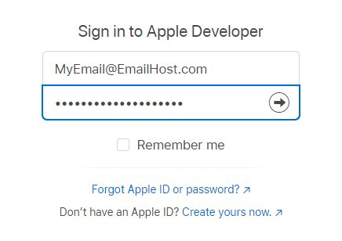
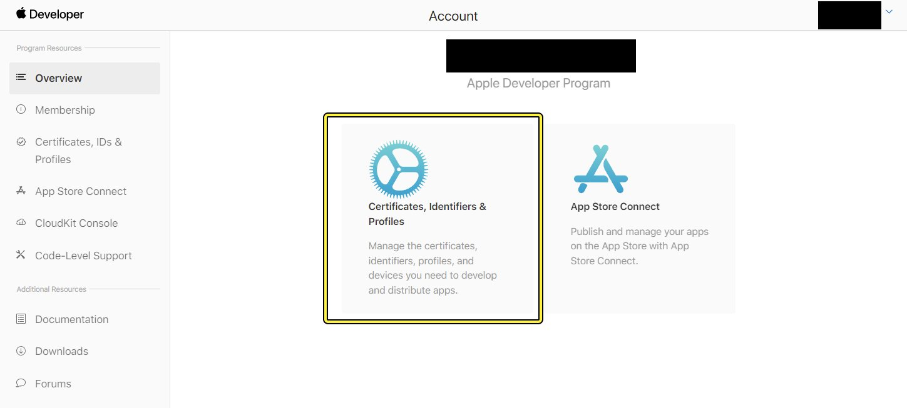
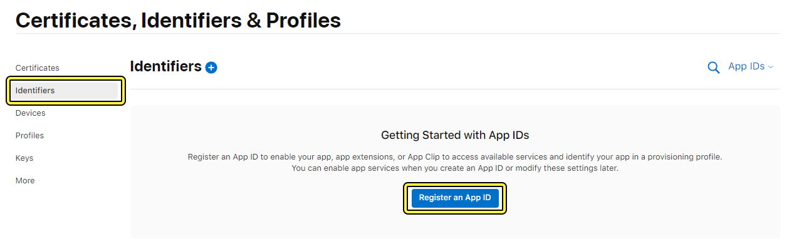
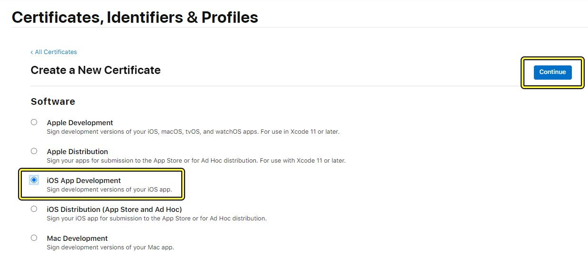
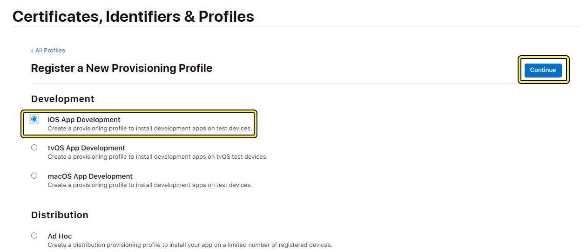
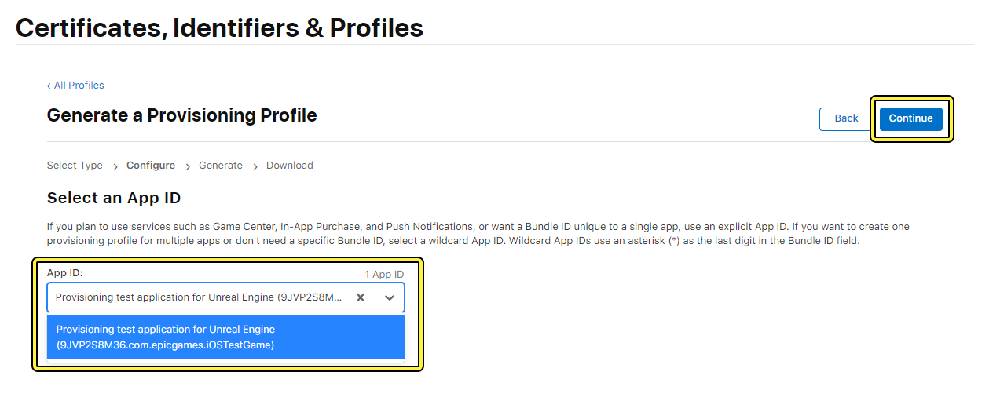

# 描述文件和签名证书

> 路径：虚幻引擎5.7文档 / 移动端开发 / iOS、iPadOS和tvOS / 虚幻引擎中iOS和tvOS相关的入门指南 / 描述文件和签名证书

> 原始页面：https://dev.epicgames.com/documentation/unreal-engine/setting-up-ios-tvos-and-ipados-provisioning-profiles-and-signing-certificates-for-unreal-engine-projects

要在iOS、iPadOS和tvOS平台上发布游戏，你需要一个 **代码签名证书（Code Signing Certificate）** 来成为一个有效的苹果开发者，还需要一个 **预配配置文件（Provisioning Profile）** 来表明你的应用程序所需要的服务和权限。虽然 **Xcode** 可以为构建代码自动管理这项任务，但是你需要将这些信息手动提供给 **虚幻引擎** 的项目设置，这样虚幻引擎的构建系统才可以烘焙并将项目打包。这份指南会介绍设置有效的证书和配置文件所需的所有步骤。

> [!NOTE]
> 该指南包括了使用MacOS和Xcode构建虚幻引擎C++项目所需的完整设置。虽然你需要用一个装有Xcode的MacOS设备构建项目来在App Store中发行，但是虚幻引擎也提供了一些其它的方法，可以以开发和测试为目的来构建iOS应用，包括使用Windows的工作方式。更多信息请参考[附录B：其它构建选项](#%E9%99%84%E5%BD%95b%EF%BC%9A%E5%85%B6%E5%AE%83%E6%9E%84%E5%BB%BA%E9%80%89%E9%A1%B9)。

## 1. 概览和要求

要为iOS、iPadOS和tvOS设备构建并发行一个 **虚幻引擎（Unreal Engine）** 项目，你需要：

- 一台运行MacOS的电脑。
- 安装好的Xcode，并且要与当前使用的虚幻引擎兼容。
- 一个苹果开发者账号。
- 一个虚幻引擎项目。

更多关于当前虚幻引擎版本对于MacOS和Xcode的版本要求，请参考[iOS、iPadOS、和tvOS开发要求](https://dev.epicgames.com/documentation/404)页面。了解如何设置Xcode与虚幻引擎搭配使用，参考[iOS 快速指南](https://dev.epicgames.com/documentation/404)。

你需要一个苹果开发者账号来创建代码签名证书和描述文件。如果你还没有该账户，可以前往[developer.apple.com](https://developer.apple.com/)并创建Apple ID以及开发者账号。

> [!NOTE]
> 虽然Epic的软件可以免费使用，苹果开发者账号需要缴纳每年99美元的费用。注册账号时需要注意。

最后，你需要在你的苹果开发者账号中进行以下操作：

- 将Xcode与你的开发者账号关联。
- 为你的应用程序创建一个

  标识符（应用程序ID）（Identifier (App ID)）

  。
- 为应用程序的部署创建一个

  预配配置文件（Provisioning Profile）

  。
- 创建一个

  签名证书（Signing Certificate）

  来将你自己认定为该应用程序的创建者。
- 使用账号注册你的iOS设备。

完成这些部分后，你需要下载描述文件和签名证书，并且将其添加到你的 **项目设置（Project Settings）** 中。然后你可以打包项目并将其推送到你的设备上。以下部分会详细介绍每个步骤。

## 2. 关联Xcode和你的苹果开发者账号

关联Xcode和你的苹果开发者账号的Apple ID，以此确保你的证书和描述文件正确识别。

1. 打开Xcode，点击 **Xcode** > **偏好（Preferences）** 。
2. 点击 **账号（Accounts）** 选项卡。
3. 点击 **添加 （Add (+)）** 来添加账号。输入你的苹果开发者账号信息。

## 3. 创建你的标识符（App ID）

所有的iOS应用程序都需要有一个Bundle ID的标识符。后面关于描述文件的信息会用到这一步骤。创建标识符，请执行以下步骤：

1. 登录到你的 [苹果开发者账号](https://developer.apple.com/).

   
2. 点击 **证书、标识符和配置文件（Certificates, Identifiers, and Profiles）** 。

   
3. 点击 **标识符（Identifiers）** ，然后点击 **注册应用程序ID（Register an App ID）** 。

   
4. 选择 **应用程序ID（App IDs）** 然后点击 **继续（Continue）** 。
5. 选择 **应用程序（App）** 然后点击 **继续（Continue）** 。
6. 在 **注册应用程序ID（Register an App ID）** 菜单中，输入你的 **描述（Description）** 和 **束ID（Bundle ID）** 。束ID应该是一个格式为 `com.(OrganizationDomainName).(AppName)` 的反向域名字符串。这个示例中，应用程序的名称为 `com.YourCompany.MobileTestGame` 。

   > [!NOTE]
   > 记下你为这个应用程序ID提供的应用名，因为这个它必须和你虚幻引擎项目的名称一致。特别是，你需要 `.uproject` 这个名字，但没有后缀。你还需要让束ID在Xcode项目和虚幻编辑器中的**项目设置（Project Settings）** 中保持一致。
7. 选择你的应用程序需要的权限和服务，然后点击 **继续（Continue）** 。
8. 检查所有的设置都正确，然后点击 **注册（Register）** 。

## 4A. 从Xcode创建代码签名证书

如果你已经将Xcode与苹果开发者账号关联，可以通过以下步骤自动生成一个开发证书（Development Certificate）：

1. 用 **Xcode** 打开你的项目解决方案，然后在导航面板中选择你的项目。这样便会显示项目的设置。
2. 在 **通用（General）** 设置中，提供你项目的束标识符。束标识符应该为反向域名形式的字符串，com.(组织名称).(项目名称)。在该示例中为 `com.YourCompany.MobileTestGame` 。
3. 点击 **签名和功能（Signing and Capabilities）** ，将 **团队（Team）** 改为你苹果开发者账户中的名字。
4. 启用 **自动管理签名（Automatically Manage Signing）** ，Xcode会与苹果开发者网站连接并且生成一个开发用代码签名证书。

该证书仅能在你配置的这台Mac上使用，并且只能用于开发，不能用于发行。

## 4B. 手动生成签名证书

利用Xcode生成的开发证书，可以部署你的项目进行测试，但要发行你的项目，可能需要创建配置为在应用商店上发布的签名证书。你还可能需要创建可以由团队在其他设备上使用的证书。

执行以下步骤，使用你的Apple开发者账户手动创建证书：

1. 打开 **钥匙串访问（Keychain Access）** App，点击 **钥匙串访问（Keychain Access）** > **证书助理（Certificate Assistant）** > **从证书颁发机构请求证书（Request a Certificate From a Certificate Authority）。**
2. 在 **证书信息（Certificate Information）** 对话框中，输入你的苹果开发者电子邮箱和你的名字。点击 **继续（Continue）** ，然后将签名请求保存在一个方便的位置，比如桌面。
3. 打开 **苹果开发者页面（Apple Developer Page）** 。在证书、标识符和描述文件菜单中，点击 **证书（Certificates）** ，然后点击 **创建一个证书（Create a Certificate）** 。
4. 选择 **iOS应用程序开发（iOS App Development）** ，然后点击 **继续（Continue）** 。如果你想创建一个用于发行的证书，你应该使用 **iOS发行（App Store和Ad Hoc）（iOS Distribution (App Store and Ad Hoc)）** 。

   
5. 点击 **选择文件（Choose File）** ，然后选择你之前生成的 **证书签名请求文件（Certificate Signing Request file）** 。点击 **继续（Continue）** 来生成你的证书。
6. 下载并打开证书来将其添加到你的系统钥匙串。

## 6. 创建描述文件

你的应用程序的描述文件将你苹果开发者的身份和测试设备相关的信息与应用程序本身捆绑。要创建一个描述文件，请执行以下步骤：

1. 在苹果开发者页面的 **证书、标识符和描述文件** 菜单中点击 **配置文件（Profiles）** ，然后点击 **生成配置文件（Generate a Profile）** 。
2. 选择 **iOS应用程序开发（iOS App Development）** ，然后点击 **继续（Continue）** 。

   

   > [!NOTE]
   > 该页面将一个iOS应用程序作为示例，但是你可以根据你的目标设备选择不同的描述文件类型。比如，如果你要创建一个tvOS应用程序，那就选择 **tvOS应用程序开发（tvOS App Development）** 。
3. 点击 **应用程序ID（App ID）** 下拉菜单选择你之前生成的应用程序ID，然后点击 **继续（Continue）** 。

   
4. 选择你之前生成的用于 **开发（Development）** 的 **签名证书（Signing Certificate）** ，然后点击 **继续（Continue）** 。

   > [!NOTE]
   > 如果你需要与团队分享你的签名证书和描述文件，应该手动创建一个证书。
5. 将你注册的设备选用为测试设备，然后点击 **继续（Continue）** 。
6. 提供 **预配配置文件名（Provisioning Profile Name）** 。在这个示例中，文件名为 **MobileTestGame_Development** 。点击 **生成（Generate）** 。
7. 下载描述文件并保存在一个方便的位置。点击并将其拖到Xcode应用程序图标上来安装。

## 7. 将描述文件和签名证书添加到虚幻编辑器

Xcode不需要预配配置文件就能构建代码，只要你将其设置为自动管理代码签名。但是，虚幻引擎的构建系统和iPhone Packager需要参考你的预配配置文件和签名证书，以便为iOS烘焙和打包项目的可执行文件。执行以下步骤，在虚幻引擎的项目设置中提供你的预配配置文件和签名证书：

1. 打开虚幻编辑器，然后打开 **项目设置（Project Settings）** > **平台（Platforms）** > **iOS** 。确保你的 **束标识符（Bundle Identifier）** 与你Xcode和苹果开发者账号上的一致。
2. 稍等片刻让编辑器识别你的描述文件和签名证书。如果两样都变为绿色，说明已经正确识别并且可以自动使用。你也可以用复选框来手动选择。

> [!NOTE]
> 你可以在Windows设备上对仅使用蓝图的项目和远程项目上执行这些步骤。

> [!WARNING]
> 在项目设置中选用的签名证书必须和用于生成描述文件的证书保持一致，否则项目将无法打包。

## 8. 打包项目

1. 点击 **平台（Platforms）** > **iOS** > **打包项目（Package Project）** 来为iOS打包。如果所有的设置都正确并且描述文件和签名证书都有效，你将创建一个iOS应用程序版本。
2. 再次点击 **平台（Platforms）** 下拉菜单。如果你的iOS设备出现在 **快速启动（Quick Launch）** 选项中，选择它来直接在你的设备上部署这个版本。

## 最终结果

执行完这个指南中的所有步骤后，你便具备了所有构建并发行iOS项目的必要条件。当你需要创建描述文件用于测试或者发布时，再来参考这篇指南并根据需求配置你的标识符、证书和描述文件。

## 附录A：获取苹果Worldwide Developer Relations (WWDR) 证书

苹果公司要求开发者具备[苹果Worldwide Developer Relations证书](https://developer.apple.com/support/expiration/)来构建应用程序。该证书通常由Xcode自动提供，但有些情况下你需要手动在自己的Mac上面安装这个证书。

1. 前往苹果的[证书颁发机构页面](https://www.apple.com/certificateauthority)并下载最新的WWDR中间证书。
2. 打开 **钥匙串访问（Keychain Access）** 应用程序并将证书拖入 **系统钥匙串（System keychain）** 。

## 附录B：其它构建选项

该指南中的步骤针对发布一个应用程序时要经过的所有签名和描述过程。在开发和测试当中也有其它的选项：

- 如果想要将仅使用蓝图的iOS项目打包或者推送至设备用于测试，那么便可以直接打包，不需要进行签名和描述。使用Windows设备开发时也同样适用。更多信息请参考[使用Windows为iOS开发](../../working-on-ios-projects-using-a-windows-machine/creating-remote-builds-of-unreal-engine-projects-for-ios/index.md)。
- 因为大部分使用虚幻引擎的团队都使用Windows设备，所有也可以使用远程开发。这将会与一台MacOS设备搭建安全连接并令其进行自动构建。更多信息请参考[使用Windows为iOS开发](../../working-on-ios-projects-using-a-windows-machine/creating-remote-builds-of-unreal-engine-projects-for-ios/index.md)。

## 附录C：与团队共享你的签名证书

在UE5.3和更高版本中，自动代码签名是在开发版本中处理签名证书的首选方法。你的团队应该有共享Apple开发者账户，让每个团队成员都可以在Xcode中连接到该账户，以便为他们所有人提供对签名和预配资源的共享访问权限。

如果你需要共享手动创建的签名证书或预配配置文件，请在UE项目目录中创建一个称为Provisioning的文件夹，然后将它们放入该文件夹中。它们不是构建过程所必需的，但你可以根据需要为你的团队将其添加到源码控制并进行共享。
