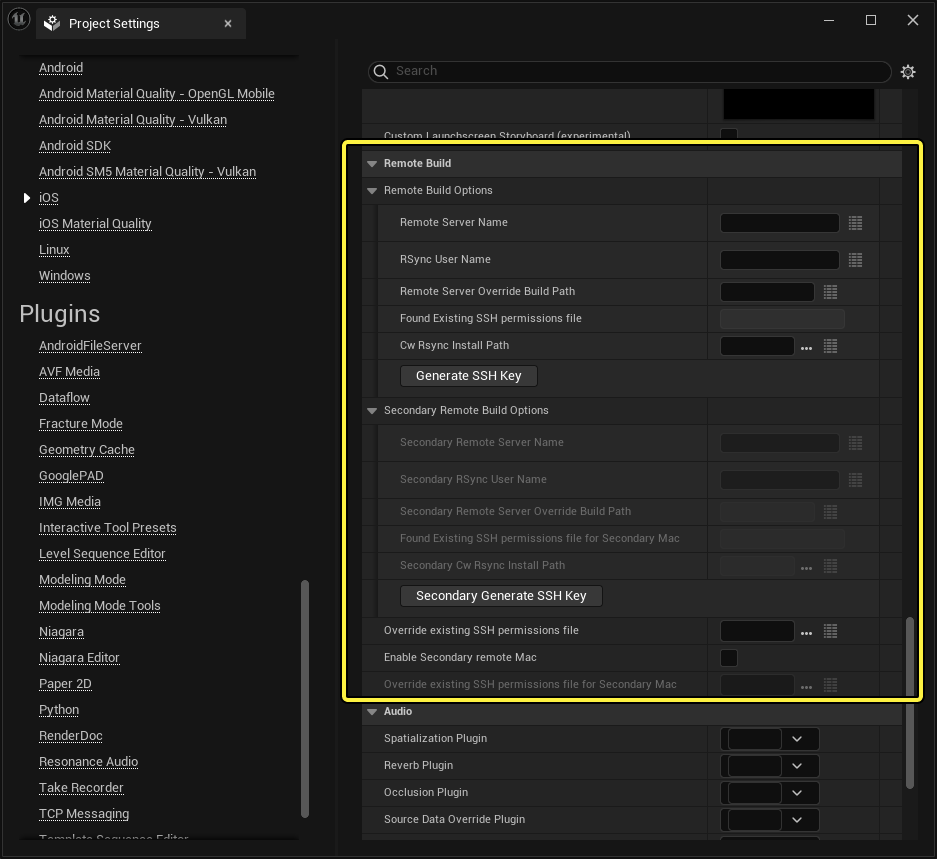
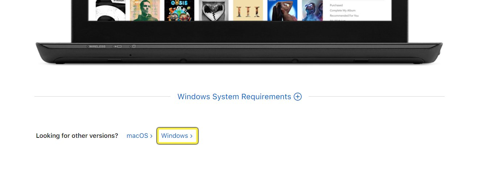
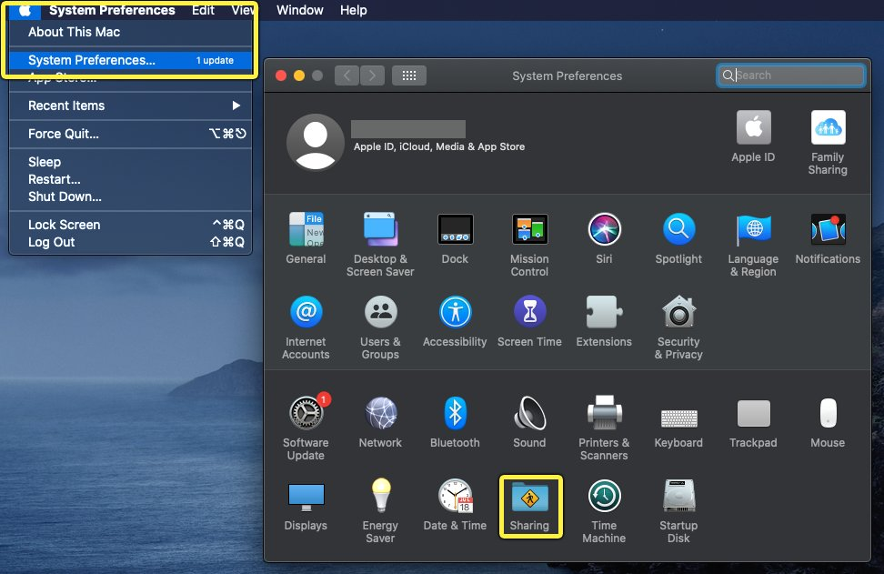
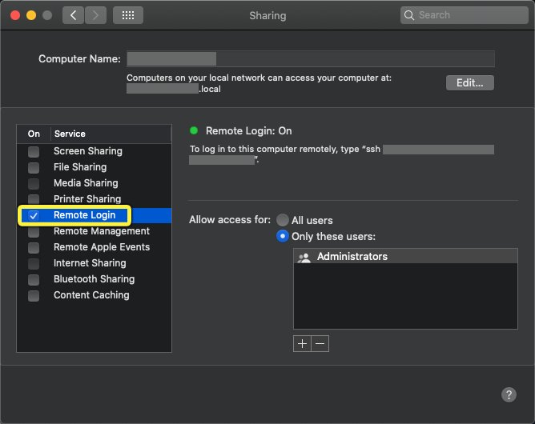
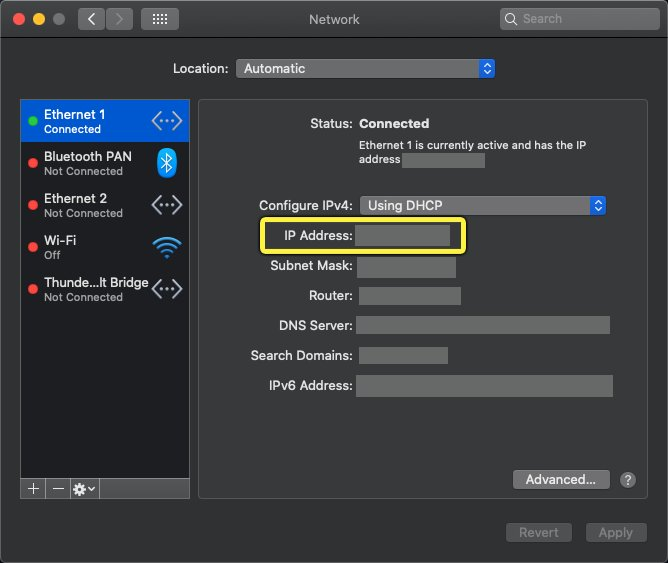
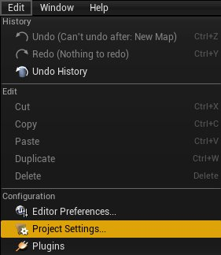
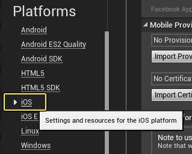
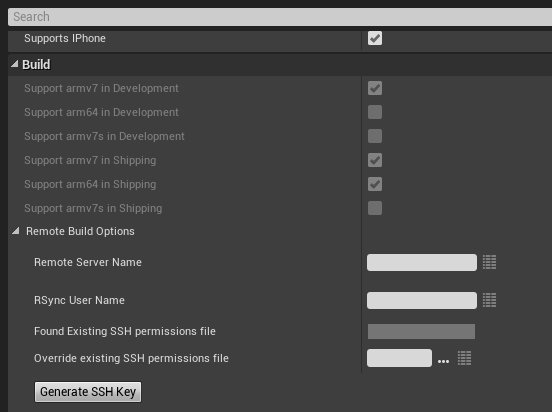

# 用Windows系统编译iOS项目

> 路径：虚幻引擎5.7文档 / 移动端开发 / iOS、iPadOS和tvOS / 在Windows上开发iOS项目 / 用Windows系统编译iOS项目

> 原始页面：https://dev.epicgames.com/documentation/unreal-engine/creating-remote-builds-of-unreal-engine-projects-for-ios

为iOS创建签名的构建需要Mac和Apple开发者账户。但是，对于主要使用Windows计算机的团队， **虚幻引擎（Unreal Engine）** 可以在Windows PC和最多两个Mac之间建立 **SSH连接** ，远程创建iOS构建。这需要你允许Mac上的传入SSH连接，然后你需要设置SSH密钥和凭证，才能在Windows计算机上访问Mac。本指南将详细介绍设置连接并运行远程构建的过程。

### 主和备用远程Mac

你可以在 **项目设置（Project Settings）** > **平台（Platforms）** > **iOS** 中的 **远程构建（Remote Build）** 分段下找到远程Mac的设置。



此分段同时列出了 **远程构建选项（Remote Build Options）** （用于你的主远程构建Mac）和 **备用远程构建选项（Secondary Remote Build Options）** （用于备用远程构建Mac）。

你的主Mac应该是处理能力很高的型号，例如Mac Pro，以便可以用作团队的共享资源。你将使用该Mac来处理需要带Xcode的Mac的大型构建过程。

备用Mac应该是个人设备，用于在测试设备上启动调试构建。备用Mac不会构建内容，而是会下载你已经在主Mac上构建的缓存数据，并设置Xcode项目文件进行调试。这意味着，它可以在主Mac上有更低级的规格，因为它不需要运行完整构建或为你的项目烘焙，而只需要在你指定的iOS、tvOS或iPadOS设备上启动。如需详细了解如何处理此过程，请参阅下面的"使用远程备用Mac"。

### 准备调试

**准备调试（Prepare for Debugging）** 命令从Xcode将之前烘焙的数据注入你的构建中，生成一个 `.ipa` 文件，用于从Xcode在你的目标设备上启动。这可在两方面简化项目的调试管线：

- 做调试准备（Prepare for Debugging）将自动处理调试版本的创建，无需重新配置你的Xcode项目。
- 只用于少量Mac计算机的项目可以从其他计算机导入已烘焙数据。这样便可跳过虚幻编辑器的构建或使用，只需从Xcode启动版本即可。

准备调试旨在简化远程构建，尤其是在使用备用Mac的情况下。请参阅[在Xcode中调试iOS项目](../../../debugging-and-optimization-for-mobile/ios-and-tvos-debugging-and-optimization/debugging-ios-projects-with-xcode/index.md)，详细了解如何使用此命令。

## 1. 必要设置

要使用iOS远程构建，你至少需要一个Mac能够构建你的iOS项目，以及至少一个Windows PC。两台计算机都必须有互联网或局域网连接。Mac不需要安装你的项目或虚幻引擎的副本就能正常运行，因为它只需要Xcode进行签名和编译。

你的Windows计算机必须安装 **iTunes** ，以确保你有iOS项目的必要二进制文件。我们推荐你从[Apple的网站](https://www.apple.com/itunes/)而不是Windows商城下载和安装iTunes，因为Windows版本包括额外的二进制文件，有时会干扰远程构建过程。要直接从Apple获取iTunes，请向下滚动到标记为"要找其他版本？（Looking for other versions?）"的分段，并点击 **Windows** 。



你的Mac必须将iOS开发人员证书安装到 **系统密钥链（System Keychain）** ，并且你必须按照[iOS预配](../../getting-started-and-setup-guides-for-ios-and-tvos/setting-up-ios-tvos-and-ipados-provisioning-pro-d7cef79d/index.md)设置来设置项目的预配配置文件。

> [!NOTE]
> 设置好Mac以创建项目的构建后，你应该直接在该计算机上运行构建至少一次，确保能够正常运行，然后继续到下一分段。

## 2. 在Mac上启用远程登录

设置好项目后，你需要配置Mac以便支持SSH连接。

1. 打开Mac的 **系统偏好设置（System Preferences）** ，然后前往 **共享（Sharing）** 。

   
2. 选中 **远程登录（Remote Login）** 复选框。

   
3. 打开系统 **偏好设置（Preferences）** > **网络（Network）** 。
4. 注意计算机的 **IP地址** 。在Windows PC上设置远程连接时将需要此IP地址。

   

完成这些步骤后，Mac将能够从你的PC接受传入的SSH连接。

## 3. Windows配置和生成SSH密钥

在Windows计算机上完成以下步骤，以便对其进行远程iOS构建配置。

1. 在 **虚幻编辑器** 中打开项目，然后打开 **项目设置（Project Settings）**

   
2. 找到 **平台（Platforms）** > **iOS** > **构建（Build）** 。

   
3. 在 **远程服务器名称（Remote Server Name）** 字段中，输入用于构建项目的Mac名称或其IP地址。
4. 在 **远程用户名（Remote User Name）** 字段中，输入你通常用于登录Mac的用户名。
5. 点击 **生成SSH密钥（Generate SSH Key）** 。这将打开命令提示窗口，其中包含一系列将生成SSH密钥的提示。

   
6. 如果你收到消息提示主机无法通过身份验证，请在提示中输入"**是**"继续。
7. 输入属于你在上一分段 **远程用户名（Remote User Name）** 中指定的用户 **密码** 。
8. 提示将要求你输入 **口令（passphrase）** 。如果你选择不输入口令，则可以使用远程连接而无需任何用户交互。
9. 出现提示时，再次输入Mac的 **密码** 和 **用户名** 完成此过程。

现在，你已经生成SSH密钥，你将能够在Windows计算机上启动与Mac的远程连接，以便创建iOS构建版本。

### 不受保护私钥的变通方案

你可能会看到类似下文的错误消息：

```
	错误：无法为远程用户确定主目录。SSH 输出：...警告： 未保护的私钥文件！...0660 （ERROR: Unable to determine home directory for remote user. SSH output:...WARNING: UNPROTECTED PRIVATE KEY FILE!...0660）
```

如果你没有看到这条错误消息，你可以继续下一步。如果你看到了，请使用以下解决方法：

1. 找到你的 `RemoteToolChainPrivate.key` 。
2. 右键点击文件并选择 **属性（Properties）** 。
3. 点击 **安全（Security）** 选项卡。
4. 点击 **编辑（Edit）** 。
5. 移除所有组或用户名。
6. 点击 **添加（Add）** 。
7. 点击 **对象类型（Object Types）** 。确保勾选所有复选框，然后点击 **确定（OK）** 。
8. 在文本框中，输入 **Users** ，然后按下回车。
9. 确保用户权限设置为 **可读（Read）** 和 **可读和执行（Read & Execute）** 。

这会更改文件的主组（primary group），以避免其与你的用户名同名——SSH在检查组权限时会因为同名发生混淆。现在操作应该能正常执行了。

> [!NOTE]
> SubInACL此前可以用于此用途，并目前微软已经不再提供。

## 4. 可选团队设置

要在将来对其他项目共享此数据，请在计算机上的 `*Engine.ini` 文件之一中指定远程服务器名称和远程用户名称。

1. 选择 **远程服务器名称（Remote Server Name）** 属性旁边的按钮，打开 **配置编辑器（Configuration Editor）** 。

   > 图片已省略：远程服务器名称属性旁边的配置编辑器按钮
2. 为每个你要共享SSH数据的.ini文件设置属性。

   > 图片已省略：使用配置编辑器编辑.ini文件
3. 针对 **远程用户名（Remote User Name）** 重复这些步骤。

通过共享这些.ini文件，你可以向多个项目或用户提供SSH信息。SSH密钥本身存储在 `Engine/Build/SSHKeys` 文件夹中。你可以将此目录签入源代码控制系统中，以便与团队共享。

## 5. 最终效果

完成上述步骤后，你可以在Windows计算机上的虚幻编辑器中点击 **平台（Platforms）** > **iOS** > **打包项目（Package Project）** 或 **平台（Platforms）** > **iOS** > **准备调试（Prepare for Debugging）** ，发起远程构建。这将打开SSH连接，并将命令发送到你的Mac，开始创建构建。你的构建将显示在目录中

## 6. 使用备用远程Mac

你还需要执行一些步骤，才能使用备用Mac，因为它使用主Mac中的现有构建数据，以跳过构建过程。

### 在Windows计算机上准备调试

1. 在Windows计算机上，打开 **项目设置（Project Settings）** > **平台（Platforms）** > **iOS** ，然后在"远程构建（Remote Build）"分段下，确保 **启用备用远程Mac（Enable Secondary Remote Mac）** 已 **禁用** 。
2. 使用主远程Mac构建你的项目。你必须至少这样构建一次，才能使用备用Mac，以为你它依赖主Mac创建的文件。
3. 在主Mac上完成至少一次构建后，启用 **启用备用远程Mac（Enable Secondary Remote Mac）** 设置。
4. 点击 **平台（Platforms）** > **iOS** > **准备调试（Prepare for Debugging）** 。这次，在主Mac上完成远程构建之后，Windows计算机将下载其构建数据并发送到备用Mac。

现在你在备用Mac上有了Xcode项目，其中包含来自其他计算机的缓存数据。它在与主Mac上创建的项目目录完全相同的目录中。首次尝试使用备用远程Mac过程时，通常需要10-15分钟在你的全部三台计算机之间同步数据，但后续每次构建时，应该只需要30秒左右。

### 在备用远程Mac上调试

要在备用远程Mac上调试，请执行以下步骤：

1. 打开包含生成的Xcode项目文件的目录，然后打开Xcode解决方案。
2. 像常规[Xcode调试工作流程](../../../debugging-and-optimization-for-mobile/ios-and-tvos-debugging-and-optimization/debugging-ios-projects-with-xcode/index.md)中那样配置Xcode。
3. 你已经缓存了构建数据，因此不需要运行完整构建。而是点击 **产品（Product）** > **执行操作（Perform Action）** > **运行而不构建（Run Without Building）** ，在你的iOS、iPadOS或tvOS测试设备上启动。

   > 图片已省略：运行而不构建

你的项目将在iOS设备上启动。
