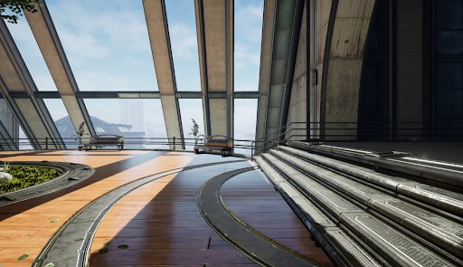
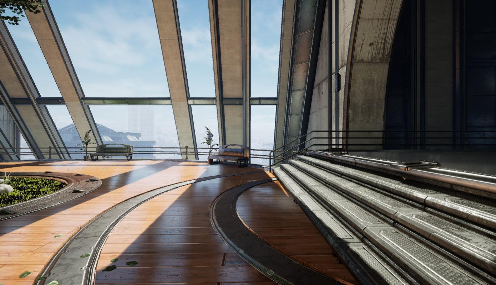

# 功能级别和渲染模式

> 路径：虚幻引擎5.7文档 / 移动端开发 / 移动端渲染功能 / 功能级别和渲染模式

> 原始页面：https://dev.epicgames.com/documentation/unreal-engine/mobile-feature-levels-and-rendering-modes-in-unreal-engine

> [!NOTE]
> 本文已经 **废弃**，将在未来的更新中被移除。请查看以下文档：
>
> - 关于移动端功能级别的信息，请查看
>
>   移动端渲染功能
>
>   的首页。
> - 关于移动端前向和延迟着色模式的信息，请查看
>
>   移动着色模式
>
>   一文。
> - 关于移动端延迟着色模式的详情，请参阅
>
>   移动延迟着色
>
>   一文。
> - 关于台式机渲染器的信息，请参阅
>
>   移动平台上的台式机渲染器
>
>   一文。

> [!NOTE]
> 本文中的一些功能是实验性或测试性功能。在项目中使用这些功能时要谨慎，并且避免在即将发布的项目中使用实验性功能。

**虚拟引擎（Unreal Engine）** 的移动渲染器提供单独的渲染路径， 它独立于桌面和主机渲染器，针对各种移动设备进行优化，例如移动电话和平板电脑。此渲染器可以通过多种方式进行配置，以符合特定设备和应用程序的需求。此页面提供了参考，介绍这些选项的位置以及如何配置这些选项。

## 功能级别

移动渲染器的基本 **功能级别（Feature Levels）** 如下所示：

| 功能级别 | 说明 |
| --- | --- |
| OpenGL ES 3.2 | Android设备的默认功能级别。你可以在 **项目设置（Project Settings）** > **平台（Platforms）** > **Android材质质量 - ES31（Android Material Quality - ES31）** 中配置此功能级别的材质设置。 |
| Android Vulkan | 一种可用于某些特定Android设备的高端渲染器。如需有关如何在你的项目中使用Vulkan以及哪些GPU支持Vulkan的信息，请参见我们在[Android Vulkan移动渲染器](../../android-support/developing-guides-for-android/using-the-android-vulkan-mobile-renderer/index.md)上的指南。 |
| Metal 2.0 | 用于iOS设备的功能级别。你可以在 **项目设置（Project Settings）** > **平台（Platforms）** > **iOS材质质量 （iOSMaterial Quality）** 中配置此功能级别的材质设置。 |

对高级移动渲染功能的支持会因应用程序所用功能级别而异。如需更多信息，请参考[移动渲染功能](../index.md)部分中各个功能的相关文档。

## 移动端HDR

**移动高清渲染（HDR）** 用于实现各种高端后期处理和渲染功能。

## 使用延迟着色（实验版）

**延迟着色（Deferred shading）** 为高质量反射、多个动态光线、光照贴花和其他高级照明功能提供支持，这些功能在移动设备的默认前向渲染模式中通常不可用。





移动前向反射（旧）

移动延迟反射（新）

要启用延迟着色，请将以下CVar添加到你的 `DefaultEngine.ini`：

DefaultEngine.ini

```
	r.Mobile.ShadingPath=1 
```

## 在移动设备上使用桌面渲染器（对于Android为实验版，对于iOS为测试版）

虚幻现在为iOS设备和使用Vulkan的Android设备提供前向和延迟桌面渲染。此功能目前对于Vulkan为实验版，对于iOS为试用版。

> [!NOTE]
> - iOS实施在功能就绪情况方面被视为试用版。
> - Android Vulkan实施被视为实验版。

使用桌面前向渲染器在iPad Pro上运行的Infiltrator演示。

要为iOS启用桌面渲染器，请打开你的项目设置，然后导航至 **平台（Platforms）** > **iOS** > **渲染（Rendering）** 并启用 **Metal桌面渲染器（Metal Desktop Renderer）**。

要为Android Vulkan启用桌面渲染器，请导航至 **平台（Platforms）** > **Android** > **编译（Build）** 并启用 **支持Vulkan桌面[实验版]（Support Vulkan Desktop [Experimental]）**。

你还需要将 `r.Android.DisableVulkanSM5Support` 设置为 *0*，以允许使用SM5。

必须重启虚幻编辑器，以使更改生效。随后即可采用与在桌面应用程序中相同的方式来配置前向和延迟渲染功能。

如需这些渲染选项的更多信息，请参考[前向着色渲染器指南](../../../designing-visuals-rendering-and-graphics/optimizing-and-debugging-projects-for-realtime-rendering/forward-shading-renderer/index.md)。
