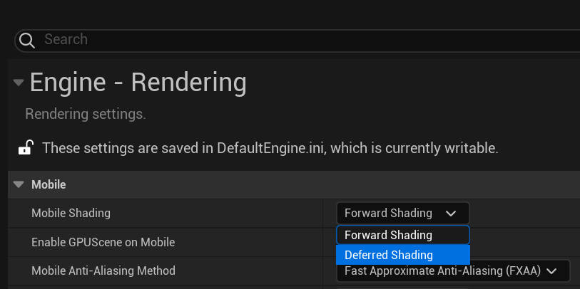
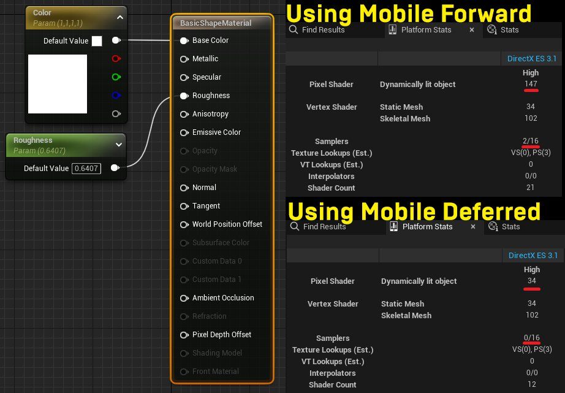

# 移动延迟着色模式

> 路径：虚幻引擎5.7文档 / 移动端开发 / 移动端渲染功能 / 移动延迟着色模式

> 原始页面：https://dev.epicgames.com/documentation/unreal-engine/using-the-mobile-deferred-shading-mode-in-unreal-engine

**正向着色** 将在绘制时间处理几何体和光照，而 **延迟着色** 会将其分为两个单独的处理阶段。这样可将当光照计算与几何体计算分开，更高效地实施材质和高级光照功能。

**移动延迟着色模型** 可提供这些优势，也会利用基于图块的GPU降低对系统内存和CPU的性能影响。这样可在支持图块内存的移动设备上实现更好的渲染质量和更高的性能。

本页提供以下信息：

- 概述移动延迟着色的优势和限制。
- 关于哪些设备兼容移动延迟着色模型的信息。
- 关于如何为你的项目配置移动延迟着色的指引。

## 如何启用移动延迟着色模式

要启用移动延迟着色：

1. 打开你的 **项目设置（Project Settings）** 。
2. 找到 **引擎（Engine） - 渲染（Rendering）** > **移动（Mobile）** 。
3. 点击 **移动着色（Mobile Shading）** 下拉菜单，将其设置为 **延迟着色（Deferred Shading）** ，然后重启编辑器。

   

当你为移动设备构建项目时，移动设备将使用移动延迟着色模型。

## 概述

延迟着色将渲染流程分为两个处理阶段：

1. *几何体处理阶段* ：处理基础颜色（BaseColor）、金属感（Metallic）和粗糙度（Roughness）参数，并将参数存储在通常称为 **Gbuffer** 的临时缓冲区。
2. *光照处理阶段* ：从GBuffer读取材质属性，为其计算光照，然后将着色像素写入帧缓冲区。

同时，正向着色会在绘制时间计算材质与光影的互动。这意味着，材质必须包括光影代码以及所有其他参数。延迟着色可以忽略此信息，并使用更简单的着色器和需要编译时间更少的材质。

因为延迟着色不需要绑定阴影和反射纹理，对于每次绘制调用，所需的图形状态管理也更少，这样可提升CPU性能。这意味着， **渲染硬件接口（Render Hardware Interface，简称RHI）** 线程工作减少，进而释放大核心用于其他线程，减少可用线程间的冲突。

> [!TIP]
> 延迟着色将光照的处理和内存开销与渲染几何体的开销分开，使得光照调试和优化更加灵活。

### 移动延迟着色

为了在移动设备上实现高效延迟着色，移动延迟着色模型会将图块内存中的GBuffer置于GPU中，这意味着GBuffer永远不会存储在系统内存中。此外，当设备支持 `LAZILY_ALLOCATED` 内存类型时，也不分配内存。若设备支持无记忆渲染目标，则使用移动延迟着色时占用的内存会更少，设备不支持无记忆渲染目标，则会为GBuffer分配系统内存，占用的内存稍多一些。

### 性能改进示例

下方材质使用简单的颜色和粗糙度输入。移动正向渲染模式下，材质使用147个指令和2个取样器。移动延迟渲染模式下，材质仅使用34个指令和0个取样器，因为不再需要包括光照和着色指令。这将减少帧率卡顿和整体内存使用。

左侧：使用简单的颜色和粗糙度输入的基础材质。右上角：此材质使用移动正向模式时的统计数据。右下角：此材质使用移动延迟模式时的统计数据。

## 移动延迟着色和移动正向着色使用指南

更适合移动延迟着色的情况：

- 你的目标设备使用基于图块的移动GPU。
- 你的游戏不使用预计算光照。
- 你需要正向着色不提供的高级光照功能。
- 你需要提升性能并节省用于复杂光照的内存。

具有大型户外环境且高度依赖动态光照的游戏，就是符合上述情形的典型项目示例。虚幻引擎支持的大多数设备满足延迟着色硬件需求，延迟着色的性能优势很明显。因此，我们建议UE中的大多数移动项目使用移动延迟着色。然而，如果你主要使用预计算光照，选择正向着色模型仍然更合适，使用局部光源或大量反射捕获时，它具有优势。

## 移动延迟着色支持的渲染功能

此小节列出了移动延迟着色模式支持但在移动正向着色模式下不可用的渲染功能。

### 光照功能

移动延迟着色模式提供以下光照功能：

- 光源函数
- 光源配置文件
- IES光源配置文件
- 光照贴花
- 提升局部光源渲染效率

### 渲染限制

#### 预计算光照和着色模型限制

如果你的项目使用预计算光照，延迟着色仅会提供默认光照（DefaultLit）和无光照（Unlit）着色模型。如果你的项目使用预计算光照，我们强烈建议你使用正向着色而非延迟着色。

#### 半透明处理阶段

延迟着色模式提供半透明功能，但半透明处理阶段始终使用正向着色。确保半透明材质（比如玻璃或水）的 **光照模式（Lighting Mode）** 设置为 **表面正向着色（Surface ForwardShading）** 。

#### 多重取样抗锯齿（MSAA）

延迟渲染无法支持 **多重取样抗锯齿（Multi-Sample Anti-Aliasing****，简称MSAA）** ，因为它需要在GBuffer中占用大量空间。由于需要着色每个样本而非每个像素，还会有更加耗费资源的着色处理阶段。

#### 光照贴花限制

在延迟模式下，静态光照不支持 **光照贴花** ，因为它需要更多的贴花缓冲空间。由于存在内存限制，移动设备上不支持光照贴花。然而， **自发光** 贴花很适合静态光照。

#### 其他贴花限制

由于GBuffer中存在空间限制，贴花将八面体编码用于法线，从而缩减大小。此编码使得你无法在GBuffer中混合或修改法线。然而，你可以完全覆盖它们。

#### 着色模型限制

若使用移动延迟着色，同时支持多个着色模型的话，开销会非常高。因此，你应将复杂着色模型限制为仅用于需要它们的对象。

## 设备兼容性

虚幻引擎在使用移动渲染器的所有平台上支持移动延迟着色，包括PC平台、iOS、Android Vulkan和Android GLES。以下小节详细介绍了每个设备系列如何使用其图块内存（Tile Memory）支持此着色模型，以及某些设备的局限性。

### 图块内存用法

每个移动平台在图块内存中执行着色的方式不同。

- iOS使用类似于

  framebuffer_fetch

  的功能访问图块内存中的GBuffer。
- Android Vulkan使用Vulkan的子处理通道。
- Android GLES需要扩展，并且没有适用于所有GPU的通用方法。
- Mali和PowerVR使用PLS扩展。
- Adreno GPU使用

  framebuffer_fetch

  扩展。

> [!NOTE]
> 其他GPU使用立即模式渲染器，所以这些图块内存技巧不适用。在这些案例中，GBuffer作为系统内存中的常规纹理分配，并且可能没有内存优势。

### 硬件限制

运行Android Vulkan的Mali设备对颜色和输入附件有严格限制：

- GBuffer中逐像素16字节或128位
- 最多只能使用4个输入附件。
- 在光照处理阶段，最多仅获取3个颜色附件和1个深度附件。

为确保所有设备的一致性，移动延迟着色模式默认采用这些限制。若要移除这些限制，可将 `*Engine.ini` 文件中的 `MobileUsesExtendedGBuffer` 参数设置为 `true`。然后，移动延迟着色模式将扩展GBuffer以使用用户设备的所有功能。
