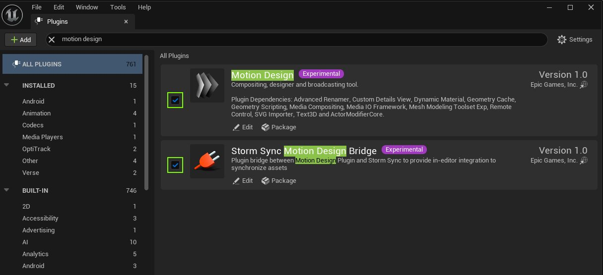
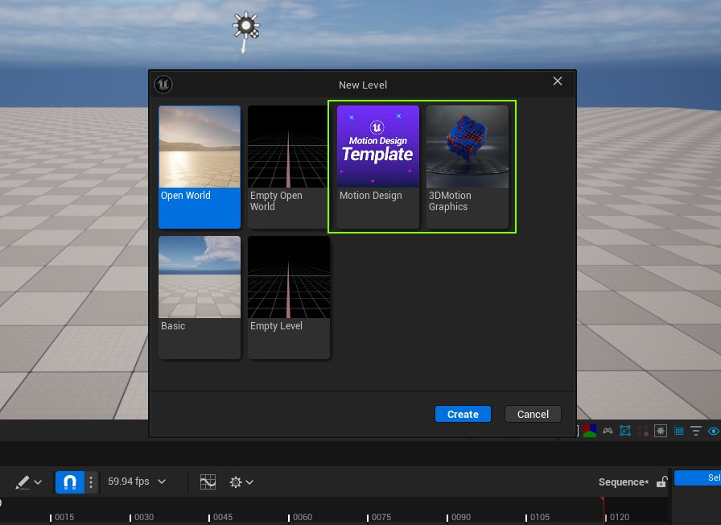
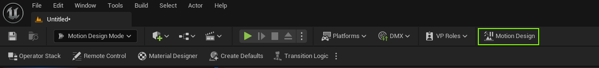
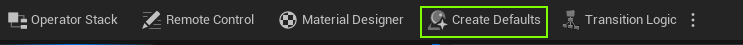
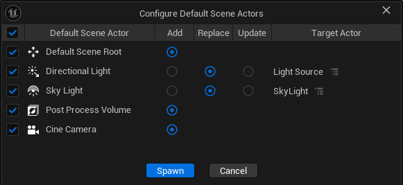
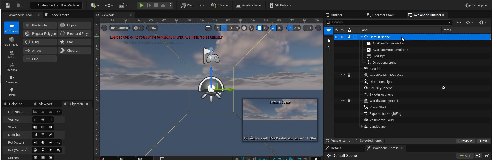
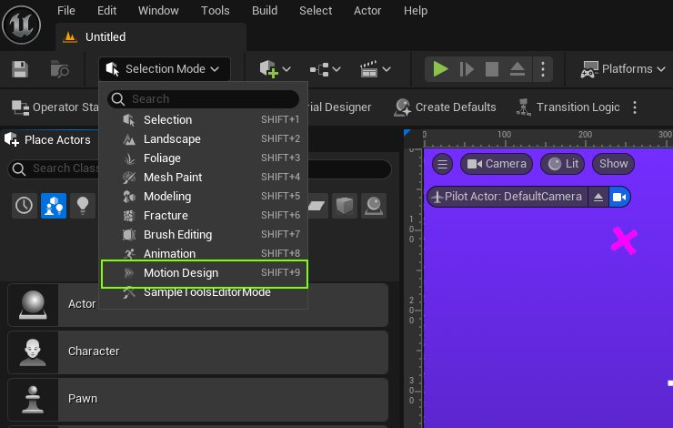
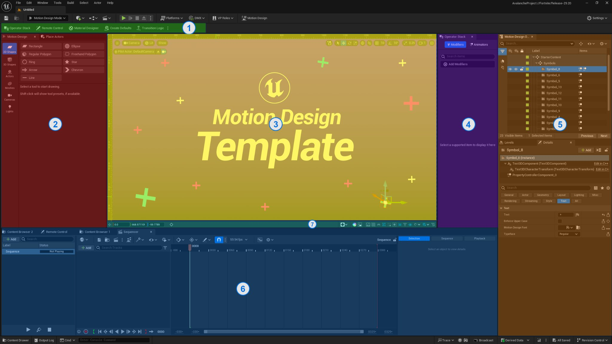

# 动态设计快速入门指南

> 路径：虚幻引擎5.7文档 / 动态设计 / 动态设计快速入门指南

> 原始页面：https://dev.epicgames.com/documentation/unreal-engine/motion-design-quickstart-guide-in-unreal-engine

## 什么是动态设计？

动态设计是用于广播的一个内部编辑器插件。你可以将其用于图形创建、播放节目和实时数据可视化，适合电视直播、新闻、天气、体育制作、插页式图形，以及需要快速设计和动画工作流程的各种其他用例。该插件的用户界面类似于[UMG](../../user-interfaces/umg-editor-reference/index.md)，但包含无法在控件中实现的功能，例如3D参数化形状和动态材质编译器。

## 启用动态设计插件

要使用动态设计，你必须首先启用所需的Motion Design插件和Storm Sync Motion Design Bridge插件。

## 创建动态设计场景

要创建动态设计场景，可以创建一个空白关卡或从现有关卡模板中选择一个：

1. 转到 **工具栏（Toolbar）** > **动态设计（Motion Design）** ，然后单击按钮。

   
2. 转到 **工具栏（Toolbar）** > **动态设计（Motion Design）** 下拉菜单，然后选择 **创建默认值（Create Defaults）** 。

   
3. 单击 **生成（Spawn）** 以创建配置好的Actor组。

   

   

你也可以在模式（Modes）下拉菜单中切换到 **动态设计模式（Motion Design Mode）** ，从而在不更改整个界面的情况下使用动态设计工具。在键盘上按SHIFT+9键可以激活此模式。

> [!NOTE]
> 你可以稍后删除此场景。要删除场景，请使用前面使用的下拉菜单中的 **停用场景（Deactivate Scene）** 按钮。你也可以手动删除 **默认场景（Default Scene）** 组。

## 动态设计UI概述

动态设计UI有多个窗口，可以用来生成和操控对象。

UI包括：

- 动态设计工具箱
- 控制板选项卡
- Sequencer
- 运算符堆栈。
- 动态设计大纲视图。
- 动态设计细节面板。
- 视口下的新视口工具栏。

激活动态设计场景后，将默认打开动态设计工具箱。

在上面的屏幕截图中，彩色区域显示以下功能：

1. 动态设计编辑器面板快捷方式

   - 增加导航选择，可减少访问诸如

     运算符堆栈、远程控制

     和

     材质设计器

     等创意工具的步骤。它也可以作为

     过渡逻辑（Transition Logic）

     系统的中心接触络点。
2. 动态设计工具箱

   - 使用此面板，你可以放置参数2D和3D形状、文本、SVG、克隆器/效果器和

     媒体板

     ，以及许多其他标准虚幻引擎Actor类型。2D和3D类别中的参数化形状是为动态设计自定义的，而

     网格体（Meshes）

     类别会生成各种标准网格体，没有自定义选项。
3. 视口

   - 默认视口在动态设计UI中仍可用，有一个额外的选项可放大和缩小你的画布。滚动鼠标滚轮可缩放。当你选择摄像机时，选择名称为动态设计视口（Motion Design Viewport）的选项来使用该行为。
4. 工具快捷方式

   - 此可选面板可以涵盖

     修饰符（Modifier）

     和

     过渡逻辑（Transition Logic）

     面板。单击

     远程控制（Remote Control）

     和

     材质设计器（Material Designer）

     按钮，即可通过

     编辑器面板快捷方式（Editor Panel Shortcuts）

     栏（分段1）将其打开。
5. 动态设计大纲视图

   - 动态设计大纲视图

     是传统虚幻引擎大纲视图的定制版，增加了

     过滤

     、

     嵌套组

     等其他功能。嵌套组有各种各样的应用，包括通过设置一个

     空Actor

     作为多个Actor的父级以及同时设置多个Actor的可视性来抵消变换。此外，你可以对一个Actor或嵌套在

     空Actor

     下的多个Actor同时应用强大的修饰符。
6. Sequencer

   - Sequencer面板在动态设计工作流程中进行了改进，其中可以单独添加和播放多个序列，也可以

     过渡逻辑（Transition Logic）

     等系统应用的逻辑进行添加和播放。
7. 视口工具栏

   - 工具栏可以访问各种功能，如遮罩可视化切换、取色器、屏幕截图，颜色通道可视化器（用于预览Alpha通道）、游戏模式切换、边界框可视化开关、Actor独奏、安全帧切换和各种对齐工具。
8. 远程控制

   - 每个动态设计关卡均配备一个链接的远程控制预设，不包含任何资产。在一些情况下，当纲要工具中组合了多个关卡时，例如过渡逻辑，它们各自的公开远程控制属性将进行组合和排序。

### 动态设计视口

> 图片已省略：image alt text

在关卡编辑器中，动态设计使用标准视口，但在底部添加了其他参数：

- 选定对象的位置控制：

  - 重置为 0,0,0。
  - X、Y、Z 轴的滑块。
- **切换遮罩模式** ：使用它处理布尔（"遮罩"）修饰符。
- 一个包含各种视口可视性设置的分段：

  - 游戏视图。你可以使用它打开或关闭所有编辑器元素的可视性。
  - 切换边界框。
  - 隔离选定Actor。
  - 切换导线。
  - 视口覆层可视性。
- 对齐设置分段。你可以使用它切换全局对齐、网格对齐、屏幕对齐和Actor对齐。
- 网格设置分段。你可以使用它来切换网格（是否始终显示网格）以及调整网格大小的滑块。

### 动态设计大纲视图

> 图片已省略：动态设计大纲视图

以下是动态设计大纲视图中的元素：

- 左侧面板：使用它设置动态设计的筛选器。

  - 你可以单击以滚动浏览可单击的筛选器。
  - 你也可以 **选择（Select）** 或 **取消选择所有快速类型筛选器（Deselect All Quick Type Filters）** 。
- **搜索（Search）** 栏。
- **对空Actor下的选定Actor进行分组（Group selected actors under a Null Actor）** 按钮。
- **视图选项（View Options）** 下拉菜单：使用它配置动态设计大纲视图中显示的内容，例如修饰符和材质的图标。
- **设置（Settings）** 下拉菜单：使用它配置动态设计大纲视图层级的设置。
- 编辑器和运行时可视性。
- **锁定（Lock）** ：切换是否可以在视口中平移项目。

### 动态设计工具箱（形状和Actor创建）

> 图片已省略：动态设计工具箱

你可以使用动态设计工具箱创建形状和Actor。工具箱允许你在视口中绘制或拖放各种各样的Actor。

你可以创建以下内容：

- 2D形状（2D形状Actor）
- 3D形状（3D形状Actor）
- Actor（文本、克隆器、效果器、空、样条线）
- SVG
- 网格体（静态网格体）
- 摄像机（摄像机Actor、摄像机绑定Actor、摄像机晃动源Actor和后期处理体积）
- 光源
- 媒体板

### 取色器

> 图片已省略：动态设计取色器

**取色器** 包含以下元素：

- 色环：使用它来使用简单材质给选定形状上色。
- 滴管：使用它从视口中的任何对象中选择颜色。
- RGB/HSV切换：更改其右侧滑块控制的值集。
- 光照/无光照开关：在光照和无光照之间切换选定Actor的材质。
- 当前主题的颜色。
- 纯色/线性渐变切换。
- 在简单颜色和渐变颜色之间进行切换的按钮。
- 主题按钮：使用此菜单，你可以编辑当前主题的名称、创建新主题、切换主题、删除主题。

### 视口信息

> 图片已省略：动态设计视口信息选项卡

**视口信息（Viewport Information）** 选项卡显示当前视口的统计信息：

- 大小（Size）：以像素为单位。
- 可视区域（Visible area）：显示放大区域的大小，以像素为单位。
- 中心偏移（Center Offset）：显示视口的当前中心与真实中心的偏移量。

  - 以像素为单位。
  - 偏移可以为正，也可以为负。
- 光标（Cursor）：显示光标在视口中的位置。
- 缩放（Zoom）：如果适用，显示当前缩放的百分比（%）。

### 对齐

> 图片已省略：动态设计对齐选项卡

对齐（Alignment）选项卡显示以下内容：

- **水平对齐（Horizontal alignment）** ：使用它水平对齐多个Actor。选项为左、中、右。
- **垂直对齐（Vertical alignment）** ：使用它垂直对齐多个Actor。
- **堆叠（Stack）** ：使用它对齐多个Actor的深度。你可以对齐前面、后面或中间。
- **分布（Distribute）** ：使用它分布选定Actor。选项为从左到右、从上到下或从前到后。
- **旋转(Actor)（Rot(Actor)）** ：使用它将一个Actor的旋转与另一个Actor对齐。
- **旋转（摄像机）（Rot(Camera)）** ：使用它将Actor的旋转与摄像机对齐。
- **屏幕（Screen）** ：使用它调整选定Actor的大小和位置，以适应当前摄像机视锥体。

### 动态设计Sequencer

> 图片已省略：动态设计中的Sequencer

[Sequencer](../../animating-characters-and-objects/cinematics-and-movie-making/index.md)是用于创建、修改和预览动画的重要工具。与虚幻引擎中的常规Sequencer相比，动态设计增加了一些其他工具和功能。

UI包括：

- **动画（Animations）** 分段：此分段包含所有动画的列表（打开的关卡/场景中嵌入的关卡序列），以及 **播放（Play）** 、 **接收（Take in）** 和 **停止（Stop）** 按钮。你也可以添加和搜索动画。
- **选择（Selection）** 选项卡：显示选定关键帧的属性。
- **序列（Sequence）** 选项卡：显示整个序列的标签和预览标记。此外还显示已创建标记的属性和设置。如需详细了解预览和标记，请参阅[Sequencer编辑器](https://dev.epicgames.com/documentation/404)文档。
- **播放（Playback）** 选项卡：显示预定播放的设置。
- Sequencer本身，有以下元素：

  - 绑定和播放设置。
  - 序列资产操作。你可以执行以下操作：保存序列和子序列、在内容浏览器中找到序列、渲染序列、为序列打开导演蓝图。
  - 序列设置：包含一个菜单，其中有 **操作（Actions）** 、 **视图（View）** 和 **播放（Playback）** 选项。
  - 关键帧设置：所键入内容的设置，包括自动键入和自动跟踪设置。还包括允许编辑的设置以及对齐设置。
  - FPS和时间显示设置。
  - 动画编辑选项：曲线编辑、修复和交错选项。
  - 当前打开的动画的名称。
  - **锁定（Lock）** ：打开和关闭动画的编辑。
  - **添加轨道（Add Track）** ：使用此按钮添加各种轨道。
  - 搜索和筛选器。
  - 当前时间和帧指示器。
  - 动画中的序列列表。
  - 动画的时间轴编辑器。

### 动态设计修饰符堆栈

> 图片已省略：动态设计修饰符堆栈

要填充堆栈，必须选择一个Actor。适用Actor包括动态设计器形状、文本和空Actor。

**修饰符堆栈（Modifiers Stack）** 包含以下内容：

- **搜索（Search）** ：使用它在添加的修饰符中搜索。
- 筛选菜单，你可以在其中按类型筛选修饰符。可用类别如下：

  - **几何体（Geometry）**
  - **布局（Layout）**
  - **渲染（Rendering）**
  - **变换（Transform）**
- **添加修饰符（Add Modifiers）** 按钮。
- 修饰符堆栈（Modifier Stack）菜单栏，适用于堆栈中的所有修饰符，有以下内容：

  - 一个用来显示或隐藏所有修饰符的性能数据的开关。
  - 一个用来删除所有修饰符的按钮。
  - 一个用来启用或禁用所有修饰符的复选框。
  - 一个包含3个操作的菜单：**重设为默认值（Reset to Default）** 、 **公开属性（Expose Property）** 、 **创建关键帧（Create Key）** 。创建关键帧（Create Key）选项将为 **启用全部修饰符（Enable all modifiers）** 复选框状态创建一个关键帧。
- 各个修饰符组成的列表，包括各自的参数：

  - 删除修饰符。
  - 一个用来 **启用、公开属性** 或 *禁用** 修饰符的复选框。
  - 一个包含 **返回默认值（Return to defaults）** 和 **创建关键帧（Create Keyframe）** 的菜单。

### 动态设计动画制作器堆栈

> 图片已省略：动态设计动画作器堆栈

动态设计动画制作器堆栈包含以下内容：

- **搜索（Search）** ：使用它在添加的动画制作器中搜索。
- 筛选菜单，你可以在其中按类型筛选动画制作器。类别有 **反弹（Bounce）** 、 **时间（Time）** 和 **扭动（Wiggle）** 。
- **添加动画制作器（Add Animators）** 按钮。
- 动画制作器（Animators）菜单栏，有以下内容：

  - 一个用来启用或禁用所有动画制作器的开关。
  - **删除全部动画制作器（Delete all Animators）** 按钮。
- 动画制作器列表，包括各自的参数：

  - 一个用来删除动画制作器的按钮。
  - 一个用来**启用** 或 **禁用** 动画制作器的复选框。
  - 一个包含 **返回默认值（Return to defaults）** 和 **创建关键帧（Create Keyframe）** 的菜单。参数包括动画制作器强度（Animator Strength）、时间偏移（Time Offset）、动画属性（Animated Properties）和时间源（Time Source）。

### 远程控制

> 图片已省略：动态设计中的远程控制

动态设计包括一个链接的[远程控制](../../production-pipeline/scripting-and-automating-the-unreal-editor/remote-control/index.md)预设，同时包含Actor、修饰符和动画制作器的参数。

要打开远程控制（Remote Control）窗口，转到 **动态设计（Motion Design）** 下拉菜单并选择 **远程控制（Remote Control）** 。

远程控制UI包括：

- **保存预设（Save preset）** 和 **找到保存预设（Browse to the saved preset）** 按钮。
- 设置（Setup）和操作（Operation）的模式切换：

  - **设置模式（Setup mode）** 显示属性本身。你可以配置逻辑并将逻辑分配给属性。
  - **操作模式（Operation mode）** 显示添加的控制器。
- **协议（Protocols）** 和 **逻辑（Logic）** 的开关：使用它们为公开属性启用协议和逻辑的配置。
- 远程控制设置：打开远程控制的项目设置（Project Settings）。
- **日志（Log）** 开关：使用它显示或隐藏远程控制的控制日志。
- **Web应用程序（Web App）** 按钮：使用它在默认浏览器中打开远程控制Web应用程序。
- 在窗口的左侧， **公开（Expose）** 、 **细节（Details）** 和 **协议（Protocols）** 选项卡可打开相应分段。
- **组（Group）** 分段：使用它将公开属性分组。
- **属性（Properties）** 分段：使用它向远程控制公开Actor和函数，以及公开的可配置属性。

## 动态设计广播

你可以使用动态设计广播促进动态设计资产在分配的显示器或其他媒体输出上的输出。

打开动态设计广播的方法如下：

1. 确保已启用动态设计插件。
2. 虚幻编辑器，转到 **UE工具栏（UE Toolbar）** > **动态设计（Motion Design）** 下拉菜单 > 选择 **动态设计广播（Motion Design Broadcast）** 。

   > 图片已省略：动态设计广播

动态设计广播UI包含以下内容：

- 用于在内容浏览器中 **保存资产（Save Asset）** 和 **找到（Browse）** 资产的按钮。
- 用于 **启动全部通道（Start All Channels）** 和 **停止全部通道（Stop All Channels）** 的按钮。
- 用于打开或关闭 **显示通道预览（Show Channel Preview）** 的开关。
- **配置文件（Profiles）** 下拉菜单：使用它在不同配置文件、添加新配置文件和删除配置文件之间进行切换。
- **复制配置文件（Duplicate Profile）** 按钮：使用它创建当前选定配置文件的副本。
- 客户端/服务器功能按钮：使用它们启动客户端、启动本地服务器和重启服务器。
- **通道（Channels）** 功能按钮，包含以下内容：

  - 一个用来添加 **新通道（New Channel）** 的按钮。
  - 通道状态。
  - 通道名称。
  - 用于在所有配置文件中固定通道、使通道占用整个区域和删除通道的选项。
  - 通道的输出设备列表。
  - 通道预览。
- **输出设备（Output Devices）** ：列出可分配给通道的可用媒体输出。
- **细节（Details）** ：显示分配给通道的选定输出设备的详细信息。
