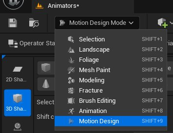
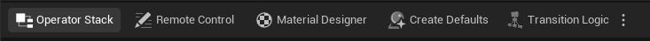
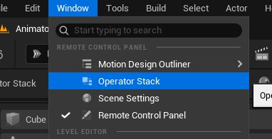
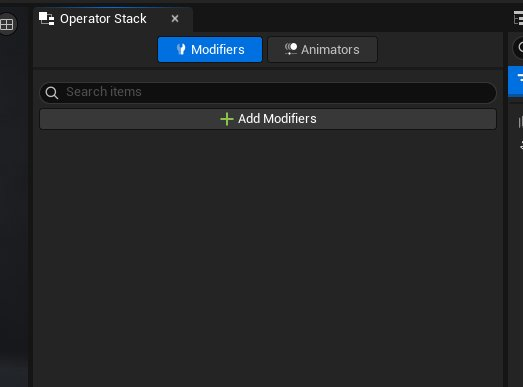

# Operator Stack

> 路径：虚幻引擎5.7文档 / 动态设计 / Operator Stack

> 原始页面：https://dev.epicgames.com/documentation/unreal-engine/operator-stack-in-unreal-engine

该页面没有可用的官方中文版本；以下内容保留原文，并按本项目人工译文规则逐步回译。

The **Operator Stack** provides access to two different suites of tools for working with Motion Design projects, Modifiers and Animators.

- The **Modifiers**include a variety of tools for working with both 2D and 3D projects, including modifying layouts, geometry, and rendering, as well as a modifier to assist with using transition logic.
- The **Animators** include tools to animate your designs without entirely relying on keyframing, using a variety of customizable animation presets.

## Where to Find the Tools

You can access the Operator Stack in two ways after you activate Motion Design Mode.

1. Click **Operator Stack** on the left of the main **Motion Design toolbar**:

   
2. Open it from the **Window** menu:

   

## Operator Stack Window

After opening the Operator Stack, a window appears in your interface that resembles the following image:

The tab on the left in the Operator Stack window is for working with modifiers. The tab on the right is for working with animators.

For more information about modifiers and animators, see the respective pages:

- [Modifiers](modifiers/index.md) - All about Modifiers for use in your Motion Design projects.
- [Animators](https://dev.epicgames.com/documentation/unreal-engine/animators-in-unreal-engine) - All about Animators for use in your Motion Design projects.
