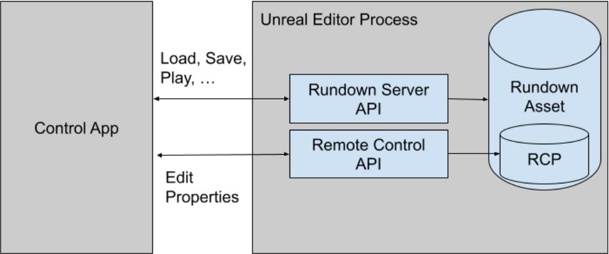
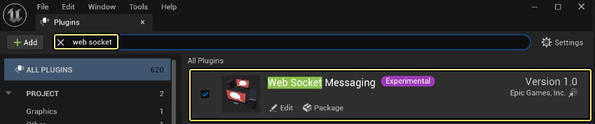
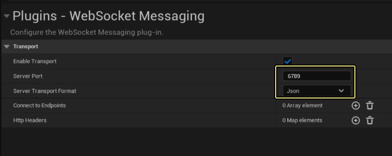
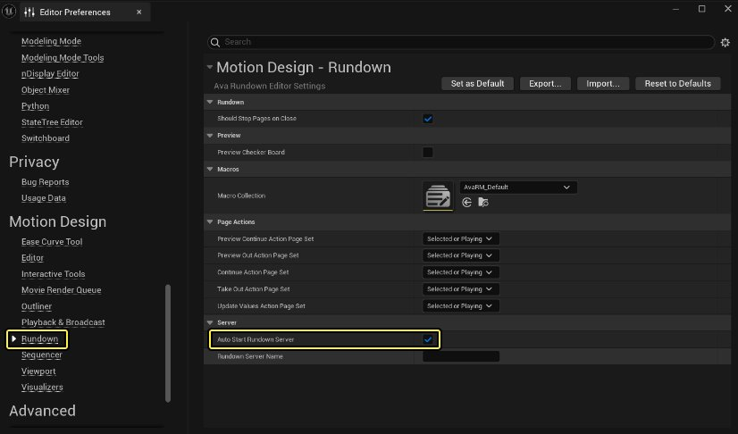
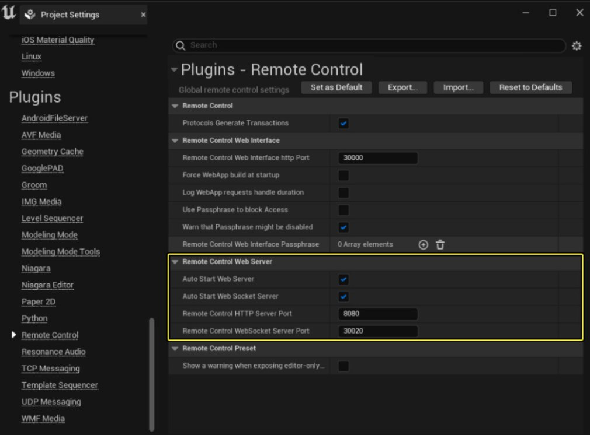
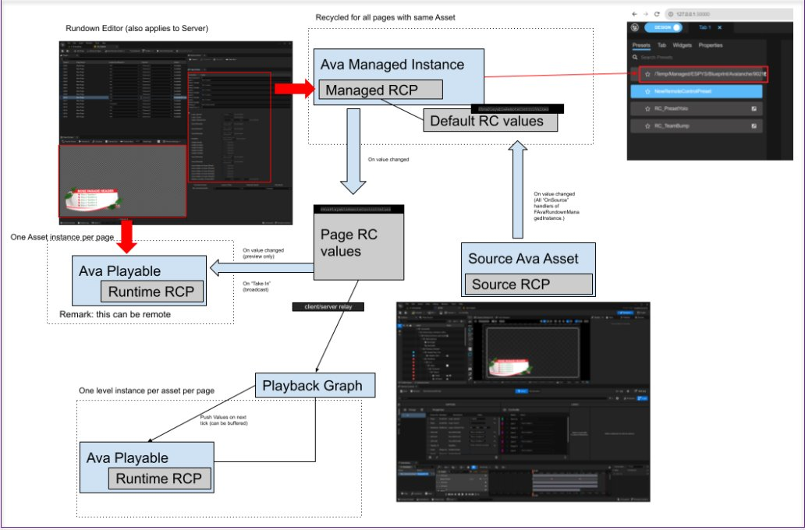

# 纲要服务器

> 路径：虚幻引擎5.7文档 / 动态设计 / 纲要服务器

> 原始页面：https://dev.epicgames.com/documentation/unreal-engine/setting-up-rundown-server-for-motion-design-in-unreal-engine

通过结合两个API实现对动态设计播放的控制。**纲要服务器API（Rundown Server API）** 用于加载纲要资产和页面模板，其包含一个嵌入式[远程控制](../../production-pipeline/scripting-and-automating-the-unreal-editor/remote-control/index.md)预设（RCP）。

可以通过远程控制API访问和修改相应页面的RCP，然后将其保存在纲要页面中，以便立即或稍后播放。

## 架构概述



## 项目配置

### 1. 在服务器模式下设置WebSocket Messaging插件

纲要服务器API通过 **WebSocket Messaging** 桥接插件向WebSocket公开。该插件允许通过WebSocket公开任何内部消息总线端点。

可以通过搜索 **web socket** ，在插件浏览器中启用该插件：



启用后，可在 **项目设置（Project Settings）> Json** 中配置该插件。



输入需要的监听端口，并将序列化配置为JSON。

### 2. 启用纲要服务器

在编辑器设置中：



在下次重新启动编辑器时，启用纲要服务器的自动启动。若将服务器名称留空，将使用计算机的名称代替。

或者有一个控制台命令可以立即启动纲要服务器："MotionDesignRundownServer.Start [ServerName]"。服务器名称为可选参数。

最后可以使用命令行参数启动UE进程： `-MotionDesignRundownServerStart[=ServerName]`.

如果正在运行服务器，控制台命令 `MotionDesignRundownServer.Status` 应提供一些有关服务器状态的信息。

### 3. 设置远程控制

按照[远程控制API WebSocket参考](../../production-pipeline/scripting-and-automating-the-unreal-editor/remote-control/remote-control-api-websocket-reference/index.md)页面中的说明进行操作。



**如果正在使用http服务器** ，默认情况下，它会绑定到 `localhost` ，而这可能不是你所需要的适配器。要让它绑定到任何适配器，在 `DefaultEngine.ini` 中添加以下行：

[HTTPServer.Listeners]

DefaultBindAddress=any

## 使用WebSocket Messaging

WebSocket Messaging插件会公开所有通过[UE消息总线](https://dev.epicgames.com/documentation/unreal-engine/API/Runtime/Messaging/IMessageBus)的消息。每个内部消息总线消息均封装在.json消息中，附带其他路由信息。

WebSocket Messaging桥接 `message` 剖析：

| 字段名称 | 说明 |
| --- | --- |
| **`发送者（Sender）`** | 发送者的UUID。此字段标识消息传递总线中的发送端点。 |
| **`接收者（Recipients）`** | 接收者的UUID列表。如果为空，则它相当于向所有监听给定消息类型的端点发出的 `broadcast` 。 |
| **`消息类型（MessageType）`** | 对应消息内容的UE结构。 |
| **`到期（Expiration）`** | 消息被丢弃的Unix时间。 |
| **`范围（Scope）`** | 指定消息（线程、进程、网络 ）在消息总线系统中的传播范围。对于WebSocket，此字段始终为 `Network` 。 |
| **`注解（Annotations）`** | 可选消息注解。 |
| **`消息（Message）`** | 消息的内容。该内容的结构由 `消息类型（Message Type）` 决定。 |

请求 `GetRundowns` 和服务器响应的示例：

| 客户端请求 | 服务器响应 |
| --- | --- |
| `{ "Sender": "F2DCD99C267C4F84B50CF091AA4ED608", "Recipients": [ "139696A842C8861F52E756BB60AA8661" ], "MessageType": "/Script/AvalancheMediaEditor.AvaRundownGetRundowns", "Expiration": 253402300799, "Scope": "Network", "Annotations": {}, "Message": {}}` | `{ "Sender": "139696A842C8861F52E756BB60AA8661", "Recipients": [ "F2DCD99C267C4F84B50CF091AA4ED608" ], "MessageType": "/Script/AvalancheMediaEditor.AvaRundown**Rundowns**", "Expiration": 253402300799, "TimeSent": 1660878367, "Scope": "Network", "Annotations": {}, "Message": { ** "rundowns": [ "/Game/AvaRundown.AvaRundown", "/Game/AvalancheExamples/ExampleRundown.ExampleRundown", "/Game/AvalancheExamples/DemoRC.DemoRC" ]** }}` |
|  | { |
|  | "Sender": "F2DCD99C267C4F84B50CF091AA4ED608", |
|  | "Recipients": [ |
|  | "139696A842C8861F52E756BB60AA8661" |
|  | ], |
|  | "MessageType": "/Script/AvalancheMediaEditor.AvaRundownGetRundowns", |
|  | "Expiration": 253402300799, |
|  | "Scope": "Network", |
|  | "Annotations": {}, |
|  | "Message": {} |
|  | } |
|  | { |
|  | "Sender": "139696A842C8861F52E756BB60AA8661", |
|  | "Recipients": [ |
|  | "F2DCD99C267C4F84B50CF091AA4ED608" |
|  | ], |
|  | "MessageType": "/Script/AvalancheMediaEditor.AvaRundown**Rundowns**", |
|  | "Expiration": 253402300799, |
|  | "TimeSent": 1660878367, |
|  | "Scope": "Network", |
|  | "Annotations": {}, |
|  | "Message": { |
|  | ** "rundowns": [ |
|  | "/Game/AvaRundown.AvaRundown", |
|  | "/Game/AvalancheExamples/ExampleRundown.ExampleRundown", |
|  | "/Game/AvalancheExamples/DemoRC.DemoRC" |
|  | ] |
|  | ** } |
|  | } |

`消息类型（message type）` 将指定 `消息（Message）` 的内容。在API术语中，对于客户端， `消息类型（message type）` 为命令， `消息（Message）` 的内容为命令的参数。

### 消息总线与纲要服务器握手

为了在消息总线上获得纲要服务器的UUID，然后将其用作消息的 `接收者（Recipient）` ，WebSocket客户端必须向WebSocket广播一条 `ping` 消息，并侦听pong回复以获得服务器的UUID。在消息总线中，纲要服务器订阅了 `AvaRundownPing` 消息，并将用 `AvaRundownPong` 消息回复其发送者。

| 客户端请求 | 服务器响应 |
| --- | --- |
| `{ "Sender": "F2DCD99C267C4F84B50CF091AA4ED608", "Recipients": [], "MessageType": "/Script/AvalancheMediaEditor.AvaRundownPing", "Expiration": 253402300799, "Scope": "Network", "Annotations": {}, "Message": { "bAuto": false }}` | `{ "Sender": "**69C67BCB4B61795764D1E596D9F01214**", "Recipients": [ "F2DCD99C267C4F84B50CF091AA4ED608 ], "MessageType": "/Script/AvalancheMediaEditor.AvaRundownPong", "Expiration": 253402300799, "TimeSent": 1661023146, "Scope": "Network", "Annotations": { }, "Message": { "bAuto": false, "hostName": "TEST-SERVER-01" }}` |
|  | { |
|  | "Sender": "F2DCD99C267C4F84B50CF091AA4ED608", |
|  | "Recipients": [], |
|  | "MessageType": "/Script/AvalancheMediaEditor.AvaRundownPing", |
|  | "Expiration": 253402300799, |
|  | "Scope": "Network", |
|  | "Annotations": {}, |
|  | "Message": |
|  | { |
|  | "bAuto": false |
|  | } |
|  | } |
|  | { |
|  | "Sender": "**69C67BCB4B61795764D1E596D9F01214**", |
|  | "Recipients": [ "F2DCD99C267C4F84B50CF091AA4ED608 ], |
|  | "MessageType": "/Script/AvalancheMediaEditor.AvaRundownPong", |
|  | "Expiration": 253402300799, |
|  | "TimeSent": 1661023146, |
|  | "Scope": "Network", |
|  | "Annotations": { }, |
|  | "Message": |
|  | { |
|  | "bAuto": false, |
|  | "hostName": "TEST-SERVER-01" |
|  | } |
|  | } |
|  |  |

Pong消息 `发送者（Sender）` 字段为消息总线系统中纲要服务器端点的UUID。然后，它将被用作来自Websocket客户端的所有其他消息的 `接收者（Recipients）` 字段。

## 纲要服务器 API

现有命令和响应消息可以在源代码中找到：

```
Engine\Plugins\Experimental\Avalanche\Source\AvalancheMediaEditor\Private\Rundown\AvaRundownMessages.h
```

USTRUCT的路径是WebSocket消息的 `消息类型（MessageType）` 字段，而内容在 `消息（Message）` 字段中被序列化，如前所示。

> [!NOTE]
> JSON序列化器使用UStructToJsonObject，它将从原生结构体定义更改字段名称的大小写。有关详细信息，请参阅原生代码中的StandardizeCase。一般来说，在JSON格式中，字段名称的第一个字符将为小写。这只适用于JSON格式，简洁的二进制对象表示（CBOR）将保持字段名称的大小写不变。

### 使用远程控制API编辑页面RCP



`GetPageDetails` 与设置为 **true** 的 `bLoadRemoteControlPreset` 一起使用，将页面的RC值注入到该资产的托管RCP中。服务器响应将包括以下字段：

'remoteControlPresetName': '/Temp/Managed/ESPYS/Blueprint/Avalanche/9021',

'remoteControlPresetId': '984A4E0146010512D839538C0AF265FA',

它们可以作为 `PresetName` 字段与远程控制API一起使用。

RC值通过 `UpdatePageFromRCP` 请求保存回页面中。

> [!NOTE]
> 没有API可以直接修改页面RC值。这样做可能会破坏RC控制器，所以这是设计不允许的。修改RC值的唯一途径是通过远程控制API，它会运行控制器和所有相关逻辑。
