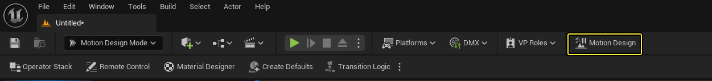
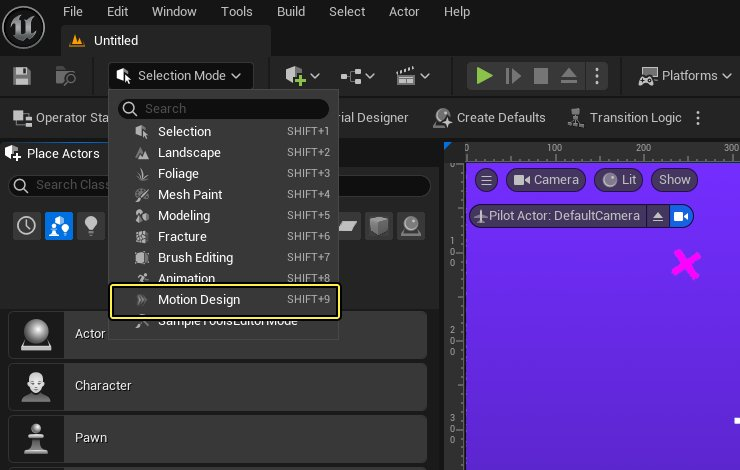
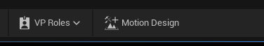
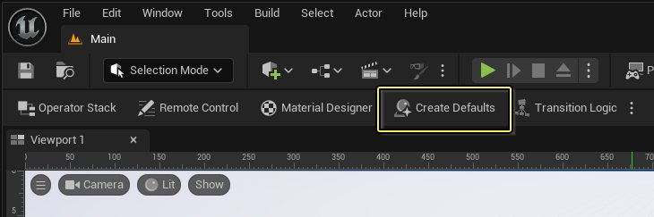
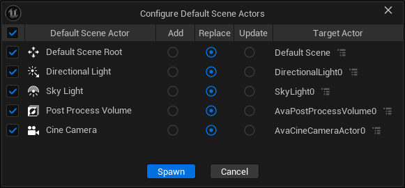
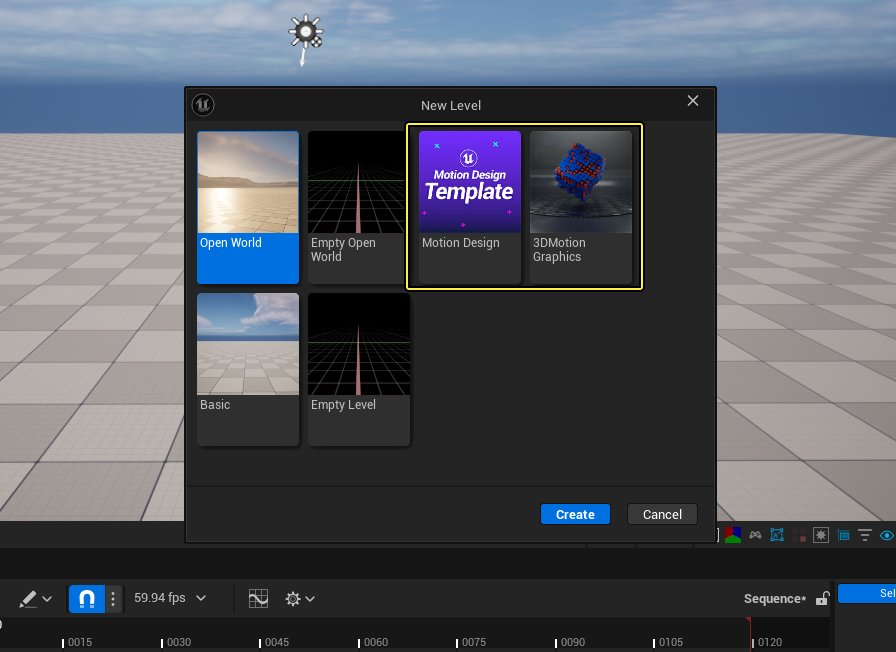
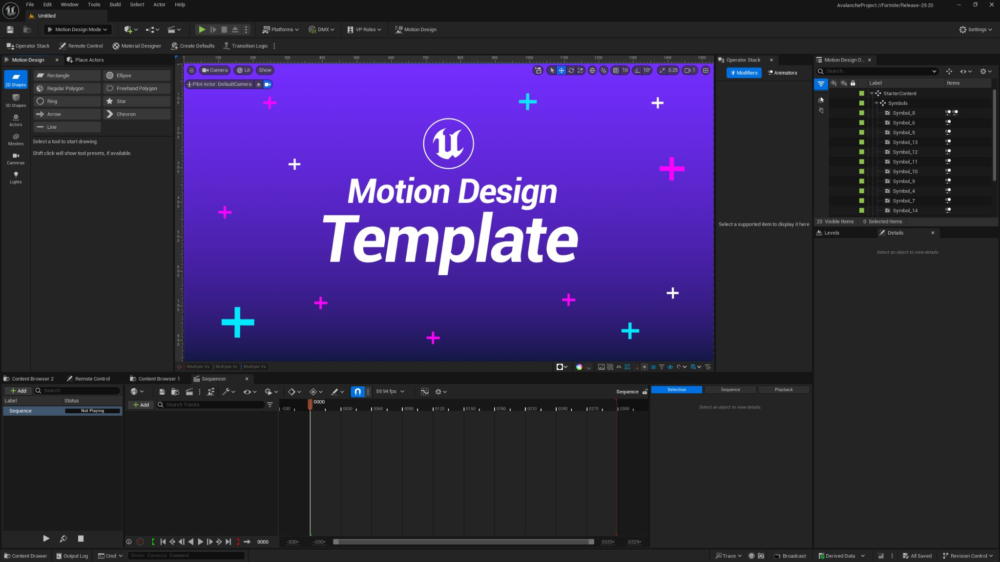

# 使用动态设计制作图形

> 路径：虚幻引擎5.7文档 / 动态设计 / 使用动态设计制作图形

> 原始页面：https://dev.epicgames.com/documentation/unreal-engine/your-first-graphic-with-motion-design-in-unreal-engine

本教程提供了一套分步介绍的工作流程，说明了如何使用虚幻引擎的动态设计工具创建可实时控制的2D动画图形，并使其进入屏幕、离开屏幕以及在屏幕上进行变换。你也可以在这套工作流程的基础上使用动态设计制作更高级、更复杂的2D和3D动画。

## 入门指南

本教程假定你已熟悉[动态设计快速入门](../motion-design-quickstart-guide/index.md)的内容。如果你尚未阅读该文档，请从彼处开始。如果你已经启用了所需的插件，并阅读了关于创建新关卡和动态设计UI的章节，请继续阅读。

继续学习本教程的方式有两种，且都行之有效。

1. 在[现有关卡](#%E5%9C%A8%E7%8E%B0%E6%9C%89%E5%85%B3%E5%8D%A1%E4%B8%AD%E4%BD%BF%E7%94%A8%E5%8A%A8%E6%80%81%E8%AE%BE%E8%AE%A1)中使用动态设计。
2. 使用[动态设计模板](#%E5%88%9B%E5%BB%BA%E6%96%B0%E5%8A%A8%E6%80%81%E8%AE%BE%E8%AE%A1%E5%85%B3%E5%8D%A1)创建新关卡。

### 在现有关卡中使用动态设计

本教程给出的第一个选项是在现有关卡中打开 **动态设计界面** 。为此，点击工具栏上的 **动态设计（Motion Design）** 按钮即可。

工具栏中的动态设计按钮。

你也可以在模式（Modes）下拉菜单中切换到 **动态设计模式（Motion Design Mode）** ，从而在不更改整个界面的情况下使用动态设计工具。在键盘上按SHIFT+9键也可以打开此模式。

模式菜单中的动态设计。

#### 用动态设计场景的默认元素填充空白关卡

若选择上文所提的第一个选项，那么为了从空白关卡开始，请点击屏幕中上方的按钮，激活 **动态设计（Motion Design）** 模式。默认情况下，你在虚幻引擎中创建的新空白关卡中不存在光源、后期处理体积或摄像机。

动态设计按钮。

1. 点击 **创建默认值（Create Defaults）** ，从推荐的默认Actor中选择要添加到空白关卡中的对象。这将打开 **配置默认场景Actor（Configure Default Scene Actors）** 窗口，其中包含多个选项。

   

   创建默认值按钮。
2. 选择要在场景中添加或替换的 **动态设计默认场景Actor** ，然后点击 **生成（Spawn）** 。本教程将使用默认选项。

   

   配置默认场景Actor窗口。

随后，视口和动态设计大纲视图将按你所选的选项进行更新。

### 创建新动态设计关卡

本教程的第二个选项是，使用动态设计模板创建新关卡。

创建一个新关卡（点击文件（File） > 新关卡（New Level））。在提示窗口中，选择要创建的关卡类型。**动态设计（Motion Design）** 模板适用于2D设计，而 **3D动态图形（3DMotion Graphics）** 模版适用于3D设计。本教程介绍的是2D设计。

- 若要跟随本教程中的步骤，请选择 **动态设计（Motion Design）** 模板，然后点击 **创建（Create）** 。

  

  选择动态设计模版。

#### 生成默认场景Actor

用动态设计模板创建新关卡后，你必须配置并生成默认场景Actor。

1. 点击 **创建默认值（Create Defaults）** 按钮，打开 **配置默认场景Actor（Configure Default Scene Actors）** 窗口。
2. 在本教程中，你必须使用默认选项。因此请点击 **生成（Spawn）** 创建默认场景Actor。

   

   配置默认场景Actor窗口。

## 使用动态设计创建2D动画图形

### 你将学习的内容

本小节教程将说明如何使用动态设计界面的功能和工具来创建2D动画图形。具体包括：

- 绘制并自定义2D图元。
- 使用

  材质设计器

  自定义几何体。
- 使用空Actor定位内容。
- 添加文本。
- 约束文本以适应特定背景尺寸。
- 通过远程控制来控制文本。
- 播放Sequencer动画，使用Sequencer标记系统停止动画，然后从该标记处继续播放离场动画。

### 编辑初始模板

创建新关卡后的虚幻引擎用户界面应该如下图所示：

动态设计模版的初始状态。

本教程要求你创建新的内容。因此你需要先删除随模板自动生成的图形元素。

1. 转到 **动态设计大纲视图** ，点击 **初学者内容包（Starter Content）** 组
2. 按键盘上的 **Delete** 键弹出对话窗口，确认删除所选对象的子项。

你得到的空白视口应该类似下图。

> 图片已省略：删除初学者内容包组后的动态设计模版

删除初学者内容包组后的动态设计模版。

> [!NOTE]
> 视口可能显示的是黑屏。这时你可以使用视口右下方的 **视图（View）** 选项，切换为棋盘格图案。

随后你必须设置画布的尺寸。

1. 为此，请点击视口左上角的 **摄像机（Camera）** 按钮。
2. 选择 **标尺覆盖（Ruler Override）** 。
3. 根据项目要求，通过 **分辨率（Resolution）** 设置项自定义画布的尺寸。

   > 图片已省略：使用标尺覆盖设置画布的尺寸

   使用标尺覆盖设置画布的尺寸。

### 创建形状和群组

你可以用动态设计工具箱创建各种形状。如果尚未打开动态设计面板，请点击 **模式（Mode）** 下拉菜单并选择 **动态设计（Motion Design）** 。

> 图片已省略：从模式下拉菜单中选择动态设计

从模式下拉菜单中选择动态设计。

可供选择的形状有多个。本教程从 **矩形** 开始。

- 双击 **矩形（Rectangle）** 并在画布中央生成一个矩形。

  > 图片已省略：双击矩形按钮以在画布上添加矩形

  双击矩形按钮以在画布上添加矩形。

  > 图片已省略：新创建的矩形应如本图所示

  新创建的矩形应如本图所示。

可以用界面右侧下方的细节面板自定义新建矩形的形状和属性（如倾斜和斜边）。还可以点击并拖动新建形状的控点来更改尺寸。

接下来请锚定形状。

1. 转到 **细节（Details）** 面板，选择 **形状（Shape）** 类别。
2. 将 **水平对齐（Horizontal Alignment）** 改为 **向左（Left）** ， **垂直对齐（Vertical Alignment）** 改为 **居中（Center）** 。

   > 图片已省略：更改水平对齐和垂直对齐方式

   更改水平对齐和垂直对齐方式。

最终你会得到作为 **群组（Group）** 同时运动的其他Actor。

- 要创建群组，请选择矩形并按键盘上的CTRL+G键，或点击"动态设计大纲视图"中的 **群组（Group）** 按钮。

  > 图片已省略：群组按钮

  群组按钮

  这将为矩形Actor创建一个空Actor父项。

  > 图片已省略：矩形Actor的空Actor父项

  矩形Actor的空Actor父项。

你可以在"细节"面板中尝试更改空Actor的位置。更改空Actor的位置不会影响矩形Actor的位置。

1. 在 **动态设计大纲视图** 中右键点击矩形，将其重命名为 **BG_Main** 。
2. 将矩形移到屏幕左侧，使其与画布边缘齐平。

   1. 要调整矩形的位置，你既可以用矩形的几何体，也可以用矩形的空Actor父项。
   2. 为此，选择该 **空Actor** 并将其重命名为 **L3_BG** 。
   3. 使用父项，在 **细节（Details）** 面板中移动该 **群组** 的 **位置（Location）** 。

   > 图片已省略：重命名空Actor

   重命名空Actor。

这时你的画布应该如下图所示。

> 图片已省略：通过移动群组来移动矩形

通过移动群组来移动矩形。

> [!TIP]
> 按住鼠标中键即可在画布上进行平移。阴影区域代表 *屏幕外* 区域。本教程需要你将图形滑动到屏幕外，因此请留意画布的边界。

接下来请设定矩形的尺寸：

1. 点击 **BG_Main** Actor，然后点击 **形状（Shape）** 按钮。
2. 转到动态设计大纲视图，确保将 **尺寸类型（Size Type）** 设置为 **像素（Pixels）** 。它是 **形状（Shape）** 的第一个设置项。
3. 将像素尺寸（Pixel Size）从 **XY** 改为 **自由（Free）** ，以解除 **像素尺寸** 属性的绑定。
4. 将 **像素尺寸** 属性的值设置为1842 x 132。

   > [!NOTE]
   > 你既可以用虚幻单位，也可以用像素来决定形状的尺寸。本教程假定你使用像素，但教程介绍的所有功能对两种情况均成立。

   > 图片已省略：设置解绑的像素尺寸属性

   设置解绑的像素尺寸属性。

由于你创建的是下方三分之一处图形，因此请将整个群组的位置移到其通常采用的位置。

- 选择作为BG_Main父项的 **空Actor** ，并将 **Y** 位置的值设为-160。

  > 图片已省略：设置空Actor的位置

  设置空Actor的位置。

定位完成后，视口应该如下图所示：

> 图片已省略：初次定位完成后的结果

初次定位完成后的结果。

### 使用材质设计器自定义图形

接下来请使用 **材质设计器** 自定义下方三分之一处的图形，使其拥有比单纯的灰盒更丰富的外观。

自定义图形的步骤如下：

1. 选择对应形状，点击 **细节（Details）** 面板中的 **材质（Material）** 按钮。
2. 将 **材质类型（Material Type）** 设为 **材质设计器（Material Designer）** 。
3. 点击 **用材质设计器编辑（Edit with Material Designer）** 按钮。

**工具参数（Tool Parameters）** 分段中应该出现 **材质设计器（Material Designer）** 选项卡。这时你的视口应该如下图所示：

> 图片已省略：设置以使用材质设计器

设置以使用材质设计器。

材质设计器是动态设计功能所提供的基于图层的材质创建工具。与图形编辑或照片编辑软件等其他基于图层的工具类似，材质设计器中的所有图层都有填充、遮罩通道和独立的不透明度值，以及一整套的混合模式。

下图是材质设计器界面的概览：

> 图片已省略：材质设计器的界面

材质设计器的界面。

#### 界面按键

1. 在表面材质或后期处理材质之间切换。
2. 材质类型选择器。可用选项如下：

   - 不透明（Opaque）
   - 遮罩（Masked）
   - 半透明（Translucent）
   - 叠加（Additive）
   - 调制（Modulate）
3. 调整整个图层堆栈的不透明度。
4. 在调整填充或遮罩图层堆栈之间切换。
5. 调整图层的不透明度，并更改图层的混合模式。
6. 对单独图层进行填充和遮罩控制。

   - 锁链图标决定是否绑定填充和Alpha纹理的UV。
   - 点击图层缩略图左侧的白点即可启用或禁用任一部分。
7. 视口工具栏提供如下工具：

   - 图层特效。用于在图层上应用各种材质特效。
   - 添加图层。
   - 复制图层。
   - 删除图层。
8. 图层设置，如纹理变换和限制纹理等功能。

上方的材质设计器界面图中选中了图层的填充（棋盘格图标）。而下图则显示了设置图层类型的部分选项。具体包括：

- 纹理（Texture）
- 纯色（Solid Color）
- 颜色图集（Color Atlas）
- 纹理边缘颜色（Texture Edge Color）
- 渐变（Gradient）
- 材质函数（Material Function）

> 图片已省略：图层类型选项

图层类型选项。

1. 现在你需要一个简单的纯色，为此请选择 **纯色（Solid Color）** 。
2. 然后点击 **颜色（Color）** 控件并在弹出菜单中设置颜色。

   > 图片已省略：使用取色器设置颜色

   使用取色器设置颜色。
3. 用以下RGB值将颜色设为绿色：

   - R：0.0
   - G：0.441406
   - B：0.030081

### 添加图案

接下来请添加图案，方法是使用视口工具栏中的 **添加新图层（Add New Layer）** 按钮创建一个新图层。

> 图片已省略：视口工具栏中的添加新图层按钮

视口工具栏中的添加新图层按钮。

默认情况下，这将创建一个纹理。点击下拉菜单后会出现数个选项。

- 选择标准的线性渐变纹理。下方示例中的纹理被命名为2。

  > 图片已省略：选择标准线性渐变纹理

  选择标准线性渐变纹理。

接下来需要对UV进行一些旋转和缩放操作，从而获取本教程所需的图案。

1. 关闭遮罩，同时解绑缩放，以禁用本图层的遮罩。

   > 图片已省略：关闭遮罩并解绑缩放

   关闭遮罩并解绑缩放。

   > [!TIP]
   > 为此，你也可以创建一个新图层，然后选择 **无Alpha纹理（Texture No Alpha）** 。
2. 将纹理的 **属性** 设置如下：

   - 类型（Type）：纹理（Texture）
   - 纹理（Texture）：2
   - 偏移（Offset）：0.0、0.0
   - 旋转（Rotation）: 45.0
   - 缩放（Scale）：0.035、0.035
   - 枢轴点（Pivot）：0.5、0.5
   - X轴镜像（Mirror on X）：禁用
   - Y轴镜像（Mirror on Y）：禁用
   - 限制纹理（Clamp Texture）：禁用

   > 图片已省略：新纹理图层的属性

   新纹理图层的属性。
3. 将渐变图层的 **混合（Blend）** 设置为 **倍增（Multiply）** ，具体如下图所示。

   > 图片已省略：将混合图层设为倍增

   将混合图层设为倍增。

你的图形应该如下图所示：

> 图片已省略：初始图案的渐变较为粗糙

初始图案的渐变较为粗糙

接下来需要降低渐变的粗糙度。

- 将 **不透明度（Opacity）**（即上文界面概览中的第5项）设为0.11。

  > 图片已省略：降低图案的不透明度可柔化渐变效果

  降低图案的不透明度可柔化渐变效果。

若要将图案拆分，可将其朝条形图的左侧淡化。

1. 返回图层设置，重新启用图层遮罩，但依然不绑定图层UV。
2. 在遮罩上再添加一个线性渐变（可用同一个渐变）。
3. 使用纹理参数中的 **限制纹理（Clamp Texture）** 按钮将其限制起来。这样可以防止纹理重复。
4. 为Alpha纹理设置以下属性：

   - 限制纹理（Clamp Texture）：True
   - 偏移（Offset）： -0.566, 0.0
   - 旋转（Rotation）: 220.0
   - 缩放（Scale）： 3.0, 0.0

结果应该如下图所示：

> 图片已省略：添加受限线性渐变后的横幅

添加受限线性渐变后的横幅。

接下来请对边缘进行圆角化处理，并让形状略微倾斜。

1. 选中形状后点击 **形状（Shape）** 按钮。
2. 选择 **右倾斜（Right Slant）** 属性，并将值设置为18.00。

**斜边化** 的方法有两种，即逐个或统一对四个角进行斜边化操作。针对本设计，你需要对右上角和右下角进行斜边化操作。

1. 展开 **形状（Shape）** 设置项底部的 **右上角（Top Right）** 和 **右下角（Bottom Right）** 选项。
2. 将各项数值设置如下：

   - 类型（Type）：

     向内弯曲（Curve In）
   - 尺寸（Size）：

     13.0
   - 细分（Subdivisions）：

     8

   > 图片已省略：你的数值应该与截图中所示的数值一致

   你的数值应该与截图中所示的数值一致。

> [!TIP]
> 利用 **视口工具栏 > RGB** 选项，你可以让视口背景从棋盘格更改为纯黑色。这样更方便你查看图形。
>
> > 图片已省略：用RGB设置将视口背景设为黑色
>
> 用RGB设置将视口背景设为黑色。

1. 要重新创建条形图，请 **右键点击** **L3_BG** 群组并选择 **复制（Duplicate）** 。条形图的颜色将变为白色，其本身将略有偏移。
2. 将Actor重命名为 **L3_BG_Bar_Offset** 。
3. 在动态设计大纲视图中，将它放置到另一个条形图的下方。这时应该出现闪烁，因为两个条形图的优先级还缺乏管理。
4. 选择L3_BG和L3_BG_Bar_Offset 的Actor，按CTRL+G分组。
5. **右键点击** 位于群组根部的新 **空Actor** ，并添加一个名为 **半透明优先级（Translucent Priority）** 的修饰符。

   > 图片已省略：添加半透明优先级修饰符

   添加半透明优先级修饰符。

**半透明优先级** 修饰符会将半透明对象的渲染优先级自动排序。列表中的首个项目将优先于下一项目进行渲染。你可以将此修饰符用于嵌套的大型Actor群组或单个Actor。本教程中，你需要在动态设计动态设计的顶部使用一个半透明对象，同时用半透明优先级修饰符来管控一切。

移动图形，使它们相互偏移，而不是直接重叠在一起。

- 偏移L3_BG_Bar_Offset，将其

  Z值

  设为

  -170.0

  。结果应该如下图所示：

> 图片已省略：你的图形应如图所示

> 图片已省略：你的UI应如图所示

你的图形和UI应如图所示

## 在动态设计中添加内容

接下来请为你所创建的条形图添加徽标和文本。

### 将文本添加至版面

要创建文本，请返回 **工具箱** 。

> [!NOTE]
> 处理文本时请注意，对于给定的文本Actor，所有字符都共用相同的设置。要让单个字符使用不同的字体、颜色、尺寸等，则需要为所有需要不同设置的字符分别使用单独的文本Actor。

> 图片已省略：动态设计的用户界面

动态设计的用户界面。

> [!NOTE]
> [动态设计快速入门](https://dev.epicgames.com/documentation/404)全面地介绍了动态设计的界面。

1. 在工具箱（上图视口左侧的2号区域）中有一个 **Actors** 按钮。点击该按钮即可显示可添加到设计中的各种Actor。
2. 双击 **文本Actor（Text Actor）** 将其添加到动态设计大纲视图的根层级。
3. 将新建的文本Actor拖入到空Actor群组，使其与背景和背景条的偏移保持一致。
4. 在动态设计大纲视图中双击Actor，将其重命名为 **Text_Line_1** 。
5. 选中Text_Line_1 Actor，按 **CTRL+G** 将其分组。
6. 将该群组命名为 **Text_Lines** ，以供识别。
7. 由于需要两条文本行，所以请右键点击并 **复制** Text_Line_1，然后将复件重命名为Text_Line_2。

### 更改字体

要设置文本的字体，请转到动态设计大纲视图，选择一个文本Actor，然后进入细节面板。可选按钮有数个，请点击其中的 **文本（Text）** 按钮。

转到底部的细节面板，在选择文本按钮后，更改文本字段中的字符串即可更新文本行的内容。同时你还可以更改字体和字样。

1. 将字体（Font）更改为Roboto。
2. 将字样（Typeface）更改为斜体（Italic）。
3. 将第2行的位置向下移，避免两行重叠。

   > 图片已省略：设置文本Actor的字体和字样

   设置文本Actor的字体和字样。

这时文本被绿色条覆盖着。要纠正这种情况，请使用之前设置好的半透明排序优先级修饰符。但使用该修饰符的前提是Actor的类型为半透明材质。

1. 选择一个文本Actor，点击细节面板中的 **样式（Style）** 按钮。你将看到半透明样式被设置为了"无（None）"，这意味着它不是半透明的，所以半透明排序优先级修饰符无法为其排序。
2. 请将样式更改为 **半透明（Translucent）** 。
3. 为另一个文本Actor重复上述操作。然后你会看到条形图上方出现了文本。
4. 选择位于根层级的 **Text_Lines** 空Actor。
5. 点击细节面板中的 **通用（General）** 按钮。
6. 下移空Actor的 **位置（Location）** 即可将整个群组下移，直到其与条形图重叠。
7. 选择所有文本行，并在变换设置中将 **缩放（Scale）** 的值设为0.45。

   > 图片已省略：通用文本Actor的设置

   通用文本Actor的设置。

### 文本版面工具

现在需要使用 **文本版面工具** 。

- 选中文本后，点击细节面板中的 **版面（Layout）** 按钮。

  > 图片已省略：文本版面设置

  文本版面设置。

你可以在该分段中设置各种常见的文本属性。现在请修改其中几项。首先是 **对齐方式（Alignment）** 选项。

1. 文本的水平对齐方式因保持为左对齐，所以请不要更改该选项。
2. 将所有文本行的垂直对齐方式改为居中对齐，所以请选择第二行的第三个选项。

此外还有"字距调整（Kerning）"、"行距（Line Spacing）"和"字距（Word Spacing）"选项，但现在还不需要管这些选项。

1. 手动将Text_Line1和Text_Line2分开，避免其完全重叠。

   > [!TIP]
   > 使用[**网格排列** 修饰符](#%E7%BD%91%E6%A0%BC%E6%8E%92%E5%88%97%E4%BF%AE%E9%A5%B0%E7%AC%A6)也可以定位文本Actor。
2. 利用 **最大宽度（Max Width）** 确保文本不超出版面。
3. 设置最大宽度的值，使文本不超出图形边界。

   > [!TIP]
   > 要想减少猜测所需最大宽度值的次数，你可以输入随机数字，直到输入的数字超出版面边缘为止。这时再调整数值，直到将文本限制在理想区域内。

   > 图片已省略：设置文本版面的最大宽度值

   设置文本版面的最大宽度值。

下方是将最大宽度值设置为1550并调整文本位置前后的对比。

> 图片已省略：文本版面调整的前后对比。

文本版面调整的前后对比。

确保条形图左侧留足空间，以便之后添加徽标和标题名称。

### 网格排列修饰符

如上文所述，要分开两个文本行，还可以使用 **网格排列** 修饰符。步骤如下：

1. 选择Text_Lines根Actor，然后点击右键。
2. 转到修饰符并选择 **网格排列（Grid Arrange）** 。
3. 你将看到如下界面：

   > 图片已省略：文本行Actor的网格排列修饰符的设置项

   文本行Actor的网格排列修饰符的设置项。

目前要使用的两项设置分别是 **计数（Count）** 和 **扩散（Spread）** 。

- 将

  计数（Count）

  设置为

  (1, 2)

  ，

  扩散（Spread）

  设置为

  (0.0, 31.0)

  。

> [!NOTE]
> 添加网格排列修饰符后，动态设计大纲视图将出现改变。编辑器的眼球图标和第二个Actor的运行时可见性都将被禁用。这是因为宽度和高度的计数都被设置为了1，导致这些设置项不再可见。

> 图片已省略：计数和扩散设置更改后的文本行Actor排列

计数和扩散设置更改后的文本行Actor排列。

这一改动对文本Actor进行了排列，拉开了间距，并在细节面板中启用了可见性。这种逻辑对更为动态的版面是必须的，但即使对于像本教程项目这样相对静态的版面而言，它也是一种高效的工具。

> [!TIP]
> 点击整个修饰符堆栈或单个修饰符上的复选框，即可禁用该修饰符。这对试验性操作和调试而言都非常有用。

### 将徽标添加至版面

现在你需要再次访问 **材质设计器（Material Designer）** ，但在此之前，请先添加一个几何体。

1. 转到 **工具箱** ，从2D形状中添加一个 **矩形** 。
2. 双击该矩形，在动态设计大纲视图中将其选中，然后在键盘上按CTRL+G键，创建一个 **群组** 。
3. 将该群组命名为 **Show_ID** ，并将新建的矩形命名为 **Logo** 。
4. 在群组添加两个文本Actor，分别命名为 **Banner_Line1** 和 **Banner_Line2** 。这两个文本Actor将作为横幅的一部分。
5. 选择整个Show_ID组，并将其拖动到动态设计大纲视图中Text_Lines组的上方。

这时你的动态设计大纲视图应该如下图所示：

> 图片已省略：添加徽标Actor和横幅行文本Actor后的动态设计大纲视图

添加徽标Actor和横幅行文本Actor后的动态设计大纲视图。

上述元素就位后，你就可以开始制作徽标了。点击刚刚添加的徽标Actor，打开 **材质设计器（Material Designer）** 。重复说明一次操作步骤：

1. 选择Actor。
2. 点击 **材质（Material）** 按钮。
3. 将 **材质类型（Material Type）** 设为 **材质设计器（Material Designer）** 。这时材质设计器选项卡位于动态设计大纲视图的左侧。

   - 这次无需取消填充和遮罩的绑定。你将应用一个同时拥有两个通道的纹理，因此它会自动使用这两个通道。
4. 点击属性下拉菜单，找到位于 **EDC_Content** 文件夹中的 **UE_Logoo_icon-only** 资产。也可以将纹理直接拖放到画布上。

   结果应该如下图所示：

   > 图片已省略：将UE_Logo_icon-only资产添加到画布

   将UE_Logo_icon-only资产添加到画布。
5. 在材质设计器属性列表中，限制该图层的纹理。

   > 图片已省略：启用限制纹理设置

   启用限制纹理设置。

> [!TIP]
> 在 **视口工具栏** 中选择 **Alpha** ，即可随时检查关卡的关键帧和填充：
>
> > 图片已省略：将视口改为显示Alpha通道
>
> 将视口改为显示Alpha通道。
>
> 更改后的视口显示的内容应如下图所示：
>
> > 图片已省略：显示Alpha通道的视口
>
> 显示Alpha通道的视口
>
> 记得请在继续工作前将视口切换回RGB。

由于 **材质设计器** 的默认值为半透明材质，你可以将徽标移动到版面中，使其只要位于列表顶部附近就能被正确排序。

1. 配置 **Banner_Line1** 和 **Banner_Line2** 文本Actor，使其设置与之前创建的两个文本行Actor相同。
2. 选择所有横幅行Actor，将它们设置为 **半透明（Translucent）** 且 **不透明度（Opacity）** 为 **1.0** ：

   > 图片已省略：横幅行文本Actor的样式设置

   横幅行文本Actor的样式设置。
3. 使用视口中的控点或细节面板中"通用（General）"字段下的"变换（Transform ）"设置，移动整个 **Show_ID** 组，使徽标位于图形左侧。虽然结果需要进一步调整，但目前这样就好，具体应该如下图所示：

   > 图片已省略：正在制作的横幅图标和待变换的文本

   正在制作的横幅图标和待变换的文本。
4. 点击徽标以将其选中。

> [!NOTE]
> 如果难以选中徽标，原因可能是没有启用 **半透明选择（Translucent Selection）** 功能。按键盘上的 **T** 键即可启用，然后再尝试选择。

调整徽标尺寸的方法有两种：

- 使用细节面板"通用（General）"字段下Actor的"变换（Transform）"设置，缩放实际尺寸。
- 启用"限制纹理（Clamp Texture）"后，在材质设计器中更改缩放值。

现在请使用Actor的"变换（Transform）"设置项来调整徽标的尺寸。之后在制作动画时，你将使用材质设计器的变换方法来缩放UV。

- 转到细节面板，将所有三个轴的 **缩放（Scale）** 值设为 **0.55** 。

  > 图片已省略：调整徽标Actor的尺寸

  调整徽标Actor的尺寸。

接下来请处理横幅的标题。

1. 选择Banner_Line1，并将文本设置为"The Daily"。
2. 将Banner_Line1和Banner_Line2的版面设置安排如下：

   - 对齐方式（Alignment）

     - 水平（Horizontal）：左对齐（Left Justified）
     - 垂直（Vertical）：居中（Centered）
   - 字距调整（Kerning）、行距（Line Spacing）和字距（Word Spacing）：0
   - 最大宽度（Max Width）、最大高度（Max Height）和按比例缩放（Scale Proportionally）：禁用

   > 图片已省略：横幅行文本Actor版面的设置

   横幅行文本Actor版面的设置。

因为使用已完成的项目时无法编辑最大宽度，所以你不需要为横幅行文本Actor设置最大宽度。

1. 调整文本的大小和位置，直到得到类似于下图的结果：

   > 图片已省略：变换后的横幅图标和文本Actor

   变换后的横幅图标和文本Actor。
2. 将文本字体换成你喜欢的字体。示例中使用的均为Roboto和斜体。可以用"字样（Typeface）"选项选择字体粗细。

> 图片已省略：调整字体和字样

调整字体和字样。

### 视口功能

视口的右下方有多个功能。本教程只会用到两个相关的功能：视口对齐和视口导线。

> 图片已省略：视口右下方显示了可访问功能的图标

视口右下方显示了可访问功能的图标

#### 视口对齐

> 图片已省略：视口对齐选项

视口对齐选项。

右键点击磁铁图标以访问视口对齐选项。所有选项都可以进行开关，并根据喜好进行配置。

- 在本例中，右键点击磁铁图标并选择

  屏幕和导线（Screen & Guide）

  。

> [!NOTE]
> 左键点击磁铁图标即可将选择的所有选项禁用。

使用紧邻右侧的网格和磁铁图标即可与指定尺寸的网格对齐。

> 图片已省略：设置视口对齐的网格大小

设置视口对齐的网格大小。

#### 视口导线

使用虚幻引擎内置的导线系统可以确保一切都按照理想的方式进行排列。点击并拖动视口左上方的标尺即可绘制导线，而导线能为你提供额外的精度。

请拖出两条导线并与虚幻引擎徽标对齐。双击导线即可将其移除。

> 图片已省略：使用导线排列Actor

使用导线排列Actor。

要保存一组复杂的导线，请点击视口中的 **摄像机（Camera）** ，然后选择 **导线预设（Guide Presets） > 另存为（Save As）** 。

> 图片已省略：保存导线预设

保存导线预设。

保存导线预设后，导线预设字段下会出现额外选项。具体是：

- 激活（Active）：标识当前使用的已保存预置。
- 保存（Save）：保存当前预设。
- 另存为（Save As）：以新名称保存当前预设。
- 重新加载（Reload）：重新加载当前预设的设置。
- 你可以选择已保存的导线预设并将其填充到视口中。

> 图片已省略：保存导线预设后出现的额外选项

保存导线预设后出现的额外选项。

此时你的项目应该如下图所示：

> 图片已省略：教程现阶段的横幅、文本Actor和徽标

教程现阶段的横幅、文本Actor和徽标。

在继续前请先保存工作。

### 背景条视效细节

在继续前，请自己尝试为背景条添加新纹理，使其不再是简单的白色条形图，而是拥有了吸引眼球的额外细节。

完成后，请阅读下文给出的步骤，看看相较之下自己的成果如何。如果你遇到了困难，请按照指示修改背景条。

1. 选择白色条形图背景，点击细节面板中的 **材质（Material）** 按钮。
2. 将 **材质类型（Material Type）** 设为 **材质设计器（Material Designer）** 。
3. 点击 **用材质设计器编辑（Edit with Material Designer）** 。

   > 图片已省略：用材质设计器编辑按钮

   用材质设计器编辑按钮。
4. 添加一个无Alpha通道的纹理。

   > 图片已省略：用添加图层菜单添加一个无Alpha通道的纹理

   用添加图层菜单添加一个无Alpha通道的纹理。
5. 将混合模式更改为 **倍增（Multiply）** ，并将纹理控制设置如下：

   - 打开纹理下拉菜单，选择标记为

     2

     的

     线性渐变资产（Linear Gradient Asset）

     。
   - 启用

     限制纹理（Clamp Texture）

     。
   - 调整

     偏移（Offset）

     、

     旋转（Rotation）

     和

     缩放（Scale）

     的UV设置。

     - 将偏移设置为-1.415。
     - 将旋转设置为-90。
     - 设置缩放，使X值为0.029，Y值为1.0。
   - 将

     不透明度（Opacity）

     设置为0.87。

   > 图片已省略：新建的无Alpha通道纹理的设置

   新建的无Alpha通道纹理的设置。

结果应该如下图所示：

> 图片已省略：投影的结果

投影的结果。

> [!TIP]
> 此类投影不需要是基于纹理渐变的投影，可以使用带有实时阴影的正常场景光照。这涉及以副本几何体为绿色背板，并将其设置为不透明而不是半透明（半透明材质无法投射阴影）。你大可随意进行尝试！

## 为你的设计制作动画

你现在的目标是让自己创建的内容从屏幕外滑入视野内并在中心停下。你还需要设置离场动画，从而让图形向左侧缩回到屏幕外。

### 为横幅图形制作动画

首先选择整个图形，并设置关键帧以供其抵达。

1. 点击根空Actor。本示例中，虚幻引擎自动将其命名为Null Actor1。

   > 图片已省略：横幅图形的空Actor

   横幅图形的空Actor。
2. 转到 **Sequencer** 面板，将播放头推进到第30帧。
3. 设置关键帧，方法是按键盘上的 **S键** ，或点击 **细节（Details）** 面板 **通用（General）** 设置 **位置（Location）** 字段右侧的菱形图标。

   > 图片已省略：设置关键帧的菱形图标

   设置关键帧的菱形图标。
4. 点击关键帧，打开新的选择分段。

   > 图片已省略：放置并点击关键帧后的新选择分段

   放置并点击关键帧后的新选择分段。
5. 转到Sequencer，点击磁铁图标左侧的笔图标，找到并启用 **自动添加关键帧（Auto-key）** 。启用此功能后，轨道值被更改时将自动放置关键帧。

   > 图片已省略：菜单中的自动添加关键帧功能

   菜单中的自动添加关键帧功能。
6. 将播放头拖回到第0帧，然后在Sequencer中展开Null Actor1的变换（Transform）>位置（Location）设置项：

   > 图片已省略：空Actor的变换>位置设置项

   空Actor的变换>位置设置项。
7. 将根空Actor关键帧的 **Y值** 改为 **-1500** 。这会使整个图形离开屏幕。另外因为启用了自动添加关键帧，该值处还会创建一个关键帧。另一种设置该关键帧的方法则是，更改动态设计大纲视图中的值并点击关键帧菱形图标。
8. 要让动画轻松自然地进入帧中，请点击移动开始位置的关键帧（即本例中的第0帧）。这时你应该可以在右侧的选择分段中看到一个图表视图。

   > 图片已省略：选择分段中的图表视图

   选择分段中的图表视图。
9. 点击 **选择（Selection）** 下拉菜单将显示几个选项，而这些选项能帮你节省制作动画的时间。在本例中请选择 **三次方（Cubic）** 。

   > 图片已省略：选择菜单选项中的三次方选项

   > 图片已省略：UI中选择后的三次方选项

   选择菜单选项中的三次方选项。

   > [!TIP]
   > 点击Sequencer中的 **播放（Play）** 按钮以查看各选项的效果。
10. 接下来请为该动画添加一个暂停，以便开始制作离场动画。 将播放头移至第30帧，右键点击并选择 **添加标记（Add Mark）** 。这将创建一个 **A** 标记。右键点击A并更改其 **标签（Label）** 属性，即可更改标签。现在用A标签就好。

    > 图片已省略：添加标记

    添加标记。

    > 图片已省略：新标记

    新标记。
11. 点击该按钮，在Sequencer面板右侧打开 **序列（Sequence）** 选项卡。

    > 图片已省略：序列选项卡

    序列选项卡。
12. 点击 **角色（Role）** 下拉菜单并选择 **停止（Stop）** 。

    标记可以有多种角色。具体包括：

    - 标记（Mark）（默认值，无功能）
    - 停止（Stop）
    - 暂停（Pause）
    - 跳转（Jump）
    - 反向（Reverse）

    > 图片已省略：标记的角色选项

    标记的角色选项。

    选择停止意味着动画将在该点停止，直到你选择继续并开始播放离场动画。而你将在稍后制作离场动画。
13. 在当前Y位置（第50帧）处创建另一个关键帧。选择轨道后，也可以将ENTER键作为快捷键。 另一种为序列创建关键帧的方法是，点击空Actor变换位置设置中与Y设置相关联的添加关键帧按钮。具体如下所示：

    > 图片已省略：添加关键帧按钮

    添加关键帧按钮。
14. 点击第一个关键帧，按住ALT键，然后将关键帧拖到约第90帧的位置。这将复制原先的（屏幕外）关键帧，并创建合适的离场动画。
15. 右键点击第70帧处的播放头，然后选择 **设置结束时间（Set End Time）** 以删除时间轴中不必要的分段。

### 为徽标制作动画

条形图的动画制作完毕后，下一步是使用 **材质设计器（Material Designer）** 为你创建的虚幻引擎徽标制作动画。

使用 **材质设计器** 为属性制作动画与为其他属性制作动画没有区别；只要属性旁边存在菱形图标，那么工作流程就几乎相同。

1. 首先从动态设计大纲视图中选择徽标Actor。需要使用图层不透明度对其进行缩小和淡入处理。

   > 图片已省略：使用不透明度和缩放选项创建动画

   使用不透明度和缩放选项创建动画。
2. 为不透明度设置关键帧。

   - 将

     Sequencer播放头

     移至第

     8

     帧。
   - 将

     不透明度（Opacity）

     的值设置为

     0

     。
   - 点击关键帧的菱形图标即可让Sequencer移动到该点。为揭露动画设置大约20帧。

   > 图片已省略：为不透明度设置关键帧

   为不透明度设置关键帧。

移动动画的初始值和结束值如下图所示。从开始到结束的关键帧变化如下：

- 不透明度值0.0 -> 不透明度值1.0
- 缩放（Scale）

  - X值2.786 -> X值1.0
  - Y值2.786 -> Y值1.0

> 图片已省略：移动动画的初始值和结束值。

移动动画的初始值和结束值。

你的下一个任务是用不透明度选项卡为徽标遮罩制作动画。

> 图片已省略：再次使用不透明度选项卡

再次使用不透明度选项卡。

- 从此选项卡中指定一个纹理，对整个材质进行遮罩（而不是仅遮罩单一图层）。

  > 图片已省略：为材质指定撕裂纹理

  为材质指定撕裂纹理。

将撕裂纹理添加到材质后，无论你对底层的RGB选项卡做了什么，该纹理都会将材质进行遮罩。

> [!TIP]
> 此时限制你的只有你的想象力。请尽情尝试用任何方式使用关键帧——其可能性无穷无尽！

## 使用远程控制绑定版面和内容

现在你已经设计并制作了图形的动画，下一步就是对其进行绑定，从而充分发挥 **远程控制** 的优势。远程控制让你能够公开各种属性，以便你在中心位置自定义属性。

远程控制还提供了一套名为 **行为（Behaviors）** 的强大系统。行为系统提供的逻辑操作为你提供了更强大的绑定能力。你是否想通过控制单个整型的数值，就达成在不同样式（包含多个属性）之间的切换？远程控制和行为系统的组合就可以帮助你做到这一点。

- 首先请选择 **远程控制（Remote Control）** 选项卡。它就位于Sequencer选项卡的旁边。

  > 图片已省略：选择远程控制选项卡

  选择远程控制选项卡。
- 你也可以用主菜单的 **窗口（Window）** > **远程控制面板（Remote Control Panel）** 打开远程控制。

  > 图片已省略：通过主菜单打开远程控制选项卡

  通过主菜单打开远程控制选项卡。

所有动态设计关卡都预先绑定了的远程控制预设。打开面板后的界面应该如下图所示：

> 图片已省略：远程控制面板的初始状态

远程控制面板的初始状态。

远程控制面板提供了很多强大且可能显得复杂的功能，但在本示例中你只会用到基本功能。你需要执行以下操作：

- 控制你的两个文本行。
- 用单个控制点更改显示的品牌文本、徽标和条形图本身的颜色。

先从两个文本行开始。

- 要将

  公开属性

  给

  远程控制

  ，请转到动态设计大纲视图并选择

  Text_Line_1

  Actor。
- 观察细节面板并找到摇杆图标。找到属性设置按钮并点击

  文本（Text）

  。

> [!TIP]
> 这些摇杆图标随处可见，毕竟远程控制可以控制项目的多个部分。

> 图片已省略：摇杆图标表示你可以通过远程控制功能控制设置项

摇杆图标表示你可以通过远程控制功能控制设置项。

此时你的界面应该如下图所示。你的文本字符串会在 **属性（Properties）** 列中被公开并供你编辑。你对文本字符串所做的更改会立即反映在视口中。

> 图片已省略：属性列中公开的文本字符串

属性列中公开的文本字符串。

控制了左侧的品牌文本后，左侧的 **属性ID（Property ID）** 列就会变得十分重要。属性ID是一种对功能按钮进行分组的方法，非常适合用来整理大量公开的属性。它是用单一来源设置多个属性的工作流程的一部分。本教程将在稍后介绍。

你可以通过 **属性（Properties）** 右侧的列将 **控制器（Controllers）** 添加到设置中。**控制器** 的界面更简单，更易于操作。

- 要为公开的属性创建控制器，请点击并将群组拖到 **控制器（Controller）** 列中。你的界面应该如下图所示：

  > 图片已省略：为公开的属性创建控制器

  为公开的属性创建控制器。

整理好控制器可以方便操作者访问你的绑定，而为字段做标记将帮你做到这一点。双击控制器ID（Controller ID）和描述（Description）字段即可进行编辑。输入字母数字字符串即可作为新的值。默认情况下，控制器ID的值为 **文本（Text）** 。

1. 将控制器ID标签更改为 **B100** 。
2. 将描述设置为 **文本 - 第一行（Text - Line 1）** 。

此时你的界面应该如下图所示：

> 图片已省略：更改控制器ID和描述文本字段后

更改控制器ID和描述文本字段后。

- 对第二行文本重复上述过程。

> [!TIP]
> 如果不想重复整个过程，也可以采取另一种更复杂但更高效的方式实现同样的结果。
>
> - 删除Text_Line_2 Actor。
> - 复制并粘贴Text_Line_1 Actor。
> - 将副本Actor重命名为Text_Line_2。
>
> 这样一来，一个 **跟踪器组件（Tracker Component）** 将被添加到副本Actor。此过程既复制了Actor，也会将相同的属性公开给远程控制。此工作流程只需要你额外执行两个步骤：
>
> - 检查网格修饰符是否维持了适当的行距。
> - 将新Actor的公开群组从
>
>   属性（Properties）
>
>   面板拖到
>
>   控制器（Controller）
>
>   列中。

你的界面应该如下图所示：

> 图片已省略：创建第二个Text_Line Actor后的界面

创建第二个Text_Line Actor后的界面。

- 在控制器列中，更改

  输入（Input）

  字段下的值来测试远程控制属性。

如果一切配置正确，那么更改的效果将立即显现。请注意，当你将文本从 **属性（Properties）** 面板拖到 **控制器（Controller）** 之中后，系统将自动添加一个 **绑定行为（Bind Behavior）** ，如上方截图所示。这样的行为有很多种——均由我们设计，旨在提供额外的自动化和逻辑以简化你的工作流程。

知晓这一点后，请使用 **条件语句行为（Conditional Behavior ）** 和 **属性ID（Property ID）** 系统，建立驱动条形图左侧项目的逻辑。

- 首先请公开需要用到的属性。请用之前学习的针对Text_Line Actor的过程，公开以下属性：

#### 徽标

1. 点击动态设计大纲视图中的徽标Actor并打开材质设计器。

   > 图片已省略：用于打开徽标所关联的材质设计器的按钮

   用于打开徽标所关联的材质设计器的按钮。
2. 点击与徽标纹理关联的远程控制按钮，即可将纹理控制器添加到远程控制面板。
3. 转到远程控制的属性列，突出显示新公开的纹理。将属性ID（目前被列为 **无（None）**）的值设置为 **100.Logo** 。

> [!TIP]
> "100" 是最重要的部分，但如果你有多个图像或颜色需要标记并控制，你也可以用句点来进一步描述属性。

#### 显示标题文本

1. 分别公开包含 **日常（The Daily）** 和 **热修复（Hotfix）** 的文本字段。
2. 将"日常（The Daily）"和"热修复（Hotfix）"作为值分别分配给属性ID **100.ShowTitleLine1** 和 **100.ShowTitleLine2** 。 你的界面应该如下图所示：

> 图片已省略：为文本字段分配属性ID

为文本字段分配属性ID。

#### 背景条颜色

1. 点击BG_Main Actor，或在动态设计大纲视图中将其选中。如果它没有自动打开，请转到你先前设置好的材质设计器。
2. 点击绿色底部图层，点击 **更多（More） (⋮)** 菜单，展开公开选项。

   > 图片已省略：更多菜单选项

   更多菜单选项。
3. 公开该属性，并为其分配属性ID **100.Background** 。

你的界面应该类似于下图：

> 图片已省略：公开所有属性后的界面

公开所有属性后的界面。

设置好公开属性后，下一步是进行用一个整型控制多个属性的设置。

1. 转到 **控制器（Controller）** 列，点击左侧的 **加号** ，选择 **整型（Integer）** 。

   > 图片已省略：控制器数值选项

   控制器数值选项。
2. 为便于整理，请将控制器ID标记为 **A100** 。
3. 使用各行控制器ID字段左侧的拖动控点手动对列表进行重新排序。
4. 将此属性的描述更改为 **0 = Show 1** | **1=Show 2** 。
5. 选择控制器并点击 **行为（Behavior）** 列中的加号，手动添加行为。
6. 选择 **条件语句（Conditional）** 并点击属性。

   > 图片已省略：添加条件语句行为

   添加条件语句行为。

   选定后，你可以选择如何为要添加的内容进行求值，但现在请将其设置为 **=** 。
7. 点击操作（Actions）字段旁的 **加号** 按钮。

   > 图片已省略：点击操作列顶部的加号以添加新操作

   点击操作列顶部的加号以添加新操作。
8. 转到菜单，选择 **添加指定ID操作（Add specific ID action）** > **ID: 100** ，如下图所示：

   > 图片已省略：选择使用ID:100的特定ID操作

   选择使用ID:100的特定ID操作。

这将收集所有以100为前缀的属性，并将它们都同时添加到"操作（Actions）"列中。

> 图片已省略：所有前缀为100的属性都被收集到了操作列中

所有前缀为100的属性都被收集到了操作列中。

这样一来，当你在 **远程控制（Remote Control）** 控制器中将该值设置为 **0** 时，所有这些值都将被设为你给所选属性所设的值。在本例中，请确保将其设置为0 = Unreal Logo和绿色背景条。

1. 右键点击属性群组，然后选择 **复制（Duplicate）** 。
2. 双击副件组的 **条件（Condition）** 字段，将值设置为1。

以下示例展示了使用此工作流程可制作的内容。

> 图片已省略：使用所述工作流程完成的示例

使用所述工作流程完成的示例。

设置完成后，当你按下0时会看到第一个横幅主题，而按下1时会看到另一个横幅主题。

## 用Storm Sync打包内容

### 导出.spak文件

你可以将内容导出为轻量的 `.spak` 文件。这非常适合在缺乏源代码控制的情况下备份内容，或将完整场景及其所有依赖文件交给同事。下面介绍该如何为自己的项目使用这一功能。

1. 打开你所处理的关卡。此处采用的示例名为 `Demo_Working_Project` 。
2. 在视口中点击鼠标右键，选择 **导出（Export）** ：

   > 图片已省略：将项目导出为.spak文件

   将项目导出为.spak文件。

   然后虚幻引擎会自动收集并显示所需文件的完整列表。

   > 图片已省略：自动收集的待导出文件列表

   自动收集的待导出文件列表。
3. 点击 **下一步（Next）** 。此时你将转到导出的选项屏幕。你可以在其中为 `.spak` 文件命名。

   > 图片已省略：为导出的文件命名

   为导出的文件命名。
4. 命名文件并点击 **完成（Finish）** 。右下角应该出现一条消息，显示文件的保存位置。

### 导入.spak文件

要导入 `.spak` 文件，请将文件从导出目录拖放到 **内容浏览器（Content Browser）** 中。导入文件前系统会显示一个画面，供你验证文件的内容。如果虚幻引擎检测到 `.spak` 文件内容与项目中的内容存在差异，那么它会对你发起通知，并导入有变更的内容。如果导入的是一组全新资产，那么变更列表会显示所有内容。

下图示例列表展示的是现有项目不存在任何文件的情况：

> 图片已省略：从.spak文件导入项目时会出现的变更列表

从.spak文件导入项目时会出现的变更列表

点击 **导入（Import）** 以将必要的文件填充到内容浏览器中。

## 纲要工具UI概览

> [!WARNING]
> 开始本节内容前，强烈建议你使用双显示器。这样你就可以将一个显示器用作输出显示器，而另一个则用作图形的操作台。没有双显示器将很难跟上本教程。

一切设置完毕后，剩下的事情就是用 **纲要** 工具播放你制作的自定义内容。

首先，在内容浏览器中点击右键，选择 **动态设计（Motion Design）> 动态设计纲要（Motion Design Rundown）** ，创建一个新的纲要。

> 图片已省略：创建新的动态设计纲要

创建新的动态设计纲要。

你可以用 **纲要（Rundown）** 工具将关卡添加到中心位置并创建页面，并利用这些页面快速生成供实时播放的内容。以下工作流程将从浅层且完全本地化的角度介绍纲要工具，以供进行简单的播放任务。

只要设置正确，你就可以在一个网络中运行多个虚幻引擎实例，并通过一个运行纲要和纲要预览功能的虚幻引擎实例，对托管着待播放项目的可发现虚幻引擎实例进行控制。

> 图片已省略：动态设计纲要界面

动态设计纲要界面。

以下是本教程中纲要工具界面较为重要的方面：

1. 模板列表：此处放置所有的导入关卡。你可以从 **内容浏览器** 中拖出关卡到此处来进行导入。
2. 播放功能按钮：用面板控制选定的页面。此处可以进行播放/停止、继续和播放纲要中的下一个项目等操作。这些播放功能按钮严格地特指对图形进行实况播放。你可以使用页面预览（Page Preview）在播放前进行预览。页面预览详情见第6项。
3. 页面列表：从模板列表中拖出项目都会导致创建页面。你可以将页面送往指定的通道。对于本教程，请将通道保留为Channel_0。
4. 页面细节：供你在此处设置单个页面的属性，例如文本行、整型值等。你还可以在此处修改页面ID和页面名称。
5. 工具栏：工具栏含几个常用的功能按钮，如保存、添加/删除新模板或页面，或广播设置等。"启动所有通道（Start All Channels）"右侧还有一个快速访问按钮，可高效地进行"实况播放"。
6. 页面预览：功能与上面提到的播放功能按钮类似，让操作者可以在实况播放图形前预览所选页面的内容。你还可以使用 **预览下一个（Preview Next）** 按钮查看完整的页面列表。

## 使用纲要工具

首先请将你的关卡添加到纲要。

1. 点击顶部行的 **添加模板（Add Template）** 按钮，或直接将关卡拖到模板列表中。
2. 双击 **开始预览（Preview In）** 按钮以查看你所处理的内容。

结果应该如下图所示：

> 图片已省略：在纲要工具中预览页面

在纲要工具中预览页面。

预览并不意味着你会在实况直播中播放图形。可以注意到，播放（Take In） / 停止（Take Out）按钮仍然呈灰色（详见界面描述中的列表项2）。

这是因为你还需要将模板拖到 **页面列表** 中。

1. 将模板拖入页面列表后，再点击页面预览面板上的 **继续（Continue）按键** 。如果一切正常，你应该能看到你所创建的离场动画会播放，让图形随之离开屏幕。
2. 在纲要中选择页面后，修改部分页面的细节。

   1. 更改B100和B200的值，让其显示默认文本以外的内容。
   2. 再次点击 **开始预览（Preview In）** 按钮。

结果应该如下图所示：

> 图片已省略：在预览中修改页面的文本

在预览中修改页面的文本。

1. 右键点击0001页面并选择 **复制（Duplicate）** 。请修改该页面，以进一步试验这些功能按钮。
2. 转到副本页面，将页面细节中的A100属性的值设置为1，而不是0。根据现有的逻辑，对图形使用"开始预览（Preview In）"的结果应该如下图所示：

   > 图片已省略：创建副本页面

   创建副本页面。

完成页面设置且页面可运行后，请简要了解一下图形的输出。为简单起见，本教程将介绍使用单机的操作，即操作和输出发生在同一引擎上。

- 点击"广播（Broadcast）"按钮，打开 **广播编辑器（Broadcast Editor）** ：

  > 图片已省略：打开广播编辑器

  打开广播编辑器。

**广播（Broadcast）** 窗口打开如下：

> 图片已省略：广播窗口

广播窗口。

右侧的 **输出设备（Output Devices）** 列表会显示目前可用的显示器

> [!WARNING]
> 如前文所述，你必须用多个显示器。

1. 点击用于接收输出的显示器，并将其拖入Channel_0视口。结果应该如下图所示：

   > 图片已省略：拖入输出显示器后的Channel_0视口

   拖入输出显示器后的Channel_0视口。
2. 设置好输出后，点击 **启动所有通道（Start All Channels）** 按钮。

   > 图片已省略：启动所有通道按钮

   启动所有通道按钮。

该通道指定的屏幕将黑屏，不会显示任何活动，直到你返回 **纲要** 。

1. 在本教程中，请将刚刚黑屏的显示器指定为 **程序显示器（Program display）** ，将另一台显示器指定为 **纲要显示器（Rundown display）** 。
2. 你当前处于 **直播（Live）** 状态。查看纲要显示器，点击任一页面上的 **开始预览（Preview In）** 按钮。该窗口将用预览视口播放。假设预览正常，并点击纲要显示器上的 **播放（Take In）** 按钮。这时，之前黑屏的程序显示器将显示你的下方三分之一处的图形。

下方图片同时给出了两台显示器的显示效果：

> 图片已省略：左侧为纲要显示器，右侧为程序显示器

左侧为纲要显示器，右侧为程序显示器。

- 当主动输出到程序显示器时，从纲要中选择第二页，然后对该页进行 **开始预览（Preview In）** 。

  > 图片已省略：在纲要显示器中预览，且不影响程序显示器

  在纲要显示器中预览，且不影响程序显示器。

在你预览下一页的同时，直播页面也在被正常显示。

- 点击此处的 **继续（Continue）** 按钮：

  > 图片已省略：继续按钮

  继续按钮。

程序显示器上的图形将播放离场动画，并离开显示屏范围。

- 选择002页面后，点击

  播放（Take In）

  ，那么蓝色的下方三分之一处图形将播放动画，并在程序显示器上移动。

图形设置好后，请尝试使用这些选项，并学习如何操作你的图形。

> [!TIP]
> 你可以用数字键盘从页面列表中调出页面。按CTRL+Enter可激活该页面的预览（Preview In），按Shift+Enter可激活播放（Take In），并以将该页面发送到程序显示器。将鼠标悬停在其他按钮上，即可查看各自的快捷方式。
