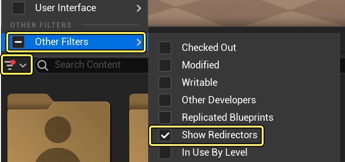
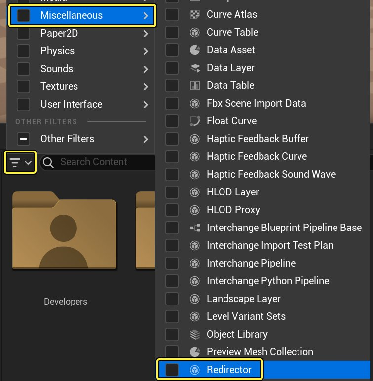

# 重定向器

> 路径：虚幻引擎5.7文档 / 建立你的开发流程 / 重定向器

> 原始页面：https://dev.epicgames.com/documentation/unreal-engine/asset-redirectors-in-unreal-engine

在 **虚幻引擎（UE）** 中，移动或重命名一个资产会在此资产的旧位置中留下一个 **重定向器**。这样，当前未加载但引用此资产的包将能够在新的位置找到它。

> [!TIP]
> 在项目初期制定一个命名规范并坚持使用将避免在重定向器方面遇到的许多问题。关于资产命名的指南，请参阅[推荐的资产命名规范](../recommended-asset-naming-conventions-in-unreal-89ae65f2/index.md)。

## 在内容浏览器中查看重定向器

内容浏览器中有两个用于查看重定向器的筛选器：

- **筛选器（Filter）** > **其他筛选器（Other Filters）** > **显示重定向器（Show Redirectors）** 将在内容浏览器中显示重定向器，但不会筛掉其他类型的资产。

  
- **筛选器（Filter）** > **杂项（Miscellaneous）** > **重定向器（Redirectors）** 将使内容浏览器只显示重定向器，这类似于其他筛选器的表现。

  

## 清理虚幻编辑器中的重定向器

要移除重定向器，强制资产引用重新定向到资产的新位置，可右键点击重定向器并选择 **修复（Fixup）**。这将重新保存所有指向该重定向器的包，并在成功重新保存所有引用该重定向器的内容后将其删除。

## 使用ResavePackages命令清理重定向器

你也运行使用 `-FixupRedirectors` 选项的 `ResavePackages` 命令清理项目中的所有重定向器。下面是一个命令行示例：

```
	UnrealEditor.exe <GameName or uproject> -run=ResavePackages -fixupredirects -autocheckout -projectonly -unattended 
```

此版本的命令行将从你的版本控制系统中签出所有需要修复的文件，并清理它们位于用户本地计算机上的所有重定向器。然后，用户必须需要提交它们。`-autocheckin` 可以由自动进程使用，它也会为您签入文件。

## 警告

### 重命名

如果您创建了一个对象，重命名了此对象，然后创建了一个与原始对象同名的新对象，则会发生错误。这是因为在重命名第一个对象时创建了一个重定向器，而重定向器和资源不能拥有相同的名称。

### 无关联的重定向器

关于重定向器，有几个已知的问题，这些问题可以再现如下：

**情境1**

- 将对象A重命名为对象B。
- 删除B。
- 错误消息将表示不能删除B，因为它正在使用中。这是因为在重命名期间创建的重定向器仍然指向B。

**情境2**

- 将对象A重命名为对象B。
- 将对象B重命名回对象A。
- 删除A。
- 为第一次重命名创建的重定向器将被销毁，但在B处将创建一个新的重定向器。因此，将无法删除A，因为它正在被引用。

删除前，从编辑器或SavePackages修复重定向器应该可以解决这些问题。
