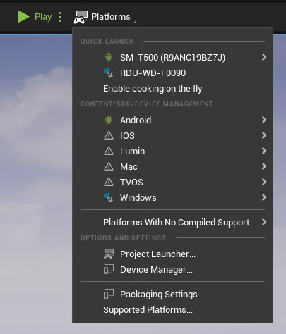
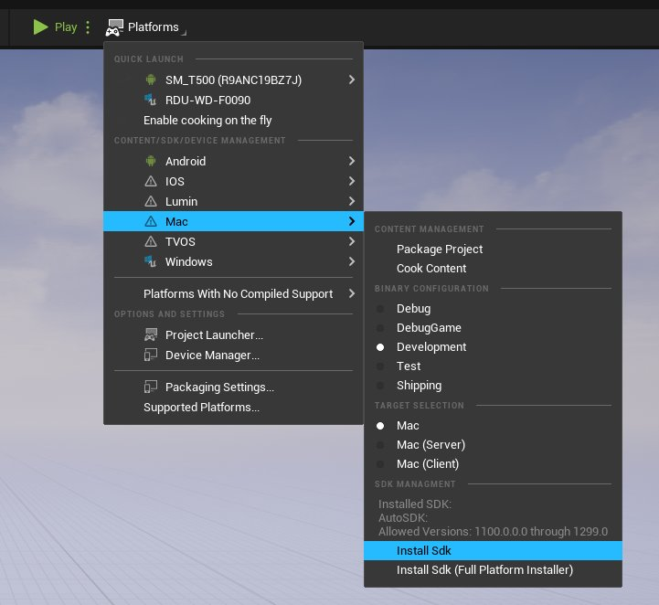
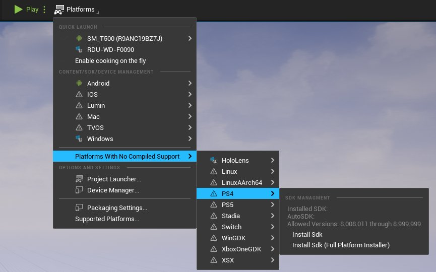
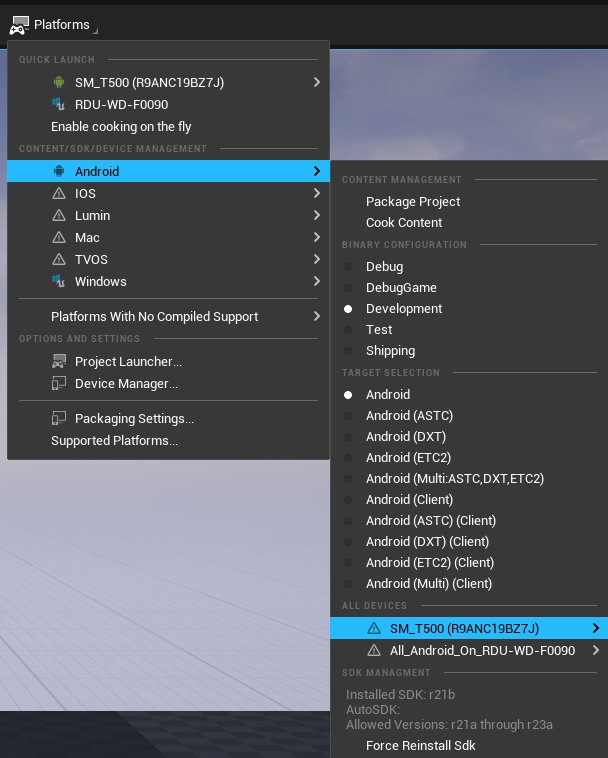
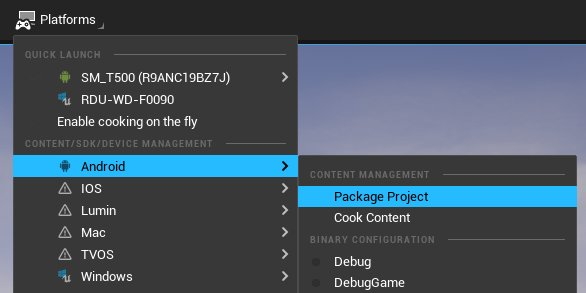
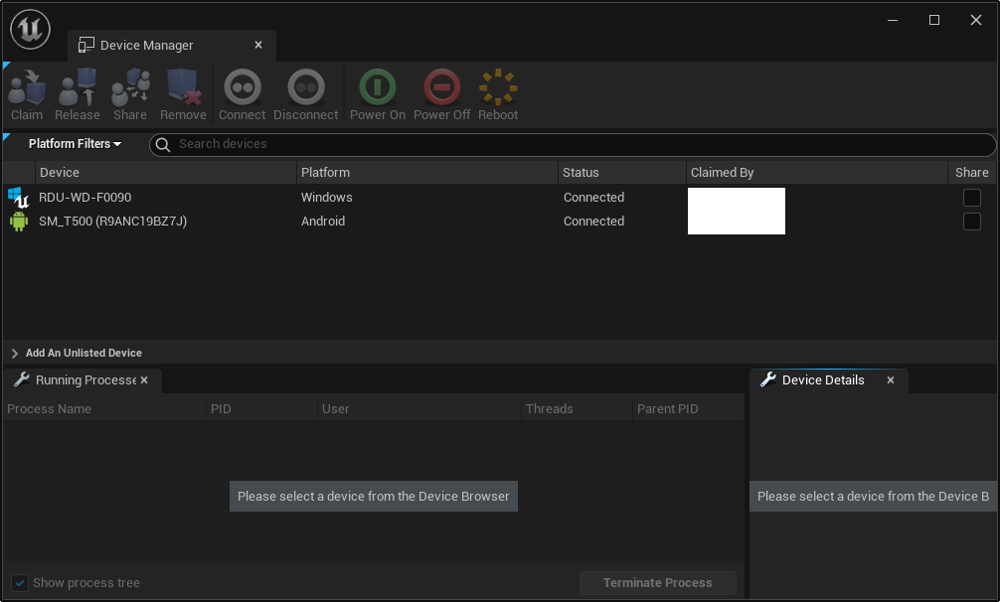
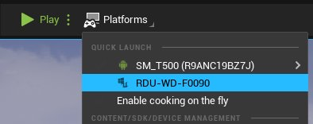
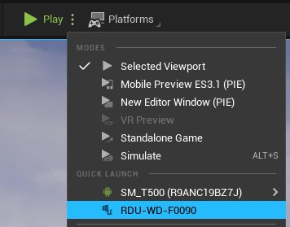

# 在虚幻编辑器中管理平台

> 路径：虚幻引擎5.7文档 / 建立你的开发流程 / 虚幻Turnkey / 在虚幻编辑器中管理平台

> 原始页面：https://dev.epicgames.com/documentation/unreal-engine/using-the-platforms-dropdown-in-unreal-editor

**虚幻编辑器（Unreal Editor）** 现在在工具栏中专门提供了一个 **平台（Platforms）** 下拉菜单。此下拉菜单允许你访问 **Turnkey** 平台支持系统并且快速安装和更新SDK，或者在设备上打开和测试项目。

此页面为可以通过此菜单使用的工具提供了参考。

> [!TIP]
> 其中的编辑器功能可以访问的系统与[Turnkey命令行](../using-the-turnkey-commandline/index.md)中的相同。

## 准备工作

如需通过平台（Platforms）菜单安装SDK，你的组织必须先在一个文件仓库中存放平台对应的SDK文件，而且你必须提供一个指向该仓库的有效TurnkeyManifest XML文件。如需详细了解如何在仓库中准备文件，请参阅[为你的组织设置Turnkey](../setting-up-turnkey-for-your-organization/index.md)。

## 安装和管理SDK

项目支持的平台都会显示在平台（Platforms）下拉菜单的 **Content/SDK/Device Management** 部分中。如需安装SDK，请导航到你要安装SDK的平台的菜单条目，然后点击 **安装Sdk（Install Sdk）**。

如果你需要的平台未显示在此列表中，请导航到 **缺少编译支持的平台（Platforms With No Compiled Support）**，其中会列出所有受支持但尚未为设置SDK的平台。

选择 **安装Sdk（Install Sdk）** 会启动Turnkey并启动所选SDK的下载和安装流程。**首选完整版（Prefer Full）** 将优先选择进行完整SDK安装。**首选简易版（Prefer Minimal）** 将首选最简化的SDK安装，例如用于测试目的的Flash SDK。

> [!NOTE]
> 根据你安装的SDK，可能会出现额外的提示来要求设置特定的SDK组件，例如Android Studio。

你可以通过查看平台的 **SDK管理（SDK Management）** 部分来检查SDK状态，这将显示你当前的SDK，还会显示你的平台兼容的SDK的范围。你可以在设备平台的子菜单中检查单个设备的SDK状态。找到 **所有设备（All Devices）** 部分并突出显示条目，以便于设备显示此信息。

## 打包项目

要打包一个项目，请点击编辑器中的 **平台（Platforms）** 下拉菜单，然后找到项目的目标平台，点击 **打包项目（Package Project）**。这将显示一个对话框，提示你保存已打包的项目，然后在你选择要保存到的目录时启动打包流程。

你可以使用平台子菜单中的设置来更改生成目标和二进制配置。

要配置打包设置，你可以点击平台下拉菜单中的 **打包设置（Packaging Settings）** 或者打开 **项目设置（Project Settings） > 打包设置（Packaging Settings）**。

## 设置目标设备

如果点击下拉菜单中的 **设备管理器（Device Manager）**，会打开设备管理器窗口。

此窗口会显示你的本地网络中识别出的设备以及开发人员工具包，包括连接到计算机的可兼容移动设备。你可以使用此菜单来声明、发布或共享设备。只有你已经声明的设备才会显示在 **项目启动程序（Project Launcher）** 中。此外，你还可以使用此菜单来开启或关闭、重启或连接/断开设备，从而对设备进行远程控制。

选中设备后，只要设备支持进程快照，**正在运行的进程（Running Processes）** 选项卡会显示设备正在运行的进程以及资源加载情况。此外，**设备详细信息（Device Details）** 选项卡会列出该设备上有哪些功能可用。

## 在设备上启动项目

"平台"（Platforms）下拉菜单有一个 **快速启动（Quick Launch）** 分段，你可以点击此处列出的设备，使用默认设置在设备上立即安装和启动项目。

此外，还可通过下拉菜单中的 **运行（Play）** 按钮找到快速启动选项。

### 项目启动程序

在处理复杂案例时，你还可以点击 **平台（Platforms）** 下拉菜单中的 **项目启动程序（Project Launcher）** 按钮来打开 **项目启动程序（Project Launcher）** 窗口。

> 图片已省略：使用项目启动程序窗口

此菜单会显示你使用设备管理器设置的所有设备；你可以配置启动设备时采用的配置文件。默认情况下显示 **变体（variant）** 字段，但点击 **高级（Advanced）** 按钮会显示项目配置和烘焙设置。利用 **自定义启动配置文件（Custom Launch Profiles）** 菜单，你可以设置打包和部署的具体选项，以便用于更加特殊的高级用例。

> 图片已省略：在项目启动程序窗口中创建自定义配置文件
