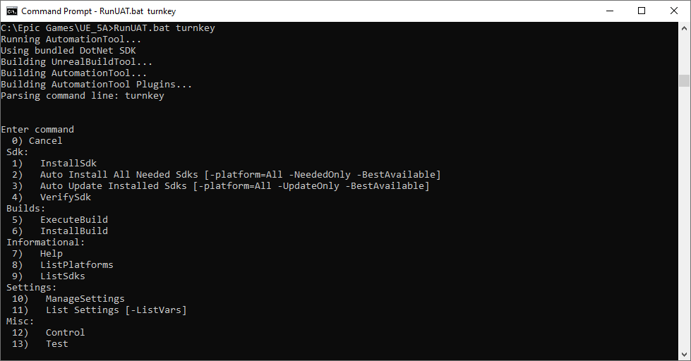
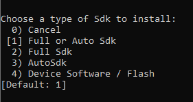
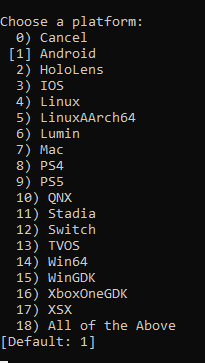
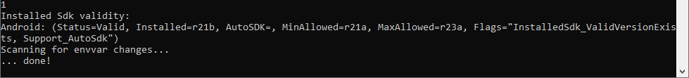
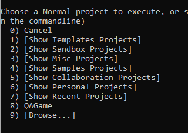
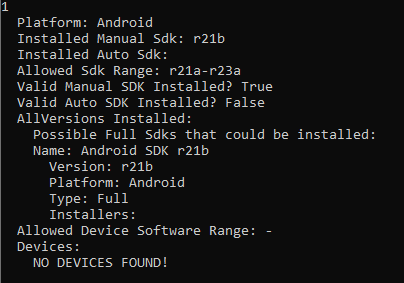
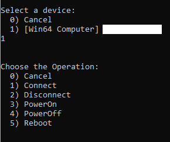
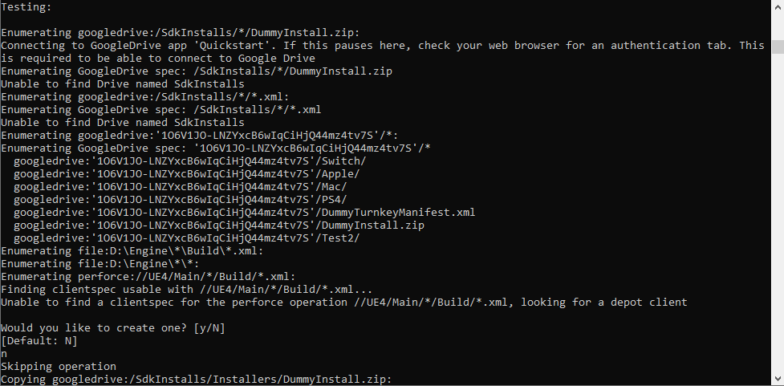

# 使用Turnkey命令行

> 路径：虚幻引擎5.7文档 / 建立你的开发流程 / 虚幻Turnkey / 使用Turnkey命令行

> 原始页面：https://dev.epicgames.com/documentation/unreal-engine/using-the-turnkey-commandline-for-unreal-engine

**Turnkey** 是 **Unreal AutomationTool (UAT)** 脚本，可以通过 `RunUAT.bat` 进行访问。虽然虚幻编辑器提供了足够的工具来使用Turnkey，但命令行允许用户以更详细、高级的方式来管理SDK。本指南将介绍如何使用Turnkey命令行，并对各个选项进行说明。

## 访问Turnkey命令行

要使用命令行访问Turnkey，请按照以下步骤进行操作：

1. 打开你选择的命令行，例如Windows命令提示符。
2. 导航到虚幻引擎安装目录。
3. 输入 `RunUAT.bat turnkey` 即可运行Turnkey。

命令行将花费一些时间来构建AutomationTool，然后启动Turnkey脚本并显示带有编号的命令列表。



在此菜单中，输入命令对应的编号并按回车键即可运行该命令。其中的大部分命令都将显示子菜单，并提供特定于该命令的额外选项。

在所有菜单中，输入 **0** 将取消当前操作。如果选择在子菜单中取消，将导退回主Turnkey菜单；如果在主菜单中取消，将停止脚本并退出。下文列出了其他可用的命令及其子菜单。

### 使用Turnkey命令行参数

此外，在运行 `.bat` 文件时，你可以添加一些指示符来跳过这些提示界面，直接运行命令。使用参数 `-command=[command name]` 来选择一个命令，然后提供其他指示符来处理其他选项。

例如，以下输入将运行 InstallSdk 命令，并将平台设置为Android：

```
	`RunUAT.bat turnkey -command=InstallSdk -platform=Android` 
```

如需了解每个命令的可用指示符，请参阅下面的部分。

## 安装SDK

在使用 `InstallSdk` 命令时，Turnkey将提示你选择要安装哪种类型的SDK。



选项如下：

1. `Full or Auto Sdk` 将尝试安装AutoSDK或Full SDK，并且如果可用，将选择AutoSDK。
2. `Full Sdk` 将下载可供项目使用的Full SDK，其中包含完整的组件数组。
3. `AutoSdk` 将尝试安装AutoSDK（如果可用）。
4. `Device Software / Flash` 将下载可供项目使用的最合适的Flash SDK，其中仅包含用于flash开发人员工具包和测试的必要组件。

如果Turnkey未找到你选择的SDK类型，将放弃操作并抛出错误。

选择你的SDK类型之后，Turnkey还会提示你选择要安装哪个平台的SDK。



输入平台对应的编号，Turnkey就会启动该平台SDK的下载和安装流程。如果没有SDK可用，流程将终止并返回错误消息，然后回到主菜单。

### 指示符

在命令行中使用 `-command=InstallSdks` 时，以下指示符（specifier）兼容。

| 指示符 | 说明 |
| --- | --- |
| `-Platform=` | 选择一个平台。使用窗口中显示的平台名称来选择平台。例如，`-Platform=Win64` 是有效选项，而 `-Platform=Windows` 不是。在使用此指示符时，将会跳过平台选择子菜单。 -Platform=All将在所有可用平台中迭代。 |
| `-NeededOnly` | 指示Turnkey应该寻找AutoSDK作为SDK类型。 |
| `-BestAvailable` | 指示Turnkey应该寻找Full SDK作为SDK类型。在与-NeededOnly结合使用时，它将查找Full SDK或AutoSDK。 |
| `-UpdateOnly` | 指示Turnkey应该更新已安装的SDK，而不是执行完整安装。 |

`Auto Install All Needed SDKs` 命令使用 `-command=InstallSdk -Platform=All -NeededOnly -BestAvailable` 等指示符来运行Turnkey。这等同于选择Full或Auto SDK并为平台选择 **以上全部（All of the Above）**。

`Auto Update Installed Sdks` 命令将使用指示符 `-command=InstallSdk -Platform=All -UpdateOnly -BestAvailable` 来运行Turnkey。

## 验证SDK

VerifySdk命令将提示你选择要验证哪个平台的SDK。Turnkey随后将输出与当前SDK安装有关的信息，并检查它是否与虚幻引擎预期的参数匹配。



### 指示符

`-command=VerifySdk` 与 `-Platform=` 指示符兼容。

## 执行构建命令

`ExecuteBuild` 命令为选定的平台构建项目。选择此选项将打开目标平台列表，随后显示另一个提示，此提示中将列出可以构建的项目。



项目基于识别出的 `.uproject` 名称。例如，`ShooterGame` 显示为示例项目。选择你的平台和项目会后，Turnkey将为项目启动烘焙和打包流程。

### 指示符

`-command=ExecuteBuild` 与 `-platform=` 指示符兼容。还可以使用 `-project=` 指示符来选择一个通过识别的项目名称，然后跳过选择步骤。例如，以下命令会尝试为Win64平台生成ShooterGame：

```
	`RunUAT.bat Turnkey -command=ExecuteBuild -platform=Win64 -Project=Shootergame`
```

## 安装项目

> [!NOTE]
> 在UE5抢先体验版中，使用Turnkey安装项目的功能仍在开发中；我们将会在正式版中提升该功能的可靠性。

`InstallBuild` 命令会打开一个包含已创建项目的列表（这些项目可以安装到设备上）以及一个连接到当前电脑的有效设备列表。确定了这两个选项后，Turnkey会将你的项目安装到选定设备上。

### 指示符

`-command=InstallBuild` 与 `-platform=` 指示符兼容。它还可以使用 `-device=` 指示符。设备的格式是[平台类型]@[设备名称]，其中平台类型是Turnkey识别出的平台，设备名称是计算机可以看到的设备的ID。例如：-device=Android@ABCXYZ123。你可以使用ListPlatforms来查看设备及其ID的列表。

## 帮助

`Help` 命令可打开帮助菜单，提供关于设置Turnkey的信息。这包括如何对 `TurnkeyManifest.xml` 中的FileSource条目进行格式化，以及某些平台的特定版本设置格式。

## 列出平台信息

`ListPlatforms` 命令会列出与选定平台的SDK和设备设置有关的信息。这包括与你当前的虚幻版本兼容的SDK版本以及网络中可见的设备有关的信息。



### 指示符

`-command=ListPlatforms` 与 `-platform=` 指示符兼容。

## 列出SDK

`ListSdks` 命令将输出FileSource仓库中可用的SDK的列表。Turnkey将提示你选择需要为哪个平台列出SDK。

### 指示符

`-command=ListSdks` 与 `-platform=` 指示符兼容。

## 管理设置

`ManageSettings` 命令将显示你可以配置的一系列变量。这些变量与你的组织的副本提供程序设置和特定平台的凭证有关。这些变量通常位于多个不同的文件中，例如 `MobileProvision.ini` 或 `TurnkeyStudioSettings.xml` 文件，但此命令提供一个集中的位置来重载它们。

### 指示符

`-command=ManageSettings` 与 `-ListOnly` 指示符兼容。该命令会列出所有可以配置的变量，以及各自的功能说明。Turnkey菜单中的 `List Settings` 命令等同于运行 `-command=ManageSettings -ListOnly`。

## 控制设备

`Control` 命令将打开一个可以用于远程控制设备的菜单。选择一个平台之后，它将显示计算机可见的与该平台匹配的所有设备。



然后你可以打开或关闭、重启或连接/断开设备。此功能是与虚幻编辑器中的[设备管理器](../using-the-platforms-dropdown-in-unreal-editor/index.md#settinguptargetdevices)相同的功能。

## 测试Turnkey

`Test` 命令会运行一个诊断测试来检查你的环境是否正确设置。测试会尝试连接到s你选择的副本提供程序（copy provider），并检查所需的目录。如果该进程的任何部分失败，都会报告错误。


