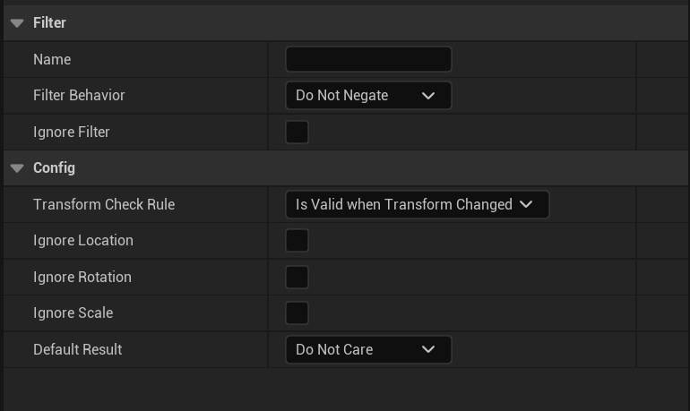
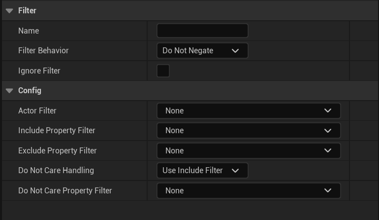
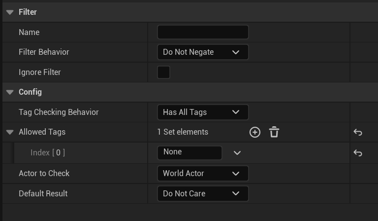
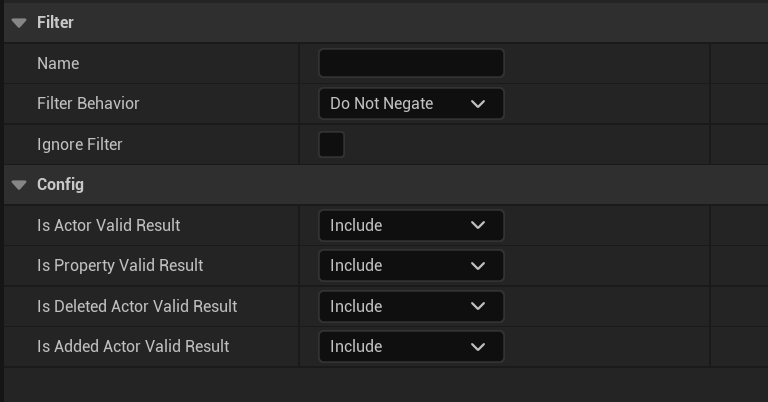
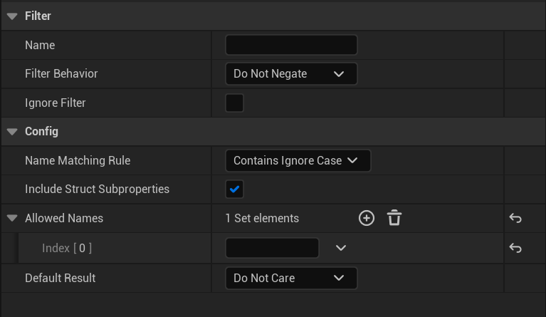
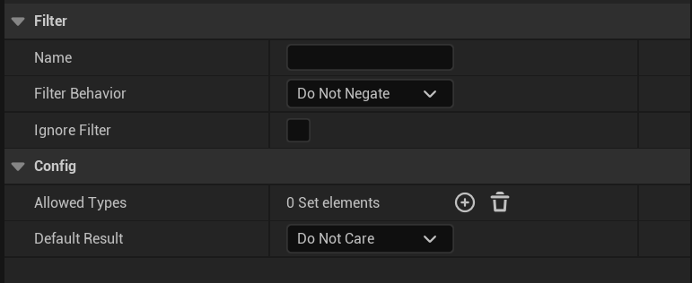
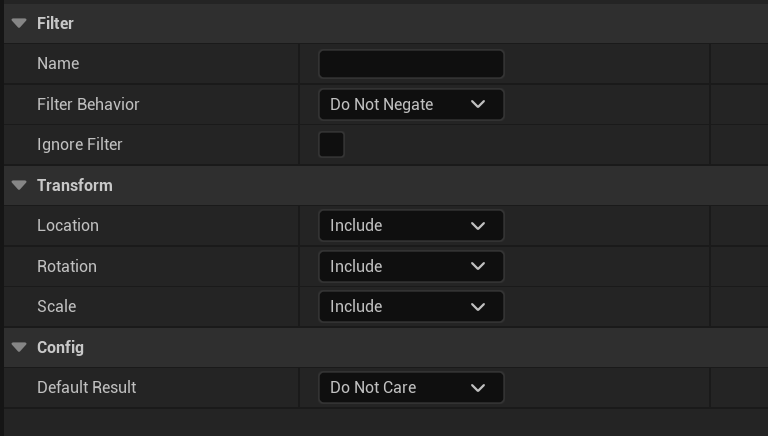

# 关卡快照筛选器参考

> 路径：虚幻引擎5.7文档 / 建立你的开发流程 / 虚幻引擎中的协作和版本控制 / 关卡快照 / 关卡快照筛选器参考

> 原始页面：https://dev.epicgames.com/documentation/unreal-engine/level-snapshot-filter-reference-for-unreal-engine

此处仅描述了默认C++筛选器的属性。使用蓝图创建的自定义筛选器可以拥有你指定的任何属性。

## 共享筛选器属性

| 属性名称 | 说明 |
| --- | --- |
| 筛选器 |  |
| 名称 | 编辑器中的显示名称。如果留空，将默认为类名。 |
| 筛选器行为 | 确定是直接传递筛选器的结果，还是将其取反。 |
| 忽略筛选器 | 确定是否忽略筛选器。 |
| 配置 |  |
| 默认结果* | 选项包括： 包含（Include）：包含Actor/属性。 排除（Exclude）：排除Actor/属性。 无所谓（Do Not Care）： 其他筛选器将决定（Another filter will decide）。如果所有筛选器都设置为"无所谓"，那么包含Actor/属性。 用于仅实现一个函数的筛选器：IsActorValid或IsPropertyValid。 |

* 此属性未被每个筛选器共享。

## Actor更改了变换筛选器属性

| 属性名称 | 说明 |
| --- | --- |
| 配置 |  |
| 变换检查规则 | 确定是允许改变了位置的Actor，还是保持在同一位置的Actor。 选项： 在变换更改时有效：在快照和世界Actor有不同变换时返回True。 在变换保持不变时有效：在快照和世界Actor有相同变换时返回True。 |
| 忽略位置 | 如果启用，那么不比较Actor的位置。 |
| 忽略旋转 | 如果启用，那么不比较Actor的旋转。 |
| 忽略缩放 | 如果启用，那么不比较Actor的缩放比例。 |

## Actor从属属性筛选器属性

> [!NOTE]
> 此筛选器很复杂，并且基于其他筛选器。它旨在用于经验丰富的用户，应小心使用。

| 属性名称 | 说明 |
| --- | --- |
| 配置 |  |
| Actor筛选器 | 在此筛选器上运行了IsActorValid。在依赖于此筛选器的以下某个筛选器上运行了IsPropertyValid。从下拉列表中选择筛选器，并相应配置其属性。 |
| 包含属性筛选器 | 在ActorFilter > IsActorValid返回Include时由IsPropertyValid使用。从下拉列表中选择筛选器，并相应配置其属性。 |
| 排除属性筛选器 | 在ActorFilter > IsActorValid返回Exclude时由IsPropertyValid使用。从下拉列表中选择筛选器，并相应配置其属性。 |
| 无所谓处理 | 确定在IsActorValid返回DoNotCare时IsPropertyValid应该使用什么筛选器。 选项： 使用包含筛选器：IsActorValid返回Include时，使用RunOnIncludedActorFilter。 使用排除筛选器：IsActorValid返回Exclude时，使用RunOnExcludedActorFilter。 使用无所谓筛选器：IsActorValid返回DoNotCare时，使用RunOnDoNotCareActorFilter。 |
| 无所谓属性筛选器 | 在ActorFilter > IsActorValid返回DoNotCare并且DoNotCareHandling == UseDoNotCareFilter时由IsPropertyValid使用。从下拉列表中选择筛选器，并相应配置其属性。 |

## "Actor有标签"筛选器属性

| 属性名称 | 说明 |
| --- | --- |
| 配置 |  |
| 标签检查行为 | 确定如何匹配每个Actor中允许的标签。 选项： 有所有标签：Actor必须有所有标签才能通过。 有任意标签：Actor必须有至少一个标签才能通过。 |
| 允许的标签 | 要对其检查Actor的标签。该属性是包含多个元素的集合，这些元素是标记的文本字符串。 |
| 要检查的Actor | 确定要在哪个Actor上检查标签。 选项： 世界Actor：仅检查世界Actor的标签。 快照Actor：仅检查快照Actor的标签。 两者：检查两组Actor的标签。 |

## 常量筛选器属性

| 属性名称 | 说明 |
| --- | --- |
| 配置 |  |
| Actor是有效结果 | 选项： 包含（Include） 排除（Exclude） 无所谓（Do Not Care） |
| 属性是有效结果 | 选项： 包含（Include） 排除（Exclude） 无所谓（Do Not Care） |
| 已删除的Actor是有效结果 | 选项： 包含（Include） 排除（Exclude） 无所谓（Do Not Care） |
| 已添加的Actor是有效结果 | 选项： 包含（Include） 排除（Exclude） 无所谓（Do Not Care） |

## "属性有名称"筛选器属性

| 属性名称 | 说明 |
| --- | --- |
| 配置 |  |
| 名称匹配规则 | 如何将属性名称与允许的名称作比较。 选项： 精确包含：名称必须包含输入子字符串（区分大小写）。 包含（忽略大小写）：名称必须包含输入子字符串（不区分大小写）。 精确匹配：名称必须匹配输入子字符串（区分大小写）。 匹配（忽略大小写）：名称必须匹配输入子字符串（不区分大小写）。 |
| 允许的名称 | 要对其检查该属性的名称。该属性是包含多个元素的集合，这些元素是名称的文本字符串。 |

## 属性类型筛选器属性

| 属性名称 | 说明 |
| --- | --- |
| 配置 |  |
| 允许的类型 | 你希望允许的属性类型。该属性是包含多个元素的集合，这些元素是类型的文本字符串。 |

## 变换属性筛选器属性

| 属性名称 | 说明 |
| --- | --- |
| 变换 |  |
| 位置 | 选项： 包含（Include） 排除（Exclude） 无所谓（Do Not Care） |
| 旋转 | 选项： 包含（Include） 排除（Exclude） 无所谓（Do Not Care） |
| 缩放 | 选项： 包含（Include） 排除（Exclude） 无所谓（Do Not Care） |
