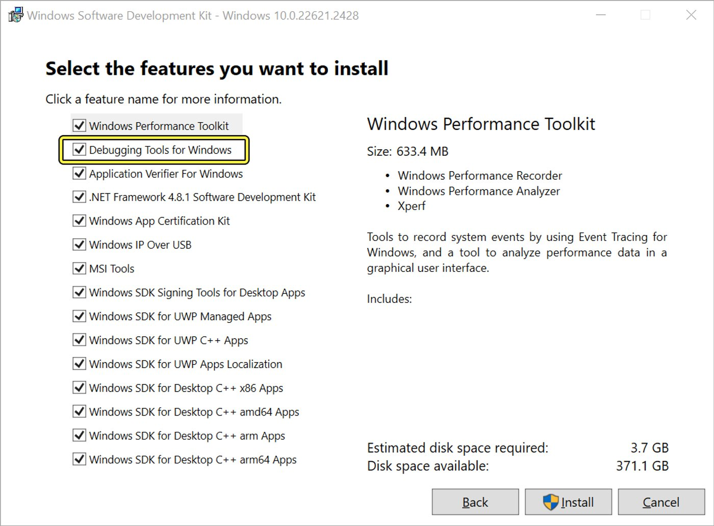
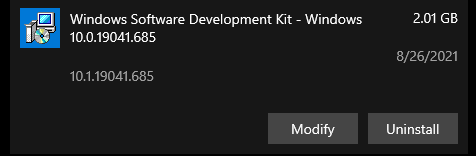
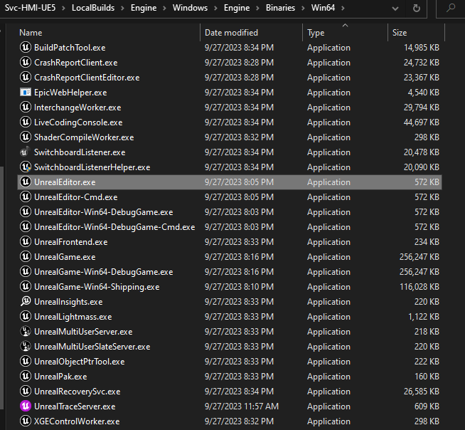
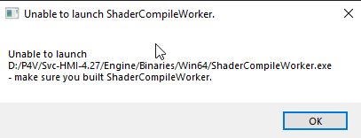

# 创建已安装构建

> 路径：虚幻引擎5.7文档 / 建立你的开发流程 / 部署虚幻引擎 / 创建已安装构建

> 原始页面：https://dev.epicgames.com/documentation/unreal-engine/create-an-installed-build-of-unreal-engine

操作系统

Windows

从下拉菜单中选择一个选项以查看与之相关的内容

与团队合作处理**虚幻引擎（UE）**项目的源构建时，部分团队成员可能不具备[从源编译并运行虚幻引擎](../../../get-started/install/downloading-source-code/building-unreal-engine-from-source/index.md)所需的软件或知识。 在这种情况下，你可以编译虚幻引擎二进制文件，并将其作为**已安装构建**分发给你的团队。 这样创建的包类似于Epic Games启动程序所部署的内容。

关于如何创建 Installed Build 的通用说明，请参阅 [Installed Build 参考指南](../installed-build-reference-guide/index.md)。本页为使用以下内容的开发者提供额外信息和步骤： **Windows**.

## 先决条件

制作已安装构建之前，确保你满足以下先决条件：

- 一个 [Unreal Engine 源代码构建](../../../get-started/install/downloading-source-code/building-unreal-engine-from-source/index.md).
- [Windows DotNet 6.0 Runtime](https://dotnet.microsoft.com/en-us/download/dotnet/6.0/runtime?cid=getdotnetcore&os=windows&arch=x64).
- Windows 10 SDK 的 Windows Debugging Tools 组件（仅 Windows 10，见下文）。

### 推荐硬件

我们推荐你使用具有高处理器核心/线程数量的计算机进行编译。 虽然UE在单个核心上编译，但使用多核心处理器可以大幅减少编译时间。 如需了解推荐的硬件，请参阅[硬件和软件规格](../../../get-started/install/hardware-and-software-specifications/index.md)。

### Windows 10 SDK（仅 Windows 10 用户）

在 Windows 10 上，需要安装 [Windows 10 SDK 中的 Windows Debugging Tools 组件](https://developer.microsoft.com/en-us/windows/downloads/sdk-archive/)。这会启用 `PDBCopy.exe`，构建流程会使用它剥离符号并优化最终包体大小。

如果尚未安装 Windows 10 SDK，请按以下步骤操作：

1. [从 Microsoft 网站下载并安装 Windows 10 SDK。](https://developer.microsoft.com/en-us/windows/downloads/windows-sdk/).
2. 当看到显示以下文字的对话框时： **选择要安装的功能**，请确保 **Debugging Tools for Windows** 已勾选，然后继续安装。

   
3. 继续安装。

如果已经设置好 Windows 10 SDK，但没有安装 Debugging Tools for Windows，请按以下步骤操作：

1. 打开 **添加或删除程序。**
2. 在可用程序列表中，找到已安装的 Windows Software Development Kit。点击 **修改**.

   
3. 在出现的选项列表中，勾选 **更改** 并点击 **下一步。**
4. 当看到显示以下文字的对话框时： **选择要更改的功能**，勾选 **Debugging Tools for Windows**，然后点击 **更改** 继续安装。

## 制作已安装构建

要在 Windows 上制作 Installed Build，请按以下步骤操作：

1. 重新生成 Unreal Engine 项目文件。

   - 如果尝试重新生成项目文件时遇到错误消息，请再次确认已安装 [Windows DotNet 6.0 runtime](https://dotnet.microsoft.com/en-us/download/dotnet/6.0/runtime) 。
2. 使用 `RunUAT.bat` 创建 installed build。下面是一个用于为 Windows 创建 installed build 的 BuildGraph 命令示例：

   命令行

   C++

   ```
   RunUAT.bat BuildGraph -script=Engine/Build/InstalledEngineBuild.xml -target="Make Installed Build Win64" -nosign -set:GameConfigurations=Development;Shipping -set:WithWin64=true -set:WithAndroid=true -set:WithDDC=false -set:WithLinux=false -set:WithLinuxArm64=false -set:WithIOS=false -set:WithTVOS=false -set:WithMac=false -clean
   ```

   > [!NOTE]
   > 请确保为每个可用平台明确指定是否要添加。如果源代码中还有本文未提到的其他平台，请根据项目需求添加 `-Set:With[Platform]=true` 或 `-Set:With[Platform]=false` ，其中 [Platform] 替换为要添加的平台名称。

   上方示例中使用的参数详情如下：

   | 参数 | 必需或可选 | 说明 |
   | --- | --- | --- |
   | `-target="Make Installed Build Win64”` | 必需 | 指示 BuildGraph 运行特定操作。该依赖图在 script="Engine/Build/InstalledEngineBuild.xml" 中描述，也有其他选项可能更符合你的需求；但就本文而言，示例目标是生成与用户从启动器版本 Unreal Engine 获得的内容相匹配的构建。 |
   | `-set With[Platform]=true` 或 `-set With[Platform]=false` | 必需 | 指定是否要将给定平台支持添加到 installed build，其中 [Platform] 替换为要启用或禁用的平台名称。 **请确保为每个拥有源代码的平台都添加此参数。**关于要启用或禁用哪些平台的详情，请参阅下方“必需平台”章节。 |
   | `-set:GameConfigurations=Development;Shipping` | 必需 | 不同编辑器版本的标志。建议包含 **Development**和 **Shipping**. |
   | `-set WithClient=false` 和 `-set WithServer=false` | 可选 | 指定是否为网络多人项目创建 Client 和 Server 构建。默认为 false。 |
   | `-set WithDDC=false` | 可选 | 指定是否创建包含 [Derived Data Cache](../../using-derived-data-cache/index.md) 支持的构建。默认为 false。 |
   | `-clean` | 推荐 | 对项目执行全新重新编译。如果遇到“Other Compilation Error”消息，请移除此参数。 |

   > [!NOTE]
   > 如果收到“Other Compilation Error”消息，请移除 `-clean` 参数并重试，因为该命令在 Linux 上存在已知问题。
3. 构建 Shader Compiler Worker。

   C++

   ```
   Engine\Build\BatchFiles\Build.bat ShaderCompileWorker Win64 Development
   ```

你的构建会出现在 Windows 目录中，其中包含用于分发的 Feature Packs、Templates 和 Engine。

### 必需平台

在 Windows 上创建 installed build 时，请确保使用 `-With[Platform]` 参数启用以下平台：

| Platform | 参数 | 说明 |
| --- | --- | --- |
| Android | `-set WithAndroid=true` | 支持发布到 Android 所必需；Android 是大多数 HMI 项目的目标平台。 |
| Windows 64 位 | `-set WithWin64=true` | 支持在 Windows 上构建编辑器所必需。 |

禁用所有其他平台，因为运行 Unreal Editor 或打包 HMI 项目都不需要它们。

## 测试已安装构建可执行文件

Installed build 会出现在以下位置下的 LocalBuilds 文件夹中： `LocalBuilds/Engine/Linux/Engine/Binaries/Win64`。在 Windows 操作系统上， `UnrealEditor.exe` 是 Unreal Editor 的主可执行文件。运行该可执行文件以测试构建。



> [!NOTE]
> 首次运行 installed build 时，会出现请求防火墙权限的提示。建议接受这些权限，以获得完整功能。

要归档并分发构建，请将 installed build 放在源码控制仓库的顶层目录中，与 FeaturePacks、Templates 和 Engine 目录并列。

> [!NOTE]
> 
>
> 如果看到“Unable to launch ShaderCompileWorker”提示，或在编译着色器时发生崩溃，说明尚未构建 Shader Compiler Worker。请回到上方“制作 Installed Build”工作流的最后一步。我们单独构建 Shader Compiler Worker，这样每次构建编辑器时就不需要重新构建 Shader Compiler Worker。
