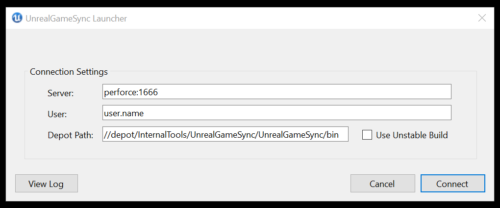
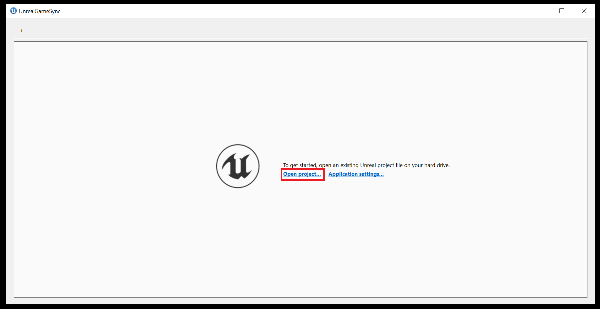
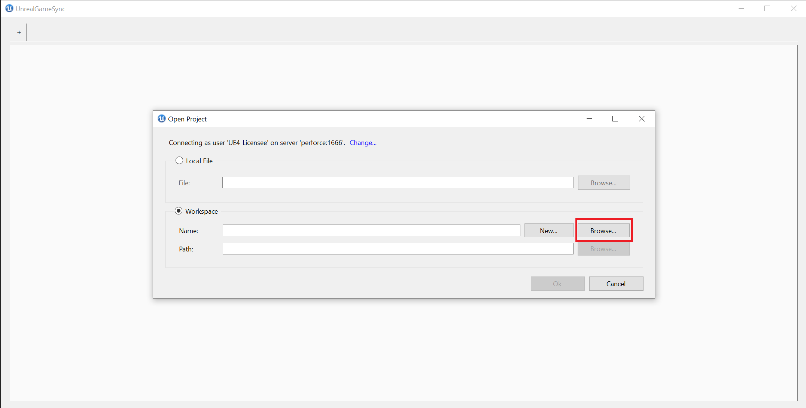
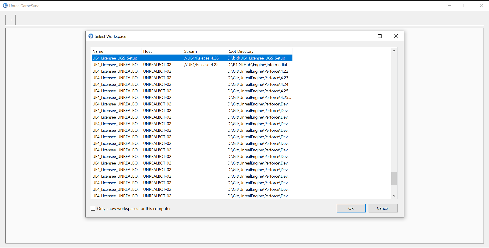
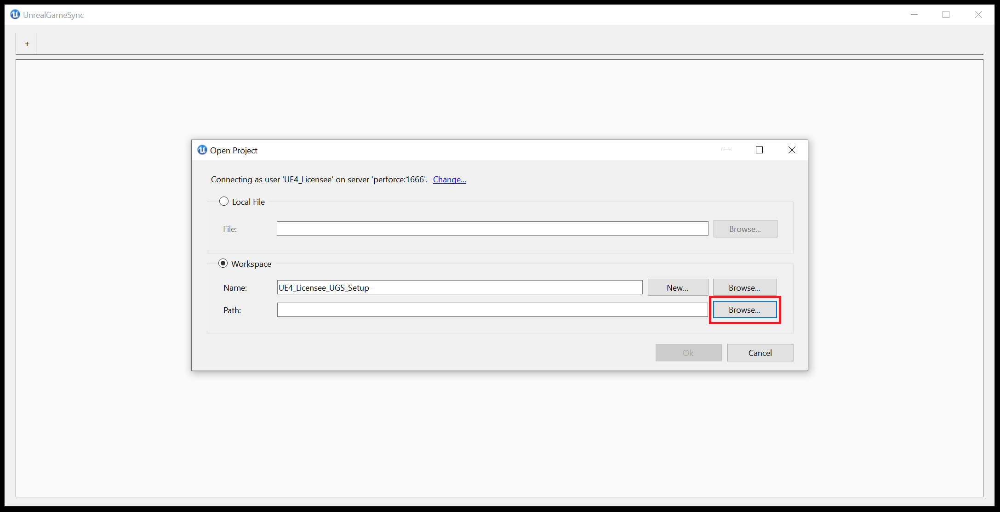
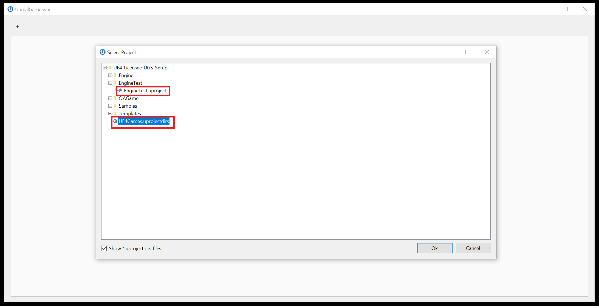
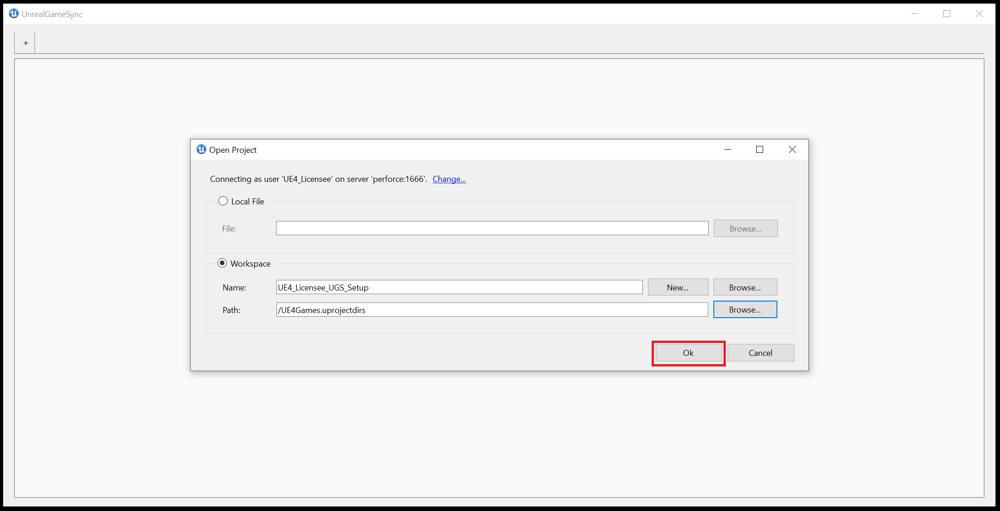
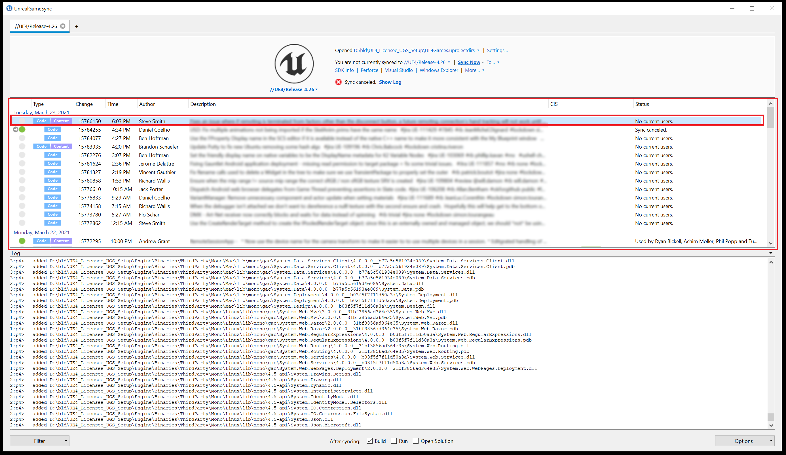

# UGS客户端设置

> 路径：虚幻引擎5.7文档 / 建立你的开发流程 / 部署虚幻引擎 / UnrealGameSync (UGS) / UGS客户端设置

> 原始页面：https://dev.epicgames.com/documentation/unreal-engine/unreal-game-sync-client-setup-for-unreal-engine

本指南将回顾新用户设置 **UnrealGameSync（UGS）客户端** 的最简单方法，但如果你需要更详细的信息或需要使用其他方法，请查看[UGS快速入门](../unreal-game-sync-quick-start-guide/index.md)指南。 本指南还假设你的团队已经设置了自己的Perforce服务器，添加了所有适用的资源和内容文件，在你将要使用UGS的机器上安装了适用的Perforc版本，并且已经将UGS分发到将使用它的用户。

如果你需要其他设置信息，请访问[UGS概述](../index.md)。

1. 在安装UGS之前，请确认你已经[设置Perforce工作空间](../../../collaboration-and-version-control/using-perforce-as-source-control/index.md#%E8%AE%BE%E7%BD%AEperforce%E5%B7%A5%E4%BD%9C%E7%A9%BA%E9%97%B4)，并指向需要同步项目的分支（stream）。工作空间的本地路径要尽可能简短。

   > [!NOTE]
   > Perforce（P4）设置通常由其他具有版本控制系统经验和在 **虚幻引擎（UE）** 中使用Perforce经验的人员完成。如果你在Perforce中查看文件时遇到问题，并具有所有适用的权限，那么可能是因为你使用的Perforce版本已经过期，无法处理我们在Epic工具中使用的现代功能。2020.1已经确认可以与UGS搭配使用，甚至一些更高的版本也可以正常工作。
2. 运行的 **UGS安装程序**，该程序应该由你的工作室中的UGS负责人分发。在运行UGS时，确保你具有管理员权限。
3. 你将在UGS启动时看到此UI：

   

   - 在 **服务器（Server）** 和 **用户（User）** 字段，输入你通过P4V连接时使用的Perforce连接设置。
   - 将 **存储路径（Depot Path）** 设置为你的UGS二进制文件在Perforce上的存储位置。
   - 在确认这些字段与Perforce凭证和UGS二进制文件的位置匹配之后，点击 **连接（Connect）**。
4. 在UGS成功连接到你的Perforce服务器后，你将看到 **入门（Getting Started）** 菜单。点击 **打开项目（Open Project）**。

   
5. 在 **打开项目（Open Project)** 对话框后，点击 **浏览（Browse）**，并找到你在步骤1中设置的工作空间。

   > [!NOTE]
   > 在点击 **打开项目（Open Project）** 之后，就可以安全地按照[UGS快速入门](../unreal-game-sync-quick-start-guide/index.md)指南中详细介绍的[工作空间](../unreal-game-sync-quick-start-guide/index.md#2-%E6%89%93%E5%BC%80%E5%B7%A5%E4%BD%9C%E7%A9%BA%E9%97%B4%E6%96%87%E4%BB%B6)方法来打开项目。 如果你希望改为使用 **本地文件（Local File）** 方法，请参阅[UGS快速入门指南的本地文件部分](../unreal-game-sync-quick-start-guide/index.md#1-%E6%89%93%E5%BC%80%E6%9C%AC%E5%9C%B0%E6%96%87%E4%BB%B6)。此处还使用更新的屏幕截图描述了这些步骤。

   

   

   > [!NOTE]
   > 根据工作空间的设置方式，你可能需要在左下角取消选中"仅针对此计算机显示工作空间"（Only show workspaces for this computer）才能查看工作空间。
6. 现在，你已经选择了之前创建的工作空间，接下来点击 **路径（Path）** 字段旁边的 **浏览（Browse）**，然后选择 `.uprojectdirs` 文件（显示方法为在 **选择项目（Select Project）** 对话框中选择**显示*.uprojectdirs文件**（Show*.uprojectdirs files）），或在该流中的项目之一中选择 `.uproject` 文件。 对于本示例，我们将使用 `.uprojectidirs` 文件，但你也可以轻松选择 `.uproject` 文件。

   

   

   在此之后，将填充 **路径（Path）** 字段，你可以点击 **确定（Ok）** 继续。

   
7. 在继续将所有内容同步到你的机器并构建/运行你的项目之前，查看[UGS同步筛选器设置](../unreal-game-sync-reference-guide/unreal-game-sync-filters/index.md)文档，了解 **同步筛选器** 对你的工作流有什么帮助。

   同步筛选器有助于确保你不会同步任何多余的数据。 例如，如果同一个流中有多个大型项目，那么可以设置筛选器，以便仅同步需要处理的项目。过滤器的功能非常强大，但如果过度使用，可能会带来意外后果。 因此使用筛选器时应该谨慎，如果有任何疑问，请向你的团队中具有同步筛选器使用经验的人员咨询。
8. 打开项目之后，你将看到主菜单，每天的日常工作都应该通过这个菜单来执行。

   > [!NOTE]
   > 有关此菜单的完整概述，请参阅[UGS菜单概述](../unreal-game-sync-menu-reference/index.md)文档。

   双击 **变更列表（Changelists）** 区域中最顶部的变更列表，或点击 **项目概述（Project Overview）** 区域中的 **立即同步（Sync Now）**，可以同步到你的构建的最新变更列表。

   在 **变更列表（Changelists）** 区域中选择 **最新**：

   

   点击 **立即同步（Sync Now）**：

   > 图片已省略：点击立即同步

   > [!NOTE]
   > **目标...（To...）** 列出 **立即同步（Sync Now）** 所同步到的变更列表选项：**最新（Latest）**、**最新良好（Latest Good）** 和 **最新星标（Latest Starred）** 分别指的是绝对最新、最新批准和最新手动标记的版本。
9. 在完成项目同步之后，如果你使用预编译的二进制文件或已经构建了编辑器，应该能够使用 **项目概述（Project Overview）** 区域中的 **Visual Studio** 选项，在Visual Studio打开项目，或在该区域中使用 **虚幻编辑器"（Unreal Editor）** 选项打开项目的编辑器。

   > [!NOTE]
   > 如果在打开编辑器之前尚未构建项目，并且未使用预编译的[二进制文件](../using-precompiled-binaries-in-unreal-game-sync/index.md)，那么可能会收到提示，要求你构建项目。

   > 图片已省略：在Visual Studio或虚幻编辑器中打开项目

   > [!NOTE]
   > 你可以使用窗口底部的 **同步后（After syncing）** 选项，让系统自动执行构建、打开、运行Visual Studio项目。
   >
   > > 图片已省略：同步后选项
