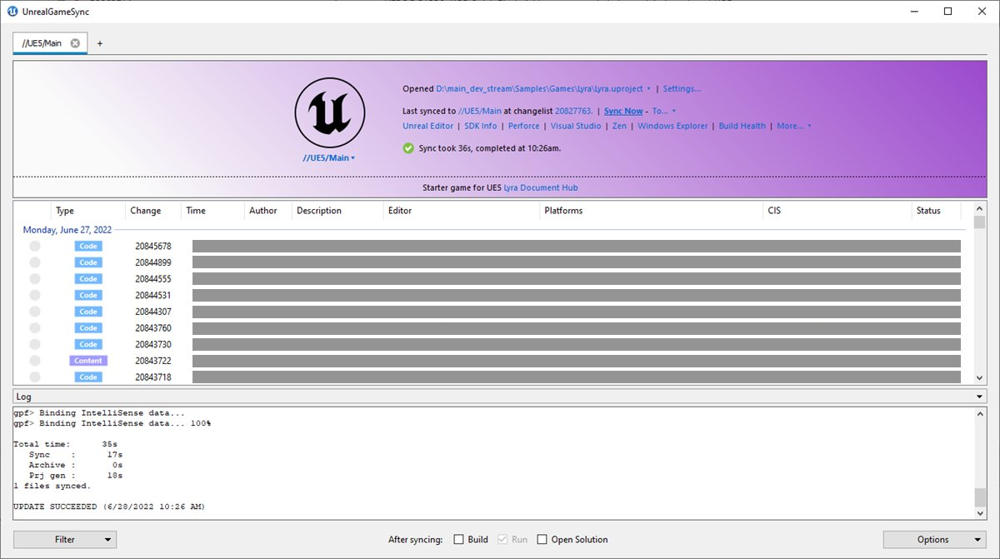
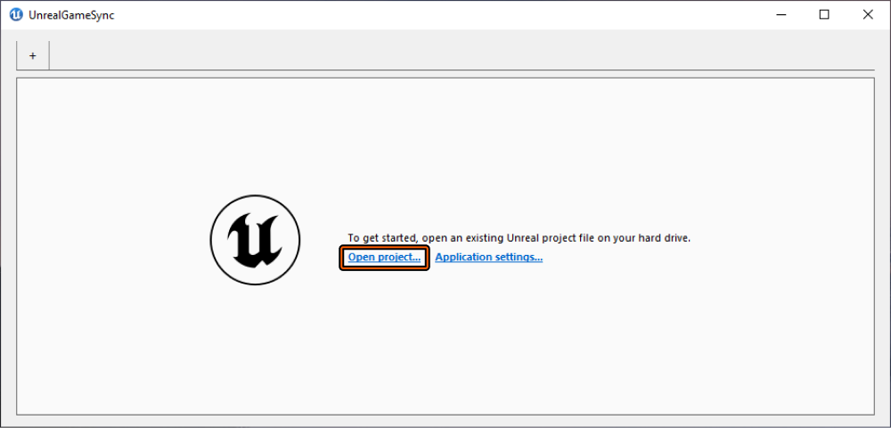
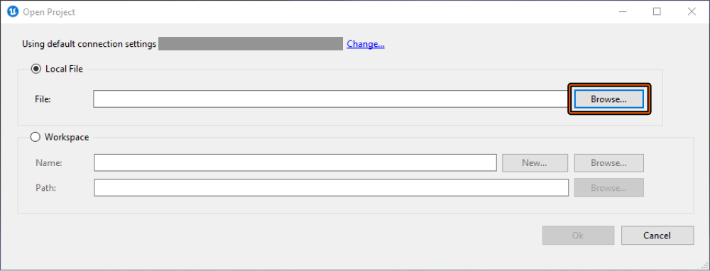
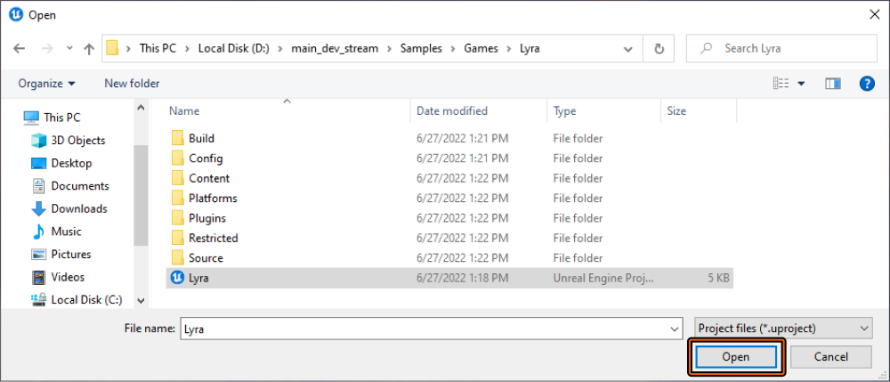
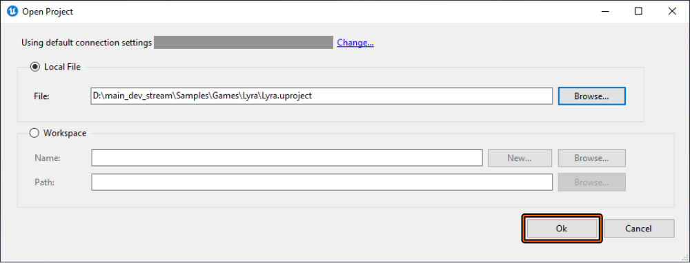
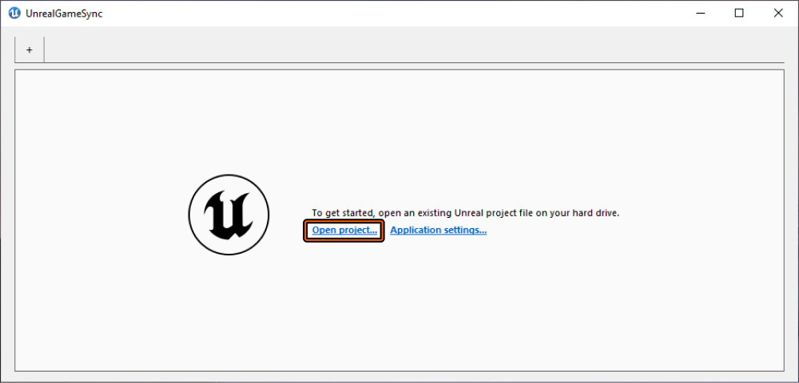
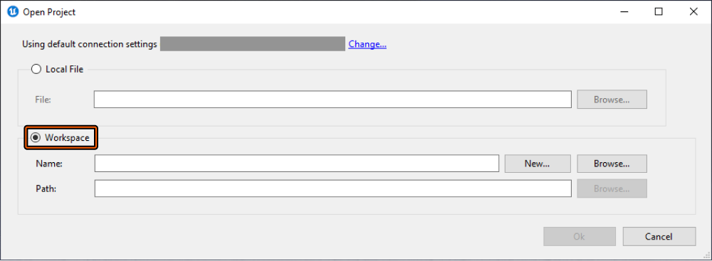
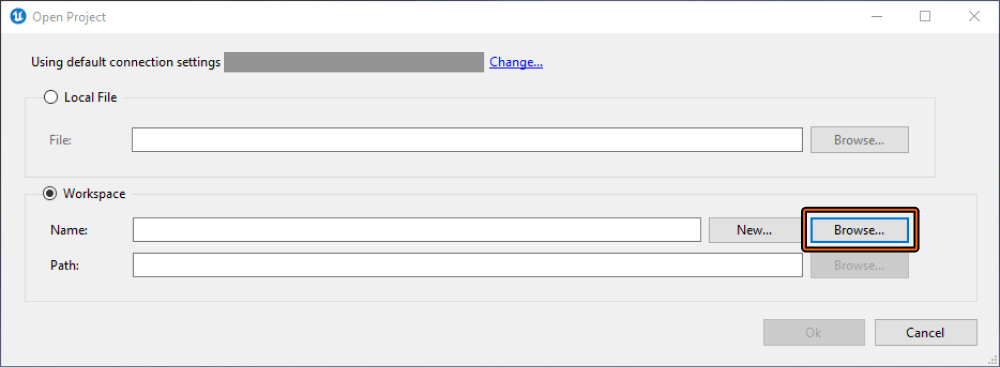

# UGS快速入门

> 路径：虚幻引擎5.7文档 / 建立你的开发流程 / 部署虚幻引擎 / UnrealGameSync (UGS) / UGS快速入门

> 原始页面：https://dev.epicgames.com/documentation/unreal-engine/unreal-game-sync-quick-start-guide

本指南将介绍使用 **UnrealGameSync（UGS）** 同步 **虚幻项目**（`.uproject`）的基本工作流程。学完本教程后，你将了解如何使用UGS打开虚幻项目，以及如何从应用程序主菜单的 **项目概览（Project Overview）** 和 **变更列表区域（Changelist Area）** 进行同步。

> [!NOTE]
> **必要设置：**在下列步骤中，我们假定你的团队已在你的计算机上分发并设置了UGS。

## 1 - 打开本地文件

下列步骤将展示如何使用UGS打开本地虚幻项目文件。

1. 要打开本地驱动器上的 `.uproject`，单击 **打开项目...（Open project...）** 链接。

   
2. 当 **打开项目（Open Project）** 窗口打开时，UGS在默认情况下选中 **本地文件（Local File）** 单选按钮。要选择本地文件，单击 **浏览...（Browse...）** 按钮。

   
3. 浏览至并选择 `.uproject` 文件，然后单击 **打开（Open）**。

   

   > [!NOTE]
   > 我们使用 [Lyra示例游戏](../../../../samples-and-tutorials/sample-game-projects/lyra-sample-game/index.md) 作为示例虚幻项目。
4. 要使用UGS打开虚幻项目，单击 **确定（Ok）** 按钮。

   

## 2 - 打开工作空间文件

下列步骤将展示如何使用UGS打开工作空间虚幻项目文件。

1. 要打开本地驱动器上的 `.uproject` 文件，单击 **打开项目...（Open project...）** 链接。

   
2. 当 **打开项目（Open Project）** 窗口打开时，UGS在默认情况下选中 **本地文件（Local File）** 单选按钮。请选择 **工作空间（Workspace）** 单选按钮，然后继续。

   
3. 需要填充的第一个字段是工作空间的名称。如果已有可将UGS指向的工作空间，单击 **名称:（Name:)** 字段旁的 **浏览...（Browse...）** 按钮。

   

   > [!NOTE]
   > 如果需要创建新工作空间，单击 **新建...（New...）** 按钮来设置新工作空间。
   >
   > > 图片已省略：New Workspace Setup
4. **选择工作空间（Select Workspace）** 菜单打开时，将显示工作空间列表，供你从中选择。请选择 **工作空间**（1）并单击 **确定（Ok）** 按钮 **（2）**。

   > 图片已省略：Select Workspace
5. 现在，单击 **路径：（Path:）** 字段旁的 **浏览...（Browse...）** 按钮。

   > 图片已省略：Open Project window with Workspace field populated
6. 在 **选择项目（Select Project）** 菜单打开后，展开工作空间树，选择 `.uproject` 文件 **(1)**，然后单击 **确定（Ok）** 按钮 **(2)**。

   > 图片已省略：Select Project menu

   > [!NOTE]
   > 我们使用[Lyra示例游戏](../../../../samples-and-tutorials/sample-game-projects/lyra-sample-game/index.md)作为示例虚幻项目。
7. 现在你已指定了 **工作空间（Workspace）****名称（Name）** 和 **路径（Path）**，接下来就可以单击 **确定（Ok）** 按钮，以使用UGS打开虚幻项目。

   > 图片已省略：Open Project window with both Workspace Name and Path selected

## 3 - 从"变更列表区域（Changelist Area）"同步

现在你已使用UGS打开了一个项目，接下来需要使用UGS执行一个常见任务——从 **变更列表区域（Changelist Area）** 同步。

> [!NOTE]
> 确保你已登录 **Perforce**，然后再继续执行下列步骤。

1. 现在你已使用UGS打开项目，在 **主菜单** 中找到 **变更列表区域（Changelist Area）**。

   > 图片已省略：Unreal Game Sync project tab
2. 找到你正在使用的变更，它旁边具有 **箭头图标**。

   > 图片已省略：Project tab with current change indicated by arrow icon
3. 要更新提交到项目流中的另外一个变更，在 **变更列表区域（Changelist Area）** 中双击该变更。

   > 图片已省略：Project tab with another change selected

同步完成后，UGS会更新 **输出日志（Output Log）（3）**、**变更列表区域（Changelist Area）（2）** 和 **项目概览区域（Project Overview Area）（1）**，在下一步骤中，你将从它同步项目。

> 图片已省略：Project tab with new sync finished

## 4 - 从"项目概览区域（Project Overview Area）"同步

现在你已从 **变更列表区域（Changelist Area）** 执行过一次同步，使用UGS打开了一个项目，接下来你需要使用UGS执行另外一个常见任务——从 **项目概览区域（Project Overview Area）** 同步。

1. 首先，在 **主菜单** 中找到 **项目概览区域（Project Overview Area）**。

   > 图片已省略：Project tab with Project Overview Area highlighted
2. 单击 **立即同步 - 至...（Sync Now - To...）** 按钮链接旁的 **向下箭头** 按钮，打开快捷菜单。

   > 图片已省略：Project tab with Sync Now - To... button highlighted
3. 现在，选择 **最新变更（Latest Change）** 选项。

   > 图片已省略：Project tab with Latest Change selected

   > [!NOTE]
   > 有关浏览UGS中内置的界面、选项和菜单的更多信息，请参阅 [UGS参考](../unreal-game-sync-reference-guide/index.md) 指南。

同步结束时，UGS将让你知道你已成功更新到最新 **变更**。

> 图片已省略：ugs-quick-start-step-4-end.png

现在你已学习完本指南，掌握了如何打开项目以及如何从 **变更列表（Changelist）** 和 **项目概览区域（Project Overview Area）** 用户界面同步项目。如果要继续进一步了解UGS，包括如何部署二进制版本的项目或如何查看界面上的所有菜单和选项，请参阅本指南的下一部分。

## 5 - 自己动手！

现在你已打开了项目，使用UGS执行了一些常见的同步方法，请尝试以下操作：

- 选中位于UGS主菜单底部的 **构建（Build）** 和 **运行（Run）** 复选框，以同步、构建并运行虚幻项目。

  > 图片已省略：Unreal Editor opened after selecting Build and Run
- 如果作为开发者，你希望针对无需从源代码编译的创意人员利用预编译二进制文件功能，请通读 [UGS参考](../unreal-game-sync-reference-guide/index.md) 指南，进一步了解如何有关设置构建系统，从而定期向Perforce提交包含编辑器二进制文件的zip文件，以便UGS将它提取到创意人员的工作空间。
