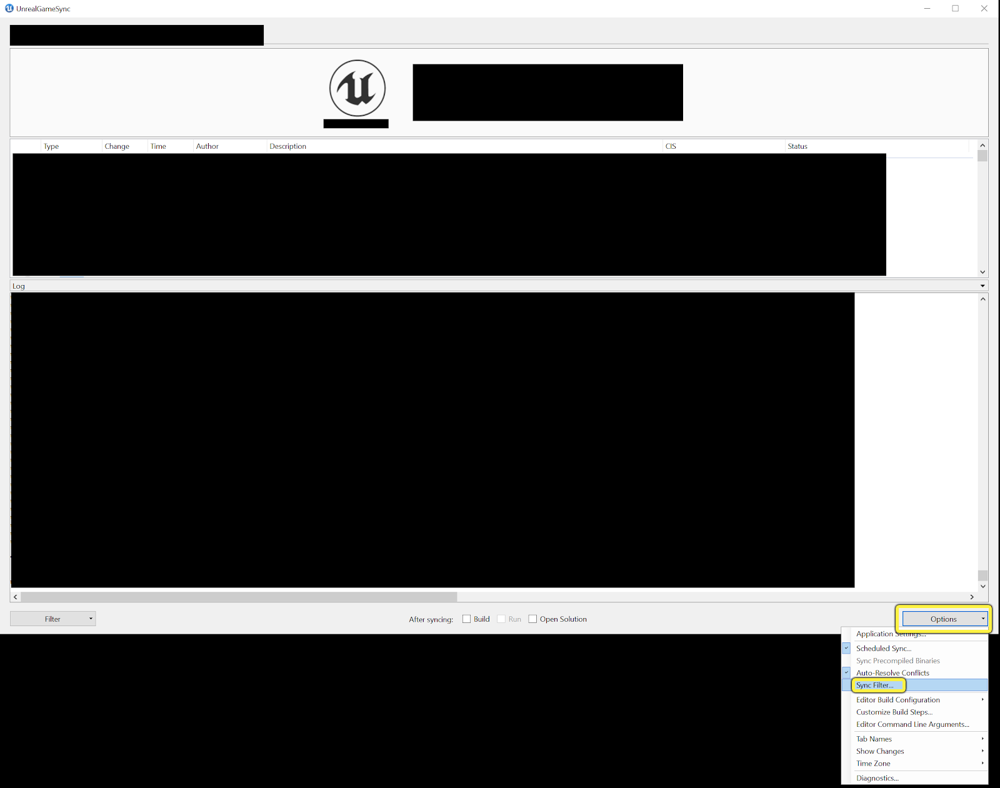
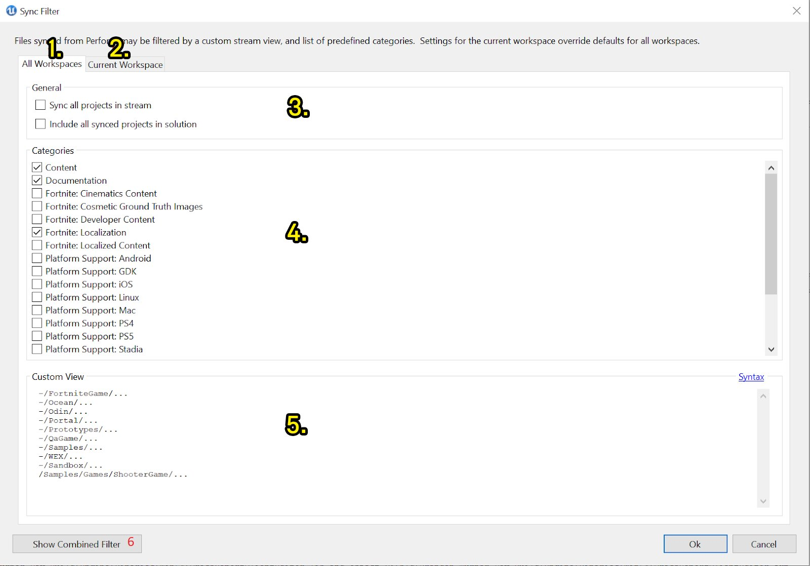
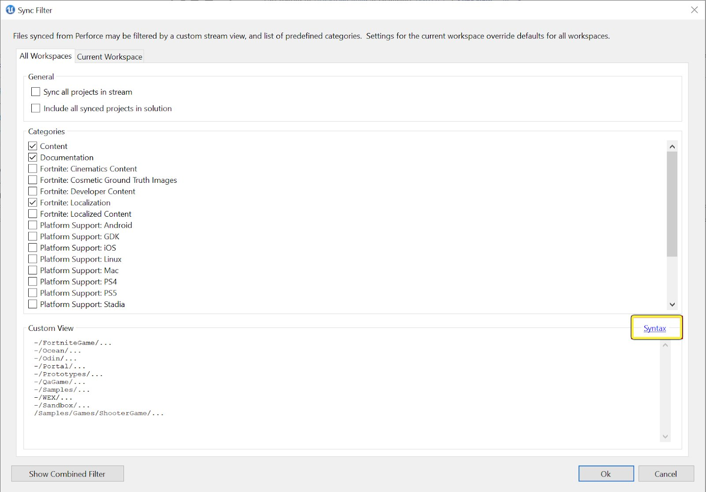

# 同步过滤器

> 路径：虚幻引擎5.7文档 / 建立你的开发流程 / 部署虚幻引擎 / UnrealGameSync (UGS) / UGS参考页面 / 同步过滤器

> 原始页面：https://dev.epicgames.com/documentation/unreal-engine/unreal-game-sync-filters-for-unreal-engine

**同步过滤器（Sync Filters）** 让开发人员可以利用能够通过 **UnrealGameSync (UGS)** 自定义的语法来更新客户端工作区。继续阅读，了解更多有关为UGS设置同步过滤器的信息。

## 用户界面

要访问同步过滤器（Sync Filter）菜单，点击主UGS窗口右下角的 **选项（Options）** 下拉菜单，然后点击 **同步过滤器...（Sync Filter…）**



一旦打开用户界面，注意以下各个选项。



| 元素 | 名称 | 说明 |
| --- | --- | --- |
| 1 | 全局工作区选项卡 | 这些设置将应用至所有工作区，除非有特定工作区发生冲突，则该特定工作区将优先。 |
| 2 | 当前工作区选项卡 | 这些设置将与全局设置搭配使用，任何冲突的设置都将覆盖全局设置。 |
| 3 | 常规设置 | 在利用ugs为此工作区生成解决方案时，**同步流中的所有项目（Sync all projects in stream）** 会同步流的全部内容，**在解决方案中包括所有同步的项目（Include all synced projects in solution）** 将包括任何已同步的项目（和解决方案）。 |
| 4 | 同步类别白名单 | 此处选中的任何内容都会进行同步，否则将被忽略。例如，选中"平台支持：PS4（Platform Support: PS4）" 将使UGS同步PS4平台文件，取消选中 "平台支持：XboxOne（Platform Support: XboxOne）" 将确保XboxOne平台文件不会同步。 |
| 5 | 自定义同步过滤器 | 使用上面的语法或 "语法（Syntax）"按钮后面的模式对话框中标注的语法，在此部分中逐行添加单个自定义过滤器。 |
| 6 | 合并的过滤器 | 点击此按钮将显示你创建的所有过滤器的摘要，包括自定义过滤器、白名单过滤器、默认排除的过滤器（未在类别中选中）和常规设置。 如果需要查看你的过滤器列表的具体外观，请使用此选项。 |

## 自定义过滤器语法

无论是直接编辑 `UnrealGameSync.ini` 还是使用UGS UI，在添加自定义同步过滤器时有一些需要注意的语法。

使用Perforce样式的通配符（每行一个）指定流的自定义视图。

- 所有文件都默认可见
- 要排除与某个模式匹配的过滤器，请在前面加上"-"字符（例如，-/Engine/Documentation/...）
- 模式可以与任何文件片段匹配（例如*.pdb），或者可以溯源至分支（例如/Engine/Binaries/.../*.pdb）

当前工作区的视图将附加到所有工作区共享的视图后面。

如果你不希望再访问此页面，也可以在UGS UI中找到这些语法规则。



## UnrealGameSync.ini

如需查看有关创建和编辑项目特定 `UnrealGameSync.ini` （位于 `[Unreal Project Root Directory]\Build\UnrealGameSync.ini`（并提交到Perforce））的简要说明，请阅读[自定义项目](../index.md#customizingforyourproject)。

### 其他参考信息

一些参考项包括以下补充内容。

#### 同步步骤

同步步骤是在任何同步操作之后运行的，可以包含或不包含后续的编译步骤。同步步骤的一个重要用途是更新自定义版本文件中的已同步变更列表信息。

```
	[Sync]	+Step=(FileName="$(ProjectDir)\\Path\\To\\SyncStep.bat", Arguments="/arg1") 
```

#### 编译步骤

```
	[Build]	+Step=(UniqueId="d9610e2f-7f6f-4898-bc98-d39dd7053d75", Description="Launch Game", StatusText="Launching Game...", EstimatedDuration="5", Type="Other", FileName="$(ProjectDir)\\Build\\BatchFiles\\Launch.bat", Arguments="", bUseLogWindow="False", OrderIndex="5", bNormalSync="False", bScheduledSync="False", bShowAsTool="True") 
```

在添加编译或同步步骤时，可以在上述语法中使用以下信息。

| 属性 | 说明 |
| --- | --- |
| **UniqueId** | 随机生成的GUID。 |
| **OrderIndex** | 升序值，用于确定此步骤在步骤列表中的顺序。 |
| **说明** | UGS UI中的显示内容。 |
| **StatusText** | 执行此步骤时的显示内容。 |
| **EstimatedDuration** | 此步骤将持续的时间（分钟），用于将UGS UI中的进度条推进正确的数量 |
| **Type** | 在创建编译步骤时，它将具有 **编译（Compile）** （默认值） 、**烘焙（Cook）** 或 **其他（Other）** 类型，用于确定哪些属性可供使用。详情请看下面的[类型表](#typestable)。 |
| **bNormalSync** | 如果应该在每个普通（用户发起）的同步中运行步骤，则设置此标记。 |
| **bScheduledSync** | 如果应该在每个计划的同步中运行步骤，则设置此标记。 |
| **bShowAsTool** | 如果步骤应该在UGS状态面板的"更多工具（more tools）"菜单中显示为工具 ，则设置此标记。 |

#### 类型

| Attribute | 说明 |
| --- | --- |
| **类型 - 编译** | **目标（Target）** 是编译步骤的目标名称（例如，"BlankGame"）。 **平台（Platform）** 是编译步骤的平台（例如，"Win64 "或 "Linux"）。 **配置（Configuration）** 是编译步骤的配置（例如，"Debug "或 "Shipping"）。 参数（Arguments）** 是要传递给正在运行的文件或进程的参数。 |
| **类型 - 烘培** | **FileName** 是本步骤要运行的文件的路径，包括文件名。 |
| **类型 - 其他** | **WorkingDir** 是文件运行的目录。 **bUseLogWindow** 启用报告步骤时是否使用日志窗口。 **Arguments** 和 **FileName** 分别与Type - Compile 和Type - Cook 中提到的相同。 |

#### 安全删除文件夹

这是你在运行UGS中的"清理工作区（clean workspace）"工具时可以默认选中的安全路径。

```
	[Default]	+SafeToDeleteFolders=FolderName	+SafeToDeleteFolders=Path/To/FolderName 
```

#### 压缩的二进制文件同步过滤器

如果使用预编译的二进制文件，这些是同步中应排除的文件。

```
	[//UE4/Main/Samples/Games/ShooterGame/ShooterGame.uproject]	ZippedBinariesPath=//UE4/Dev-Binaries/++UE4+Main-Editor.zip	ZippedBinariesSyncFilter=-/FolderToFilter/...
```

> [!NOTE]
> 使用UGS UI中的自定义过滤器所用的相同语法。
