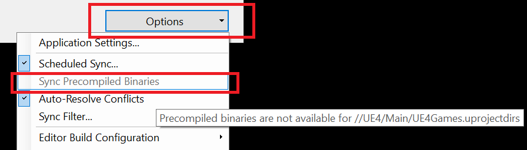
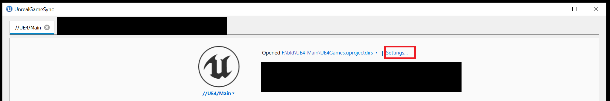
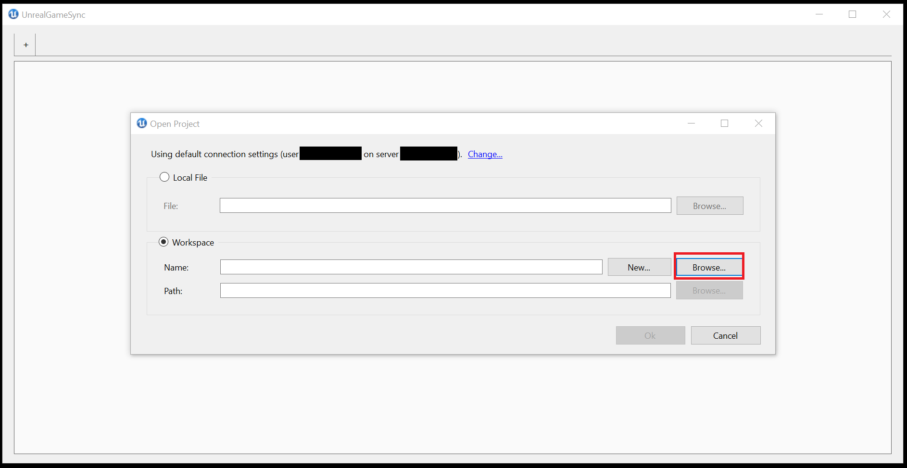
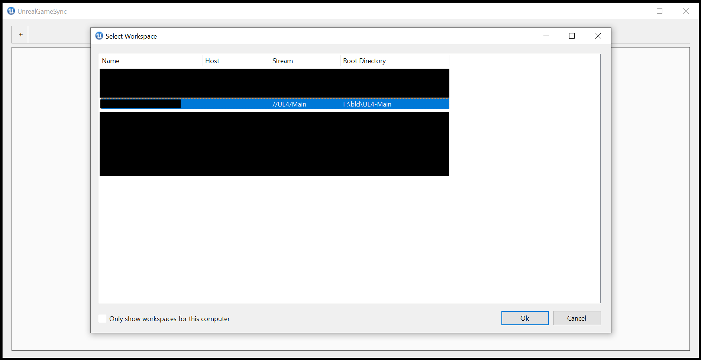
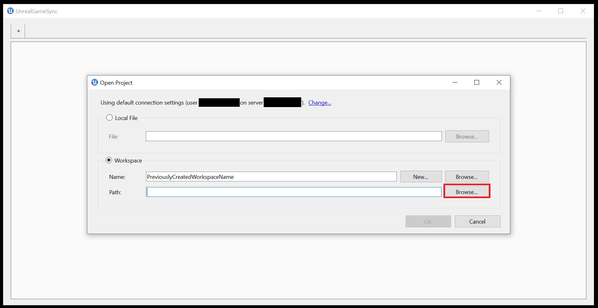
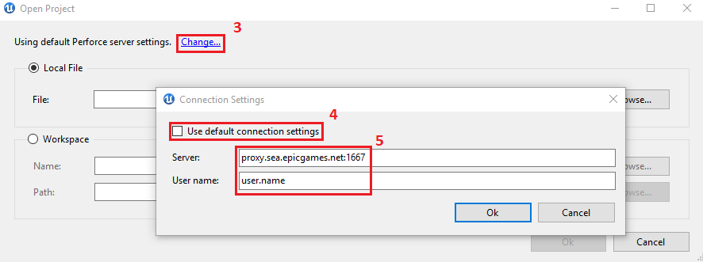

# UGS故障排除

> 路径：虚幻引擎5.7文档 / 建立你的开发流程 / 部署虚幻引擎 / UnrealGameSync (UGS) / UGS故障排除

> 原始页面：https://dev.epicgames.com/documentation/unreal-engine/unreal-game-sync-troubleshooting

对于你在 **Unreal Game Sync（UGS）** 中遇到的很多问题，可能会有提示详细解释为何你认为本应正常运行的选项出现了问题。

## 基本的故障排除

若要向Epic或IT部门提出虚幻游戏同步问题，请提供与你的设置有关的基本信息。这能让你更快地获得更实用的帮助。 示例如下：

- 确定你是否可以在不使用UGS的情况下重现该问题。 通常，与UGS相关的问题不会重现。 例如：

  - 如果出现崩溃，尝试在不使用UGS的情况下打开编辑器。
  - 如果存在Perforce同步问题，尝试仅使用Perforce，而不是通过UGS使用它。
- 如果你在未使用UGS的情况下问题仍然存在，则需要联系负责解决实际所遇问题的团队或部门，以便获得更好的帮助。

  - 确定你是否使用最新版本的UGS。 若要获取版本信息，可以前往 **诊断（Diagnostics）** 菜单（**主页（Main page）> 选项（Options）> 诊断…（Diagnostics…）**），你也可以在 `UnrealGameSync.log` 的 `C:\Users\<user>\AppData\Local\UnrealGameSync\` 中找到版本信息。 这通常是涉及元数据和UGS更新问题的原因。
  - 如果你确定这是UGS专项问题，请先参阅下面的常见问题。

### 编译错误的故障排除

大量编译错误可以通过简单的故障排除步骤解决：

- 确认编译的哪一步失败。例如UnrealHeaderTool、ShaderCompileWorker等。

前往 **项目预览（Project Overview）** 区域，选择 **更多...（More...） > 清理工作空间（Clean Workspace）**，使用UnrealGameSync来清理你的工作空间。之后，尝试重新同步或编译。

- 删除 `UE5.sln`，手动运行 `GenerateProjectFiles.bat` (Windows)或 `GenerateProjectFiles.command` (Mac)，并再次尝试同步或编译。
- 尝试使用Visual Studio或XCode手动编译。
- 尝试同步或编译标记为"良好"（用绿球表示）的变更列表

  - 如果故障仍然存在，请选择 **选项（Options）> 使用增量构建= False（Use Incremental Builds = False）**
  - 尝试重新编译
- 确保禁用 **同步预编译编辑器（Sync Precompiled Editor）**

  > [!NOTE]
  > 仅某些流送可用。
- 确认Perforce中的工作空间配置正确。

  > [!WARNING]
  > 这在很多情况下都有帮助，但不涵盖工作空间中有额外文件的情况。 如果你的工作空间过于复杂而无法管理，你可能需要联系你的IT部门寻求帮助，或者重新制作你的工作空间并为其重新同步数据。

## 具体问题

#### 无法检测到预编译的二进制文件。

- 检测PCB可能需要很长时间。UGS将首先加载所有CL，然后交叉引用它们以便查看可用的PCB。 连接较慢时，这可能需要几分钟，请耐心等待。
- 如果问题仍然存在，可能是由于存储它们的流送存在权限问题，或者由于构建运行状况问题而无法正确创建/上传。 联系你的Perforce管理员并确认你的构建成功上传了预编译二进制文件，并且你有权访问。
- 将鼠标悬停在 **同步预编译二进制文件（Sync Precompiled Binaries）** 上时，显示的提示文本还将提供更多有助于调试此问题的信息：

  

#### 无法连接。

- 这通常是Perforce或本地网络问题。 我们已经在2019.2版本中发现了多个问题，因此建议使用其他版本。 有时，使用P4V重新登录Perforce服务器有助于解决问题。
- 如果在首次设置期间收到以下错误： `Failed to sync application` 并且你的日志中包含以下内容： `Couldn't find last changelist` 请确保将你的 **Depot路径（Depot Path）** 设置为你的Perforce管理员提供的正确Perforce位置，并且路径的格式无误：开头有两个正斜杠，注明Perforce depot，结尾没有正斜杠，如下例中所示： `//depot/path/to/UnrealGameSync/bin` 然后再次点击 **连接（Connect）**。
- 如果一切设置正确，并且你的Perforce版本不是2019.2，你应该联系你的Perforce管理员，确认你有depot路径的访问权限。

#### 因为路径太长导致同步或构建失败

大部分Windows版本的路径限制为260个字符，UGS无法避开这一限制。 事实上，如果UGS检测到超过260个字符的路径，它将完全阻止同步项目。 目前无法在UGS中禁用此检查。

为了解决此问题，你可能需要在更靠近根目录的文件夹中设置你的工作空间（例如 `D:/prj/workspace/`）。 此外，请尝试采用能够最大限度缩短文件名的文件命名结构。

这种方法在很罕见的情况下可能会有用，例如你决定使用 `.uprojectdirs` 文件而非 `.uproject` 文件来同步项目。 此问题可以通过使用 `.uproject` 文件在UGS中设置项目来解决。

1. 选择 **设置（Settings）**

   
2. 针对你所使用的工作空间的 **名称（Name）** 和 **路径（Path）**，选择 **浏览（Browse）**。

   - 工作空间名称：

     

     
   - 工作空间路径：

     
3. 不要按照设置教程中的说明选择 `.uprojectdirs` 文件，而是应该在该流送中选择 `.uproject` 文件。
4. 尝试重新同步。

#### UGS不会自动更新

- **案例1**：这通常是由于机器上的文件争用导致。 可以通过关闭UGS，确认没有正在运行的活动UGS进程，然后删除 `[AppData]/Local/UnrealGameSync/Latest/`（通常包含阻止更新的争用文件）解决该问题。

  如果删除文件夹失败，系统将会显示哪个文件处于争用状态，以及哪个进程因此而受阻。 如果你无法停止该进程，重启应该可以解决该问题，然后你可以删除该文件夹。

  随后，你可以使用UnrealGameSyncLauncher下载最新的更新。

  > [!NOTE]
  > 你可能需要在重新启动之前从启动应用程序中移除UnrealGameSync，删除文件夹，将UGS重新添加到启动应用程序，然后根据你设置UGS的方式重新启动。
- **案例2**：如果用户没有适当的连接，或没有适当的权限查看UGS更新二进制文件所在的Perforce路径，UGS可能会无限期挂起，不允许用户继续。 如果是这种情况，请更新连接设置中的 **Depot路径（Depot Path）**，或与你的Perforce管理员联系，以便获得文件的正确访问权限。

#### 关于"找不到文件"的随机构建错误。

这种错误通常与Perforce有关，不一定与UGS有关。 如果你的工作空间发生问题，请首先尝试强制同步整个引擎目录，如果其他所有方法都失败，请创建新工作空间。

发生此错误也可能是由于同步筛选器未正确配置，例如由于某些用于构建的重要内容被过滤掉（例如Win64文件夹），或者由于依赖的文件因采用了同步筛选器而被意外涵盖。 如需更多信息，请参阅[UGS同步筛选器设置](../unreal-game-sync-reference-guide/unreal-game-sync-filters/index.md)文档。

#### 从编辑器的UGS副本进行烘焙时失败。

通过UGS发布的引擎的预编译二进制文件版本尝试烘焙或打包时，如果你收到了类似于 `ERROR: Failed to find command BuildCookRun` 的错误， 可能是由于需要源文件夹才能完成此操作。

目前，即使你实际上未构建源代码，也还是需要源目录才能通过UGS所使用的预编译二进制文件来烘焙或打包。 如果这是你工作流的一部分，即使你没有直接使用源目录，也请检查你的同步筛选器，确保未排除源目录。

#### 编译器限制：已达到内部堆限制。

如果在编译时遇到类似于以下任何提示的错误：

```
			Fatal Error C1060: Compiler is out of Heap Space 			Fatal Error C1076: compiler limit: internal heap limit reached; use /Zm to specify a higher limit 			Error C3859: virtual memory range for PCH exceeded; please recompile with a command line option of '-Zm123' or greater 
```

你将需要采取相应的变通方案。

- **短期变通方案（Short-Term Workaround）**：重新启动你的机器，因为这会清除缓存内存，并且可以暂时解除编译阻塞。
- **长期解决方案（Long-term Resolution）**：你应该联系你的IT部门并提供问题说明。 在某些情况下，通过 **控制面板（Control Panel）** 增加最大页面文件大小可能会有所帮助，但这是大多数工作室需要通过IT完成的工作。

#### (Windows)启动游戏或编辑器时无任何反应，或者编辑器因奇怪的错误立刻崩溃。

在大部分情况下，这种错误发生在尚未配置好而无法运行虚幻的计算机上。 如果你使用新机器，所有内容都已同步，其他一切都在正常运行，但启动时没有任何反应，请尝试运行位于以下位置的 `UEPrereqSetup_x64.exe` 应用程序：

`<Path to Workspace>/Engine/Extras/Redist/en-us`

此应用程序会在尚未安装先决软件的计算机上安装运行虚幻所需的先决软件。

#### UGS在启动时崩溃。

UnrealGameSync使用P4命令行工具来查询Perforce，以获取更新。 未安装命令行工具是启动时崩溃的最常见原因。

解决方案：

1. 重新运行Perforce客户端安装程序
2. 在安装期间，确保包含命令行工具

检查P4命令行工具：

1. 打开命令窗口
2. 输入p4。
3. 按Enter。

   - 如果安装了P4命令行工具，则显示一系列帮助命令。
   - 如果未安装P4命令行工具，则显示错误消息

     File not found

     ，

#### 生成项目文件时出错。

在生成项目文件时，如果遇到类似于下面的错误：

```
			Setting up Unreal Engine 4 project files...			UnrealBuildTool Exception: System.FormatException: 索引 (zero based) must be greater than or equal to zero and less than the size of the argument list.			at System.Text.StringBuilder.AppendFormatHelper(IFormatProvider provider, String format, ParamsArray args)			at System.String.FormatHelper(IFormatProvider provider, String format, ParamsArray args)			at System.String.Format(String format, Object[] args)			…			ERROR: UnrealBuildTool was unable to generate project files.Press any key to continue ...Failed to generate project files (exit code 1). 
```

这通常是由于缺少Visual Studio组件而引起的。

确保根据[Visual Studio设置](https://dev.epicgames.com/documentation/404)文档中的说明安装所有Visual Studio组件。

如果你遇到类似于下面的错误：

`error MSB3644: The reference assemblies for framework ".NETFramework,Version=v4.6.2" were not found.`

请安装[Microsoft SDK和开发人员包](https://developer.microsoft.com/en-us/windows/downloads/windows-sdk/)

#### Error: System.ComponentModel.Win32Exception

在使用UGS进行构建时，如果出现以下错误：

```
			ubt> Using Visual Studio 2017 14.16.27023 toolchain (C:\Program Files (x86)\Microsoft Visual Studio\2017\Professional\VC\Tools\MSVC\14.16.27023) and Windows 10.0.17763.0 SDK (C:\Program Files (x86)\Windows Kits\10). 			ubt> ERROR: System.ComponentModel.Win32Exception (0x80004005): 系统无法找到指定的文件
```

此错误是由于安装.NET Framework和其他开发人员包，并尝试在重启计算机之前进行同步造成的。

要纠正该问题，请重启计算机，重新生成项目文件，并重新构建。

#### Error: System.UnauthorizedAccessException

此错误通常发生在一段时间未更新的BUGS版本中，如下所示：

```
	UnrealGameSync has crashed.	System.UnauthorizedAccessException:  Access to the path <path> is denied. 
```

解决方案：

1. 前往 `C:[user]\AppData\Local\UnrealGameSync`
2. 删除UnrealGameSync.ini

   > [!WARNING]
   > 删除此文件将删除用户数据，包括：
   >
   > - 已保存的构建配置。
   > - 编辑器命令行参数。
   > - 已收藏的未完成项目。
   > - 预编译的编辑器和增量构建选择。

#### 无法找到包含.../.uproject的任何Perforce工作空间。 请检查你的连接设置。

如果你是第一次设置UGS并使用本地文件对话框添加项目，但仍然出现上述错误：

1. 尝试通过 **打开项目（Open Project）>工作空间（Workspace）>新增…（New…）** 对话框添加相同的文件。
2. 如果你不能添加，则这是Perforce权限问题，你需要与Perforce管理员协商，以便确保你有工作空间目标流送和文件的正确访问权限。

#### 连接到服务器失败。

尝试使用无法识别的端口号连接到Perforce服务器将返回以下错误：

`Perforce client error: Connect to server failed; check $P4PORT`

解决方案：

1. 打开命令/终端窗口
2. 输入 `p4 set P4PORT=<_local P4 port from admin_>`。
3. 按 **Enter**。
4. 关闭并重新启动UGS。

同样，与未知用户连接将生成错误：

`Access for user 'USERNAME' has not been enabled by 'p4 protect'`

要解决此问题，请打开命令窗口并执行以下操作：

1. 输入 `p4 set P4USER=<perforce.username>`。
2. 按 **Enter**。
3. 关闭并重新启动UGS。

#### System.Io.FileNotFoundException: Ionic.Zip.Reduced

确认 `C:\Users[User.name]\AppData\Local\UnrealGameSync\Latest` 包括 `Ionic.Zip.Reduced.dll`

*如果该文件确实存在，可能是由于工作空间中丢失了文件，并且应该强制同步工作空间中的 `Engine\Binaries` 文件夹

或者，请确保防病毒软件未将其隔离。按照防病毒软件的步骤"信任"文件

如果你不确定如何操作，请执行以下步骤：

1. 从任务管理器终止UGS。
2. 删除 `C:\Users[User.name]\AppData\Local\UnrealGameSync\Latest` 的内容。
3. 重启UGS。
4. 确认该文件在UGS打开之后存在。

#### UGS未使用正确的代理服务器。

如果在打开 **诊断（Diagnostics）** 菜单（主窗口右下角，列表最底部的 **选项（Options）->诊断（Diagnostics）**）之后，诊断菜单显示你正在使用代理服务器，但同步仍然失败，请按照下面的步骤执行操作：

1. 在UGS中打开新项目
2. 查找 **使用默认Perforce服务器设置（Using default Perforce server settings）**。
3. 点击 **更改（Change）**。
4. 禁用 **使用默认连接设置（Use default connection settings）**。
5. 在提供的字段中输入你的代理服务器和用户名。
6. 点击 **确定（OK）**。
7. 现在打开UGS诊断应该会显示正确的服务器设置。

   
