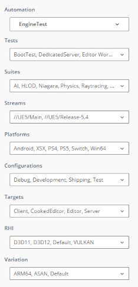
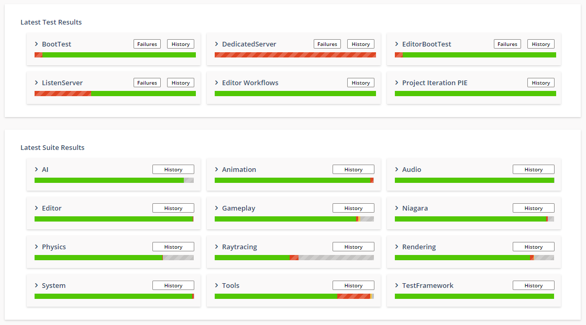
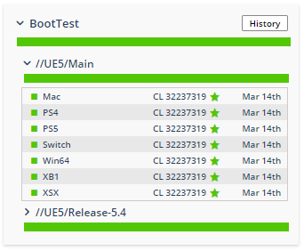
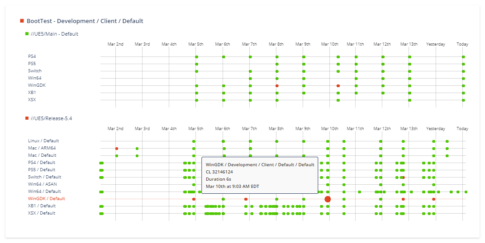
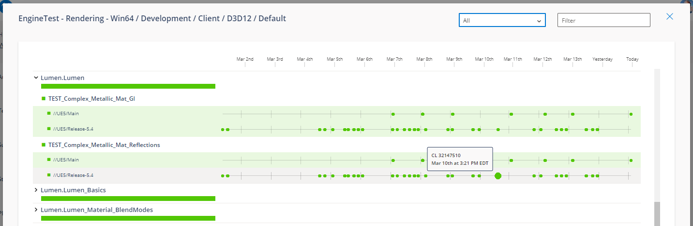
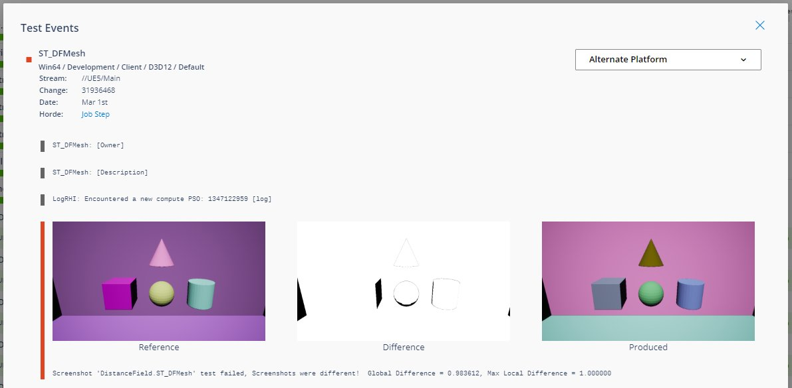

# Horde自动化中心

> 路径：虚幻引擎5.7文档 / 建立你的开发流程 / Horde / Horde配置 / Horde自动化中心

> 原始页面：https://dev.epicgames.com/documentation/unreal-engine/horde-automation-hub-for-unreal-engine

Horde自动化中心会显示个体和套件[Gauntlet](../../../../testing-and-optimizing-content/automation-test-framework/gauntlet-automation-framework/index.md)测试结果。 Horde可高效生成流送、平台、配置、渲染API等的可搜索元数据。Epic by QA、发布经理和代码所有者可以使用自动化中心快速查看和调查跨平台和流送的最新测试结果。 它提供历史数据和视图，可深入研究特定测试事件，包括屏幕截图、日志记录和调用堆栈。

要显示测试结果，除了启用Horde[构建自动化](../horde-build-automation/index.md)之外，所需的配置仅仅是在Gauntlet测试命令行中添加 `-WriteTestResultsForHorde` 参数。 请参阅下文的BuildGraph[示例](#buildgraph)了解详情。

## 自动化筛选器

自动化UI由数据驱动，会根据测试元数据自动填充。 测试结果可以按照项目、测试、数据流、平台、配置、目标、渲染硬件接口和变体进行筛选。 详细选项也可以建立链接，便于共享和添加到书签。



## 测试图块

测试结果以图块形式呈现，这些图块会基于所选平台和数据流显示相对测试健康状况。



测试图块可以展开，以查看平台和变更列表等更多详细信息，这些详细信息将与各个[Horde CI](../horde-build-automation/index.md)作业步骤关联，从而协助调查问题。



该功能还提供测试历史记录图表和详细故障败报告，其中包含日志记录和调用堆栈。



## 测试套件

Gauntlet测试套件可能包含数千个单独的单元测试。 自动化中心可以通过跨数据流比较，对每个单元测试的历史数据进行深入研究。



套件测试会生成测试事件，查看这些事件有助于诊断问题。 测试事件可以包含日志记录、屏幕截图等更多数据，以捕捉退步情况。 为了便于比较，也可以选择单元测试的其他替代平台。



## BuildGraph示例

以下[**BuildGraph**](../../../using-the-unreal-engine-build-pipeline/unreal-automation-tool/buildgraph/index.md)片段声明：

- HordeDeviceService

  和

  HordeDevicePool

  属性，用于指定你的Horde服务器以及要使用的设备池。
- 添加了一个 `BootTest Android` 节点，该节点指定了 `-WriteTestResultsForHorde` 参数，并自动生成测试数据，这些数据供Horde摄取，会被解析成高效的元数据，并由自动化中心进行展示

  ```
        <Property Name="HordeDeviceService" Value="http://localhost:13440" />      <Property Name="HordeDevicePool" Value="UE5" />			      <Node Name="BootTest Android">          <Command Name="RunUnreal" Arguments="-test=UE.BootTest -platform=Android " -deviceurl="$(HordeDeviceService)" -devicepool="$(HordeDevicePool)" -WriteTestResultsForHorde/>      </Node>
  ```
