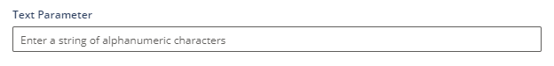
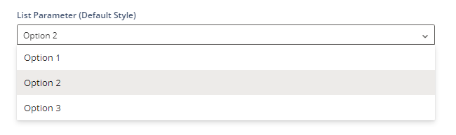
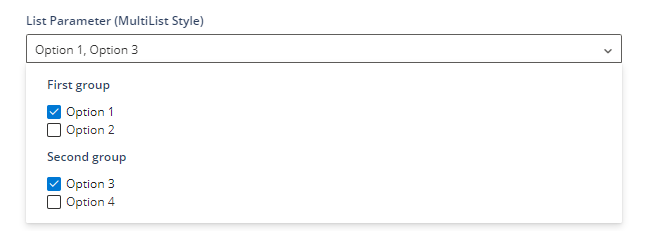
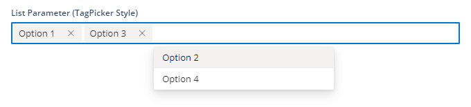

# Horde构建自动化

> 路径：虚幻引擎5.7文档 / 建立你的开发流程 / Horde / Horde配置 / Horde构建自动化

> 原始页面：https://dev.epicgames.com/documentation/unreal-engine/horde-build-automation-for-unreal-engine

**构建自动化**（也称为CI/CD）是Epic Games为Horde设定的首个用例，也是最成熟的一个用例。

它旨在将[BuildGraph](../../../using-the-unreal-engine-build-pipeline/unreal-automation-tool/buildgraph/index.md)作为第一类支持对象，允许高效的分布式并行化构建管线进行脚本化，同时可以在代理之间自动追踪和传输中间构建构件。

它还支持以下功能：

- 构建健康状况
- Perforce元数据缓存、工作空间管理
- 支持基于作业队列进行自动伸缩
- 支持结构化日志记录，其中许多常见的UE数据类型会自动附带额外元数据注释。
- 分析与遥测功能

CI与Horde的远程执行能力协同合作，在多个代理之间分配计算密集型工作负载，同时利用存储功能对缓存的中间件和最终构件进行存档和检索。

## BuildGraph

BuildGraph将构建管线描述为一个参数化的图表，图表中的每个节点对一组输入（以另一个节点生成的文件形式存在）执行一系列顺序操作，并生成一组输出（以一组文件的形式呈现）。在具有同步Perforce工作空间的代理上，按顺序执行一个或多个节点。

在Horde上运行作业时，需要指定一个BuildGraph脚本、要传递给该脚本的命令行参数，以及一个或多个待求值节点的名称。Horde负责预配机器，从Perforce进行同步，以及将输入和输出文件传输到临时存储位置。

## 启用CI功能

要在Horde中启用CI功能，需要执行以下步骤：

- 编写一个BuildGraph脚本，将其提交到源代码控制。
- 在

  Globals.json

  文件中定义一个项目，其中包括一个

  *.project.json

  配置文件。
- 在

  .project.json

  文件中定义一个流，其中包括一个

  *.stream.json

  配置文件。
- 声明一个

  agent type

  ，用于定义一台可以执行BuildGraph脚本中的步骤的机器。
- 声明一个

  job template

  ，用于定义你的BuildGraph脚本的参数，并在源代码控制中引用它。

另请参阅：[快速入门 - 构件自动化](../../horde-tutorials/horde-build-automation-tutorial/index.md)。

## 代理类型

代理类型将根据BuildGraph脚本中指定的名称，明确执行特定类型工作所需的机器。当在多个流中运行同一个BuildGraph脚本，或者对同一个BuildGraph脚本进行参数化以应用于不同项目时，这种间接层会很有用。

为便于管理，代理通常会被分为静态或动态[池](../horde-agents/index.md#%E6%B1%A0)，以便纳入代理类型定义。代理类型还可以引用一个[工作空间](#%E5%B7%A5%E4%BD%9C%E7%A9%BA%E9%97%B4)来指定在机器上执行作业时需要同步哪些文件。为特定流配置要使用的代理会对该流的数据保持'热'同步，这样在需要时它们就能更快地开始处理作业，因此，筛选要同步的文件可以减少磁盘空间占用，并让每台机器拥有更多的工作空间。

如需详细了解代理类型配置，请参阅[.stream.json参考](../horde-schema/index.md#%E4%BB%A3%E7%90%86%E9%85%8D%E7%BD%AE)。

## 作业模板

作业模板描述了运行一项作业所需的参数和默认参数值，以及Horde操作面板可用于向用户显示这些参数的控件。典型模板如下：

```
{    "id": "editor-only",    "name": "Editor Only",    "arguments": [        "-Target=Editor Only",        "-Script=Engine/Restricted/NotForLicensees/Build/DevStreams.xml"    ],    "parameters": [        {            "type": "List",            "style": "List",            "label": "Toolchain Versions",            "items": [                {                    "text": "Latest",                    "argumentIfEnabled": "-set:WithLatest=true",                    "argumentIfDisabled": "-set:WithLatest=false",                    "default": true                },                {                    "text": "Preview",                    "argumentIfEnabled": "-set:WithPreview=true",                    "argumentIfDisabled": "-set:WithPreview=false",                    "default": true                },                {                    "text": "Clang",                    "argumentIfEnabled": "-set:WithClang=true",                    "argumentIfDisabled": "-set:WithClang=false",                    "default": true                }            ]        }    ]}
```

你可以在 `parameters` 块中指定各种控件类型。以下的截图和配置摘录取自教程中的"参数演示"作业类型。

### 文本参数

允许为参数输入任意文本，还可选择使用正则表达式进行验证。



```
{    "type": "Text",    "label": "Text Parameter",    "argument": "-set:TextParameter=",    "default": "",    "validation": "[a-zA-Z0-9_]+",    "validationError": "Should be a sequence of alphanumeric characters",    "hint": "Enter a string of alphanumeric characters",    "toolTip": "Tooltip for text parameter"}
```

如需了解有效属性，请参阅[TextParameterData](../horde-schema/index.md#textparameterdata)。

### 列表参数

允许用户从预定义列表中选择一个或多个选项。



```
{    "type": "List",    "label": "List Parameter (Default Style)",    "toolTip": "Tooltip for list parameter",    "items": [        {            "text": "Option 1",            "argumentIfEnabled": "-set:ListParameter=Option1"        },        {            "text": "Option 2",            "argumentIfEnabled": "-set:ListParameter=Option2",            "default": true        },        {            "text": "Option 3",            "argumentIfEnabled": "-set:ListParameter=Option3"        }    ]}
```

如需了解有效属性，请参阅[ListParameterData](../horde-schema/index.md#listparameterdata)。

### 多列表参数

多列表参数以常规列表形式创建，但要将 `Style` 属性设置为 `MultiList` 。从下拉列表中勾选项目可以指定多个选项。列表项上的 `Group` 属性将为其下的项目指定分组标题。



```
{    "type": "List",    "style": "MultiList",    "label": "List Parameter (MultiList Style)",    "toolTip": "Tooltip for list parameter (MultiList)",    "items": [        {            "group": "First group",            "text": "Option 1",            "argumentIfEnabled": "-set:MultiListOption1=true",            "default": true        },        {            "group": "First group",            "text": "Option 2",            "argumentIfEnabled": "-set:MultiListOption2=true"        },        {            "group": "Second group",            "text": "Option 3",            "argumentIfEnabled": "-set:MultiListOption3=true",            "default": true        },        {            "group": "Second group",            "text": "Option 4",            "argumentIfEnabled": "-set:MultiListOption4=true"        }    ]},
```

如需了解有效属性，请参阅[ListParameterData](../horde-schema/index.md#listparameterdata)。

### 标签选择器参数

标签选择器参数与[多列表参数](#%E5%A4%9A%E5%88%97%E8%A1%A8%E5%8F%82%E6%95%B0)类似，但输入几个字符即可选择项目，而非从列表中选取。



```
{    "type": "List",    "style": "TagPicker",    "label": "List Parameter (TagPicker Style)",    "toolTip": "Tooltip for list parameter (TagPicker)",    "items": [        {            "text": "Option 1",            "argumentIfEnabled": "-set:TagPickerOption1=true",            "default": true        },        {            "text": "Option 2",            "argumentIfEnabled": "-set:TagPickerOption2=true"        },        {            "text": "Option 3",            "argumentIfEnabled": "-set:TagPickerOption3=true",            "default": true        },        {            "text": "Option 4",            "argumentIfEnabled": "-set:TagPickerOption4=true"        }    ]}
```

### 布尔参数

允许切换是否启用某个选项。


```
{    "type": "Bool",    "label": "Bool Parameter",    "toolTip": "Tooltip for bool parameter",    "argumentIfEnabled": "-set:BoolParameter=true",    "argumentIfDisabled": "-set:BoolParameter=false"}
```

如需了解有效属性，请参阅[BoolParameterData](../horde-schema/index.md#boolparameterdata)。

## 计划

模板还可以指定要自动触发的计划和策略，例如在每次提交变更时运行、针对最近 `n` 次变更运行、在某些文件被修改时运行。如需了解详情，请参阅配置参考中的[ScheduleConfig](../horde-schema/index.md#scheduleconfig)小节。

## 工作空间

工作空间定义了告知代理要执行作业需要从源代码控制同步哪些数据以及如何同步。

`View` 属性通过将额外一组筛选器应用于流视图，对流定义进行细化，同时在标准Perforce语法中指定通配符。

`Incremental` 属性定义增量式工作空间。默认情况下，在运行作业之前，Horde会将工作空间恢复到原始状态。如果设置了该标记，所有受追踪的文件将被同步回原始状态（即根据时间戳判定，修改过的文件将被重置为原始版本），但工作空间中的其他文件将保持不变。当工具在依赖追踪方面足够强大，能够判断文件是否需要重新编译时，这就可以保留中间状态，例如编译构件。

## AutoSDK

AutoSDK系统提供的机制可以分发目标平台SDK，并根据需要对其进行配置，以便引擎使用。在构建场中管理多个代码行时，这一点特别有用，因为它减少了构建代理所需的手动配置工作量。

如需详细了解如何创建AutoSDK库，请参阅虚幻引擎源代码树中 `Engine/Extras/AutoSDK` 下的文档。

你可以在globals.json文件的 `perforceClusters` 部分为Horde配置AutoSDK。可以根据代理的属性匹配情况，指定不同的AutoSDK流，例如：

```
"autoSdk": [    {        "properties": [ "OSFamily=Windows" ],        "stream": "//UE5/Private-AutoSDK-Windows"    },    {        "properties": [ "OSFamily=MacOS" ],        "stream": "//UE5/Private-AutoSDK-Mac"    },    {        "properties": [ "OSFamily=Linux" ],        "stream": "//UE5/Private-AutoSDK-Linux"    }]
```
