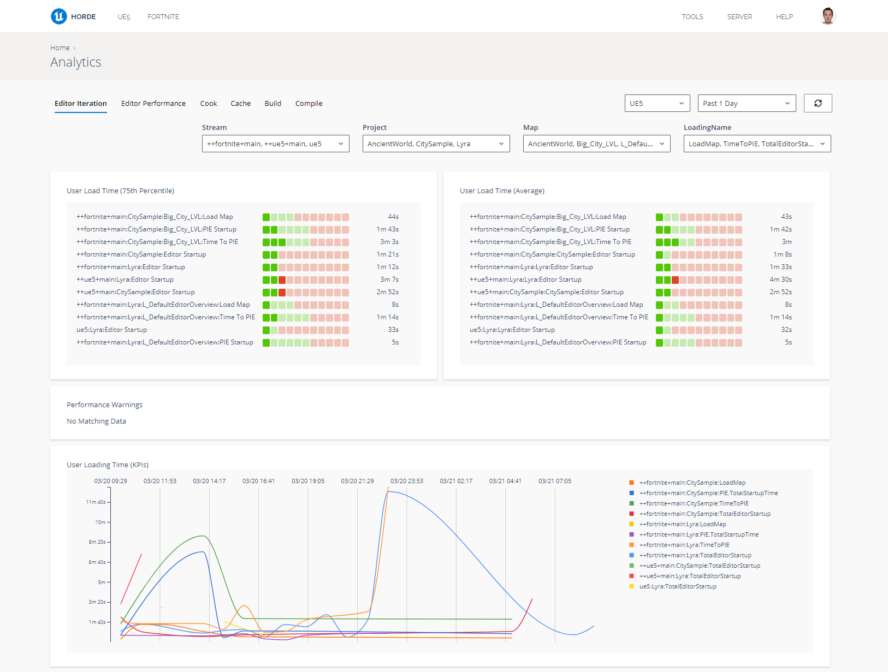

# Horde分析教程

> 路径：虚幻引擎5.7文档 / 建立你的开发流程 / Horde / Horde教程 / Horde分析教程

> 原始页面：https://dev.epicgames.com/documentation/unreal-engine/horde-analytics-tutorial-for-unreal-engine

## 简介

**Horde** 实现了一个遥测收集器，它可以接收和处理虚幻编辑器发送的事件。

Horde将遥测事件聚合为用于离散时间间隔的 **指标** ，然后可以通过Horde操作面板绘制图表，从而提供有关你的团队所遇瓶颈的宝贵见解。



## 先决条件

- Horde服务器安装（参阅

  快速入门：安装Horde

  ）。
- 以虚幻引擎5.5或更高版本为目标的虚幻引擎项目。

## 步骤

1. 在虚幻编辑器中，打开你的项目，并前往

   编辑（Edit）> 插件（Plugins）

   菜单。搜索

   Studio Telemetry

   插件并确保启用插件。该插件应该会默认启用。
2. 打开项目的 `DefaultEngine.ini` 文件（在 `.uproject` 文件旁边的 `Config` 文件夹中），并添加以下几行：

   ```
        [StudioTelemetry.Provider.HordeAnalytics]     Name=HordeAnalytics     ProviderModule=AnalyticsET     UsageType=EditorAndClient     APIKeyET=HordeAnalytics.Dev     APIServerET="http://localhost:13340/"     APIEndpointET="api/v1/telemetry/engine"
   ```

   确保将 `APIServerET` 的值替换为你的Horde服务器的地址。
3. 配置遥测存储以聚合遥测事件的指标。Horde安装中包含一些默认指标和图表，将以下代码片段添加到你的[globals.json](../../horde-configuration/horde-orientation/index.md)文件即要添加这些指标和图表：

   ```
            // 定义"引擎"遥测存储并在其中创建一些标准指标。         "telemetryStores": [             {                 "id": "engine",                 "include": [                     {                         "path": "$(HordeDir)/Defaults/default-metrics.telemetry.json"                     }                 ]             }         ],		         // 配置默认操作面板来渲染它们         "dashboard": {             "include": [                 {                     "path": "$(HordeDir)/Defaults/default-analytics.dashboard.json"                 }             ]         },
   ```

## 另请参阅

- 配置 > 分析
