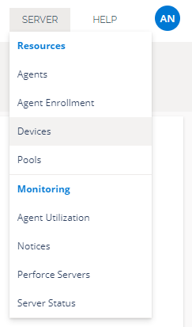
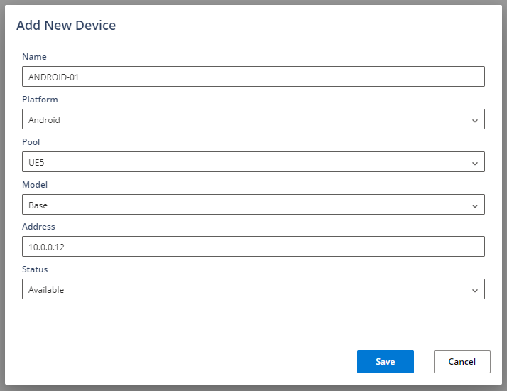
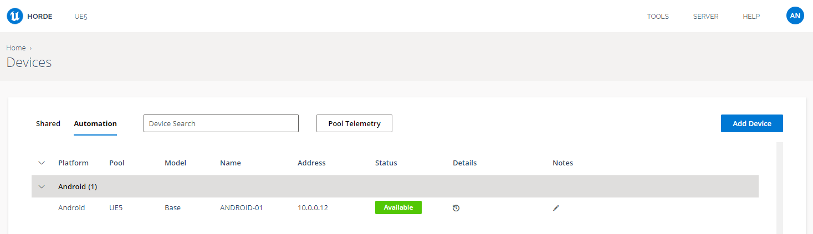

# Horde设备管理器教程

> 路径：虚幻引擎5.7文档 / 建立你的开发流程 / Horde / Horde教程 / Horde设备管理器教程

> 原始页面：https://dev.epicgames.com/documentation/unreal-engine/horde-device-manager-tutorial-for-unreal-engine

## 简介

Horde包含用于维护移动端和主机开发工具包资源的[设备管理器](../../horde-configuration/horde-devices/index.md)。托管设备由使用简单REST API的自动化测试来保留。此外，设备可以划分为用户池，支持共享远程设备的检出，以进行手动测试和开发。

设备管理器包含操作面板UI，可以轻松管理和监控设备。设备使用情况会生成可供查看的遥测数据，以帮助分配和安排测试。Horde设备管理器在Epic中得到广泛使用，并且经过了实战检验，具有自动问题报告、发生错误时套件翻转以及与Slack集成等功能。

虽然设备管理器与Horde[构建自动化](../../horde-configuration/horde-build-automation/index.md)集成，但可以通过REST api单独使用。

## 先决条件

- Horde服务器和Android手机或平板电脑（参阅

  Horde安装教程

  ）。

## 步骤

1. 在Horde操作面板上，找到设备管理视图

   
2. Horde配置示例包含针对Android平台的定义。此外还定义了共享池和自动化池，设备可以分别针对用户检出和自动化测试进行分区。

   ```
        "devices": {     "platforms": [         {         "id": "android",         "name": "Android"         }     ],     "pools": [         {         "id": "ue5",         "name": "UE5",         "poolType": "Automation"         },         {         "id": "remote-ue5",         "name": "Remote UE5",         "poolType": "Shared"         }     ]     }
   ```

   点击添加设备（Add Device）并填写新设备表格，其中包括设备IP。选择示例UE5自动化池来为该工作负载指定设备。

   

   保存后，Android设备将被添加，并且可用于作业。你还可以编辑设备、应用维护说明和查看历史作业详情。

   
3. 可选择重复步骤2，为设备选择共享池。这将填充共享设备枢轴点，使该设备可供用户检出。
