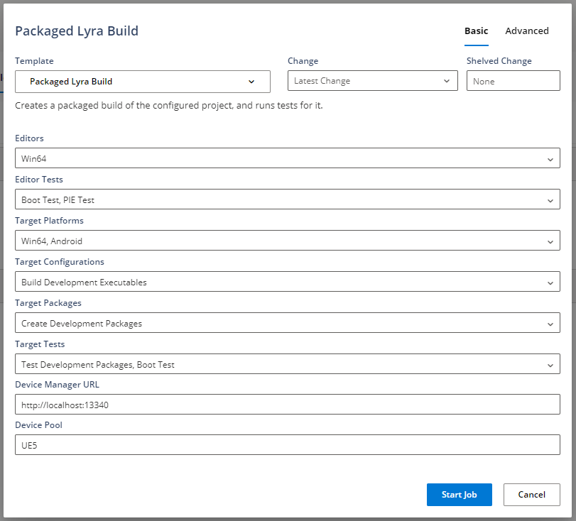
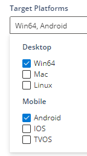
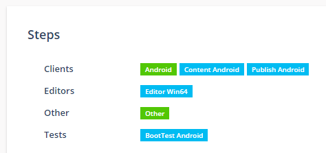
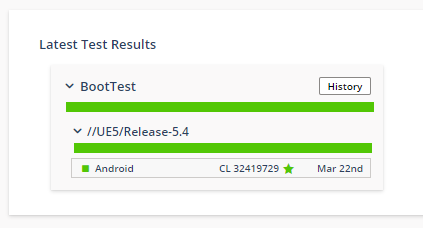

# Horde测试自动化教程

> 路径：虚幻引擎5.7文档 / 建立你的开发流程 / Horde / Horde教程 / Horde测试自动化教程

> 原始页面：https://dev.epicgames.com/documentation/unreal-engine/horde-test-automation-tutorial-for-unreal-engine

## 简介

Horde自动化中心会显示个体和套件[Gauntlet](../../../../testing-and-optimizing-content/automation-test-framework/gauntlet-automation-framework/index.md)测试结果。 Horde可高效生成流送、平台、配置、渲染API等的可搜索元数据。Epic by QA、发布经理和代码所有者可以使用自动化中心快速查看和调查跨平台和流送的最新测试结果。它提供历史数据和视图，可深入研究特定测试事件，包括屏幕截图、日志记录和调用堆栈。

## 先决条件

- 已安装Horde服务器（参阅

  Horde安装教程

  ）。
- 配置了AutoSDK的Horde代理（参阅引擎源中的Engine\Extras\AutoSDK\README.md）
- 已配置Horde构建示例项目（参阅

  Horde构建自动化教程

  ）。
- 已将Android手机或平板电脑添加到设备管理器（参阅

  Horde设备管理器教程

  ）。

## 步骤

1. Horde示例UE5项目包含用于编译、打包和测试Lyra示例游戏项目的参考模板。 此示例的构建图表旨在实现通用性和可扩展性，是Epic用于自动化测试的良好现实世界图表来源。

   

   从UE5项目流视图中，选择打包构建（Packaged Build）类别，点击 `新构建（New Build）` ，然后选择 `已打包Lyra构建（Packaged Lyra Build）` 。添加Android目标平台，并点击 `开始作业（Start Job）`

   

   请注意，设备管理器URL字段仅用于示例目的，你通常要在相关的Gauntlet构建图表配置中设置它。
2. 该作业将在Android设备上编译、烘焙和运行Lyra启动测试，并在此过程中将其从设备管理器中保留。

   
3. 完成后，测试结果将在[自动化中心](../../horde-configuration/horde-automation-hub/index.md)中可用，该自动化中心具有细粒度筛选器和视图，可交叉比较平台和流送。

   
