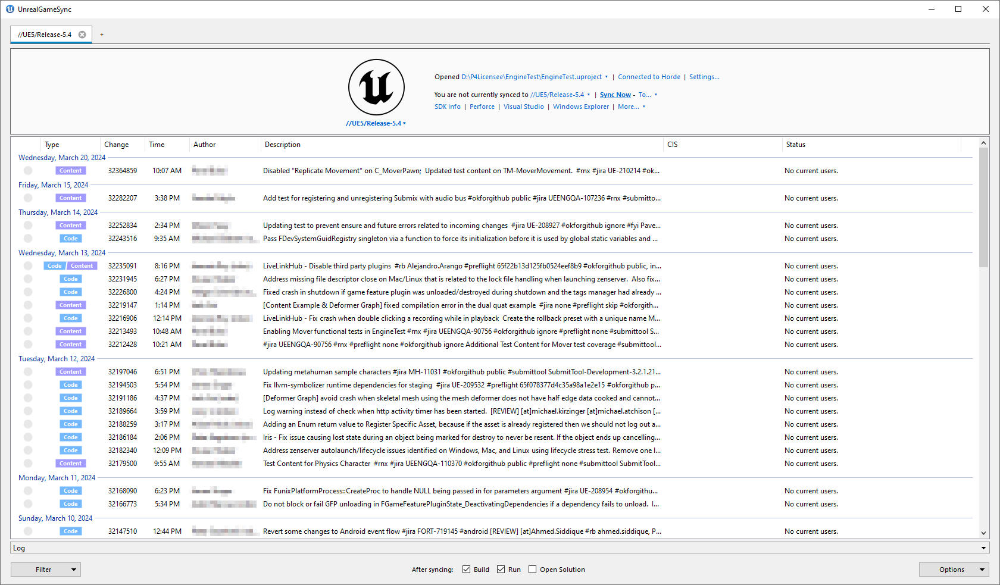

# Horde UnrealGameSync教程

> 路径：虚幻引擎5.7文档 / 建立你的开发流程 / Horde / Horde教程 / Horde UnrealGameSync教程

> 原始页面：https://dev.epicgames.com/documentation/unreal-engine/horde-unrealgamesync-tutorial-for-unreal-engine

## 简介

使用虚幻引擎编译的项目通常需要美术师、设计师和工程师密切协作，尤其是要使用蓝图等技术，允许C++代码和Gameplay脚本互操作。

由于不同开发者与修订控制系统的交互方式不同，协调这些开发工作可能具有挑战性 - 例如，工程师可能会修改代码并编译自己的编辑器，然后提交利用这些代码更改创建的资产 - 并且美术师需要能够步调一致地同步和使用相同的资产，而无需浏览代码IDE。

**UnrealGameSync** （通常缩写为 **UGS** ）是一种为从 **Perforce** 同步项目的开发者提供统一前端的工具，为内容创建者和工程师提供相同的仓库视图。工程师可以用它正确控制编辑器的版本以编辑资产，内容创建者可以用它同步Horde的编译自动化系统生成的预编译编辑器二进制文件。该界面提供了项目运行状况和最近的CI构建状态的概览，并可作为启动其他工具的起点。

Epic Games使用UnrealGameSync开发所有内部项目，例如《堡垒之夜》。有关UnrealGameSync的更多信息，可以在[此处找到](../../../deploying/unrealgamesync-ugs/index.md)。

> [!NOTE]
> 图形化UnrealGameSync客户端仅适用于Windows。命令行版本适用于MacOS和Linux。



## 先决条件

- Horde服务器安装（参阅

  Horde安装教程

  )。

## 安装（Windows）

1. 在Horde操作面板上，找到

   工具（Tools）> 下载（Downloads）

   页面。
2. 点击

   UnrealGameSync

   项右侧的

   下载（Download）

   按钮，运行已下载的安装程序。
3. 安装后，系统将提示你配置UnrealGameSync的自动更新设置。选择"Horde"并输入你的Horde服务器的路径。这还将配置UnrealGameSync，以从Horde的其他用户获取构建信息和元数据。

   > [!NOTE]
   > 你可以稍后使用UnrealGameSync内的 `选项（Options）> 应用程序设置...（Application Settings）...` 对话框进行修改。
4. 选择

   打开项目...（Open Project...）

   ，然后选择你已在本地同步的项目，或者创建一个包含要同步项目的新工作区。

## 安装（Mac）

1. 安装[.NET 8 Runtime](https://dotnet.microsoft.com/en-us/download)和[Helix命令行工具](https://www.perforce.com/products/helix-core-apps/command-line-client)。
2. 打开终端并运行：

   ```
        curl "{{ HORDE_SERVER_URL }}/api/v1/tools/ugs-cmd?action=download" -o ~/ugs.zip     unzip -eo ~/ugs.zip -d ~/ugs/     ~/ugs/ugs install     source ~/.zshrc
   ```
3. 运行 `ugs -help` 获取有关可用命令的信息。

## 安装（Linux）

1. 安装[.NET 8 Runtime](https://dotnet.microsoft.com/en-us/download)和[Helix命令行工具](https://www.perforce.com/products/helix-core-apps/command-line-client)。
2. 打开终端并运行：

   ```
        curl "{{ HORDE_SERVER_URL }}/api/v1/tools/ugs-cmd?action=download" -o ~/ugs.zip     unzip -eo ~/ugs.zip -d ~/ugs/     ~/ugs/ugs install     source ~/.bashrc
   ```
3. 运行 `ugs -help` 获取有关可用命令的信息。

## 服务器设置

### 默认的Perforce服务器

- 如果你的整个团队使用同一个Perforce服务器，你可以通过修改服务器的[globals.json](../../horde-configuration/horde-orientation/index.md)文件来使用默认值配置UGS。只要UGS配置为使用你的Horde服务器，它就会在启动时查询此属性。

  ```
        "parameters": {          "ugs":           {              // 为使用UGS的任何人设置默认Perforce服务器。              "defaultPerforceServer": "perforce:1666"          }      }
  ```

### 编辑器构建

UnrealGameSync最初是针对小团队创建的，美术师可以在本地同步和编译代码更改，无需设置基础架构（例如CI/CD系统）。虽然这种使用方式仍然可行，但对于较大的团队来说，通常更容易让Horde的构建自动化系统集中生成编辑器构建。

UnrealGameSync可以向Horde查询可用的编辑器构建（通常称为预编译二进制文件，简称PCB）。这些构建可以自动存储在Horde服务器上并被发现。UnrealGameSync的早期构建需要将这些二进制文件存储在Perforce中的压缩文件中；现在不再需要这样做。

从Horde的[构建自动化](../horde-build-automation-tutorial/index.md)教程指南中引用的示例流配置包含 **增量构建（Incremental Build）** 作业模板，该模板将使用 `Engine/Build/Graph/Examples/BuildEditorAndTools.xml` [BuildGraph](../../../using-the-unreal-engine-build-pipeline/unreal-automation-tool/buildgraph/index.md)脚本编译和上传这些二进制文件。

在Horde上编译项目的编辑器后，请选中 `选项（Options）> 同步预编译二进制文件（Sync Precompiled Binaries）` 选项来下载它们，而不是在本地编译。

### 徽章

使用BuildGraph `<Label>` 元素即可直接在UGS中显示来自Horde的构建自动化系统的信息。
