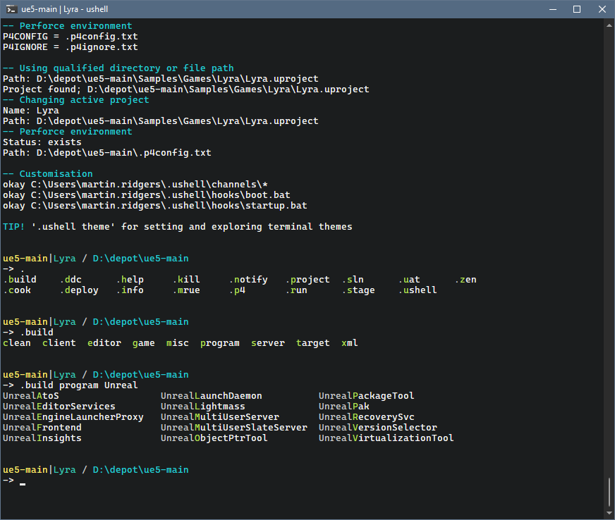

# Ushell

> 路径：虚幻引擎5.7文档 / 建立你的开发流程 / Ushell

> 原始页面：https://dev.epicgames.com/documentation/unreal-engine/how-to-use-ushell-for-unreal-engine

**Ushell** 功能是用于虚幻引擎项目的一种命令行界面。



它包含许多虚幻引擎基础操作的命令，包括：

- 编译代码
- 烘焙并暂存数据
- 运行产品
- 执行命令
- 为Unreal Insights运行追踪会话
- 以及更多

Ushell支持丰富的Tab补全功能，包括详细的内联文档，并提供可搜索的持久命令历史记录。本页面将介绍Ushell用法的快速入门。

## 如何运行Ushell

要启动Ushell，请打开引擎的安装目录（例如 `C:/EpicGames/UE_5.4` ）并运行以下批处理文件：

引擎安装目录中的相对路径

```
Engine/Extras/ushell/ushell.bat
```

> [!NOTE]
> 虚幻引擎5.4的启动器构建不包含Ushell，但源代码构建包含。虚幻引擎5.5修复了该问题。

每条命令都以点号/英文句号字符开头。例如， `.build` 命令会以各种配置编译项目。你可以使用Tab补全功能来帮助发现命令和参数。

## 帮助和文档

输入 `help` 命令即可查看所有可用命令的列表，指定 `--help` 参数即可访问各命令的使用指南：

Ushell命令

```
.help.build editor --help
```

更详细的文档见Ushell的Readme文件，该文件涵盖多种主题，比如用自定义命令扩展Ushell、用Ushell编写脚本、在基于POSIX的平台上运行、与其他Shell集成等。你可以使用 `.help readme` 便捷地访问该文件。

## 样例命令

为帮助大家理解Ushell的用例，下表列出了一部分可能会用到的命令的样例：

| **样例命令** | **说明** |
| --- | --- |
| `.build editor` | 为活动项目编译编辑器。 |
| `.build game win64` | 为活动项目编译Win64平台的游戏运行时。 |
| `.build program UnreralInsights shipping` | 用发布配置编译Unreal Insights。 |
| `.cook game win64` | 为Win64平台的游戏运行时烘焙数据。 |
| `.stage game mac` | 暂存本地编译的游戏/客户端可执行文件和之前为Mac烘焙的数据。 |
| `.run editor` | 为活动项目运行编辑器。 |
| `.run game Win64 --trace -- -ExecCmds="TrySurfing"` | 为活动项目启动本地编译的Win64平台二进制文件。向开发主机发送Unreal Insights追踪会话，并执行"TrySurfing"命令。 |
| `.run program UnrealInsights shipping` | 用发布配置运行Unreal Insights。 |
| `.sln generate` | 为活动项目生成Visual Studio解决方案。 |
| `.info` | 显示当前会话的信息。 |

> [!NOTE]
> 使用 `.help` 命令或 `--help` 参数即可获取上述各个命令的更多详细信息。

每条Ushell命令都可以用 `--help` 参数显示该命令的文档、调用方式的详细信息以及可用选项的说明。

## Tab补全功能和命令历史

熟悉用Bash编辑命令和调用先前命令（如Readline）的人，都会对Ushell提示符感到得心应手。

命令及其参数都可使用广泛的上下文敏感Tab补全功能。按Tab键能帮你寻找命令及其参数，并快速方便地输入命令。例如：

| **样例输入** | **说明** |
| --- | --- |
| `.<tab><tab>` | 显示可用的命令。 |
| `.b<tab>` | 完成 `.build` 。 |
| `.run <tab><tab>` | 显示 `.run` 首个参数的选项。 |
| `.build editor --p<tab>` | 添加 `--platform=` 。对平台进一步进行Tab补全。 |

Ushell会保留以前运行过的命令的历史记录，这些记录会在下一个会话中继续存在。有多种方法可以方便地调用以前的命令。

使用PgUp可按前缀回溯以前的命令：

| **样例输入** | **说明** |
| --- | --- |
| `.bu<pgup>` | 循环遍历以"`.bu`"开头的命令 |
| ` .run game xb` | 迭代Xbox上的先前运行。 |

按 `Ctrl-R` 可对增量历史记录进行更彻底的搜索。这时将显示提示让你输入搜索的字符串，并显示匹配的最新命令。再次按下 `Ctrl-R`，即可向后查找与搜索字符串匹配的命令。按 `Ctrl-S` 则会改为向前查找。
