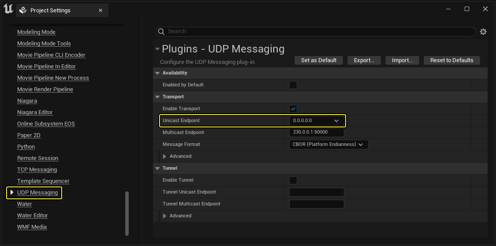
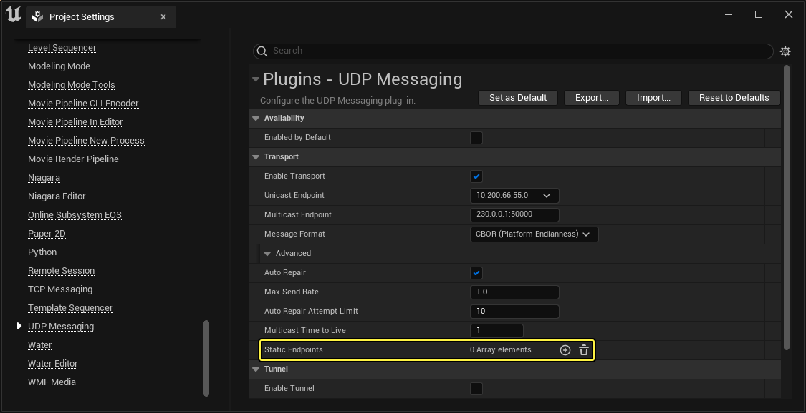
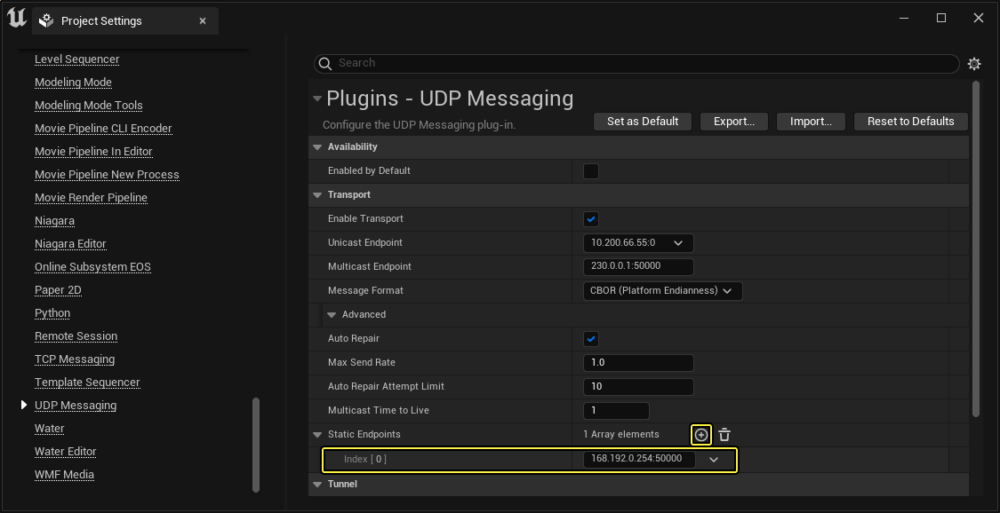

# 高级多用户联网功能

> 路径：虚幻引擎5.7文档 / 建立你的开发流程 / 虚幻引擎多用户编辑 / 高级多用户联网功能

> 原始页面：https://dev.epicgames.com/documentation/unreal-engine/advanced-multi-user-networking-in-unreal-engine

[多用户编辑快速入门](../getting-started-with-multi-user-editing/index.md)描述如何在简单的本地局域网（LAN）中使用 **多用户编辑系统**，其中客户端可自动发现多用户编辑服务器。但有时可能无法自动发现服务器。这种情况下，可能需要在希望通过多用户编辑连接的计算机上执行一些额外的配置。

本页含有一些策略，可在虚幻编辑器无法自动发现多用户编辑服务器时帮助用户成功建立连接。

## 相同LAN，相同子网

如果虚幻编辑器和多用户编辑服务器位于相同局域网（LAN）和相同子网中，但是两者无法自动发现彼此，则原因可能是其中之一或两者均未设置为在恰当的计算机网络接口上广播或侦听组播流量。若要强制虚幻引擎使用特定网络接口，你需要将其指定为单播端点IP。

### 配置编辑器

为虚幻编辑器设置本地IP地址的方法：

1. 在主菜单中选择 **编辑（Edit）> 项目设置（Project Settings）**。
2. 在 **项目设置（Project Settings）** 窗口，转至 **插件（Plugins）> UDP消息（UDP Messaging）** 部分，找到 **传输（Transport）> 单播端点（Unicast Endpoint）** 设置。

   
3. 请把这个属性的值设置成你希望虚幻编辑器使用的网络接口IP地址。请固定使用端口 **0**。 例如，`192.168.10.73:0`。

### 配置服务器

若要为多用户编辑服务器设置单播端点IP地址，你可以按照上述说明为虚幻编辑器设置单播端点，然后从编辑器中的 **工具栏** 启动服务器。若以这种方式启动服务器，它将自动使用与启动该服务器的编辑器相同的单播IP地址。

或者，你也可以按照以下说明手动配置IP地址：

1. 如果你的服务器已在运行，请将其关闭。
2. 在你的虚幻引擎安装文件夹中，打开 `Engine/Programs/UnrealMultiUserServer/Saved/Config/<platform>` 文件夹，并在文本编辑器中打开 `Engine.ini` 文件。如果该文件不存在，请先创建它。
3. 将以下设置添加到文件中：

   ```
           [/Script/UdpMessaging.UdpMessagingSettings]        EnableTransport=True        UnicastEndpoint=192.168.0.73:0        MulticastEndpoint=230.0.0.1:50000        MulticastTimeToLive=1        EnableTunnel=False        TunnelUnicastEndpoint=        TunnelMulticastEndpoint=
   ```
4. 将 `UnicastEndpoint` 的值设为你希望虚幻编辑器（Unreal Editor）使用的网络适配器IP地址。固定使用端口 **0**。
5. 保存文件并重新启动服务器。

## 相同LAN，不同子网

若要将虚幻编辑器的实例连接到不在同一子网中的服务器，你需要同时对服务器和编辑器进行一些额外配置。其中涉及到为服务器的单播端点设置端口，然后将虚幻编辑器设置成以静态端点方式连接到服务器的单播IP地址和端口。

### 配置服务器

你需要将多用户服务器配置为对其单播端点使用预定义端口。有几种方法可以做到这一点：

- 若要手动启动多用户服务器，你可以按照上一节中的相同给定步骤，在配置文件中设置单播端点。但是，请不要使用端口 `0`，而应使用其他编号的端口，例如 `6666`。
- 若要从虚幻编辑器启动多用户服务器，最简单的方法是在 **服务器端口（Server Port）** 设置中设置你希望使用的端口号，你可以在 **插件（Plugins）> 多用户编辑（Multi-User Editing）** 部分的 **项目设置（Project Settings）** 窗口中找到该设置。此值将自动覆盖在 **插件（Plugins）> UDP消息（UDP Messaging）** 部分中为单播端点设置的任何端口值。

  另请参阅[多用户编辑参考](../multi-user-editing-reference/index.md#multi-usereditingsettings)
- 或者，你也可以按照上一节中的给定步骤，在 **插件 > UDP消息（Plugins > UDP Messaging）** 部分下的 **项目设置（Project Settings）** 窗口中设置单播端点。但是，请不要使用端口 `0`，而应使用其他编号的端口，范围在 `50000` - `60000`。

  > [!NOTE]
  > 如果你选择第三种方法，则服务器将始终使用比设置的端口号大一的端口号。这样可确保当编辑器与服务器都在同一台计算机上运行时，两者之间不会发生冲突。当你在以下部分中为其他虚幻编辑器实例配置静态端点时，你需要记住在 **项目设置** 中设置的端口号的基础上加一。例如，如果你在用于启动服务器的编辑器中将 `50000` 设置为单播端点的端口号，则需要让编辑器的其他实例在连接到静态端点时使用端口 `50001` 。

### 配置编辑器

若要在能够连接到服务器的其他子网上创建虚幻编辑器的实例，你需要将服务器的IP地址和端口指定为静态端点。

若要在虚幻编辑器中设置静态端点：

1. 从主菜单中，选择 **编辑（Edit）> 项目设置（Project Settings）**。
2. 在 **项目设置（Project Settings）** 窗口，转至 **插件（Plugins）> UDP消息（UDP Messaging）** 部分。展开 **传输（Transport）** 部分下的高级设置，并找到 **静态端点（Static Endpoints）** 设置。

   
3. 按下 **+** 向列表添加一个新项目，然后将新项目的值设置为你为服务器的单播端点设置的IP地址和端口。

   
