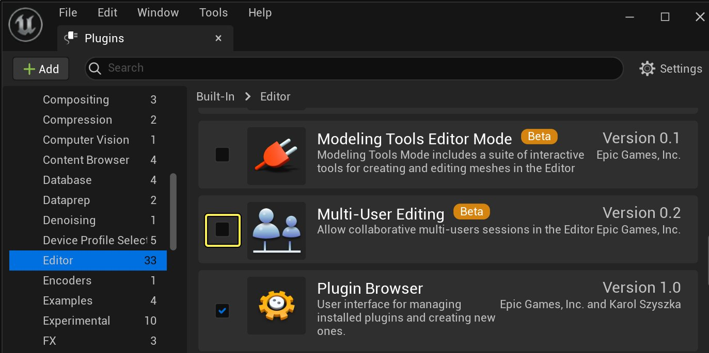
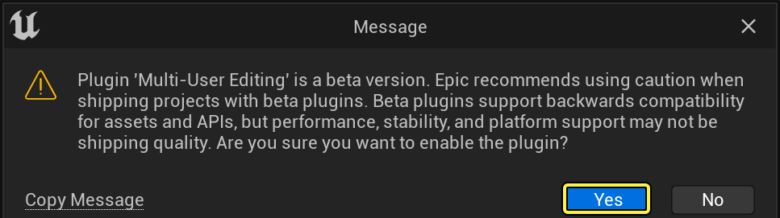
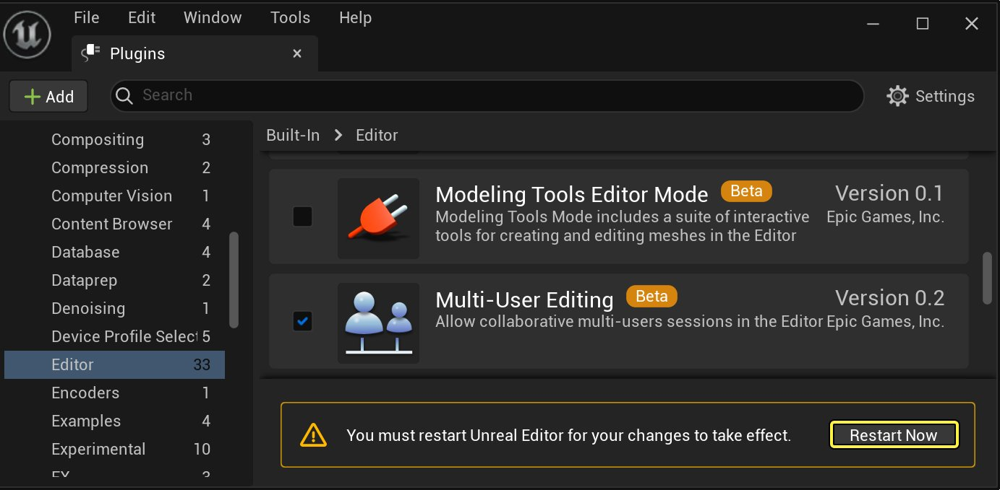
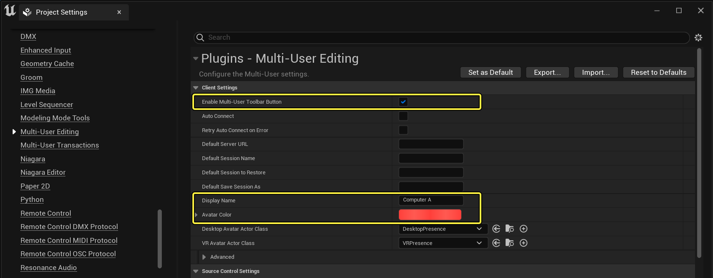
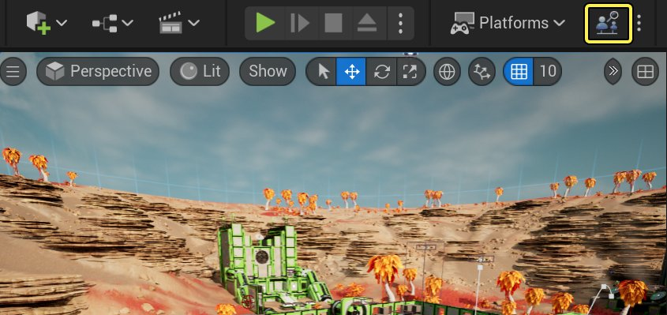
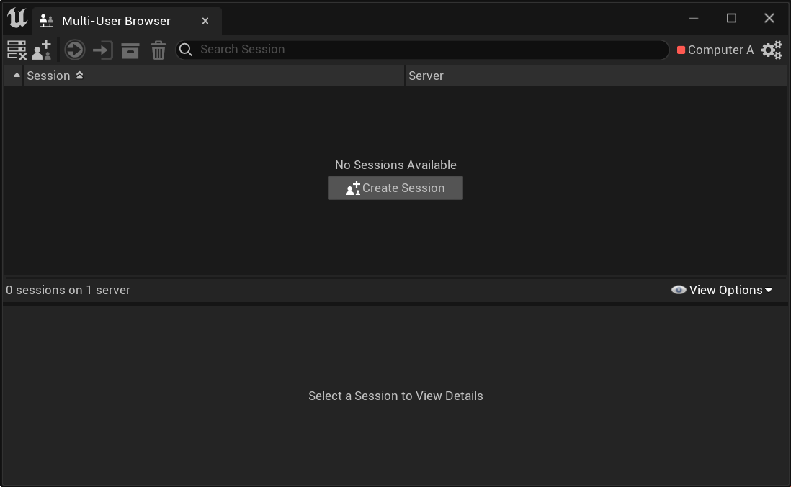
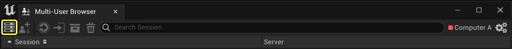
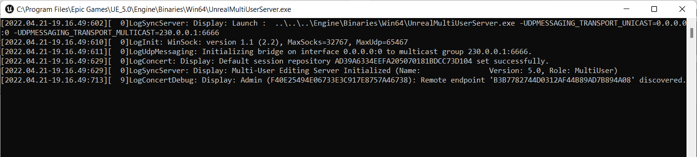

# 多用户编辑入门

> 路径：虚幻引擎5.7文档 / 建立你的开发流程 / 虚幻引擎多用户编辑 / 多用户编辑入门

> 原始页面：https://dev.epicgames.com/documentation/unreal-engine/getting-started-with-multi-user-editing-in-unreal-engine

此快速入门页面将介绍多用户编辑系统的基础知识，帮助读者使用该功能。完成本教程后将学习到：

- 如何对多台电脑进行设置，让其能同时加入会话。
- 如何启动服务器对会话进行管理。
- 如何发起和加入会话，以便和团队成员共同工作。
- 如何将在会话中所做的更改保存到本地电脑上的项目内容中。

> [!NOTE]
> **先决条件：**操作本教程时，虽然可以用同一台主机上的虚幻编辑器的多个实例，但是效率更高的方法是将多台不同的电脑连接至同一会话。首先：
>
> - 在每台电脑上安装相同版本的虚幻引擎。
> - 确保所有电脑都连接到同一局域网（LAN）或虚拟专用网络（VPN）。

> [!TIP]
> 此过程中使用的图像是[第三人称模板](https://dev.epicgames.com/documentation/404)示例项目，可从Epic Games Launcher的 **虚幻商城（Marketplace）** 选项卡中获取。然而，同样的步骤也适用于正在进行的所有虚幻引擎项目。

## 1 - 启动插件

要将虚幻编辑器的多个实例连接在一起，以便在共享会话中进行工作，需先为该项目启用 **多用户编辑** 插件。

1. 在虚幻编辑器中打开你的项目。
2. 从主菜单中选择 **编辑（Edit） > 插件（Plugins）**。
3. 在 **编辑器（Editor）** 类目下，找到 **多用户编辑** 插件并选中其 **启用（Enabled）** 框。

   
4. 点击 **是（Yes）** 确认。

   
5. 点击 **立即重启（Restart Now）** 重新启动项目并应用该更改。

   

## 2 - 设置多台电脑

每台连接至同一多用户编辑会话的电脑，必须安装相同版本的虚幻引擎。

该虚幻引擎项目在每台电脑上的副本必须相同，即每个副本都有完全相同的内容。

- 通常实现这一点的方法是，将该项目存储在一个版本控制系统中，如Perforce、Git或Subversion，并将每台电脑同步至同一个版本或变更列表。

  > [!TIP]
  > 如使用Perforce，也可考虑使用UnrealGameSync工具（UGS）来简化这个过程。欲了解相关细节，请参见[UGS文档](../../deploying/unrealgamesync-ugs/index.md).
- 多用户编辑系统并不强制要求使用源码管理。可以将项目文件夹轻松地从一台电脑复制到需加入同一会话的所有其他电脑中。这种方法在多用户编辑系统的初始测试中十分实用。然而，要避免对这种方法产生依赖。在团队中，有效利用版本控制工具才是维护和共享项目内容的最安全方式。

每台电脑上均存该项目的副本后，则需要自定义一些关键设置。在每台电脑上执行以下操作：

1. 在虚幻编辑器中打开项目，然后在主菜单中选择 **编辑（Edit）> 项目设置（Project Settings）**。
2. 在 **项目设置（Project Settings）** 窗口中，打开 **插件（Plugins） > 多用户编辑（Multi-User Editing）** 部分。

   

   更改以下设置来添加编辑器UI的快捷按钮，自定义每个虚幻编辑器实例在连接到会话时向其他实例显示的在线状态信息。

   | 设置 | 描述 |
   | --- | --- |
   | **启用多用户工具栏按钮（Enable Multi-User Toolbar Button）** | 向虚幻编辑器主窗口添加一个新按钮，提供最常用的多用户编辑命令的快捷方式。 |
   | **显示名称（Display Name）** | 设置多用户编辑系统显示该电脑的在线状态信息和会话历史时所使用的名称。 默认状态下，多用户编辑系统会尝试使用主机操作系统的当前用户的登录信息，但在某些情况下可能需要覆盖此值——例如在多台电脑上登录了相同的用户帐户时。 |
   | **化身颜色（Avatar Color）** | 设置多用户编辑系统在显示在线状态信息和会话历史时与此电脑关联的颜色。 默认状态下，该颜色对于所有用户都是相同的（白色），但如为每台电脑指定不同的颜色，则能更轻松地理解会话历史。 |

   > [!NOTE]
   > 欲了解此面板中各种可用设置的相关细节，也可参见[多用户编辑参考](../multi-user-editing-reference/index.md)。
3. 再次重启编辑器使新设置生效。

## 3 - 启动服务器

在每台需进行连接的电脑上打开虚幻编辑器中的项目后，需启动一台服务器，以便对这些电脑的共享会话进行管理。实现该目标的最简单方法是从虚幻编辑器的任一实例中启动。

1. 点击工具栏中的多用户编辑图标。（它应该会显示 **浏览（Browse）**，表示当前未连接到会话。）

   
2. **多用户浏览器（Multi-User Browser）** 窗口会打开。通过此面板可访问在多用户编辑系统中工作时需要的大部分会话管理工具。你将会经常回到此窗口。

   

   > [!TIP]
   > 即使工具栏图标不在活跃状态，也可随时选择 **窗口（Window）> 多用户浏览器（Multi-User Browser）** 打开此面板。
3. 在 **多用户浏览器（Multi-User Browser）** 窗口中，点击工具栏最左侧的 **启动** 图标，在电脑上启动多用户编辑服务器。

   
4. 将看到新打开的命令窗口。管理会话和更改项目内容时，该服务器会定期发送状态信息，并在此窗口中显示。例如：

   

> [!TIP]
> 也可在安装了虚幻引擎的任何电脑上从命令行启动服务器。欲了解有关细节，请参见"多用户编辑参考"页面的[虚幻多用户服务器命令行参数](../multi-user-editing-reference/index.md#%E8%99%9A%E5%B9%BB%E5%A4%9A%E7%94%A8%E6%88%B7%E6%9C%8D%E5%8A%A1%E5%99%A8%E7%9A%84%E5%91%BD%E4%BB%A4%E8%A1%8C%E5%8F%82%E6%95%B0)部分。

## 4 - 开始会话

现在一台电脑上运行着一台服务器，但是虚幻编辑器实例尚未连接至该服务器。为实现该操作，需新建会话。会话将对其连接的全部用户对该项目的资源和关卡做出的全部修改进行管理并共享。

新建会话的步骤：

1. 在任何一台电脑上，按上一节所示方法打开 **多用户浏览器（Multi-User Browser）** 窗口。

   此处还不会列出任何会话。但是，只要运行服务器的电脑在网络上对运行此虚幻编辑器实例的电脑可见，便应该可以新建会话。
2. 点击 **多用户浏览器（Multi-User Browser）** 窗口工具栏中的 **新建会话** 图标。

   > 图片已省略：Create a new Session

   将会看到列表视图增加了新的一行，用于设置新会话。

   > 图片已省略：Blank new session
3. 输入新会话的名称，然后从下拉列表选择要用来管理会话的服务器。（此时该列表中只有一个服务器。）然后选择最右端的复选框图标来创建会话。

   > 图片已省略：New session with name

   > [!NOTE]
   > 如有服务器与运行虚幻编辑器的电脑运行在同一个LAN或VPN上，但无法新建会话或在 **服务器（Server）** 下拉列表中看到该服务器，此时可能需停下来做一些附加的网络配置。请参见[高级多用户编辑](../advanced-multi-user-networking/index.md)。

你将会自动连接到新会话。**多用户浏览器（Multi-User Browser）** 窗口的布局将会改变，显示已加入会话的相关细节。

> 图片已省略：Connected to session

此外，主虚幻编辑器工具栏中的按钮将会表明已连接。

> 图片已省略：Multi-User Editor connected in the Toolbar

## 5 - 加入会话

现在已有一台正在运行的服务器，并且已用一台电脑上的虚幻编辑器在该服务器上创建会话，将能从其他电脑运行的虚幻编辑器实例连接到同一会话。

在需加入会话的其他每台电脑上执行以下操作：

1. 打开 **多用户浏览器（Multi-User Browser）** 窗口。可以看到已在其他电脑上创建的会话在此列出。

   > 图片已省略：List of existing sessions
2. 选择会话可以看到关于项目的细节和当前连接到会话的人员。

   > 图片已省略：Session details

   > [!TIP]
   > 也可将鼠标悬停到任何会话上来查看其细节：
   >
   > > 图片已省略：Session tooltip
3. 在工具栏中点击 **加入所选会话** 图标以加入。（或者也可以双击会话名称。）

   > 图片已省略：Join the selected session

一旦连接，**多用户浏览器（Multi-User Browser）** 窗口就会改变，显示已加入会话的相关细节。此时应看到 *所有* 已连接用户将显示在 **客户端** 列表中，以及共享会话中所有参加者所做更改的历史记录。

> 图片已省略：Multiple connected clients

如已在此会话中工作的任何其他电脑在你加入之前已经对项目中的关卡或资源进行了更改，虚幻编辑器实例将自动从服务器获取这些事务，并将其应用至共享会话工作区的本地视图中。此时只能处理与所有其他参与者相同的一批内容，但是在虚幻编辑器用户界面中可用任何方式对该内容进行操作。可以在不影响其他用户的情况下，进行在关卡视口中移动相机视点、在内容浏览器中浏览新文件夹、切换工具、打开新窗口和面板等操作。

现在，多台电脑已连接至同一会话，我们可以在一台电脑上进行一些更改，并查看这些更改会如何传播至该会话中的其他电脑。

## 6 - 共同工作

现在已有多个用户连接至同一个实时会话中，大家就可以共同构建虚拟世界了。所有人都可以照常处理虚幻引擎项目，但是现在每个人都能立即观察到彼此应用的更改。

欲了解在线工作中的其他细节，请参见[多用户编辑概述](../multi-user-editing-overview/index.md)。

> 图片已省略：Working together in the Level Viewport

## 7 - 保存会话更改

此时，你和你的团队可能已经对项目中的某个关卡和某些资源进行了一些更改。但是，这些整改尚未反映至在电脑上组成项目内容的实际文件中。如想保留团队在实时会话中完成的工作，则需要 *保存* 这些更改。也就是说，必须将多用户编辑系统处理的所有事务应用到本地项目文件中。

无论是否正在使用源码管理提供程序，均可使用工具栏中的 **源码管理（Source Control）** 保存更改。

1. 点击工具栏中 **源码管理（Source Control）** 按钮旁边的箭头，然后选择 **保存会话更改（Persist Session Changes）**。

   > 图片已省略：Persist Session Changes
2. 在"保存并提交文件（Persist & Submit Files）"窗口中，将看到在实时会话期间修改的所有文件的列表。使用复选框，选出需要应用至本地电脑上项目文件的修改文件。

   > 图片已省略：Persist & Submit Files
3. 如在启动或加入会话时设置源码管理提供程序，可选择在新的变更列表或修订版中立即将要保留的更改提交回该程序。

   如果未选择立即提交，多用户编辑系统将自动从源码管理提供程序迁出修改后的文件，以便将会话中所做的更改应用和保存到电脑上的本地文件。只要愿意，还可进行进一步的修改（在会话中修改，或者在离开会话后脱机修改），然后使用标准源码管理工作流提交所有更改。

   如想立即将会话中所做的更改提交至源码管理：

   1. 选中窗口底部的 **提交至源码管理（Submit to Source Control）** 选项。

      > 图片已省略：提交至源码管理
   2. 就像在常规源码管理工作流中一样，必须对所提交的更改设置描述。展开窗口顶部的 **变更列表描述（Changelist Description）** ，并在框中输入描述。

      > 图片已省略：Set a changelist description
   3. 如知道以后需要对提交的文件进行更多修改，可像通常的源码管理工作流一样，选中 **保持文件迁出状态（Keep Files Checked Out）** 选项。

      > 图片已省略：Keep Files Checked Out
4. 如对要提交的文件列表满意，且已经设置所需的源码管理选项，请点击 **提交（Submit）**。

   > 图片已省略：Submit

与会话的连接不会断开，想工作多久都可以。

## 8 - 清理

现在，你已经将你和团队在实时会话期间对关卡和资源所做的更改应用到了磁盘上的项目中，并选择性地将这些更改提交回源码管理系统，可能已经不再需要会话。可以随时重新加入并重新开始中断的会话。但与在旧的会话中长时间工作相比，定期从更新的变更列表中建立新的编辑会话更为可取。

不再需要会话时，可使用 **多用户浏览器** 将其删除。

> [!NOTE]
> 只有最初创建会话的用户才能将其删除。其他用户即使参与了该会话，也无法在 **多用户浏览器** 中看到该选项。

1. 如果尚未断开与会话的连接，请断开。（当你与会话保持连接时，无法将其删除。）

   > 图片已省略：Leave the current session from the Multi-User Browser

   > [!TIP]
   > 如在工具栏中显示多用户编辑按钮，连接时它会显示 **退出（Leave）**。只要点击它就可以退出会话：
   >
   > > 图片已省略：Leave the current session from the Toolbar
2. 断开连接后，在 **多用户浏览器** 中选择会话，并在工具栏中点击 **删除** 图标将它删除。

   > 图片已省略：Delete the selected session
3. 确认删除。

   > 图片已省略：Confirm deletion

   如有任何其他用户连接至已删除的会话，将会自动断开连接。
4. 最后，如知道以后暂时不需重新连接到任何共享会话，可通过在服务器的控制台窗口中按下 **Ctrl+C**，停止服务器。

   > [!NOTE]
   > 不要仅关闭控制台窗口。服务器会将其视为异常关机。下次启动服务器时，关闭控制台窗口时仍处于活动状态的会话将自动恢复。

现在已回到开始学习本教程时所在之处，但拥有所有用户在共享编辑会话中所做的全部更改。

## 9 - 自行尝试

如已成功完成上述所有步骤，虚幻编辑器中的实时协作工作流首次体验便已完成。你已经学会如何在多台电脑上设置项目，将这些电脑连接至同一共享编辑会话，并与团队成员一起构建虚拟世界。你可能已经明白了如何在自己的项目团队中、在自己的项目上实施这些工作流。现在将能享受多用户编辑带来的系统即时协作、零迭代时间以及创造性合作的优势。

- 如开始在团队中经常使用多用户编辑系统，可能需要在 **项目设置（Project Settings）** 中设置默认服务器命名和会话命名。此设置完成后，工具栏按钮会更新，显示 **加入（Join）** 而非 **浏览（Browse）**。然后可点击工具栏图标，一键加入默认会话。也可选择在打开项目时自动连接至默认会话。
- 如需多个用户同步播放相同的动画，可配置多用户编辑系统同步Sequencer用户界面中的操作，从而实现不同用户操作的同步。每个选择加入同步的用户都需要设置一些控制台命令。

欲了解需修改设置的详细信息，请参见[多用户编辑参考](../multi-user-editing-reference/index.md)。
