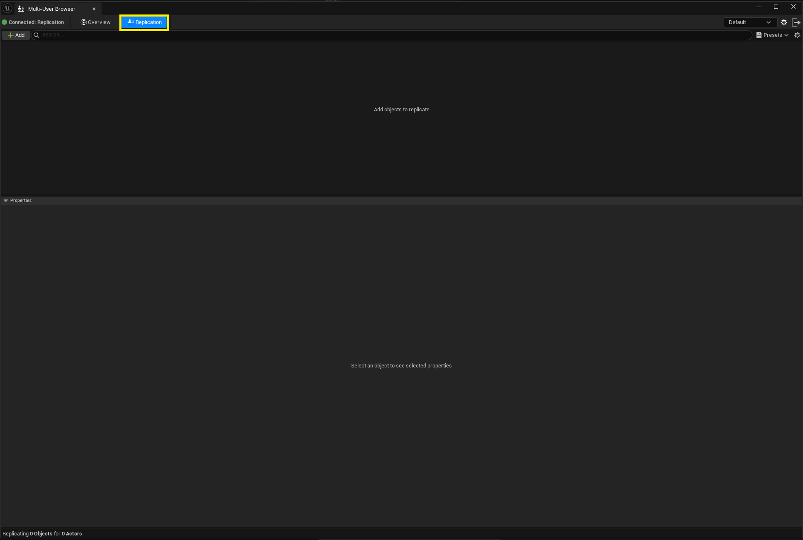
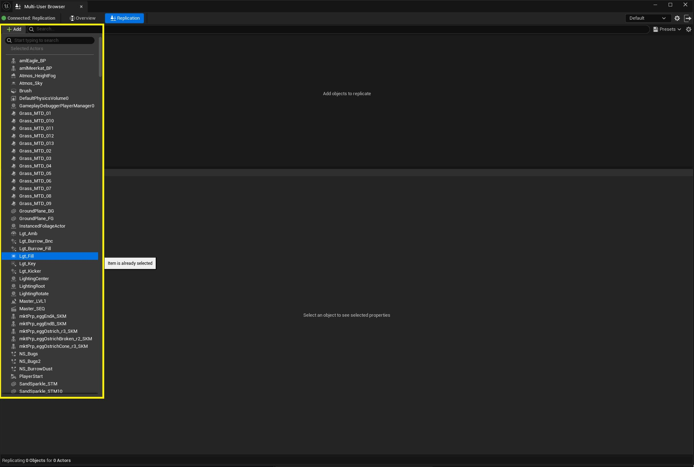
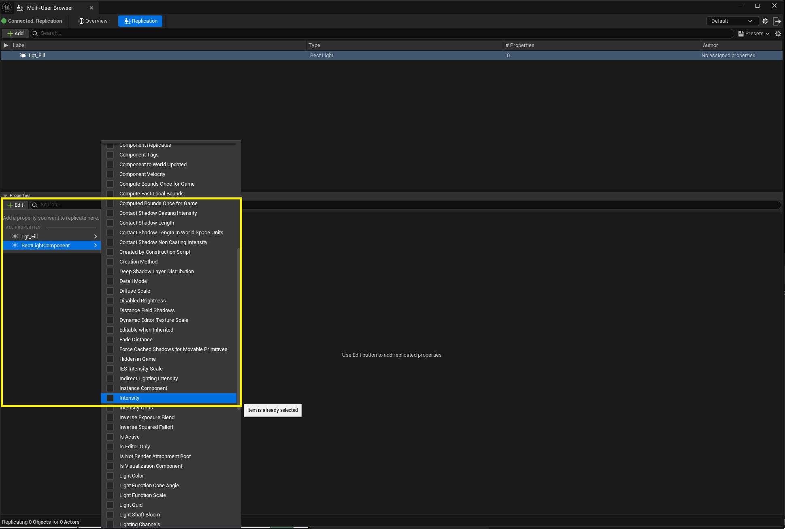
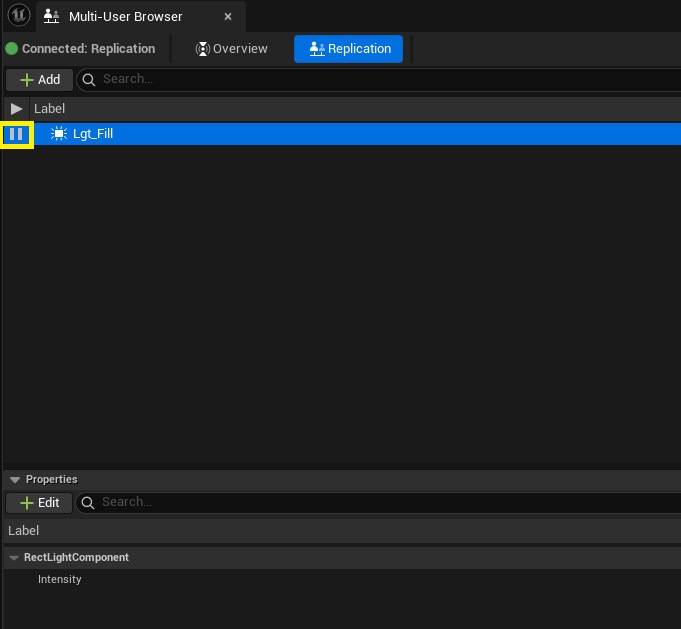
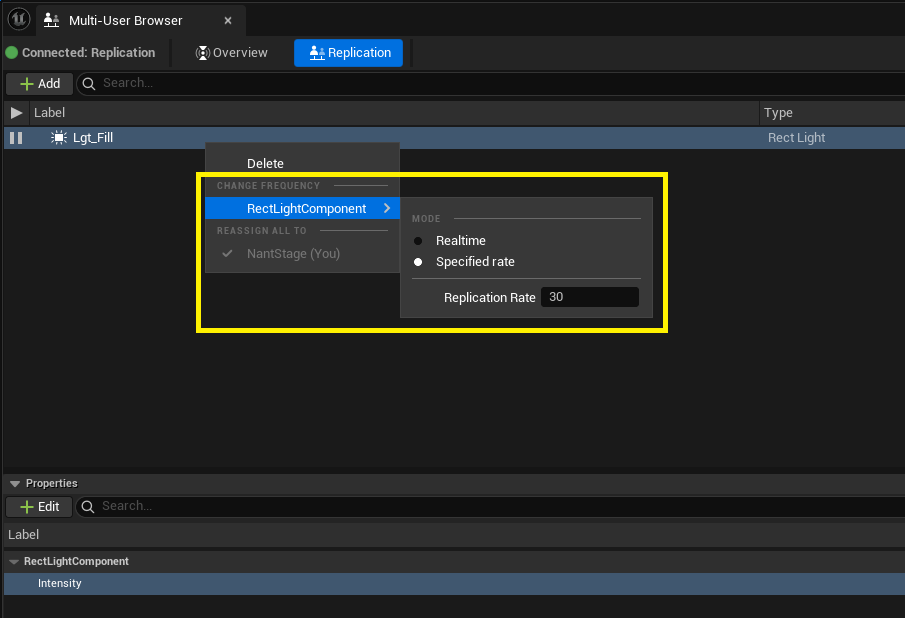
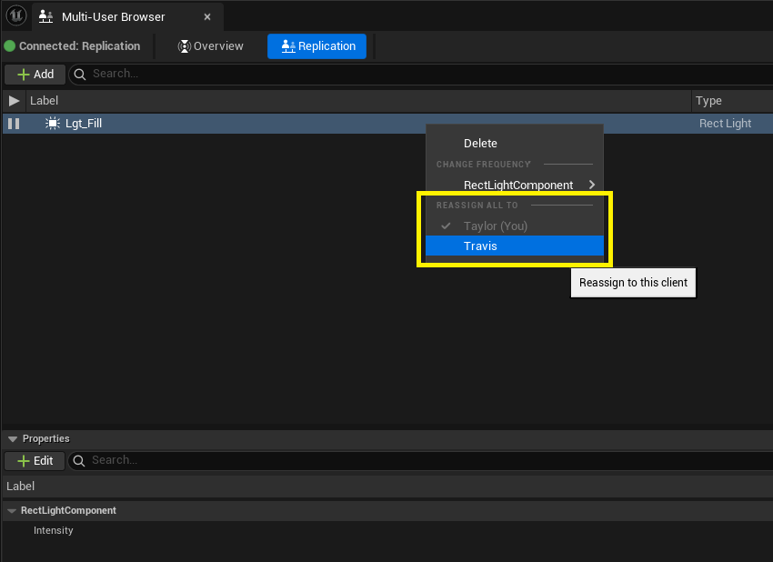
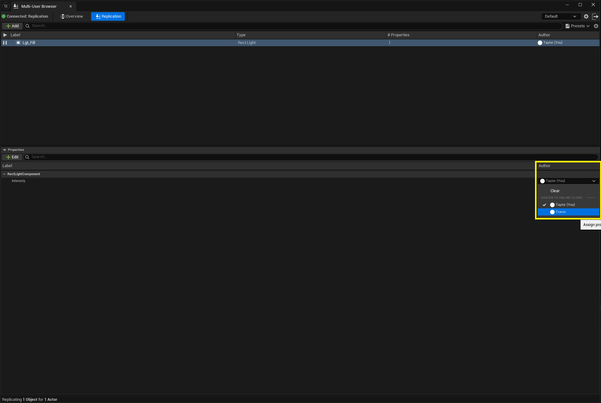
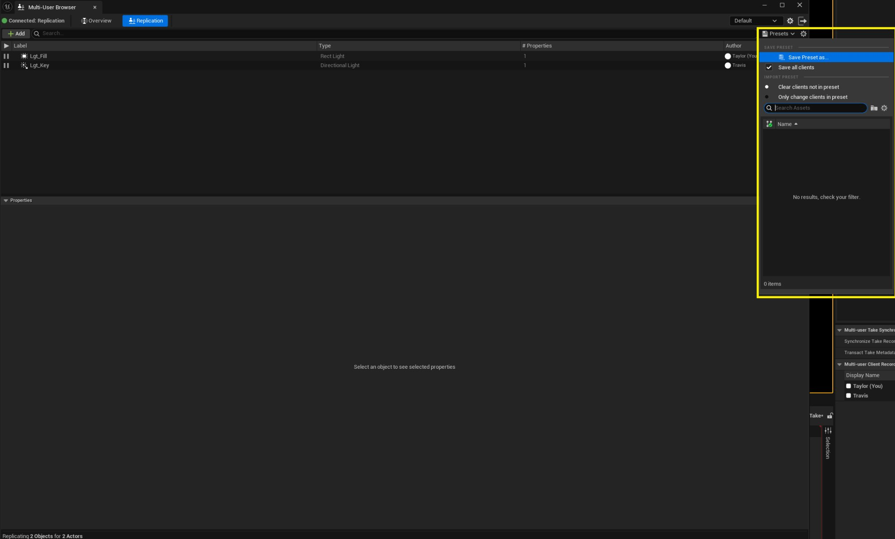

# 多用户复制

> 路径：虚幻引擎5.7文档 / 建立你的开发流程 / 虚幻引擎多用户编辑 / 多用户复制

> 原始页面：https://dev.epicgames.com/documentation/unreal-engine/multi-user-replication-in-unreal-engine

## 概述

多用户复制（Multi-User Replication）功能通过[多用户编辑](../index.md)实现在客户端之间进行Actor属性的实时复制。本用户指南将介绍如何使用多用户复制功能。

> [!NOTE]
> 此功能用于在编辑器之间复制对象。此系统不适合用于进行Gameplay的复制。

## 先决条件

要使用多用户复制，你必须将虚幻引擎项目配置为使用"多用户编辑（Multi-User Editing）"，运行多用户服务器，并加入一个会话。如需详细了解相关设置过程，请参阅[多用户编辑入门](../getting-started-with-multi-user-editing/index.md)。

## 打开复制选项卡

加入多用户会话后，点击 **复制（Replication）** 选项卡。

## 复制属性

多用户复制不会复制整个Actor。由于带宽限制，也不建议尝试复制Actor的所有属性。替代做法是选择单个属性进行复制。

要使用多用户复制功能实时复制某个属性，请执行以下步骤：

1. 转到 **复制（Replication）** 选项卡并点击 **添加（Add）** ，选择要复制的Actor。

   
2. 点击底部面板的 **编辑（Edit）** 按钮，从属性所在的组件选择属性。

   

   被添加的属性应该会被自动分配给添加该属性的客户端。这时，该客户端对该属性的求值将被复制给会话中的其他客户端。
3. 要停止对Actor的复制，请点击Actor名称旁的 **暂停（Pause）** 按钮。要继续复制，请点击 **运行（Play）** 按钮。

   

## 设置复制速率

默认情况下，被添加到复制中的Actor会尝试以每秒30帧的速率进行复制。要更改此速率，请右键点击Actor并将鼠标悬停在要更改速率的组件上。

可将速率设为下列选项之一：

- 实时（Realtime）

  ：组件的复制速率与引擎的求值速率一致。
- 指定速率（Specified Rate）

  ：组件将尝试以复制速率（Replication Rate）所指定的速率进行复制。

> [!NOTE]
> 如果编辑器的求值速率低于指定的复制速率，则复制速率将以较低的速率为上限。

## 更改属性作者

要更改作为某个Actor所有属性的复制作者的客户端，请右键点击顶部面板中的Actor，然后在 **全部重分配给（Reassign All To）** 类别中点击一名新作者。

要更改作为单个属性的复制作者的客户端，请在底部面板中找到该属性，然后点击 **作者（Author）** 下拉菜单，并选择一名新作者。

> [!NOTE]
> 如果多个客户端被指定为不同属性的作者，那么这些客户端都可以复制同一个Actor。

## 使用多用户复制预设

在复杂的复制环境中，将Actor和属性的分配保存起来以供日后调用，这种做法也许会很有价值。复制预设（Replication Preset）可以实现这种操作。

预设会将Actor的标签映射到客户端名称。如果多个客户端共享相同的名称，则预设将无法生效。为避免这种情况，请转到项目设置的 **多用户编辑（Multi-User Editing）** 分段，设置客户端的 **显示名称（Display Name）** 。

### 创建复制预设

要创建复制预设，请执行以下步骤：

1. 转到 **复制（Replication）** 选项卡，点击 **预设（Presets）** > **将预设另存为（Save Preset as...）** 。

   
2. 保存预设。

> [!NOTE]
> 如果你计划将来在不同会话中使用预设资产，请不要忘记将其持久化。

### 加载复制预设

要加载预设，请执行以下步骤：

1. 转到 **复制（Replication）** 选项卡，点击 **预设（Presets）** ，然后点击需要加载的预设。

   > 图片已省略：加载预设

## 进阶内容：默认属性

添加给定类的组件以供复制时，你可以配置默认添加的属性。

要配置默认属性，请执行以下步骤：

1. 打开虚幻引擎的主菜单，转至 **编辑（Edit）**> **项目设置（Project Settings）** 。
2. 转到多用户复制（Multi User Replication）分段，展开 **复制编辑器设置（Replication Editor Settings）** 。
3. 转到 **默认属性选择（Default Property Selection）** ，将类（通常是组件的类）映射到需要自动添加的属性。

   > 图片已省略：默认属性选择
4. 转到 **已添加的默认子对象规则（Default Added Subobject Rules）** ，指定 **默认属性选择（Default Property Selection）** 中定义的规则适用于哪些类型的Actor。这样就可以将 **默认属性选择（Default Property Selection）** 中指定的组件默认项应用于所需的Actor类。

   - 作为键，指定要应用规则的Actor类；默认情况下，应该有一条规则应用于所有Actor类。
   - 作为值，指定子对象（通常是组件）的类型，以应用

     默认属性选择（Default Property Selection）

     中的规则。

   > 图片已省略：已添加的默认子对象规则
