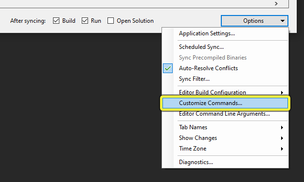
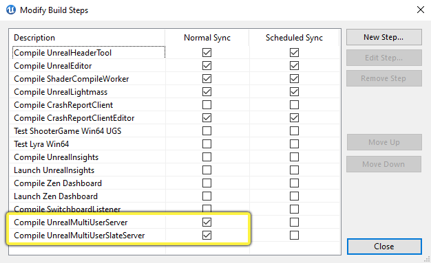
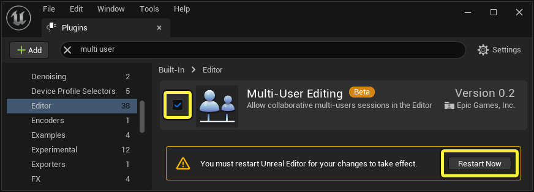
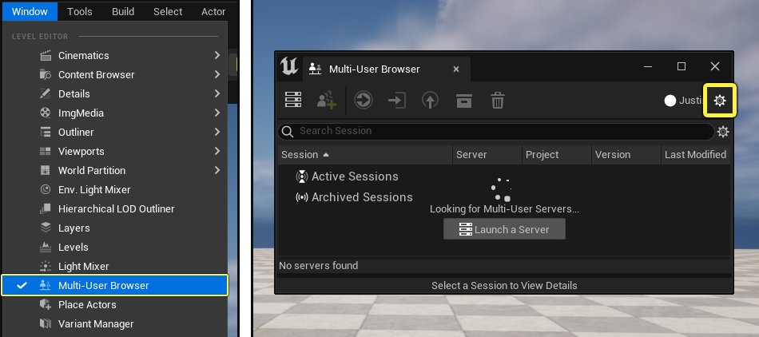
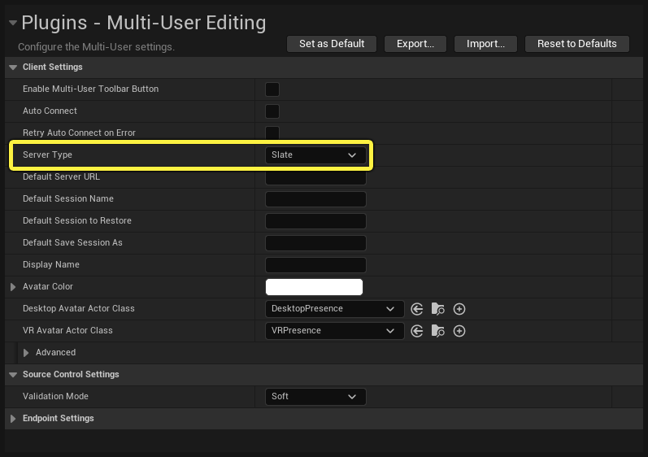
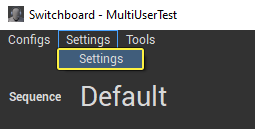
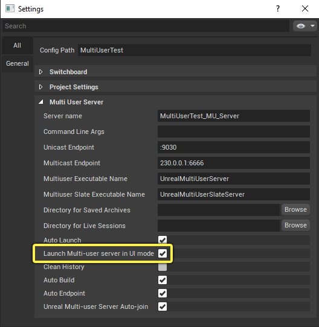
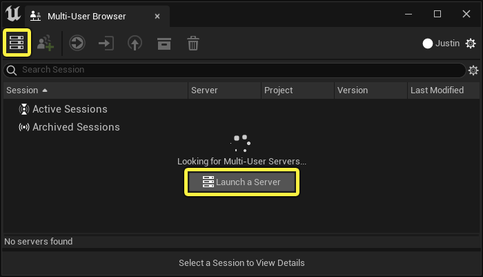

# 多用户服务器用户界面

> 路径：虚幻引擎5.7文档 / 建立你的开发流程 / 虚幻引擎多用户编辑 / 多用户服务器用户界面

> 原始页面：https://dev.epicgames.com/documentation/unreal-engine/multi-user-server-user-interface-in-unreal-engine

用户界面已添加到 **多用户服务器（Multi-User Server）** ，用于实时检查服务器的运行状态。 这样操作员和ICVFX舞台管理员就能在多用户服务器操作期间检查、监控和诊断问题。

这相对于控制台服务器有更大优势，后者仅通过控制台命令提供了连接信息的流送，并不提供有关运行中服务器操作的上下文信息。

控制台服务器仍可用于无界面计算机或无法运行UI的计算机上的操作。例如，Linux服务器或容器化操作。

## 构建多用户服务器

多用户服务器程序需要构建才能运行。如果你使用的是预编译的二进制版本，服务器应该预构建，并在启动引擎时可用。如果你从源构建虚幻引擎，我们推荐你使用 **UnrealGameSync** 为控制台和UI版本构建服务器的编译版本。

在UnrealGameSync中，你可以启用 **Compile UnrealMultiUserServer（编译UnrealMultiUserServer）** 和 **Compile UnrealMultiUserSlateServer（编译UnrealMultiUserSlateServer）** 选项，在正常同步操作期间构建服务器。 后者是基于UI的新服务器的名称。

1. 点击UnrealGameSync界面右下角的 **选项（Options）** ，并选择 **自定义命令（Customize Commands）** 。

   
2. 在"修改构建步骤（Modify Build Steps）"对话框中，启用 **编译UnrealMultiUserServer（Compile UnrealMultiUserServer）** 和 **编译UnrealMultiUserSlateServer（Compile UnrealMultiUserSlateServer）** 旁边的复选框。

   

## 启用多用户编辑插件

要使用多用户服务器，你必须在项目中启用 **多用户编辑（Multi-User Editing）** 插件。

1. 在编辑器中，转至 **编辑（Edit）** > **插件（Plugins）** ，打开插件浏览器。
2. 搜索"Multi-User"并启用 **多用户编辑（Multi-User Editing）** 插件。

   
3. 重启虚幻编辑器，然后继续。

# 更改设置以启动UI模式

启用插件后，你需要在多用户项目设置中更改默认服务器模式，使插件在UI模式下启动。

1. 在 **窗口（Window）** 菜单中，选择 **多用户浏览器（Multi-User Browser）** ，打开插件界面。

   
2. 点击 **多用户浏览器（Multi-User Browser）** 窗口右上角的 **设置** 齿轮图标。这将打开多用户编辑器插件设置。
3. 在 **客户端设置（Client Settings）** 下，将 **服务器类型（Server Type）** 属性更改为 **Slate** 模式。

   

### Switchboard支持

Switchboard中也支持在UI模式下启动多用户服务器。 Switchboard应用程序默认在UI模式下启动多用户服务器。

若要更改此行为，你可以在 **Switchboard设置（Switchboard Settings）** 菜单中调整全局设置。

1. 在Switchboard应用程序菜单中，转至 **设置（Settings）** > **设置（Settings）** 。

   
2. 向下滚动到 **多用户服务器（Multi User Server）** 分段。
3. 取消选中 **在UI模式下启动多用户服务器（Launch Multi-user server in UI mode）** 旁边的复选框，禁用用户界面版本。Switchboard现在将在控制台模式下启动多用户服务器会话。

   

## 运行多用户服务器

你可以从 **多用户浏览器（Multi-User Browser）** 编辑器面板或从 **Switchboard** 运行新服务器。

### 从多用户浏览器

多用户浏览器面板打开后，插件将自动搜索网络上的可用服务器。

你可以点击窗口中间的 **启动服务器（Launch a Server）** 按钮或工具栏左侧的服务器图标，启动新的服务器。

多用户服务器UI将在新窗口中打开。

> 图片已省略：启动多用户服务器

### 从Switchboard

在Switchboard应用程序中，点击窗口左下角的 **多用户服务器** 启动图标。

> 图片已省略：在Switchboard中启动多用户服务器

## 多用户服务器UI概述

多用户服务器界面包含三个区域。

> 图片已省略：多用户服务器UI

1. 菜单栏和选项卡。
2. 会话和客户端信息面板。
3. 命令控制台和输出日志。

### 菜单栏和选项卡

#### 窗口

窗口菜单将显示当前UI选项卡（会话、客户端或活动会话）中可用的浏览器窗口的上下文相关列表。 你可以使用此列表恢复之前关闭的窗口。

> 图片已省略：窗口菜单

#### 调试

在 **调试（Debug）** > **查看应用图标（View App Icons）** 下，你可以查看介绍多用户服务器界面中的所有图标的信息键。

> 图片已省略：多用户服务器图标键

#### 选项卡

菜单栏下面是一行选项卡，可用于在多用户服务器中的各种UI面板之间切换。默认情况下会显示 **会话（Sessions）** 和 **客户端（Clients）** 选项卡。 若双击 **活动的会话（Active Session）** 或 **存档的会话（Archived Session）** ，将打开新的选项卡面板，其中包含该会话的详细信息。

> 图片已省略：多用户服务器UI选项卡

### 命令控制台和输出日志

多用户服务器有一个输出日志，你可以在其中查看日志，了解与服务器操作相关的信息。 你可以找到错误、警告和通用诊断信息，辅助你对多用户服务器操作进行故障排除。

> 图片已省略：输出日志筛选器

"筛选器（Filters）"下拉菜单下提供了多个选项，用于限制哪些输出日志条目可见。

此界面还包含命令控制台，你可在其中修改各种控制台变量，影响多用户服务器的操作。

## 会话信息选项卡

类似于虚幻编辑器中可用的现有多用户浏览器，多用户服务器包含一个会话面板，你可在其中检查运行中会话和存档的会话。

> 图片已省略：会话信息面板

### 工具栏图标

选择活动的会话或存档的会话时，你可以从"会话（Sessions）"选项卡中的工具栏执行三个操作。

| 图标 | 说明 |
| --- | --- |
| 恢复会话 | 恢复所选会话。 |
| 存档会话 | 存档所选会话。 |
| 删除会话 | 在允许的情况下删除所选会话。 |

### 活动的会话

服务器上的所有 **活动的会话（Active Sessions）** 在此处列出，附带有关其服务器、项目名称、虚幻引擎版本和上次修改日期的摘要信息。右键点击活动的会话，可以从上下文菜单存档、重命名或删除该会话。

> 图片已省略：活动的会话上下文菜单

你可以 **双击** 活动的会话，在新选项卡中更详细地检查该会话。

### 存档会话

服务器上的所有 **存档的会话（Archived Sessions）** 都在此处列出，附带与上面相同的摘要信息。 右键点击存档会话，可以从上下文菜单恢复、重命名或删除该会话。

> 图片已省略：存档的会话上下文菜单

你可以双击存档的会话，在新选项卡中检查会话。

## 活动的会话选项卡

你可以在"会话信息面板（Sessions Information Panel）"中双击活动的会话，显示该会话的更多信息。 界面上将打开带有该会话名称的新选项卡，其中将显示该会话的信息。 活动会话的信息面板包含四个区域。

> 图片已省略：活动的会话面板

1. 已连接客户端
2. 会话历史记录
3. 操作详情
4. 会话内容

### 已连接客户端

从活动的会话选项卡，你可以点击 **已连接客户端（Connected Clients）** 按钮，检查当前连接到该会话的客户端。 "已连接客户端（Connected Clients）"按钮将转至 **客户端（Clients）** 主选项卡，其中的内容筛选为仅显示该特定会话中的活动连接。 你可以使用"客户端（Clients）"选项卡中的齿轮图标清除筛选器并显示所有客户端。

### 会话历史记录

活动的会话选项卡打开之后，会按时间顺序显示该会话期间发生的所有单独操作的历史记录。 该面板还会简要显示操作信息以及做出更改的客户端。

> 图片已省略：会话历史记录

你可以使用搜索栏在历史记录时间轴中查找特定操作。 齿轮图标下提供了多个显示筛选器。

> 图片已省略：历史记录筛选器

### 操作详情

你可以在"会话历史记录（Session History）"中选择单独的操作，并展开"细节（Details）"分段，展示有关该操作中做出的更改的更多信息。

> 图片已省略：操作详情

在 *修改的对象和属性（Modified objects and properties）** 下，你可以将鼠标悬停在列出的某个项目上方，将有提示文本显示具体修改了哪个资产。

### 会话内容

> 图片已省略：会话内容

**会话内容（Session Content）** 面板将列出对项目内容做出的所有更改。 添加新数据包时，会将其列出，并且在数据包名称左侧有一个加号图标。 该图标会在保存数据包时更改为勾选符号。

## 客户端信息选项卡

客户端信息选项卡将显示多用户服务器的网络信息，以及参与该服务器上会话的所有客户端的记录。

### 客户端表

客户端表将跟踪参与服务器的所有客户端，包括已连接和已断开连接的客户端。当前连接到多用户服务器中的活动会话的客户端将在表的左下角显示绿色色条。客户端从服务器断开连接时，色条会变为灰色。

> 图片已省略：客户端表

客户端表提供了每个客户端收发的活动网络数据的摘要视图。 你可以使用搜索栏检索特定客户端的信息。 你还可以右键点击特定客户端的边角并选择上下文菜单中的某个选项，查看该客户端的详细连接信息。

> 图片已省略：客户端表显示选项

- 打开日志（Open Log）：

  打开新选项卡，你可以在其中查看与此客户端相关的日志事件。
- 网络图表（Network Graph）：

  显示客户端的网络活动的实时图表。
- 出站片段表（Outbound segment table）：

  客户端发起的所有操作的逐项记录。
- 入站片段表（Inbound segment table）：

  客户端接收的所有操作的逐项记录。

这些表提供了有关客户端收发的活动数据的信息。

| 项目 | 说明 |
| --- | --- |
| 已发送 | 客户端发送的总数据。 |
| 已接收 | 客户端接收的总数据。 |
| RTT | 往返时间，以毫秒为单位。 |
| 在途 | 当前在途数据，等待由接收方确认。 |
| 丢失 | 有关丢包的信息。 |

在诊断高吞吐量情况下的可通过丢包时，此信息极其有用。 你可以确定不稳定或者可能由于网络拥塞或配置而不可访问的连接。

### 数据包列

服务器窗口右侧的"数据包（Packages）"列将显示客户端之间的数据包传输信息。 该视图提供了有关大量数据当前传输到其他客户端的深度信息。例如，关卡快照数据或GPU Lightmass烘焙。

> 图片已省略：数据包列

发送数据包的时间、大小和修订版信息可见。 **状态（State）** 列中的绿色勾号表示数据包已由接收方确认为完全传输，因此应该存在于节点上。 启用 **增强日志记录（Enhanced Logging）** 后，你还可以点击该勾号，确定用于发送数据包的确切消息。

### 增强日志记录

增强日志记录位于 **客户端（Clients）** 选项卡底部的 **服务器日志（Server Log）** 面板中。点击"服务器日志（Server Log）"面板中间的 **启用日志记录（Enable logging）** ，启用增强日志记录。

> 图片已省略：启用增强日志记录

增强日志记录会显示多用户服务器与其客户端之间的当前消息传输的详细视图。它是对所传输消息类型的检查。默认情况下，所有消息类型可见，还会显示发送时间、发送者、发送地点，以及客户端是否已确认。

"服务器日志（Server Log）"面板中的搜索栏左侧提供了各种筛选器。 点击下拉插入符号图标可显示筛选器。

> 图片已省略：服务器日志筛选器

> [!WARNING]
> 在服务器中启用增强日志记录后，无法将其关闭。日志记录信息会写入服务器日志文件所在目录中的CSV文件。长会话可能会生成非常大的CSV文件，因此你应该仅在对问题进行故障排除时启用此功能。

## 静音和删除操作

多用户服务器应用程序允许用户编辑现有会话数据，支持你将客户端生成的操作静音或删除。该功能适合用于确定和消除可能对用户操作造成问题的操作。

### 将会话存档

要使用该功能，你必须创建你希望编辑的会话的存档副本，并在多用户服务器中打开该存档会话。在"会话（Sessions）"选项卡中 **右键点击** 活动的会话，并在上下文菜单中选择 **存档（Archive）** 。 双击存档的会话将打开其信息面板。

> 图片已省略：将会话存档

打开存档的会话后，你可以选择操作并将其静音或删除。

### 删除操作

要删除操作，请在存档的会话中右键点击该操作，并从上下文菜单中选择 **编辑（Edit）** > **删除（Delete）** 。

> 图片已省略：删除操作

> [!WARNING]
> 请注意，删除操作是破坏性的，无法撤销。 将操作静音可以实现类似效果，但允许你稍后取消静音。 如果你有可能稍后恢复操作，请考虑改为静音。

### 将操作静音

如果你将存档的会话中的操作静音，当客户端在会话取消存档之后重新加入该会话时，不会重新播放该操作。静音的操作在操作历史记录中显示为变暗的条目。要将操作静音，请在操作历史记录中右键点击该操作，并从上下文菜单中选择 **静音（Mute）** 。

> 图片已省略：将操作静音

该工作流程产生的结果大体上与删除操作相同。 但是，你稍后随时可以将操作取消静音，而删除的操作则无法恢复。不管你要临时还是永久禁用操作，静音都是推荐的工作流程。

#### 依赖性分析

当你尝试将操作静音时，界面上会显示警告对话框，告知你将操作静音存在破坏下游依赖性的风险。

> 图片已省略：将操作静音的警告

由于一些操作可能依赖更早的操作，静音或删除总是需要对操作历史记录进行依赖性分析。该过程自动执行，并将查找彼此相关的操作。依赖性分析并非万无一失，在一些情况下，它无法确定某个操作是否依赖另一个操作。 在这些情况下，系统会向你提供包含或排除该操作的选项。在大部分情况下，还是谨慎为好。
