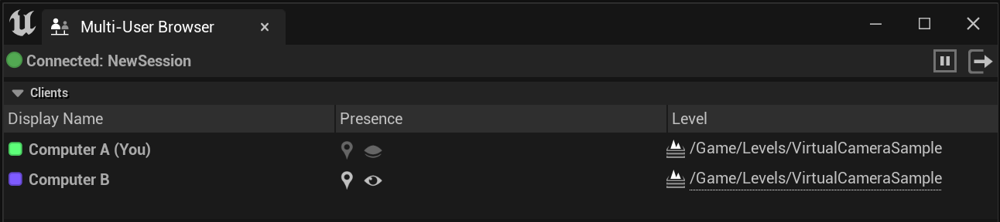
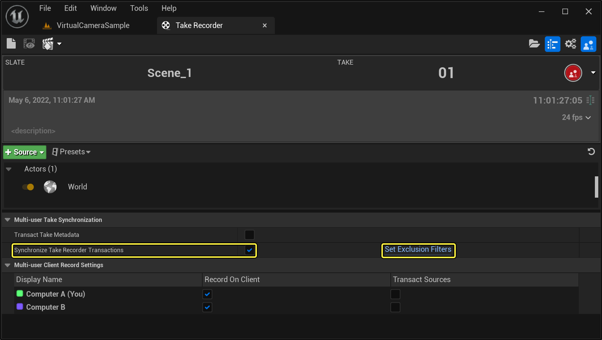
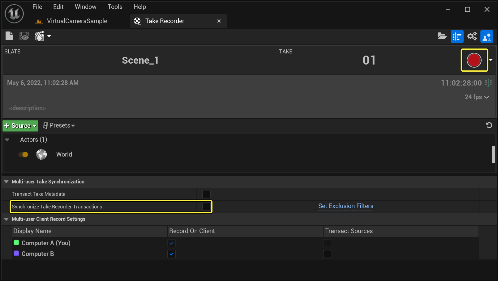
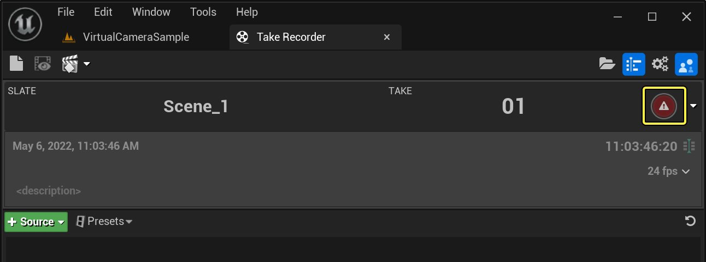

# 多用户镜头录制器

> 路径：虚幻引擎5.7文档 / 建立你的开发流程 / 虚幻引擎多用户编辑 / 多用户镜头录制器

> 原始页面：https://dev.epicgames.com/documentation/unreal-engine/multi-user-take-recorder-in-unreal-engine

在[多用户编辑](../index.md)会话中，你可以控制哪些节点包括在[镜头试拍录制](../../../animating-characters-and-objects/cinematics-and-movie-making/unreal-engine-sequencer-movie-tool-overview/take-recorder/index.md)会话中。 你可以将节点指定为录制节点，其中可能包含 **操作（Operator）** 会话中不可见的额外数据，例如，多用户会话中 **nDisplay** 或游戏节点的数据。

在下面的示例中，有四个节点连接到该会话。

- Computer A

  : 主操作员，使用多用户功能控制阶段（Stage）。
- Computer B

  ：辅助主操作员会话的编辑者节点。

在 **Take Recorder** 面板中，你还会在使用新的"设置"分段时看到类似的界面。

有一个称为 **同步Take Recorder操作（Synchronize Take Recorder Transactions）** 的主属性，用于控制发送多用户录制事件的触发器。禁用此属性时，对应的节点将灰显，这表示用户无法触发多用户录制。

"多用户镜头试拍同步"属性还包含指向 **多用户镜头试拍设置（Multi-User Take Settings）** 中的 **排除筛选器（Exclusion Filters）** 的快捷方式，这样用户就可以筛选源。之前，如果不指定筛选器，就无法在多用户设置中使用Take Recorder来防止进行录制的镜头试拍。

在下图中，"同步Take Recorder操作"已禁用，并且多用户图标消失了，这表示你将在本地进行录制。

在启用了"同步Take Recorder操作"的已连接会话中，已连接节点将有两个属性指示它们参与了多用户录制会话。

1. **在客户端上录制（Record on Client）**：这是在执行录制的客户端。 在"虚拟制片"阶段中，这通常会是作为录制权威的单台机器。
2. **操作源（Transact Sources）**：这些是为其他节点传达Take Recorder中的 **源** 的节点。 在上图中，源 **Actor_Blueprint** 由操作员节点提供。 操作员节点对源属性进行的任何更改都将传播到其他节点。如果其他节点更改了源，更改不会传播到其他节点。

指定了源并指定了至少一个进行录制的节点之后，多用户录制图标将重新显示，并且你可以开始录制。

> [!NOTE]
> 可以同时激活多个录制节点。 但是，此配置将生成多个Take Recorder资产，这些资产会附加录制节点的名称。 例如，如果 `computer_A` 和 `computer_B` 都在录制，`Scene_01_03` 将变为 `Scene_01_03_computer_A` 和 `Scene_01_03_computer_B`。 如果用户激活了多个录制节点，将向用户显示警告。

> [!WARNING]
> 如果不提供源，就无法开始录制。
>
> 
