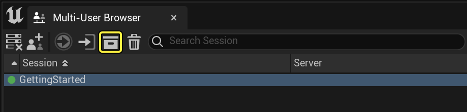
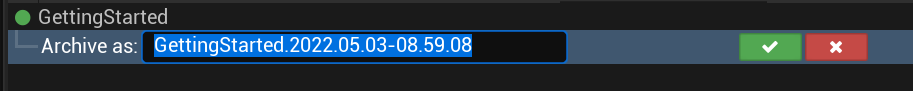
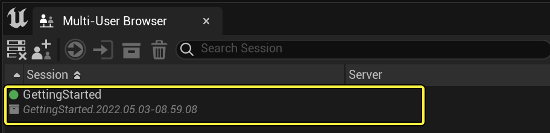
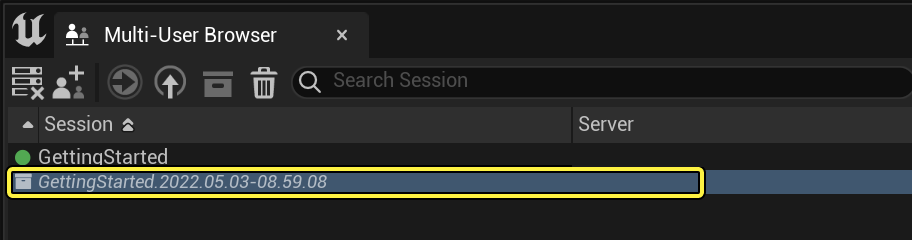
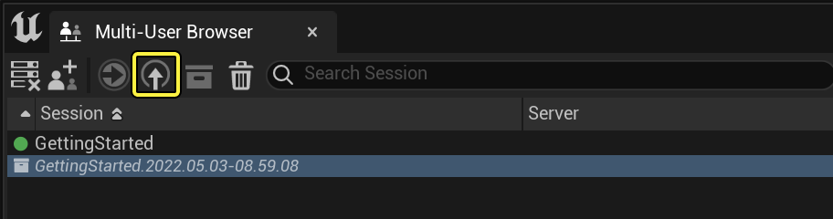
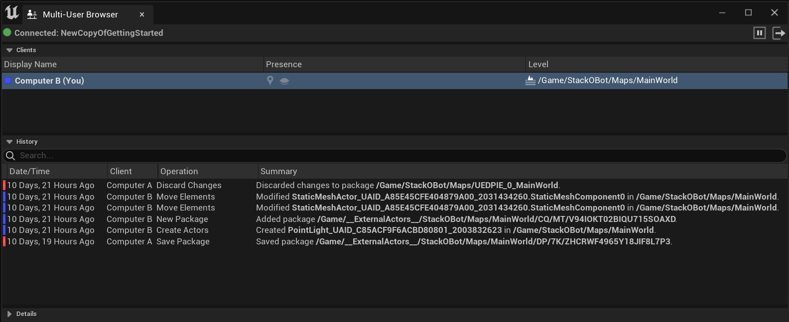

# 会话档案的保存和恢复

> 路径：虚幻引擎5.7文档 / 建立你的开发流程 / 虚幻引擎多用户编辑 / 会话档案的保存和恢复

> 原始页面：https://dev.epicgames.com/documentation/unreal-engine/saving-and-restoring-session-archives-in-unreal-engine

多用户编辑服务器可随时将在单个会话中进行的所有事务保存到磁盘上的档案中。稍后，可使用此档案创建包含所有这些更改的新会话。

本文中的介绍展示如何将会话保存至档案，以及稍后如何将档案恢复到活跃会话中。

> [!TIP]
> 将使用 **多用户浏览器** 中的功能按钮完成此操作。可通过在主菜单中选择 **窗口（Window）>开发人员工具（Developer Tools）>多用户浏览器（Multi-User Browser）** 或开启工具栏按钮打开此面板，进行多用户编辑。欲了解更多信息，请参见[快速入门](../getting-started-with-multi-user-editing/index.md)。

## 将会话保存至档案

按照本节中的说明，将活跃会话保存到磁盘上的档案中。

### 步骤

1. 选择要在 **多用户浏览器** 中保存的会话。
2. 单击工具栏中的 **档案** 图标，或右键单击会话，然后从快捷菜单中选择 **档案（Archive）**。

   
3. 立即在会话名称的下方，为档案文件设置描述性命名，然后点击复选框图标。

   

### 最终结果

新档案将出现在会话列表中。它与活跃会话的区别在于使用方框图标和浅灰色文本。

> [!TIP]
> 服务器将会话档案保存在虚幻引擎安装文件夹下的 `Engine\Programs\UnrealMultiUserServer\Saved\MultiUser` 中。

## 恢复已存档会话

按照本节中的介绍将档案恢复到活跃会话中，以便加入该会话并继续编辑。

### 步骤

从档案恢复会话：

1. 确保运行的服务器与用来创建原始会话的服务器相同。每台服务器负责将其会话保存到本地计算机上的档案中。这意味着每台服务器只能恢复其存档的会话。
2. 打开最初用于创建会话的项目，并确保该项目内容的状态与存档会话的原始状态相同。

   > [!NOTE]
   > 注意：恢复已存档会话时，与加入现有会话一样，磁盘上的项目内容状态必须与最初创建会话时项目内容的状态相同。
3. 选择要在 **多用户浏览器** 中恢复的档案。

   
4. 点击工具栏中的 **恢复** 图标或双击该档案，或者右键点击该档案，然后从快捷菜单中选择 **恢复（Restore）**。

   
5. 设置要从存储在档案中的事务创建的新会话的命名，然后点击复选框图标。

   Name the new session]

### 最终结果

多用户编辑系统会启动属于您的新会话，并立即将您加入该会话。历史记录（History）将显示会话运行期间所有事务的完整记录。工作时，将继续在现有历史上方添加新的事务。

