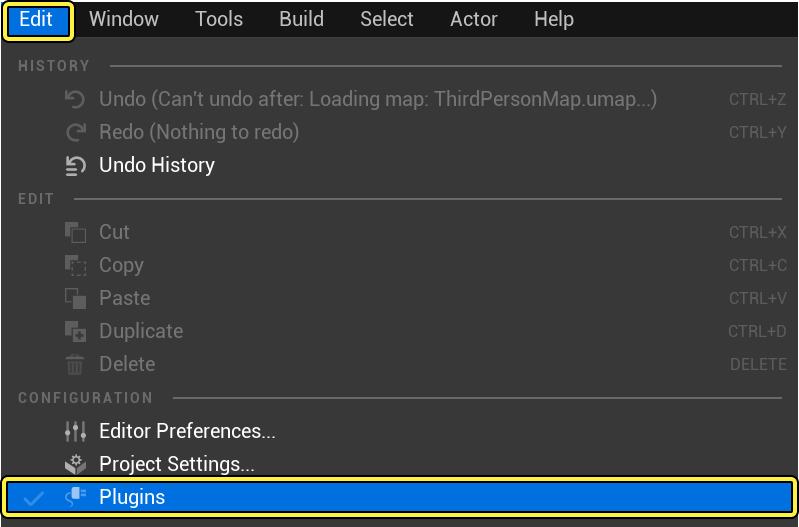
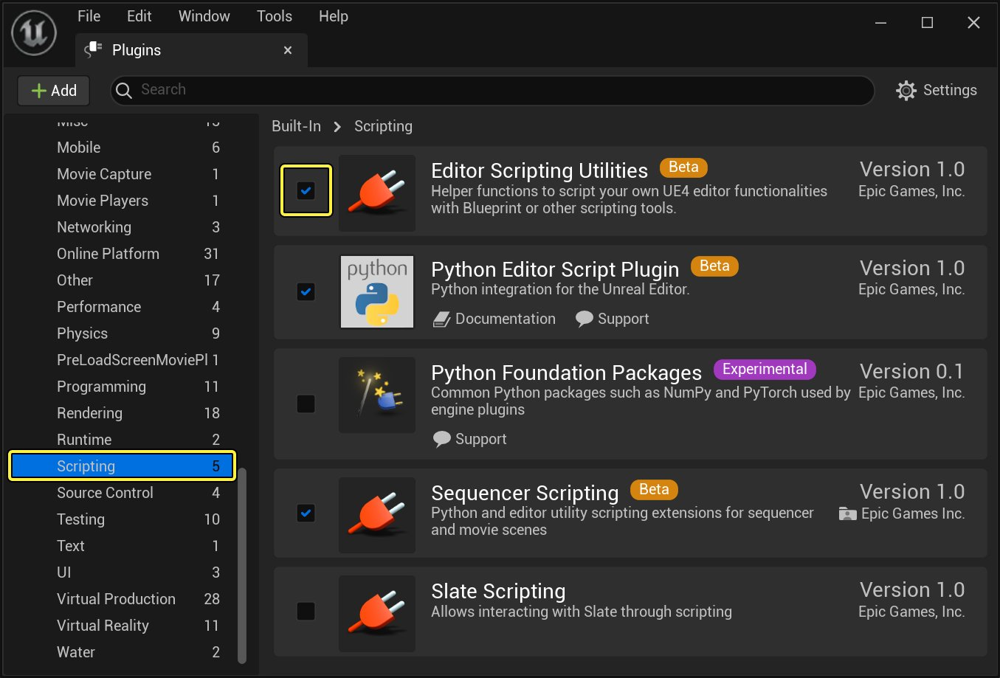

# 编辑器的脚本与自动化

> 路径：虚幻引擎5.7文档 / 建立你的开发流程 / 编辑器的脚本与自动化

> 原始页面：https://dev.epicgames.com/documentation/unreal-engine/scripting-and-automating-the-unreal-editor

在虚幻编辑器用户界面中，可以使用各种各样的可视化工具来设置项目，设计和构建关卡，创建游戏性交互等等。但有些时候，当你确定了需要编辑器执行的操作后，可能想要通过编程方式调用它的工具和命令——以可重复使用的脚本或是自行构建接口来驱动编辑器的方式。

这有助于：

- 减少或消除再三重复执行相同系列的任务的需求，
- 自动化或随机化在关卡中放置、布局和设置Actor的过程，
- 创建你自己的资源导入和管理流程，
- 与其他第三方应用程序和流程脚本互操作，
- 扩展编辑器，增加为满足项目或内容需求专门定制的额外工具甚至UI。

本部分的页面向你展示如何使用[蓝图](scripting-the-unreal-editor-using-blueprints/index.md)、[Python](https://dev.epicgames.com/documentation/404)和[远程控制HTTP](remote-control/index.md)运行这些种类的编辑器内脚本。

## 安装编辑器脚本实用程序（Editor Scripting Utilities）插件

无论你计划使用什么语言或系统来进行编辑器自动化，几乎肯定需要安装 **编辑器脚本实用程序（Editor Scripting Utilities）** 插件。该插件简化了许多需要在编辑器中执行的最常见的操作，也可以处理一些不常见的极端情况，使你无需了解编辑器工作原理的所有内部细节就可以执行一些从概念上来说很简单的任务。

要安装该插件：

1. 在主菜单中，选择 **编辑器（Editor） > 插件（Plugins）** 来打开 **插件（Plugins）** 窗口。

   
2. 在 **脚本（Scripting）** 类别下，找到 **编辑器脚本实用程序（Editor Scripting Utilities）** 条目并选中其 **启用（Enabled）** 框。

   
3. 如果希望使用 Python，也可以在该窗口中选中Python插件的

   启用（Enabled）

   框。有关更多信息，请参阅

   使用Python脚本化编辑器

   。
4. 重启编辑器并重新加载项目。
