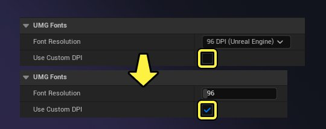
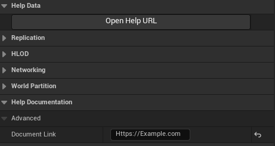

# 编辑条件

> 路径：虚幻引擎5.7文档 / 建立你的开发流程 / 编辑器的脚本与自动化 / 编程工具 / 细节面板自定义 / 编辑条件

> 原始页面：https://dev.epicgames.com/documentation/unreal-engine/edit-conditions-for-properties-in-the-details-panel-in-unreal-engine

有时你可能想要基于特定的编辑条件，选择性地在 **细节（Details）** 面板中显示、隐藏或禁用属性字段或其他UI元素。例如，项目设置中的 **字体分辨率（Font Resolution）** 设置会显示下拉字段，你可以在其中选择预设的DPI值，但如果你勾选 **使用** **自定义DPI（Use Custom DPI）** 设置，则会显示整型字段。



虚幻引擎（UE）提供在细节视图中处理自定义编辑条件的多种路径。本文档提供了Slate C++代码中实现 `UPROPERTY` 和自定义编辑条件的参考信息。

## 先决条件

本页面使用[细节面板自定义快速入门](../details-panel-quickstart-guide/index.md)教程作为示例基础，并提及以下内容：

- FCustomDataProperty – 由以下内容组成的自定义结构体：

  - TSoftObjectPtr

    CustomTexture
  - FName CustomName
  - FString CustomString
  - Int32 CustomInt
- ACustomActor – 一个添加了以下属性的简单Actor：

  - TSoftObjectPtr

    CustomMesh
  - float CustomFloat
  - bool CustomBool
  - FCustomDataProperty CustomData
- FCustomDataPropertyCustomization – 用于FCustomDataProperty的属性类型自定义。
- FCustomClassDetailsCustomization – 用于ACustomActor的细节自定义。

## UPROPERTY元数据中的编辑条件

你可以使用属性的 `UPROPERTY` 元数据通过 `EditCondition` 标签指定自定义编辑条件。编辑条件必须是字符串，其中包含用作编辑条件的字段或函数的名称。

```
 UPROPERTY(EditAnywhere)bool bAllowEdit; UPROPERTY(EditAnywhere, meta = (DisplayName = "Custom Integer", EditCondition = "bAllowEdit"))uint32 CustomInt; 
```

如果编辑条件未满足，则禁用属性。

### 编辑条件中的运算符

你可以使用 `EditCondition` 标签中的运算符提供更复杂的标准。比如，你可以：

- 使用不等于运算符

  !=

  ，允许在布尔值不为

  true

  时进行编辑。
- 使用

  >

  、

  >=

  、

  <

  和

  <=

  运算符，允许在变量处于特定阈值内时进行编辑。
- 使用AND运算符

  &&

  将多个编辑条件串在一起。
- 使用OR运算符

  ||

  提供备用编辑条件。

上述列表并不详尽，但代表了几种常见的逻辑运算符和比较运算符。以下是其中几个运算符的使用示例：

CustomActor.h

```
	UPROPERTY(EditAnywhere)	bool bRestrictEdit; 	//仅当bRestrictEdit不为true时，CustomInt才可编辑。	UPROPERTY(EditAnywhere, meta = (DisplayName = "Custom Integer", EditCondition = "!bRestrictEdit"))	uint32 CustomInt; 	//仅当CustomInt大于或等于10且小于或等于20并且bRestrictEdit为false时，CustomFloat才可编辑。	UPROPERTY(EditAnywhere, meta=(DisplayName = "Custom Float", EditCondition = "CustomInt > 10 && CustomInt < 20 && !bRestrictEdit"))	Float CustomFloat;
```

你还可以使用运算符 `==` 检查是否满足特定值。将枚举用作编辑条件时，这非常有用。

CustomActor.h

```
	UPROPERTY(EditAnywhere)	ECustomIntEditMode EditMode; 	//仅当EditMode为AllowEdit时，CustomInt才可编辑。	UPROPERTY(EditAnywhere, meta = (DisplayName = "Custom Integer", EditCondition = "EditMode==ECustomIntEditMode::AllowEdt"))	uint32 CustomInt;
```

### UPROPERTY编辑条件中的函数

`UPROPERTY` 编辑条件目前不支持使用函数。如果你需要将函数或委托用作编辑条件的基础，请参阅下面关于细节面板自定义中自定义编辑条件的小节。

### EditConditionHides

使用 `EditConditionHides` 元数据标签不仅可以禁用属性字段，还可以在不满足字段的编辑条件时隐藏它。

上面提到的字体分辨率（Font Resolution）设置使用的正是此方法。在C++代码中， `UUserInterfaceSettings` 实际上包含三个用于处理字体DPI的不同变量：

- 名为

  FontDPIPreset

  的

  EFontDPI

  枚举，代表下拉列表中的预设。
- 名为

  CustomFontDPI

  的

  uint32

  ，代表可编辑的整型字段。
- 名为

  bUseCustomFontDPI

  的布尔值，在上面两个变量的EditCondition中使用。

CustomClassDetailsCustomization.h

```
	#if WITH_EDITORONLY_DATA 	/**	* 控制UMG字体大小和像素高度之间的关系。	*/	UPROPERTY(config, EditAnywhere, Category = "UMG Fonts", meta = (DisplayName = "Font Resolution", EditCondition = "bUseCustomFontDPI", EditConditionHides, ClampMin = "1", ClampMax = "1000"))	uint32 CustomFontDPI; 	/**	* 控制UMG字体大小和像素高度之间的关系。	*/ 	UPROPERTY(config, EditAnywhere, Category = "UMG Fonts", meta = (DisplayName = "Font Resolution", EditCondition = "!bUseCustomFontDPI", EditConditionHides))	EFontDPI FontDPIPreset; 	/**	* 要设置你自己的自定义值，请勾选此框，然后在文本框中输入值。	*/ 	UPROPERTY(config, EditAnywhere, Category = "UMG Fonts", meta = (DisplayName = "Use Custom DPI"))	bool bUseCustomFontDPI;	#endif
```

> [!TIP]
> `UUserInterfaceSettings` 还在字体DPI计算中使用 `bUseCustomFontDPI`，用来选择是直接使用CustomFontDPI值，还是将FontDPIPreset转换为整型值。

`CustomFontDPI` 属性的 `EditCondition` 直接使用 `bUseCustomFontDPI`，这意味着 `bUseCustomFontDPI` 必须为true才能显示和使用 `CustomFontDPI`。

同时，`FontDPIPreset` 属性的 `EditCondition` 为 `"!bUseCustomFontDPI"`。运算符 `!` 表示bUseCustomFontDPI必须为false才能显示和使用 `FontDPIPreset`。

### InlineEditConditionToggle

`UPROPERTY` 元数据标签 `InlineEditConditionToggle` 在属性字段旁边提供了一个复选框，用于启用或禁用字段。这与用于渲染的后期处理字段类似。

```
//CustomInt有一个切换字段，直接显示在旁边，用于启用和禁用CustomInt。UPROPERTY(EditAnywhere, meta = (DisplayName = "Custom Integer", InlineEditConditionToggle))uint32 CustomInt;
```

这里没有使用 `EditCondition` 元数据标签 – `InlineEditConditionToggle` 提供并跟踪自己的切换字段。

## 细节面板自定义中的自定义编辑条件

你可以使用细节面板自定义创建更复杂或由函数决定的编辑条件。下面的示例就属性字段和Slate控件进行了相关演示。

### 属性字段的自定义编辑条件

要为属性字段创建自定义编辑条件：

1. 注册一个委托，该委托可以通过你想要触发刷新的任何属性刷新细节面板。有关此流程的更多细节，请参阅[刷新细节面板](../refreshing-custom-details-panels/index.md)。
2. 如有需要，请使用 `TSharedRef::Get` 和 `IPropertyHandle::GetValue` 获取属性的值。
3. 基于此值添加或隐藏属性。请参阅[重新排序和隐藏属性](https://dev.epicgames.com/documentation/404)，了解更多细节。

   CustomClassDetailsCustomization.h

   ```
         bool boolValue;     boolPropertyHandle.Get().GetValue(boolValue);      if (boolValue)     {         DetailBuilder.AddProperty(GET_MEMBER_NAME_CHECKED(ACustomActor, CustomMesh));     }     else     {         CustomCategory.HideProperty(GET_MEMBER_NAME_CHECKED(ACustomActor, CustomMesh));     } 
   ```

或者，你可以编写其他函数，用来封装显示和隐藏属性的逻辑、编译细节面板的各个部分的操作，或两者兼具。将 `IDetailLayoutBuilder` 引用作为你想要编译部分细节面板的函数的参数。提供属性句柄引用或属性值，作为你要予以考虑的函数的参数。

下面是 `CustomizeDetails` 函数的完整示例，该函数使用布尔值作为 `TSoftPtr<UStaticMesh>` 属性的编辑条件，以及刷新细节面板的委托。

CustomClassDetailsCustomization.cpp

```
	void FCustomClassDetailsCustomization::CustomizeDetails(IDetailLayoutBuilder& DetailBuilder)	{		//添加自定义设置类别。		IDetailCategoryBuilder& CustomCategory = DetailBuilder.EditCategory(FName("Custom Settings")); 		//添加CustomBool属性到自定义设置。		CustomCategory.AddProperty(GET_MEMBER_NAME_CHECKED(ACustomActor, CustomBool)); 		//获取CustomBool的属性句柄。		TSharedRef<IPropertyHandle> boolPropertyHandle = DetailBuilder.GetProperty(GET_MEMBER_NAME_CHECKED(ACustomActor, CustomBool)); 		//为值变更设置委托。将此添加到你要触发细节面板强制刷新的变量的属性句柄。		const FSimpleDelegate OnValueChanged = FSimpleDelegate::CreateLambda([&DetailBuilder](){			DetailBuilder.ForceRefreshDetails();			}); 		//将Property Value Changed的委托添加到CustomBool的属性句柄。		boolPropertyHandle->SetOnPropertyValueChanged(OnValueChanged); 		//从CustomBool的属性句柄中获取其值。		bool boolValue; 		boolPropertyHandle.Get().GetValue(boolValue); 		//如果CustomBool为true，则显示CustomMesh属性。如果CustomBool为false，则隐藏CustomMesh属性。		if (boolValue)		{		DetailBuilder.AddProperty(GET_MEMBER_NAME_CHECKED(ACustomActor, CustomMesh));		}		else		{		CustomCategory.HideProperty(GET_MEMBER_NAME_CHECKED(ACustomActor, CustomMesh));		} 	}
```

### Slate控件的自定义编辑条件

你可能需要在细节面板自定义中为更复杂的自定义Slate控件创建编辑条件。例如，在用户填写 **文档链接（Document Link）** 字段之前， **文档Actor（Documentation Actor）** 中的 **打开帮助URL（Open Help URL）** 按钮将被禁用。



`DocumentationActorDetails.cpp` 在带有 `SButton` 的自定义行中添加"打开帮助URL"按钮。`FDocumentationActorDetails::IsButtonEnabled` 使用 `IsEnabled` 参数控制是否启用按钮。

DocumentationActorDetails.cpp

```
	// 添加一个点击它即可打开文档的按钮	IDetailCategoryBuilder& HelpCategory = DetailBuilder.EditCategory("Help Data"); 	HelpCategory.AddCustomRow(LOCTEXT("HelpDocumentation_Filter", "Help Documentation"))		[			SNew(SButton)			.Text(this, &FDocumentationActorDetails::OnGetButtonText)			.ToolTipText(this, &FDocumentationActorDetails::OnGetButtonTooltipText)			.HAlign(HAlign_Center)			.OnClicked(this, &FDocumentationActorDetails::OnHelpButtonClicked)			.IsEnabled(this, &FDocumentationActorDetails::IsButtonEnabled) 		];
```

`FDocumentationActorDetails::IsButtonEnabled` 将根据是否存在有效的文档链接返回true或false。

DocumentationActorDetails.cpp

```
	bool FDocumentationActorDetails::IsButtonEnabled() const	{		bool bResult = false; 		if ((SelectedDocumentationActor.IsValid() == true) && (SelectedDocumentationActor->HasValidDocumentLink() == true))		{			EDocumentationActorType::Type LinkType = SelectedDocumentationActor->GetLinkType();			bResult = ((LinkType == EDocumentationActorType::UDNLink) || (LinkType == EDocumentationActorType::URLLink)) ? true : false;		} 		return bResult;	}
```

使用此实现刷新细节面板时，不需要进行额外的编程，因为在分配 `IsEnabled` Slate` 参数时，会自动添加所需的委托和响应。
