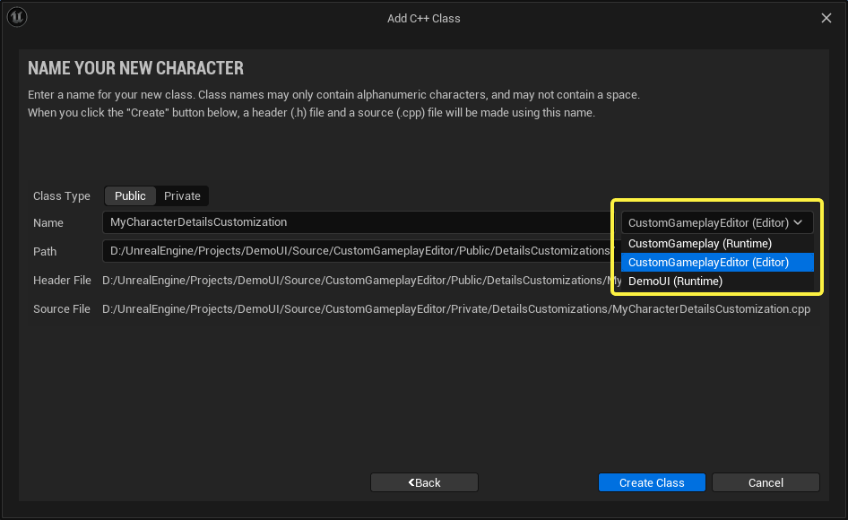

# 编辑器模块

> 路径：虚幻引擎5.7文档 / 建立你的开发流程 / 编辑器的脚本与自动化 / 编程工具 / 编辑器模块

> 原始页面：https://dev.epicgames.com/documentation/unreal-engine/setting-up-editor-modules-for-customizing-the-editor-in-unreal-engine

**编辑器模块** 是 **虚幻引擎（UE）** [C++模块](../../../../cpp-programming/programming-in-the-unreal-engine-architecture/unreal-engine-modules/index.md)，其代码仅针对编辑器版本进行编译。这有助于创建能够自定义编辑器功能的类，而不会使运行时（发布）版本变得臃肿。

设置编辑器模块需要比设置运行时模块多执行几个步骤，因为你会经常需要使用模块类来注册细节面板自定义内容或自定义编辑器窗口。本指南详细介绍了围绕这些目标设置编辑器模块的过程。

## 设置模块的目录结构

在你的项目的 **Source** 目录中，为运行时模块和编辑器模块各添加一个文件夹，然后分别为每个模块添加 **Private** 和 **Public** 文件夹。例如：

- CustomGameplay

  - Private
  - Public
- CustomGameplayEditor

  - Private
  - Public

在此示例中，CustomGameplay模块是一个运行时模块，CustomGameplayEditor模块是一个编辑器模块，提供支持CustomGameplay中的类和类型的编辑器自定义。

CustomGameplay针对编辑器和运行时版本编译，而CustomGameplayEditor仅针对编辑器版本编译，因为编辑器自定义的代码在发布你的项目时不是必要的。

我们强烈建议将你的编辑器功能整理为并行运行时和编辑器模块。这样一来，任意给定编辑器模块应该支持哪些类或Gameplay功能就很清晰了，并可维持强烈的封装意识。请参阅[虚幻引擎模块](../../../../cpp-programming/programming-in-the-unreal-engine-architecture/unreal-engine-modules/index.md)，详细了解运行时模块的优势。

> [!NOTE]
> 确保Private和Public文件夹以大写字母开头。虽然Windows不区分大小写，但许多源码控制系统会区分大小写，并且在文件夹名称开头使用大写字母可确保不生成重复文件夹。

## 填充你的运行时模块

要为你的运行时模块填写样板类，请执行以下操作：

1. 在CustomGameplay文件夹中，创建名为 `CustomGameplay.Build.cs` 的文件。按如下所示填充：

   CustomGameplay.Build.cs

   ```
        using UnrealBuildTool;      public class CustomGameplay: ModuleRules     {          public CustomGameplay(ReadOnlyTargetRules Target) : base(Target)          {                PrivateDependencyModuleNames.AddRange(new string[] {"Core", "CoreUObject", "Engine"});          }     }
   ```

   根据需要添加公共或私有依赖项以支持你的代码。
2. 在CustomGameplay/Private中，创建名为 `CustomGameplayModule.cpp` 的文件。按如下所示进行实现：

   CustomGameplayModule.cpp

   ```
        #include "Modules/ModuleManager.h"      IMPLEMENT_MODULE(FDefaultModuleImpl, CustomGameplay);
   ```

就此示例而言，此默认实现就足够了。编辑器模块提供了一个更详细的模块类实现示例。

## 填充你的编辑器模块

为你的编辑器模块设置样板代码类似于为运行时模块执行此操作的过程，但需要进行一些修改以包括Slate UI框架，并提供启动和关闭模块来初始化和清理你的编辑器功能。

1. 在CustomGameplayEditor文件夹中，创建名为 `CustomGameplayEditor.Build.cs` 的文件。按如下所示填充：

   CustomGameplayEditor.Build.cs

   ```
        using UnrealBuildTool;      public class CustomGameplayEditor: ModuleRules     {          public CustomGameplayEditor(ReadOnlyTargetRules Target) : base(Target)          {                PrivateDependencyModuleNames.AddRange(new string[] {"Core", "CoreUObject", "Engine", "CustomGameplay", "Slate", "SlateCore"});          }     }
   ```

   此文件包括 **Slate** 和 **SlateCore** ，因为它将被用于自定义编辑器。它还包括了CustomGameplay作为依赖项，因为它旨在为CustomGameplay的类提供编辑器。这些设置为私有依赖项，因为你不需要通过此项来公开这些模块。
2. 在CustomGameplayEditor/Public文件夹中，创建名为 `CustomGameplayEditorModule.h` 的文件。使用以下内容进行填充：

   CustomGameplayEditorModule.h

   ```
        #pragma once     #include "Modules/ModuleInterface.h"     #include "Modules/ModuleManager.h"      class FCustomGameplayEditorModule : public IModuleInterface     {         public:         virtual void StartupModule() override;         virtual void ShutdownModule() override;     }; 
   ```

   这会公开此模块的 `StartupModule` 和 `ShutdownModule` 函数，它们将被用于注册并清理自定义编辑器功能和子系统。
3. 在CustomGameplayEditor/Private文件夹中，创建名为 `CustomGameplayEditorModule.cpp` 的文件。使用以下内容进行填充：

   CustomGameplayEditorModule.cpp

   ```
    #include "CustomGameplayEditorModule.h"  IMPLEMENT_GAME_MODULE(FCustomGameplayEditorModule, CustomGameplayEditor);  void FCustomGameplayEditorModule::StartupModule() { }  void FCustomGameplayEditorModule::ShutdownModule() { }
   ```

   这会实现 `CustomGameplayEditorModule.h` 中的函数。

> [!WARNING]
> 你在 `IMPLEMENT_GAME_MODULE` 的第二个字段中提供的名称必须有效，否则你的项目将在运行时使用烘焙的数据时崩溃，这很难调试。请确保名称与模块的文件夹名称一致。

## 在你的项目中注册你的模块

现在你的两个模块都已实现，你需要将模块添加到项目。

1. 在文本编辑器中打开你的 `.uproject` 文件。将新条目添加到 **模块（Modules）** 分段。
2. 要注册运行时模块，请添加以下内容：

   .uproject file

   ```
        {         "Name": "CustomGameplay",         "Type": "Runtime",         "LoadingPhase": "Default"     },
   ```

   1. 要注册编辑器模块，请添加以下内容：

   .uproject file

   ```
        {         "Name": "CustomGameplayEditor",         "Type": "Editor",         "LoadingPhase": "Default"     }
   ```

   将 **编辑器（Editor）** 用作你的 **类型（Type）** 表示这是一个编辑器模块。因此，当你创建项目的运行时版本时，它不会被编译。
3. 打开你的项目的 `Target.cs` 文件。将 **"CustomGameplay"** 添加到 `ExtraModuleNames` 。

   Target.cs

   ```
        ExtraModuleNames.Add("CustomGameplay");
   ```
4. 打开你的项目的Editor.Target.cs文件。将 **"CustomGameplayEditor"** 和 **"CustomGameplay"** 添加到ExtraModuleNames。

   Editor.Target.cs

   ```
        ExtraModuleNames.AddRange(new string[]("CustomGameplayEditor", "CustomGameplay"));
   ```
5. 打开你的项目的Build.cs文件。在PublicDependencyModuleNames.AddRange中，添加"CustomGameplay"的条目：

   Build.cs

   ```
        PublicDependencyModuleNames.AddRange(new string[] { "Core", "CoreUObject", "Engine", "InputCore", "CustomGameplay" });
   ```
6. 保存你编辑过的所有文件，然后右键点击你的.uproject并重新生成项目文件。
7. 编译项目的代码。

## 最终效果

当你在IDE中查看项目时，你的解决方案文件现在会显示你的两个新模块以及你的主应用程序模块。此外，当你编译项目时，你会在"新建C++类"向导的模块下拉菜单中看到你的模块。


