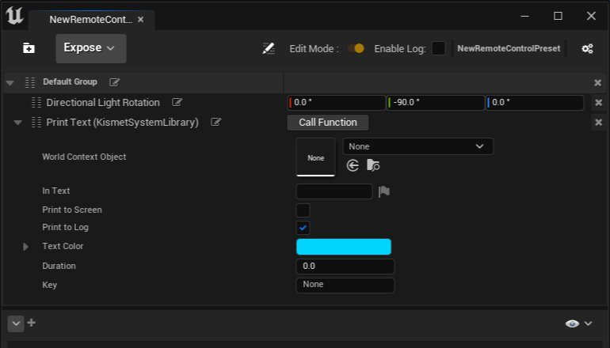
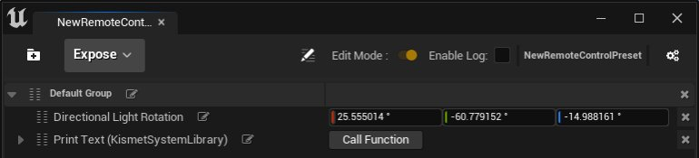

# 远程控制预设API HTTP参考

> 路径：虚幻引擎5.7文档 / 建立你的开发流程 / 编辑器的脚本与自动化 / 远程控制 / 远程控制预设API HTTP参考

> 原始页面：https://dev.epicgames.com/documentation/unreal-engine/remote-control-preset-api-http-reference-for-unreal-engine

此页面介绍[远程控制预设](../remote-control-presets-and-web-application/index.md)的[远程控制API](../index.md)提供的HTTP端点，并详细介绍了调用各个端点时需要包括的消息正文格式。

> [!NOTE]
> 此页面中的示例使用 **蓝图第三人称（Blueprint Third-Person）** 模板。要按照示例进行操作，请将 **远程控制预设（Remote Control Preset）** 添加到项目，将其命名为MyPreset，并提供以下属性和函数：
>
> - 定向光源的旋转属性，重命名为 **定向光源旋转（Directional Light Rotation）**
> - Kismet系统库中的Print Text函数，并启用 **打印至日志（Print to Log）**
>
> 

## GET remote/presets

使用此端点获取所有可用预设的列表。调用将返回JSON有效载荷，并提供项目中每个 **远程控制预设（Remote Control Preset）** 的信息。

### 示例

使用空白请求正文发送请求。成功的请求将会返回200状态和包含以下属性的响应正文：

```
	{		"Presets": [			{				"Name": "MyPreset",				"Path": "/Game/Presets/MyPreset.MyPreset"			}		]	} 
```

## GET remote/preset/insert_preset_name

使用此端点获取有关你项目中特定预设的详细信息。在URL中，将 `insert_preset_name` 替换为你项目中 **远程控制预设（Remote Control Preset）** 的名称。如果找到了具有指定名称的预设，调用将返回JSON有效载荷以及与预设相关的信息。

> [!NOTE]
> 如果找不到具有指定名称的预设，调用将返回JSON有效载荷以及错误消息：
>
> ```
> 	{		"errorMessage": "Preset insert_preset_name could not be found."	}
> ```

### 示例

发送具有空白请求正文的请求GET `http://localhost:30010/remote/preset/MyPreset` 将返回状态为200的成功请求，以及以下响应正文：

```
	{		"Preset": {			"Name": "MyPreset",			"Path": "/Game/Presets/MyPreset.MyPreset",			"Groups": [				{					"Name": "Lighting",					"ExposedProperties": [						{							"DisplayName": "Directional Light Rotation",							"UnderlyingProperty": {								"Name": "RelativeRotation",								"Description": "Rotation of the component relative to its parent",								"Type": "FRotator",								"ContainerType": "",								"KeyType": "",								"Metadata": {									"ToolTip": "Rotation of the component relative to its parent"								}							}						}					],					"ExposedFunctions": []				},				{					"Name": "Print",					"ExposedProperties": [],					"ExposedFunctions": [						{							"DisplayName": "Print Text (KismetSystemLibrary)",							"UnderlyingFunction": {								"Name": "PrintText",								"Description": "Prints text to the log, and optionally, to the screen\nIf Print To Log is true, it will be visible in the Output Log window.  Otherwise it will be logged only as 'Verbose', so it generally won't show up.\n\n@param       InText                  The text to log out\n@param       bPrintToScreen  Whether or not to print the output to the screen\n@param       bPrintToLog             Whether or not to print the output to the log\n@param       bPrintToConsole Whether or not to print the output to the console\n@param       TextColor               Whether or not to print the output to the console\n@param       Duration                The display duration (if Print to Screen is True). Using negative number will result in loading the duration time from the config.",								"Arguments": [									{										"Name": "WorldContextObject",										"Description": "",										"Type": "UObject*",										"ContainerType": "",										"KeyType": "",										"Metadata": {}									},									{										"Name": "InText",										"Description": "",										"Type": "FText",										"ContainerType": "",										"KeyType": "",										"Metadata": {}									},									{										"Name": "bPrintToScreen",										"Description": "",										"Type": "bool",										"ContainerType": "",										"KeyType": "",										"Metadata": {}									},									{										"Name": "bPrintToLog",										"Description": "",										"Type": "bool",										"ContainerType": "",										"KeyType": "",										"Metadata": {}									},									{										"Name": "TextColor",										"Description": "",										"Type": "FLinearColor",										"ContainerType": "",										"KeyType": "",										"Metadata": {}									},									{										"Name": "Duration",										"Description": "",										"Type": "float",										"ContainerType": "",										"KeyType": "",										"Metadata": {}									}								]							}						}					]				}			]		}	} 
```

## GET remote/preset/insert_preset_name/metadata

使用此端点获取与预设关联的所有元数据。在URL中，将 `insert_preset_name` 替换为你项目中 **远程控制预设（Remote Control Preset）** 的名称。此调用将返回JSON有效载荷以及该预设的元数据条目。

### 示例

发送具有空白请求正文的请求GET `http://localhost:30010/remote/preset/MyPreset/metadata` 将返回状态为200的成功请求，以及以下响应正文：

```
	{		"Metadata": {}	} 
```

> [!NOTE]
> 使用 `PUT remote/preset/insert_preset_name/metadata/insert_metadata_key` 添加元数据条目之后，调用此端点将在此结果中包括这些键值对。

## PUT remote/preset/insert_preset_name/metadata/insert_metadata_key

使用此端点创建或更新预设的元数据键值对。元数据键可以是人和名称，但请求正文必须在JSON对象中包含属性 **"Value"**；任何其他属性都会使值成为空白字段。调用将仅返回请求的状态。

### 示例

发送请求 `PUT http://localhost:30010/remote/preset/MyPreset/metadata/MyKey`，请求正文如下：

```
	{		"Value": "MyValue"	} 
```

成功的请求将会返回200状态。通过调用 `GET http://localhost:30010/remote/preset/MyPreset/metadata` 验证是否已创建键值对：

```
	{		"Metadata": {			"MyKey": "MyValue"		}	} 
```

## GET remote/preset/insert_preset_name/metadata/insert_metadata_key>

使用此端点读取与元数据键关联的值。此调用将返回JSON有效载荷以及请求的信息。

### 示例

发送请求`GET http://localhost:30010/remote/preset/MyPreset/metadata/MyKey`，使用空白的请求正文。成功的请求将会返回200状态以及以下响应正文：

```
	{		"Value": "MyValue"	} 
```

## DELETE remote/preset/insert_preset_name/metadata/insert_metadata_key

使用此端点移除与预设关联的元数据键值对。调用将仅返回请求的状态。

### 示例

发送请求 `DELETE http://localhost:30010/remote/preset/MyPreset/metadata/MyKey` 将会返回状态为200的成功请求。通过调用 `GET http://localhost:30010/remote/preset/MyPreset/metadata` 验证是否已删除键值对：

```
	{		"Metadata": {}	} 
```

## GET remote/preset/insert_preset_name/property/insert_property_name

使用此端点读取预设中公开的属性。此调用将返回JSON有效载荷以及请求的信息。

### 示例

发送请求 `GET http://localhost:30010/remote/preset/MyPreset/property/Directional Light Rotation`，使用空白的请求正文。

成功的请求将会返回200状态以及以下响应正文：

```
	{		"PropertyValues": [			{				"ObjectPath": "/Game/ThirdPerson/Maps/ThirdPersonMap.ThirdPersonMap:PersistentLevel.DirectionalLight_0.LightComponent0",				"PropertyValue": {					"Pitch": -60.779161,					"Yaw": -14.98808,					"Roll": 25.555014				}			}		]	} 
```

## PUT remote/preset/insert_preset_name/property/insert_property_name

使用此端点更新预设中公开的属性的值。

### 示例

发送请求 `PUT http://localhost:30010/remote/preset/MyPreset/property/Directional Rotation Light`，请求正文如下：

```
	{		"PropertyValue": {			"Pitch": -90,			"Yaw": 0,			"Roll": 0		},		"GenerateTransaction": true	} 
```

成功的请求将会返回200状态。通过查看预设中的属性来验证更改：



## PUT remote/preset/insert_preset_name/function/insert_function_name

使用此端点调用预设中公开的函数。调用将返回JSON有效载荷以及函数的任何返回值。

## 示例

发送请求 `PUT http://localhost:30010/remote/preset/MyPreset/function/Print Text (KismetSystemLibrary)`，使用以下请求正文：

```
	{		"Parameters": {			"InText": "Hello, World"		},		"GenerateTransaction": true	} 
```

A successful request returns a 200 status with the following response body and "Hello, World" printed to the Output Log:

```
	{		"ReturnedValues": [			{}		]	}
```
