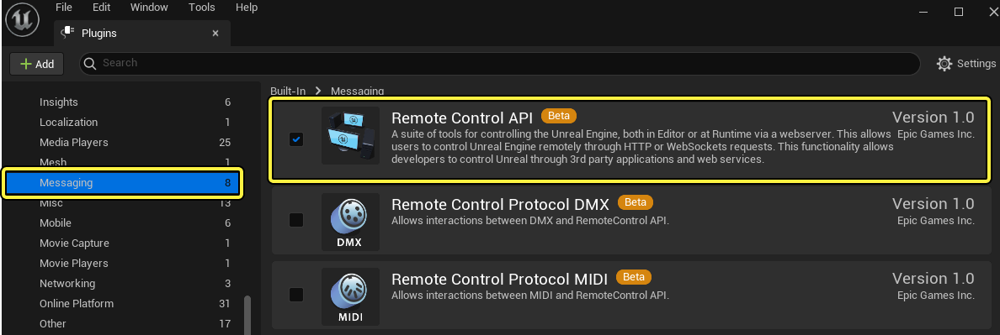
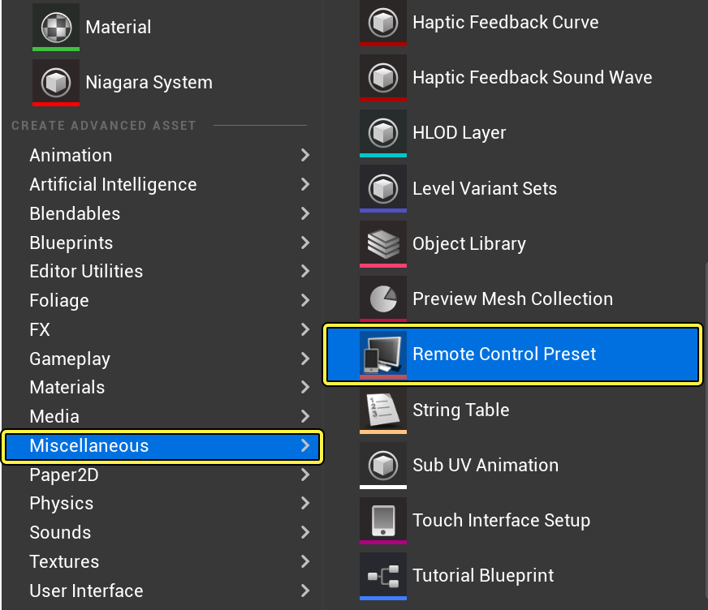
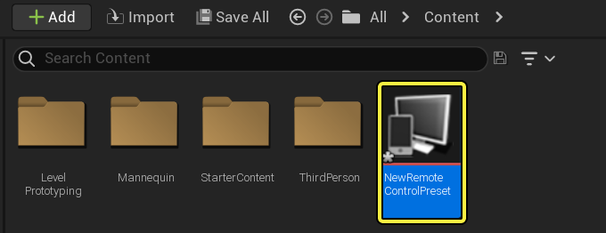
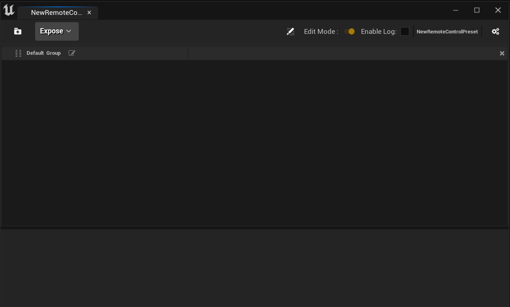
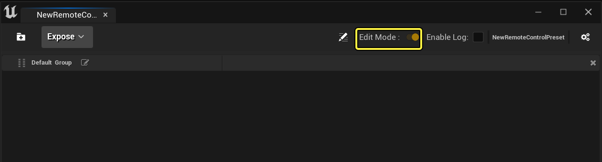
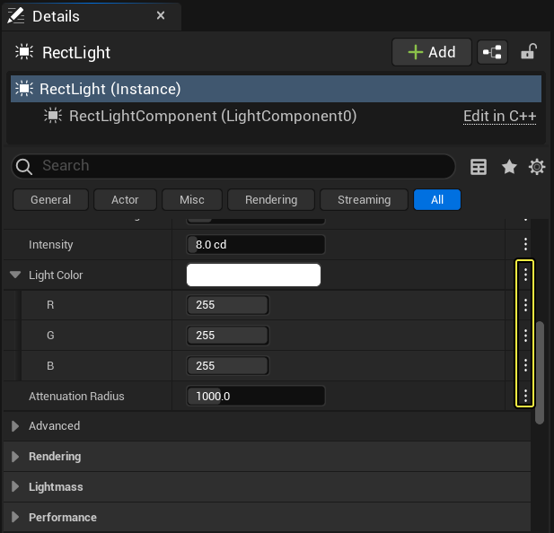
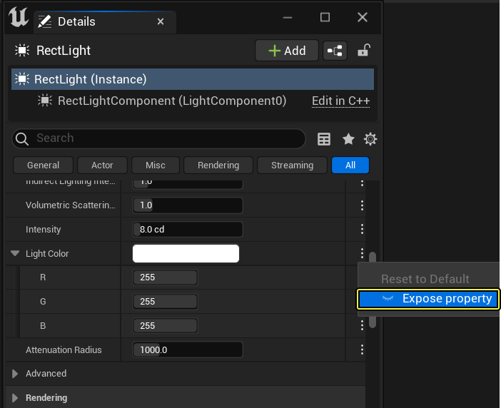
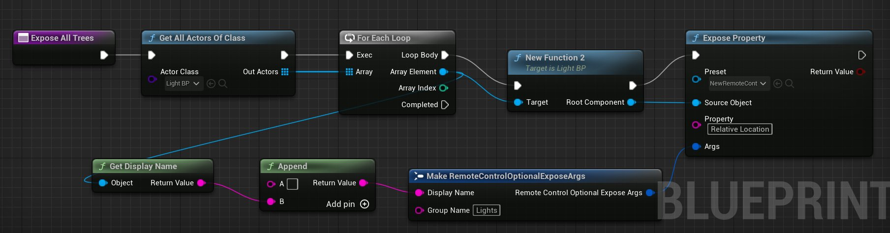

# 远程控制预设入门

> 路径：虚幻引擎5.7文档 / 建立你的开发流程 / 编辑器的脚本与自动化 / 远程控制 / 远程控制预设和Web应用程序 / 远程控制预设入门

> 原始页面：https://dev.epicgames.com/documentation/unreal-engine/getting-started-with-remote-control-presets-in-unreal-engine

你可以利用 **远程控制预设（Remote Control Preset）** 收集UI参数或函数并整理到单个面板中，然后向远程控制API公开。这些参数和函数可以连接到 **远程控制Web界面（Remote Control Web Interface）** 插件提供的伙伴Web应用程序中的控件，从而远程控制引擎。

本页面将介绍如何将属性和函数从虚幻编辑器公开给远程控制API。如需详细了解远程控制面板中的所有设置，请参考[远程控制面板参考](../remote-control-panel-reference/index.md)。

## 先决条件

**远程控制API（Remote Control API）** 插件提供了网络服务器，能够为 **远程控制预设（Remote Control Preset）** 托管数据和websocket连接。

按照下面的步骤为你的项目启用插件。

1. 在虚幻编辑器中打开你的项目。
2. 在编辑器的主菜单中，选择 **编辑（Edit） > 插件（Plugins）** 以打开 **插件（Plugins）** 窗口。
3. 在 **插件（Plugins）** 窗口中，在 **消息传递（Messaging）** 类别下找到 **远程控制API（Remote Control API）** 插件。勾选 **启用（Enabled）** 复选框。

   
4. 重启引擎。

## 将属性公开给远程控制面板和远程控制API

在 **虚幻编辑器** 下的 **远程控制面板（Remote Control Panel）** 中，你将关卡中的多个对象的属性收集起来，以便于访问。你还可以将函数添加到面板，然后从面板中调用函数。向 **远程控制面板（Remote Control Panel）** 公开属性和函数的同时，也会向 **远程控制API（Remote Control API）** 公开。这有助于操作者在实时环境中轻松整理需要控制的任何项。

按照下面的步骤添加 **远程控制预设（Remote Control Preset）** ，然后打开 **远程控制面板（Remote Control Panel）** 。

1. 在 **内容侧滑菜单（Content Drawer）** 中按 **添加（Add）** 并找到 **杂项（Miscellaneous）** 分段。选择 **远程控制预设（Remote Control Preset）** 。

   

   
2. 双击 **远程控制预设资产（Remote Control Preset Asset）** 打开 **远程控制面板（Remote Control Panel）** 。

   
3. 勾选 **编辑模式（Edit Mode）** 复选框。

   
4. 在 **资产（Assets）** 的 **细节（Details）** 面板中，每个属性现在都有该属性的设置菜单（三个点）。

   
5. 左键点击设置菜单，可看到闭上或睁开的眼睛图标。

   
6. 眼睛图标表示属性是否已添加到 **远程控制面板（Remote Control Panel）** ：

   - 睁开（open）

     的眼睛图标表示属性

     已

     添加到远程控制面板。
   - 闭上（closed）

     的眼睛图标表示属性

     未

     添加到远程控制面板。
   - 点击睁开的眼睛图标可以让它闭上，点击闭上的眼睛图标可以让它睁开；属性将会相应地从远程控制面板中添加或移除。
7. 当属性在远程控制面板中时，它的界面与 **细节（Details）** 面板中相同。

   远程控制面板界面 细节面板界面

   在远程控制面板（左侧）和细节面板（右侧）中具有RGB值的光源颜色属性。
8. 右键点击 **远程控制预设（Remote Control Preset）** 并选择 **保存（Save）** 以保存你的更改。

## 通过蓝图库公开属性和函数

> [!WARNING]
> 此功能还在实验阶段，可能会在下一次发布时发生变化。

你可以使用蓝图库将属性、函数和Actor公开给远程控制API，并自动完成填充远程控制预设的过程。如需详细了解如何使用蓝图公开这些内容，请参考[蓝图API](https://docs.unrealengine.com/BlueprintAPI/)。

在下面的示例蓝图中，函数被设置为公开类 **Light_BP** 的所有树。

点击查看大图。

在函数运行时，远程控制预设将显示类 **Light_BP** 的所有树。

> 图片已省略：undefined

点击查看大图。

## 后续步骤

在本指南中，你学习了如何将属性公开给远程控制API，以及如何创建远程控制预设。请参考以下文档，了解如何在实时环境中使用这些公开的属性。

- [远程控制Web应用程序](../remote-control-web-application/index.md)
- [远程控制协议](../remote-control-protocols/index.md)
