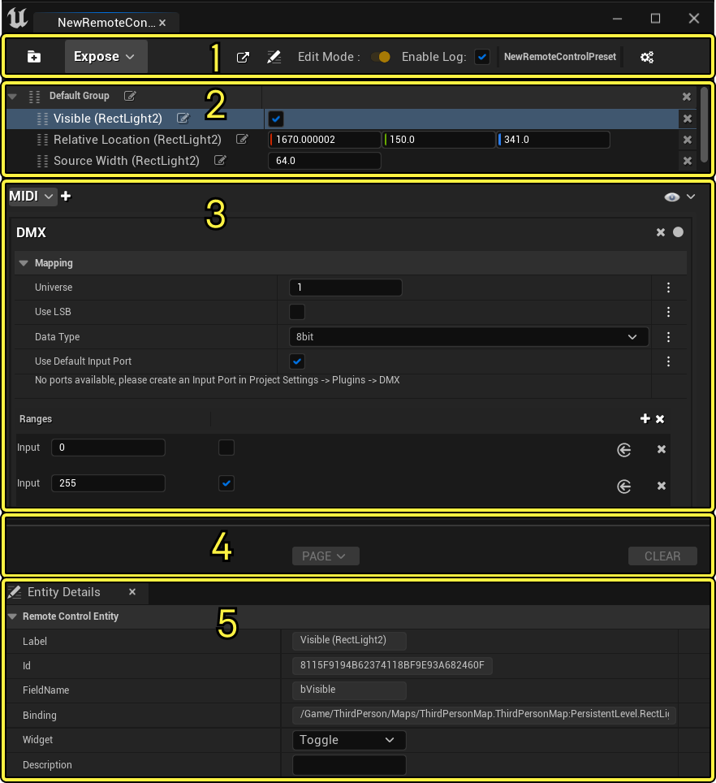
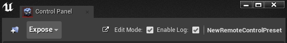
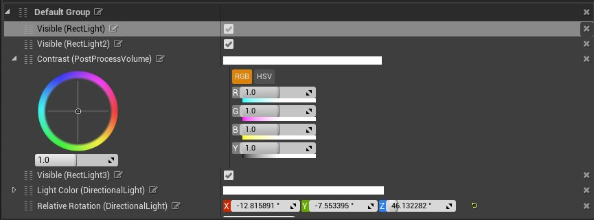
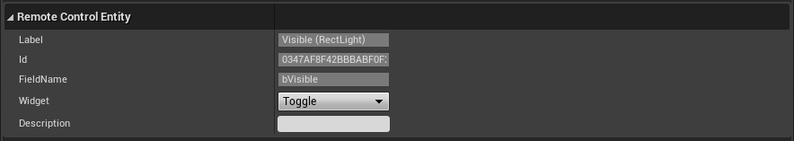
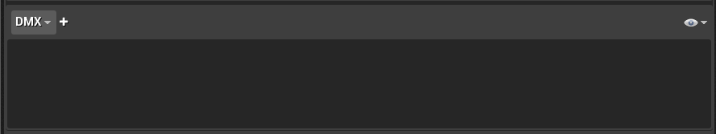
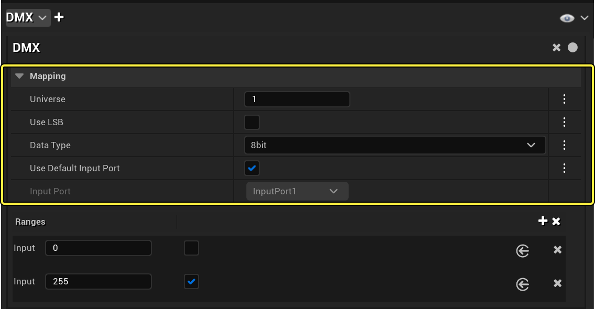
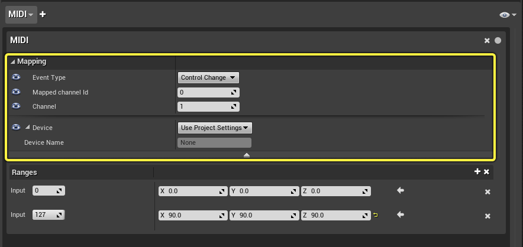
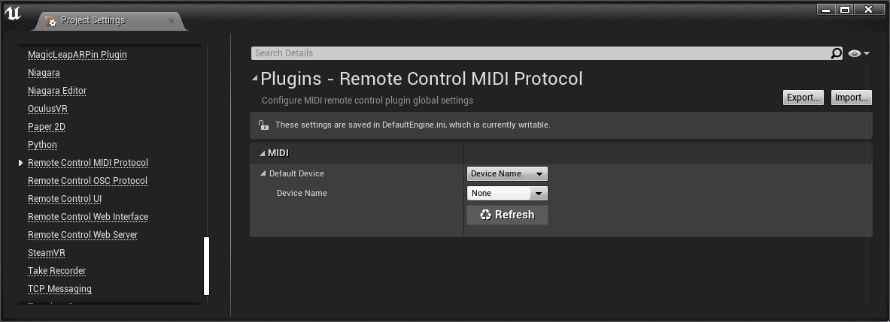

# 远程控制面板参考

> 路径：虚幻引擎5.7文档 / 建立你的开发流程 / 编辑器的脚本与自动化 / 远程控制 / 远程控制预设和Web应用程序 / 远程控制面板参考

> 原始页面：https://dev.epicgames.com/documentation/unreal-engine/remote-control-panel-reference-for-unreal-engine

本文将简要介绍远程控制面板中包含的界面元素和选项。你将学习如何整理远程控制面板、连接外部设备以及对元素重命名，以便在远程控制API中更轻松地进行引用。

## 远程控制面板界面

点击查看大图

1. [菜单](#%E8%8F%9C%E5%8D%95)
2. [公开的属性](#%E5%85%AC%E5%BC%80%E7%9A%84%E5%B1%9E%E6%80%A7)
3. [远程控制实体](#%E8%BF%9C%E7%A8%8B%E6%8E%A7%E5%88%B6%E5%AE%9E%E4%BD%93)
4. [DMX、MIDI和OSC专用远程控制插件](#%E8%BF%9C%E7%A8%8B%E6%8E%A7%E5%88%B6%E6%8F%92%E4%BB%B6)
5. [协议日志](#%E5%8D%8F%E8%AE%AE%E6%97%A5%E5%BF%97)

## 菜单

下表介绍了菜单中显示的每个元素，按照从左到右的顺序进行介绍。

| UI元素 | 说明 |
| --- | --- |
| **创建组（Create Group）** | 创建多个组以将相似的属性和函数整理在一起。 |
| **公开（Expose）** | 将其他项添加到你希望公开功能而不仅仅是属性的面板。以下选项可用于公开到远程控制API： 蓝图库函数 子系统函数 Actor函数 Actor 按类划分的Actor |
| **打开Web应用程序（Open Web App）** | 在你的浏览器中启动[远程控制Web应用程序](../remote-control-web-application/index.md)。 |
| **编辑模式（Edit Mode）** | 启用之后，你可以从编辑器公开属性、将函数添加到预设，以及修改属性和函数的组和位置。 |
| **启用日志（Enable Log）** | 显示协议日志。如需更多信息，请参见[协议日志部分](#protocollog)。 |
| ***远程控制预设名称（Remote Control Preset Name）** | 显示当前打开的远程控制预设资产的名称。 |

## 公开的属性

下表介绍了针对每个公开的属性显示的各个元素，按照从左到右的顺序进行介绍。

| 操作 | 说明 |
| --- | --- |
| **展开（Expand）** | （可选）显示数据值的额外信息（如果存在）。 |
| **移动（Move）** | 将元素拖放到面板中，重新排列属性、函数和组。 |
| **重命名（Rename）** | 更改属性、函数或组的名称，使其在函数调用中的引用更加清楚和简单。 |
| **数据值（Data Values）** | 在编辑器中匹配属性的数据格式。 |
| **重置（Reset）** | 将属性的值还原成默认值。 |
| **删除（Remove）** | 从面板中移除属性或函数，使其不再向远程控制API公开。 |

## 远程控制实体

当你选择公开的属性时，此部分将显示。下表介绍了可以与每个属性关联的元数据。根据数据格式，部分属性可能具有更多的字段。

| 元数据 | 说明 |
| --- | --- |
| **标签（Label）** | 与远程控制预设中的标签匹配的属性的唯一标签。可以在远程控制API中使用，用于访问公开的属性。 |
| **ID** | 属性在引擎中的唯一标识符。可以在远程控制API中使用，用于访问公开的属性。 |
| **字段名称（FieldName）** | 关联的字段的名称。 |
| **控件（Widget）** | 在远程控制Web应用程序中用于此属性所用的默认控件类型。 |
| **说明（Description）** | 此字段重载远程控制Web应用程序中显示的标签。 |

## DMX、MIDI和OSC专用远程控制协议

在远程控制面板中，你可以通过[DMX](../../../../../working-with-media/communicating-with-media-components-from/dmx/index.md)、MIDI和[OSC](../../../../../working-with-audio/external-audio-control/osc-plugin-overview/index.md)将公开的属性映射到外部设备。下表介绍了用于添加和查看协议映射的UI。

| UI元素 | 说明 |
| --- | --- |
| **协议映射选项（Protocol Mapping Option）** | 选项包括： DMX MIDI OSC |
| **添加协议（Add Protocol）** | 为协议映射选项下拉菜单中当前选择的选项创建新的协议映射。 |
| **查看选项（Viewing Options）** | 筛选出你希望查看的协议映射。 |

此外，每个协议映射还具有自己的 **映射（Mapping）** 和 **范围（Ranges）** 分段，用于定义要连接到哪些外部设备和输入。下面的部分解释协议类型映射之间的不同，以及协议类型共同拥有的范围功能。

> [!TIP]
> 使用自动绑定按钮捕获当前协议的最新输入，并将其应用到映射。这提供了一种方便快捷的方法来手动指定属性。
>
> 例如，在现有或新创建的MIDI绑定中，你可以切换自动绑定，在设备上按音符，然后映射属性将相应填充。要完成自动绑定和停止对任何新输入的录制，需要再按一下自动绑定按钮，使其不再是红色。
>
> 以下是自动绑定的可用状态： ***灰色（Grey）**：不侦听输入* **红色（Red）**：侦听输入 * **绿色（Green）**：具有绑定的输入

### DMX协议映射

下表介绍了用于通过DMX协议连接到外部设备上的特定输入的选项。

| 字段 | 说明 |
| --- | --- |
| **通用（Universe）** | DMX通用映射 |
| **使用LSB（Use LSB）** | 启用后，如果使用16位DMX数值时的顺序不标准，则使用最不重要的数位来交换字节顺序。通常情况下，使用最重要的数位。 |
| **数据类型（Data Type）** | 指定传入数据的精度和最大数值。输入将限制为此类型的边界。可用的类型有： 8位 16位 24位 32位 目前，24位选项存储在内部，表示为32位整数。 |
| **起始通道（Starting Channel）** | 你要将属性绑定到的第一个DMX通道。目前，仅允许将一个通道绑定到参数。 |

### MIDI协议映射

下表介绍了用于通过MIDI协议连接到外部设备上的特定输入的选项。

| 字段 | 说明 |
| --- | --- |
| **事件类型（Event Type）** | 指定传入数据的精度和最大数值。输入将限制为此类型的边界。可用的类型有： 8位 16位 24位 32位 目前，24位选项存储在内部，表示为32位整数。 |
| **映射通道ID（Mapped Channel ID）** | 使用MIDI设备输入指示符指定要连接到哪个设备。 |
| **通道（Channel）** | 输入MIDI通道。预期的数值范围为0-16。 |
| **设备（Device）** | 选择要映射哪个设备。默认使用项目设置中设置的数值。此外，你还可以按照设备的名称或ID来设置设备，从而根据协议绑定来重载设备。 |

> [!NOTE]
> 要在 **项目设置（Project Settings）** 中指定MIDI设备：
>
> 1. 在编辑器（Editor）中，转到主菜单并选择
>
>    项目设置（Project Settings）
>
>    ，以打开"项目设置"窗口。
> 2. 在
>
>    项目设置（Project Settings）
>
>    窗口中，导航到
>
>    插件（Plugins） > 远程控制MIDI协议（Remote Control MIDI Protocol）
>
>    。
> 3. 按设备
>
>    名称（Name）
>
>    或
>
>    ID
>
>    选择设备。字段旁边的下拉菜单显示可用设备列表，或者如果当前未连接，则可以指定设备。
>
> 

> [!TIP]
> 如果在编辑器打开时插入设备，点击 **刷新（Refresh）** 按钮可刷新设备列表。
>
> > 图片已省略：MIDI设备刷新按钮

### OSC协议映射

下表介绍了用于通过OSC协议连接到外部设备上的特定输入的选项。

> 图片已省略：OSC协议映射选项

| 字段 | 说明 |
| --- | --- |
| **路径名称（Path Name）** | 指定OSC设备的服务器地址和路径。 |

> [!NOTE]
> 默认情况下，服务器为 `127.0.0.1:8001`。你可以在项目设置中更改或添加更多选项：
>
> 1. 在编辑器（Editor）中，转到主菜单并选择
>
>    项目设置（Project Settings）
>
>    ，以打开"项目设置"窗口。
> 2. 在
>
>    项目设置（Project Settings）
>
>    窗口中，导航到
>
>    插件（Plugins） > 远程控制OSC协议（Remote Control MIDI Protocol）
>
>    。
> 3. 添加新的
>
>    服务器设置（Server Settings）
>
>    数组元素，或修改现有元素，然后设置其
>
>    服务器地址（Server Address）
>
>    以与您的设备匹配。
>
> > 图片已省略：远程控制OSC插件

### 协议范围

此部分显示映射到外部设备的范围。默认情况下，新协议映射将添加两个与预测的最小数值和最大数值对应的范围输入。

选择范围分段右侧的加号按钮可以添加更多的范围步长。如果为范围点输入不同的数值，将会在输入点之间（例如动画中的关键帧）插入属性数值。

下表介绍了如何为范围设置属性数值。

> 图片已省略：协议范围属性

| UI元素 | 说明 |
| --- | --- |
| **输入范围点（Input Range Point）** | 你可以将其与特定属性数值关联的输入点。 |
| **数据值（Data Values）** | 为该范围点设置属性的数值。数据格式与关联的属性类型匹配。 |
| **使用当前属性数值（Use Current Property Value）** | 捕获关卡中属性的当前数值。 |
| **删除输入（Remove Input）** | 删除范围点。 |

> [!NOTE]
> 当外部设备上的同一输入具有多个映射时，显示的警告图标。

## 协议日志

在远程控制面板的菜单中勾选 **启用日志（Enable Log）** 时，此部分将显示选定协议的传入数据。在下面的示例中，名称为/1/fader4的OSC设备向引擎发送浮点数值。

> 图片已省略：协议日志
