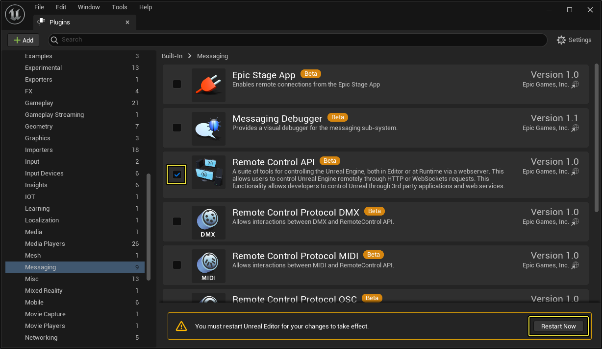
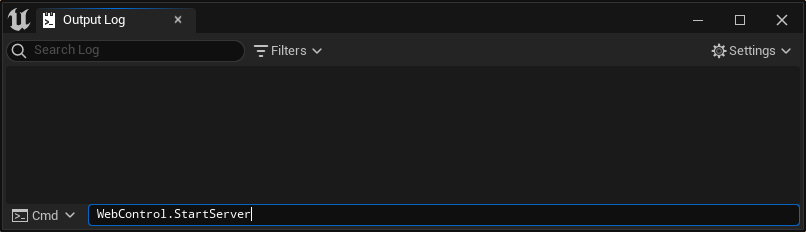
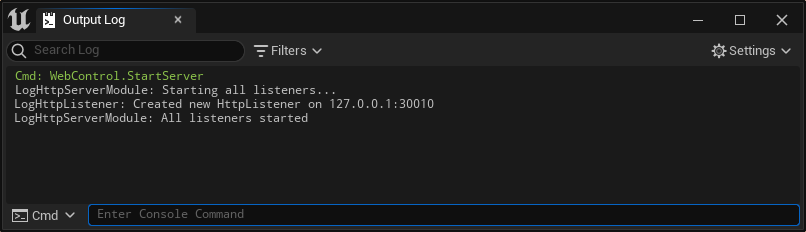
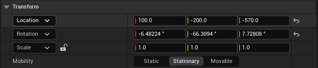
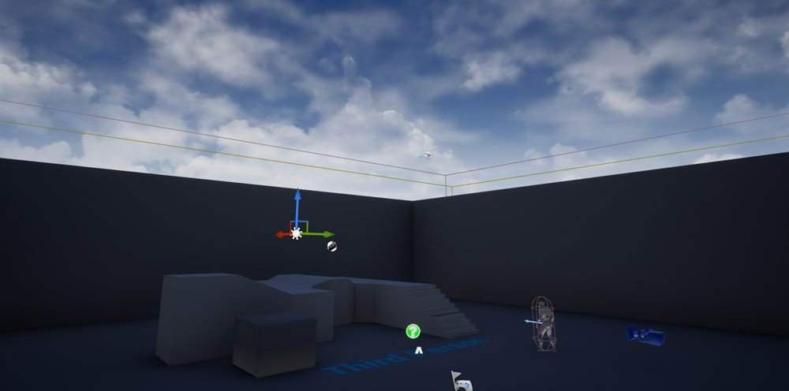
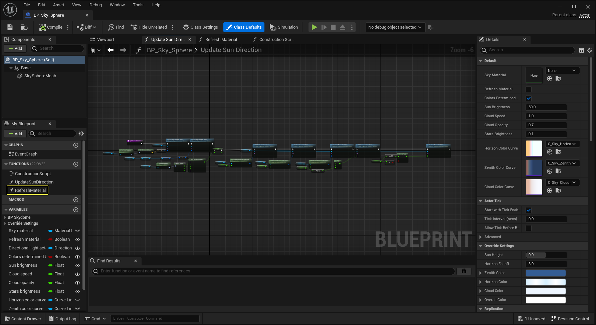
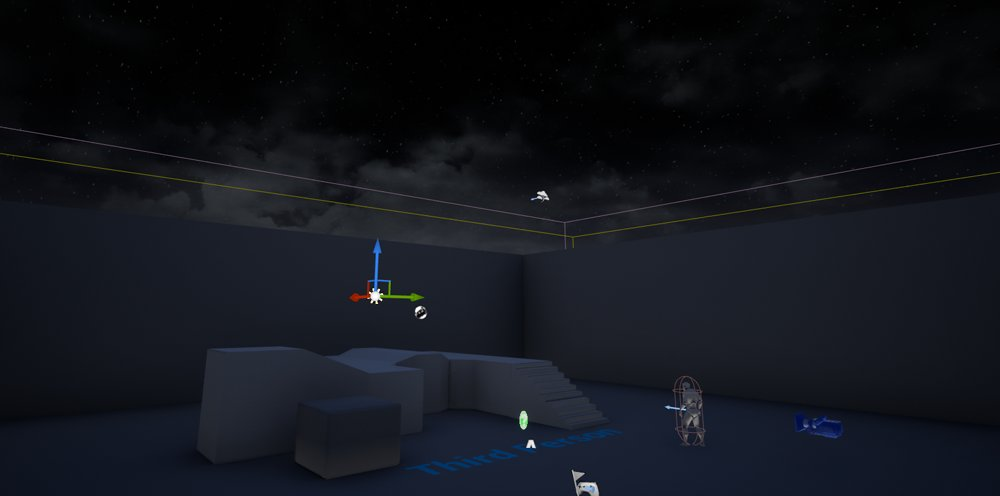
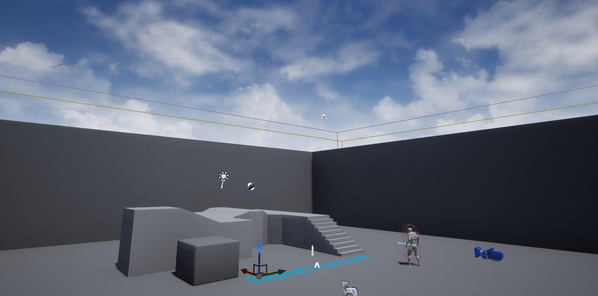

# 远程控制快速入门

> 路径：虚幻引擎5.7文档 / 建立你的开发流程 / 编辑器的脚本与自动化 / 远程控制 / 远程控制快速入门

> 原始页面：https://dev.epicgames.com/documentation/unreal-engine/remote-control-quick-start-for-unreal-engine

此页面上的说明介绍远程控制API入门的分步指南。学完本教程将了解如何设置项目以聆听来自网页应用程序的传入请求，并可以准备开始提出自己的请求。

> [!NOTE]
> **先决条件：**
>
> - 远程控制API服务器使用端口
>
>   8080
>
>   监听传入的HTTP请求。如果此端口不可用，你可以在
>
>   项目设置
>
>   的
>
>   Web远程控制（Web Remote Control）
>
>   中更改
>
>   远程控制HTTP服务器端口（Remote Control HTTP Server Port）
>
>   。
> - 必须初步了解如何从网页客户端向HTTP服务器端点发出承载JSON有效负载的请求。
> - 此页面上的步骤使用一个由
>
>   蓝图第三人称
>
>   模板设置的项目。基本上同样的步骤可以用于任何项目。但是，如果项目未使用与该模板相同的天空设置，那么在步骤
>
>   3 - 发送请求
>
>   中的具体对象路径和请求可能会无效。

> [!WARNING]
> **不要尝试将虚幻引擎应用程序的主机名和端口对公共互联网开放。**这样使项目和计算机容易遭到第三方恶意行为的侵害。
>
> 应只在局域网（LAN）内部或通过安全的虚拟专用网（VPN）使用网页远程控制系统。

## 1 - 建立项目

要开始发出网页远程控制请求，需先安装 **远程控制（Remote Control）** 插件。

### 步骤

1. 在虚幻编辑器中，打开使用网页远程控制的项目。
2. 在主菜单中，选择 **编辑（Edit）> 插件（Plugins）** 来打开 **插件（Plugins）** 窗口。
3. 在 **插件（Plugins）** 窗口中，在 **消息（Messaging）** 类别中找到 **远程控制API（Remote Control API）** 插件。选中 **启用（Enabled）** 勾选框。

   
4. 点击 **是（Yes）** 接受此插件仍为测试版本的警告。
5. 点击 **立即重启（Restart Now）** 重启虚幻编辑器，并重新打开项目。

### 最终结果

在虚幻编辑器中重新打开项目后，即可启动网页远程控制服务器。

## 2 - 管理服务器

网页远程控制系统依赖于由虚幻编辑器进程启动和管理的网页服务器。为安全起见，此服务器仅在显式启动时运行。要控制该服务器何时运行，可使用几个简单的控制台命令：

| 命令 | 说明 |
| --- | --- |
| `WebControl.StartServer` | 启动网页服务器并开始在端口 `30010` 上聆听传入请求。 |
| `WebControl.StopServer` | 停止网页服务器，禁止再处理任何对虚幻编辑器实例的请求。 |
| `WebControl.EnableServerOnStartup` | 每当此项目在虚幻引擎中以任何支持的模式打开（在虚幻编辑器主窗口中、在编辑器中运行（PIE）会话中、或在虚幻编辑器的 `-游戏` 模式下）时，便自动启动Web服务器。 |

现在，我们就在编辑器主窗口中启动该服务器。

### 步骤

1. 在主菜单中，选择 **窗口（Window）> 开发者工具（Developer Tools）> 输出日志（Output Log）**。
2. 在 **Cmd** 栏中，输入控制台命令 `WebControl.StartServer`。

   
3. 将显示一条消息，表示服务器正在运行：

   

### 最终结果

服务器在运行后，即可开始对它输送请求。

## 3 - 发送请求

我们建议从尽可能简单的用例开始，发出初始请求。

- 使用专门用于测试API请求和响应的工具，例如[Insomnia](https://insomnia.rest/)或[Postman](https://www.getpostman.com/)。这样可以方便确认自己为请求正确构造了JSON有效负载。对网络远程控制端点的工作情况和它们提供的响应类型感到满意后，可将对这些端点的调用合并到自己的网页应用程序中。
- 首先在用来在编辑器中运行项目的计算机上，本地发出第一批请求。确定这些请求有效后，可从连接到本地网络的其他计算机或设备上的客户端发出请求。

### 步骤

1. 在网页客户端应用中，设置拥有以下代码的请求：

   ```
           {            "objectPath" : "/Game/ThirdPersonBP/Maps/ThirdPersonExampleMap.ThirdPersonExampleMap:PersistentLevel.LightSource_0.LightComponent0",            "access":"READ_ACCESS",            "propertyName":"RelativeRotation"        }		
   ```

   此请求将询问关卡的主要定向光源（在 **世界大纲视图** 中名为 **光源（Light Source）** 的Actor）上 `RelativeRotation` 属性的当前值。
2. 将该消息以 `PUT` 请求的形式发送给下列端点：

   ```
           http://localhost:30010/remote/object/property		
   ```
3. 你应该能在你的网络客户端中看到一条响应，其中包含状态码以及你请求的信息：

   ```
           {            "RelativeRotation": {                "Pitch": -66.3094,                "Yaw": 7.72808,                "Roll": -6.48224            }        }		
   ```
4. 如选择 **光源（Light Source）** Actor并查看 **细节（Details）** 面板，将看到响应中的值与该处显示的值匹配：

   

   > [!TIP]
   > 这展示了网页远程控制系统能够如何将对象（在此例中是一个矢量）分解为JSON值，从而与网页应用程序进行交换。
5. 接下来，我们将远程更改这个光源的旋转。

   此属性在引擎源代码中定义为 `BlueprintReadOnly`：

   ```
       /** Rotation of the component relative to its parent */    UPROPERTY(EditAnywhere, BlueprintReadOnly, ReplicatedUsing=OnRep_Transform, Category=Transform)    FRotator RelativeRotation; 
   ```

   这意味着我们需调用由同一对象公开的 `BlueprintCallable` 函数才能修改它。可以在 `Engine/Source/Runtime/Engine/Classes/Components/SceneComponent.h` 文件中找到此定义：

   ```
       /**     * 设置组件相对于其父项的旋转     * @param NewRotation		组件相对于其父项的新旋转     * @param SweepHitResult	如扫描为true，来自任意影响的命中结果。     * @param bSweep			是否对目标位置进行扫描（当前不支持旋转）。     * @param bTeleport			是否传送物理状态（如此对象已启用物理碰撞）。     *							如为true，此对象的物理速度则不会发生改变（因此布偶部件不会受位置变化影响）。     *							如为false，则基于位置变化更新物理速度（会影响布偶部件）。     */    UFUNCTION(BlueprintCallable, Category="Utilities|Transformation", meta=(DisplayName="SetRelativeRotation", ScriptName="SetRelativeRotation", AdvancedDisplay="bSweep,SweepHitResult,bTeleport"))    void K2_SetRelativeRotation(FRotator NewRotation, bool bSweep, FHitResult& SweepHitResult, bool bTeleport);    void SetRelativeRotation(FRotator NewRotation, bool bSweep=false, FHitResult* OutSweepHitResult=nullptr, ETeleportType Teleport = ETeleportType::None);    void SetRelativeRotation(const FQuat& NewRotation, bool bSweep=false, FHitResult* OutSweepHitResult=nullptr, ETeleportType Teleport = ETeleportType::None); 
   ```
6. 设置拥有下列代码的请求：

   ```
           {            "objectPath" :"/Game/ThirdPersonBP/Maps/ThirdPersonExampleMap.ThirdPersonExampleMap:PersistentLevel.LightSource_0.LightComponent0",            "functionName":"SetRelativeRotation",            "parameters": {                "NewRotation": {                    "Pitch":90,                    "Yaw":0,                    "Roll":0                }            },            "generateTransaction":true        }		
   ```
7. 将该消息以 `PUT` 请求的形式发送给下列端点：

   ```
           http://localhost:30010/remote/object/call		
   ```

   此时应会看到关卡中定向光源的角度发生变化，使场景中的对象笼罩在阴影中。

   

   > [!TIP]
   > 此时如果返回并重新发出与步骤2中相同的请求，将会收到刚刚设置的更新值。
8. 我们要远程调用函数来更新天空，使它考虑太阳的新角度。在此例中，我们将调用在蓝图中 **BP_Sky_Sphere** 类中定义的函数：

   

   > [!TIP]
   > 此函数的作用与在 **SkySphereBlueprint** Actor的 **细节（Details）** 面板中勾选 **刷新材质（Refresh Material）** 框相同。
9. 将此消息发送到上文所述的同一端点：

   ```
           {            "objectPath" : "/Game/ThirdPersonBP/Maps/ThirdPersonExampleMap.ThirdPersonExampleMap:PersistentLevel.SkySphereBlueprint",            "functionName":"RefreshMaterial",            "generateTransaction":true        }		
   ```

   > [!TIP]
   > 在此例中，函数无需任何输入参数，所以我们可以完全忽略 `parameters` 属性。

   将看到关卡中的天空变为夜空：

   

### 最终结果

执行上述步骤后，你便已学习到如何从网页客户端获取运行中虚幻引擎项目内容的相关信息。你也学习到了远程更改项目内容的方法，即从网页客户端发出请求来执行由对象在编辑器环境中公开的函数。在此例中我们更改的是天空。



**通过远程控制更改的光照和天空**

## 4 - 自行尝试

在上述简单过程中使用的两个端点也可以用来对项目内容进行深入的更改。它们的用法还有诸多可学习的部分，请参见[端点参考](../remote-control-api-http-reference/index.md)了解更多细节和范例。

网络服务器的地址默认设置为127.0.0.1，只能由运行虚幻引擎会话的电脑获取。为了允许其他设备通过远程控制API访问你的虚幻会话框，请将项目 **DefaultEngine.ini** 文件中的 **DefaultBindAddress** 改为你的设备的IP地址。

```
	[HTTPServer.Listeners]	DefaultBindAddress=0.0.0.0
```
